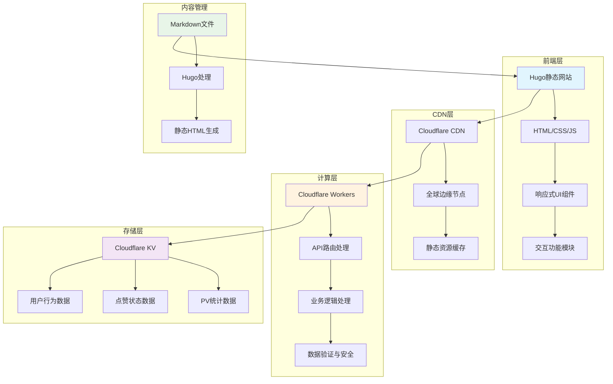
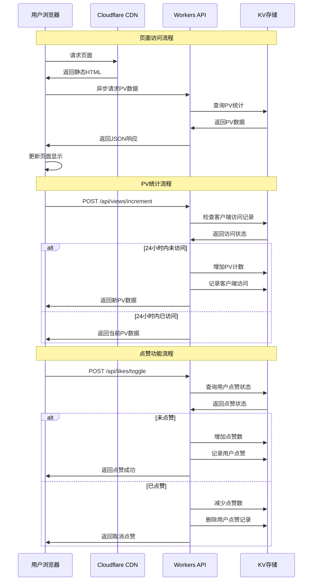
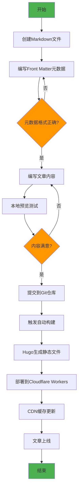
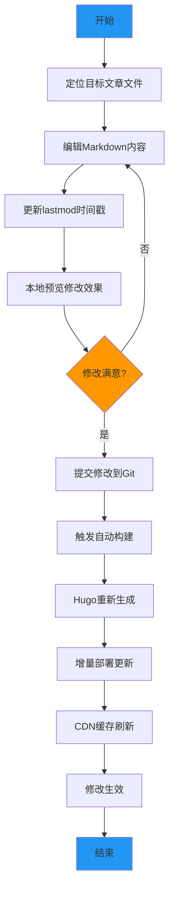
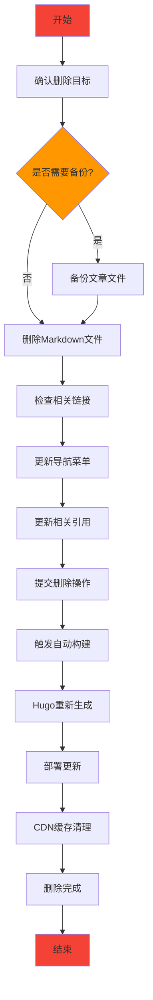

# NSSA - 神经科学与社会分析

[](https://nssa.io)
[](https://gohugo.io/)
[](https://workers.cloudflare.com/)
[](LICENSE)

## 📖 项目简介

NSSA（Neuroscience & Social Analysis）是一个专注于神经科学与社会分析的现代化学术博客平台。项目采用Hugo静态网站生成器构建，部署在Cloudflare Workers上，提供高性能、低延迟的阅读体验。

网站涵盖职场心理学、技术分析、历史研究、心理学等多个领域的深度文章，致力于通过科学的视角分析社会现象，为读者提供有价值的洞察和思考。

**🌐 在线访问**: [https://nssa.io](https://nssa.io)

## ✨ 核心功能

### 📊 统计功能
- **真实PV统计**: 基于Cloudflare KV的页面访问次数统计
- **智能点赞系统**: 用户级别的点赞状态管理和持久化存储
- **防刷机制**: 24小时内同一客户端不重复计数PV，防止虚假数据

### 🎨 用户体验
- **Apple风格设计**: 简洁优雅的界面设计，支持深色/浅色/跟随系统三种主题模式
- **响应式布局**: 完美适配桌面端、平板和移动设备
- **交互式按钮**: 点赞、评论、分享、下载等丰富的交互功能

### 📱 分享功能
- **智能微信分享**: 
  - 微信内：原生分享引导
  - 移动端：系统分享API或链接复制
  - 桌面端：二维码扫码分享
- **多平台支持**: 微信、微博、Facebook、X(Twitter)、邮件分享
- **一键下载**: 文章内容TXT格式下载

### 🔧 技术特性
- **静态网站生成**: 基于Hugo的高性能静态网站
- **边缘计算**: Cloudflare Workers提供全球CDN加速
- **数据持久化**: KV存储确保统计数据的可靠性
- **API驱动**: RESTful API设计，支持异步数据交互

## 🏗️ 系统架构



## 🔄 应用调用流程



## 📝 内容管理业务流程

### 新增文章流程



### 修改文章流程



### 删除文章流程



## 🛠️ 技术栈

### 前端技术
- **Hugo**: 静态网站生成器
- **Tailwind CSS**: 原子化CSS框架
- **JavaScript ES6+**: 现代JavaScript特性
- **响应式设计**: 移动优先的设计理念

### 后端技术
- **Cloudflare Workers**: 边缘计算平台
- **Cloudflare KV**: 分布式键值存储
- **RESTful API**: 标准化API设计
- **JSON**: 数据交换格式

### 开发工具
- **Git**: 版本控制系统
- **GitHub**: 代码托管平台
- **Wrangler CLI**: Cloudflare Workers开发工具
- **npm**: 包管理器

## 📁 项目结构

```
nssa/
├── content/                 # 文章内容目录
│   ├── workplace/          # 职场专题
│   ├── tech/               # 技术专题
│   ├── history/            # 历史专题
│   └── psychology/         # 心理专题
├── layouts/                # Hugo模板文件
│   ├── _default/           # 默认模板
│   ├── partials/           # 组件模板
│   └── shortcodes/         # 短代码模板
├── static/                 # 静态资源
│   ├── css/                # 样式文件
│   ├── js/                 # JavaScript文件
│   └── images/             # 图片资源
├── workers-site/           # Cloudflare Workers代码
│   └── index.js            # Workers主文件
├── config.yaml             # Hugo配置文件
├── wrangler.toml           # Workers配置文件
└── package.json            # 项目依赖配置
```

## 🚀 快速开始

### 环境要求
- Node.js 18+
- Hugo Extended v0.148.1+
- Git
- Cloudflare账户

### 本地开发

1. **克隆项目**
```bash
git clone https://github.com/Matthewyin/nssa.git
cd nssa
```

2. **安装依赖**
```bash
npm install
```

3. **启动开发服务器**
```bash
hugo server -D
```

4. **访问本地站点**
```
http://localhost:1313
```

### 部署到生产环境

1. **构建静态文件**
```bash
npm run build
```

2. **部署到Cloudflare Workers**
```bash
npx wrangler deploy
```

## 📊 API文档

### PV统计API

#### 获取文章PV数
```http
GET /api/views/get?path={article_path}
```

#### 增加文章PV数
```http
POST /api/views/increment
Content-Type: application/json

{
  "path": "workplace/sic",
  "clientId": "client_123"
}
```

#### 批量获取PV数
```http
GET /api/views/batch?paths=path1,path2,path3
```

### 点赞功能API

#### 获取点赞状态
```http
GET /api/likes/get?path={article_path}&clientId={client_id}
```

#### 切换点赞状态
```http
POST /api/likes/toggle
Content-Type: application/json

{
  "path": "workplace/sic",
  "clientId": "client_123"
}
```

#### 批量获取点赞数据
```http
GET /api/likes/batch?paths=path1,path2&clientId={client_id}
```

## 🔧 配置说明

### Hugo配置 (config.yaml)
```yaml
baseURL: 'https://nssa.io'
languageCode: 'zh-cn'
title: 'NSSA - 神经科学与社会分析'
theme: 'custom'

params:
  description: '专注于神经科学与社会分析的学术博客'
  author: 'NSSA Team'

markup:
  goldmark:
    renderer:
      unsafe: true
```

### Workers配置 (wrangler.toml)
```toml
name = "nssa"
main = "workers-site/index.js"
compatibility_date = "2023-12-01"

[site]
bucket = "./public"

[[kv_namespaces]]
binding = "ARTICLE_STATS"
id = "1d522d1cf0a547e28319cf5dc0f2d1cb"
```

## 📈 性能指标

- **页面加载速度**: < 1秒
- **首次内容绘制**: < 0.8秒
- **最大内容绘制**: < 1.2秒
- **累积布局偏移**: < 0.1
- **首次输入延迟**: < 100ms

## 🤝 贡献指南

1. Fork 项目
2. 创建特性分支 (`git checkout -b feature/AmazingFeature`)
3. 提交更改 (`git commit -m 'Add some AmazingFeature'`)
4. 推送到分支 (`git push origin feature/AmazingFeature`)
5. 开启 Pull Request

## 📄 许可证

本项目采用 MIT 许可证 - 查看 [LICENSE](LICENSE) 文件了解详情。

## 📞 联系我们

- **网站**: [https://nssa.io](https://nssa.io)
- **GitHub**: [https://github.com/Matthewyin/nssa](https://github.com/Matthewyin/nssa)
- **邮箱**: contact@nssa.io

---

<div align="center">
  <strong>NSSA - 用科学的视角分析社会现象</strong>
</div>
