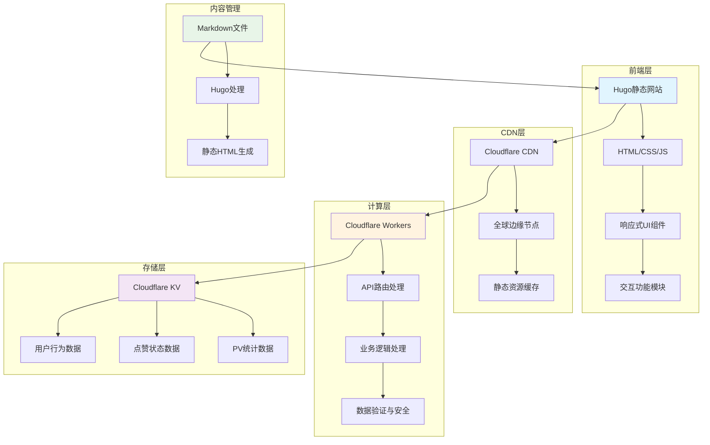
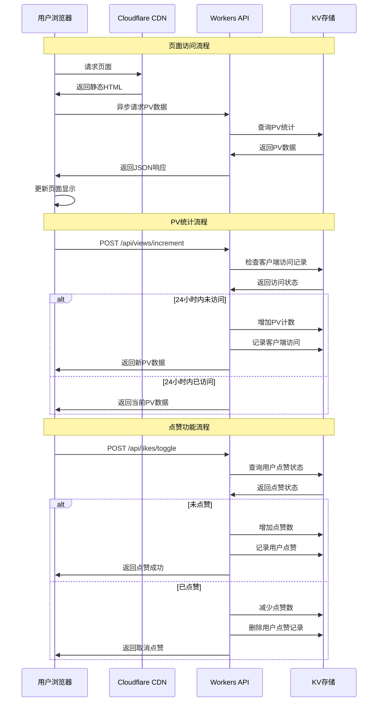
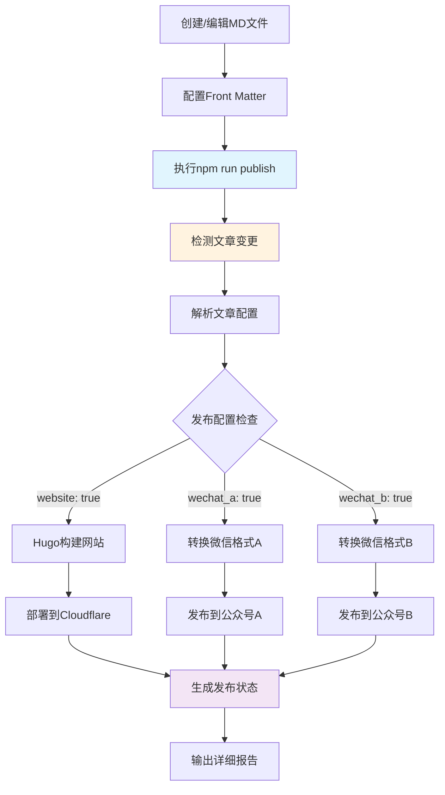
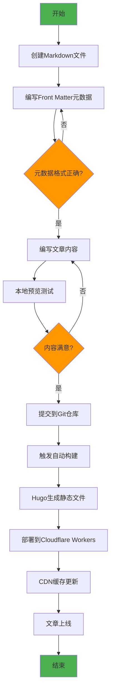
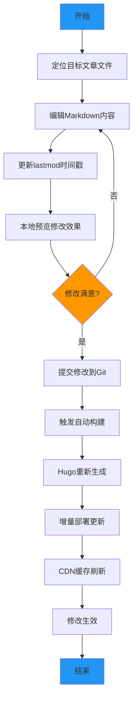
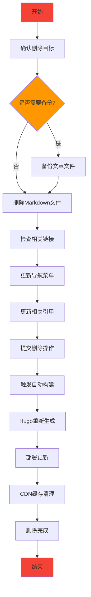

# NSSA - Not-So-Stubby Area)

[](https://nssa.io)
[](https://gohugo.io/)
[](https://workers.cloudflare.com/)
[](LICENSE)

## 📖 项目简介

NSSA（Not-So-Stubby Area)）是一个采用Hugo静态网站生成器构建，部署在Cloudflare Workers上，提供高性能、低延迟的阅读体验。

网站涵盖职场心理学、技术分析、历史研究、心理学等多个领域的深度文章，致力于通过科学的视角分析社会现象，为读者提供有价值的洞察和思考。

**🌐 在线访问**: [https://nssa.io](https://nssa.io)

## 🚀 快速开始

```bash
# 1. 克隆项目
git clone https://github.com/Matthewyin/nssa.git
cd nssa

# 2. 安装依赖
npm install

# 3. 配置环境变量
cp .env.example .env
# 编辑.env文件，填入您的API密钥

# 4. 创建测试文章
echo '---
title: "我的第一篇文章"
description: "这是一篇测试文章"
date: 2025-01-28T15:00:00+08:00
publish:
  website: true
  wechat_a: false
---

# 我的第一篇文章

这是文章内容...
' > content/posts/my-first-post.md

# 5. 本地发布
npm run publish

# 6. 本地预览
npm run dev
# 访问 http://localhost:1313
```

## ✨ 核心功能

### 📊 统计功能
- **真实PV统计**: 基于Cloudflare KV的页面访问次数统计
- **智能点赞系统**: 用户级别的点赞状态管理和持久化存储
- **防刷机制**: 24小时内同一客户端不重复计数PV，防止虚假数据

### 🎨 用户体验
- **Apple风格设计**: 简洁优雅的界面设计，支持深色/浅色/跟随系统三种主题模式
- **响应式布局**: 完美适配桌面端、平板和移动设备
- **交互式按钮**: 点赞、评论、分享、下载等丰富的交互功能

### 📱 分享功能
- **智能微信分享**:
  - 微信内：原生分享引导
  - 移动端：系统分享API或链接复制
  - 桌面端：二维码扫码分享
- **多平台支持**: 微信、微博、Facebook、X(Twitter)、邮件分享
- **一键下载**: 文章内容TXT格式下载

### 🚀 本地发布系统
- **本地执行**: 在本地环境完成所有发布操作，无需云端配置
- **多平台发布**: 一次编写，自动发布到网站和微信公众号
- **智能检测**: 自动检测文章变更，支持增量和全量发布
- **灵活配置**: 通过Front Matter和环境变量精确控制发布行为
- **内容转换**: Markdown自动转换为微信公众号格式
- **状态管理**: 完整的发布状态跟踪和详细报告
- **简单易用**: 一条命令完成发布，支持多种发布模式
- **错误处理**: 完善的重试机制和错误恢复

### 🔧 技术特性
- **静态网站生成**: 基于Hugo的高性能静态网站
- **边缘计算**: Cloudflare Workers提供全球CDN加速
- **数据持久化**: KV存储确保统计数据的可靠性
- **API驱动**: RESTful API设计，支持异步数据交互

## 🏗️ 系统架构



## 🔄 应用调用流程



## 🚀 本地发布系统

NSSA本地发布系统是一个完整的内容管理和分发解决方案，支持在本地环境中从Markdown文件到多平台发布的自动化流程。相比GitHub Actions，本地发布更加灵活便捷，无需复杂的云端配置。

### ✨ 系统特性

- **🏠 本地执行**：在本地环境中完成所有发布操作，无需云端配置
- **🎯 多平台支持**：同时发布到网站和多个微信公众号
- **🛡️ 错误恢复**：完善的重试机制和错误处理
- **📊 智能检测**：自动检测文章变更，支持增量发布
- **📋 详细日志**：完整的执行日志和状态报告
- **⚙️ 灵活配置**：通过Front Matter和环境变量精确控制发布行为
- **🚀 简单易用**：一条命令完成发布，支持多种发布模式
- **🖼️ 智能封面**：自动处理封面图片，支持HEIC转JPG等格式转换
- **🔐 安全可靠**：自动令牌管理，支持重试机制和错误恢复

### 本地发布系统架构



### 本地发布使用流程

#### 1. 环境准备

```bash
# 安装依赖
npm install

# 复制环境变量模板并配置API密钥
cp .env.example .env
nano .env  # 填入您的微信和Cloudflare API密钥
```

#### 2. 配置文章发布选项

在Markdown文件的Front Matter中添加发布配置：

```yaml
---
title: "文章标题"
subtitle: "副标题"
description: "文章描述"
date: 2025-01-28T10:00:00+08:00
tags: ["标签1", "标签2"]
categories: ["分类"]

# 🚀 发布配置
publish:
  website: true           # 发布到nssa.io
  wechat_a: true         # 发布到公众号A
  wechat_b: false        # 不发布到公众号B
  schedule: "2025-01-28T14:00:00+08:00"  # 定时发布(可选)

# 📱 微信专用配置
wechat:
  title: "微信标题（可选，默认使用文章标题）"
  summary: "文章摘要"
  author: "作者名称"
  cover_image: "/images/cover.jpg"
  tags: ["微信标签"]
---
```

#### 3. 本地发布

```bash
# 智能发布（自动检测变更文章）
npm run publish

# 仅发布到网站
npm run publish:website

# 仅发布到微信公众号
npm run publish:wechat

# 发布所有文章到所有平台
npm run publish:all
```

#### 4. 提交到GitHub（可选）

```bash
git add .
git commit -m "新增文章：标题"
git push origin main
```

#### 5. 发布流程

系统将自动：
- ✅ 检测文章变更（Git变更或最近修改）
- ✅ 解析文章配置和Front Matter
- ✅ 构建Hugo网站并部署到Cloudflare
- ✅ 转换Markdown为微信格式
- ✅ 处理封面图片（支持HEIC转JPG等格式转换）
- ✅ 上传图片到微信永久素材库
- ✅ 创建微信图文消息草稿
- ✅ 提供手动发布链接（符合微信权限要求）
- ✅ 生成详细的发布状态报告

### 📱 微信发布说明

由于微信公众平台的权限限制，本地发布系统采用**"自动创建草稿 + 手动发布"**的模式：

#### 🔄 发布流程
1. **自动化部分**：
   - ✅ 自动获取访问令牌
   - ✅ 自动上传封面图片
   - ✅ 自动创建图文消息草稿

2. **手动部分**：
   - 📝 登录[微信公众平台](https://mp.weixin.qq.com/)
   - 📝 进入素材管理 → 图文消息
   - 📝 找到对应草稿并手动发布

#### 💡 为什么这样设计
- **权限限制**: 微信对自动发布有严格限制
- **安全考虑**: 手动发布可以最后检查内容
- **最佳实践**: 很多企业都采用这种模式

### 发布配置选项

#### 基础发布配置

| 选项 | 类型 | 默认值 | 说明 |
|------|------|--------|------|
| `website` | boolean | `true` | 是否发布到网站 |
| `wechat_a` | boolean | `false` | 是否发布到公众号A |
| `wechat_b` | boolean | `false` | 是否发布到公众号B |
| `schedule` | string | `null` | 定时发布时间 |

#### 微信专用配置

| 选项 | 类型 | 说明 |
|------|------|------|
| `title` | string | 微信文章标题（可选） |
| `summary` | string | 文章摘要 |
| `author` | string | 作者名称 |
| `cover_image` | string | 封面图片路径 |
| `tags` | array | 微信标签 |

### 发布场景示例

#### 场景1：只发布到网站
```yaml
publish:
  website: true
  wechat_a: false
  wechat_b: false
```

#### 场景2：发布到网站+技术公众号
```yaml
publish:
  website: true
  wechat_a: true    # 技术内容发布到公众号A
  wechat_b: false
```

#### 场景3：全平台发布
```yaml
publish:
  website: true
  wechat_a: true
  wechat_b: true
```

#### 场景4：定时发布
```yaml
publish:
  website: true
  wechat_a: true
  schedule: "2025-01-28T14:00:00+08:00"
```

## � 本地发布命令参考

### 基础命令

```bash
# 智能发布（推荐）- 自动检测变更文章
npm run publish

# 仅发布到网站
npm run publish:website

# 仅发布到微信公众号
npm run publish:wechat

# 全平台发布所有文章
npm run publish:all

# 解析文章配置（不发布）
npm run parse
```

### 高级选项

```bash
# 强制发布所有文章
node scripts/local-publish.js --all

# 仅发布网站（跳过微信）
node scripts/local-publish.js --website-only

# 仅发布微信（跳过网站）
node scripts/local-publish.js --wechat-only

# 强制模式（忽略变更检测）
node scripts/local-publish.js --force

# 详细输出模式
node scripts/local-publish.js --verbose
```

### 环境变量控制

```bash
# 启用调试模式
DEBUG=true npm run publish

# 详细日志输出
VERBOSE=true npm run publish

# 跳过网站构建
SKIP_WEBSITE_BUILD=true npm run publish

# 跳过微信发布
SKIP_WECHAT_PUBLISH=true npm run publish
```

## �📝 内容管理业务流程

### 新增文章流程



### 修改文章流程



### 删除文章流程



## 🛠️ 技术栈

### 前端技术
- **Hugo**: 静态网站生成器
- **Tailwind CSS**: 原子化CSS框架
- **JavaScript ES6+**: 现代JavaScript特性
- **响应式设计**: 移动优先的设计理念

### 后端技术
- **Cloudflare Workers**: 边缘计算平台
- **Cloudflare KV**: 分布式键值存储
- **RESTful API**: 标准化API设计
- **JSON**: 数据交换格式

### 开发工具
- **Git**: 版本控制系统
- **GitHub**: 代码托管平台
- **Wrangler CLI**: Cloudflare Workers开发工具
- **npm**: 包管理器

## 📁 项目结构

```
nssa/
├── content/                 # 文章内容目录
│   ├── workplace/          # 职场专题
│   ├── tech/               # 技术专题
│   ├── history/            # 历史专题
│   └── psychology/         # 心理专题
├── scripts/                # 本地发布脚本
│   ├── local-publish.js    # 主发布脚本
│   ├── parse-articles.js   # 文章解析脚本
│   ├── publish-wechat.js   # 微信发布脚本
│   └── update-status.js    # 状态更新脚本
├── docs/                   # 项目文档
│   ├── local-publish-guide.md  # 本地发布指南
│   └── github-secrets-setup.md # API配置指南
├── layouts/                # Hugo模板文件
│   ├── _default/           # 默认模板
│   ├── partials/           # 组件模板
│   └── shortcodes/         # 短代码模板
├── static/                 # 静态资源
│   ├── css/                # 样式文件
│   ├── js/                 # JavaScript文件
│   └── images/             # 图片资源
├── workers-site/           # Cloudflare Workers代码
│   └── index.js            # Workers主文件
├── .env.example            # 环境变量模板
├── .env                    # 本地环境变量（不提交）
├── config.yaml             # Hugo配置文件
├── wrangler.toml           # Workers配置文件
└── package.json            # 项目依赖配置
```

## � 环境要求

- **Node.js 18+**: JavaScript运行环境
- **Hugo Extended v0.148.1+**: 静态网站生成器
- **Git**: 版本控制系统
- **Cloudflare账户**: 网站部署和CDN服务
- **微信公众号**: 内容分发平台（可选）

### 本地发布系统配置

#### 📋 配置清单

在开始使用本地发布系统之前，请确保完成以下配置：

- [ ] 安装Node.js和npm依赖
- [ ] 配置本地环境变量
- [ ] 获取微信公众号API凭证
- [ ] 获取Cloudflare API令牌
- [ ] 测试发布验证

#### 1. 环境准备

```bash
# 安装项目依赖
npm install

# 复制环境变量模板
cp .env.example .env
```

#### 2. 配置环境变量

编辑 `.env` 文件，填入以下配置：

**微信公众号配置**：
```bash
WECHAT_A_APPID=
WECHAT_A_SECRET=
WECHAT_B_APPID=
WECHAT_B_SECRET=
```

**Cloudflare配置**：
```bash
CLOUDFLARE_API_TOKEN=
```

#### 2. 获取微信公众号凭证

1. 登录[微信公众平台](https://mp.weixin.qq.com/)
2. 进入`设置与开发 → 基本配置`
3. 获取AppID和AppSecret
4. 配置IP白名单（添加GitHub Actions IP段）

详细配置说明请参考：[本地发布指南](docs/local-publish-guide.md)

## 💡 使用示例

### 完整发布流程示例

```bash
# 1. 初始化项目
git clone https://github.com/Matthewyin/nssa.git
cd nssa
npm install
cp .env.example .env

# 2. 编辑.env文件，填入您的API密钥
nano .env

# 3. 创建新文章
cat > content/posts/example-article.md << 'EOF'
---
title: "NSSA本地发布系统体验"
description: "体验NSSA强大的本地发布功能"
date: 2025-01-28T15:00:00+08:00
tags: ["技术", "发布系统"]
categories: ["技术专题"]

# 发布配置
publish:
  website: true      # 发布到nssa.io网站
  wechat_a: true     # 发布到微信公众号A
  wechat_b: false    # 不发布到微信公众号B

# 微信配置
wechat:
  title: "体验NSSA本地发布系统"
  summary: "一键发布到网站和微信公众号，简单高效"
  author: "NSSA团队"
  tags: ["技术分享"]
---

# NSSA本地发布系统体验

## 🚀 简单易用

只需一条命令，即可将文章发布到网站和微信公众号：

\`\`\`bash
npm run publish
\`\`\`

## ✨ 智能检测

系统会自动检测文章变更，只发布需要更新的内容。

## 🎯 精确控制

通过Front Matter配置，精确控制每篇文章的发布目标。
EOF

# 4. 本地发布
npm run publish

# 5. 查看发布结果
cat wechat-publish-results.json

# 6. 手动发布微信草稿
# 登录 https://mp.weixin.qq.com/
# 进入素材管理 → 图文消息
# 找到草稿并手动发布
```

### 常用发布场景

```bash
# 场景1: 仅预览网站效果
npm run dev
# 访问 http://localhost:1313

# 场景2: 仅发布到网站
npm run publish:website

# 场景3: 仅发布到微信公众号
npm run publish:wechat

# 场景4: 强制发布所有文章
npm run publish:all

# 场景5: 调试模式发布
DEBUG=true VERBOSE=true npm run publish
```

#### 3. 测试本地发布

创建测试文章验证系统：

```bash
# 创建测试文章
mkdir -p content/test
cat > content/test/test-local-publish.md << 'EOF'
---
title: "本地发布系统测试"
publish:
  website: true
  wechat_a: false  # 测试时建议先设为false
  wechat_b: false
wechat:
  title: "测试文章"
  summary: "这是一篇测试文章"
---

# 测试内容

这是本地发布系统的测试文章。
EOF

# 执行本地发布
npm run publish
```

#### 4. 监控发布状态

- 查看控制台输出日志
- 检查生成的状态文件
- 访问网站确认文章发布
- 查看以下文件了解详细状态：
  - `articles-config.json`：文章配置解析结果
  - `wechat-publish-results.json`：微信发布结果
  - `publish-status.json`：完整发布状态

### 部署到生产环境

1. **构建静态文件**
```bash
npm run build
```

2. **部署到Cloudflare Workers**
```bash
npx wrangler deploy
```

## 📊 API文档

### PV统计API

#### 获取文章PV数
```http
GET /api/views/get?path={article_path}
```

#### 增加文章PV数
```http
POST /api/views/increment
Content-Type: application/json

{
  "path": "workplace/sic",
  "clientId": "client_123"
}
```

#### 批量获取PV数
```http
GET /api/views/batch?paths=path1,path2,path3
```

### 点赞功能API

#### 获取点赞状态
```http
GET /api/likes/get?path={article_path}&clientId={client_id}
```

#### 切换点赞状态
```http
POST /api/likes/toggle
Content-Type: application/json

{
  "path": "workplace/sic",
  "clientId": "client_123"
}
```

#### 批量获取点赞数据
```http
GET /api/likes/batch?paths=path1,path2&clientId={client_id}
```

## 🔧 配置说明

### Hugo配置 (config.yaml)
```yaml
baseURL: 'https://nssa.io'
languageCode: 'zh-cn'
title: 'NSSA - 神经科学与社会分析'
theme: 'custom'

params:
  description: '专注于神经科学与社会分析的学术博客'
  author: 'NSSA Team'

markup:
  goldmark:
    renderer:
      unsafe: true
```

### Workers配置 (wrangler.toml)
```toml
name = "nssa"
main = "workers-site/index.js"
compatibility_date = "2023-12-01"

[site]
bucket = "./public"

[[kv_namespaces]]
binding = "ARTICLE_STATS"
id = ""
```

## 📈 性能指标

- **页面加载速度**: < 1秒
- **首次内容绘制**: < 0.8秒
- **最大内容绘制**: < 1.2秒
- **累积布局偏移**: < 0.1
- **首次输入延迟**: < 100ms

## 🤝 贡献指南

1. Fork 项目
2. 创建特性分支 (`git checkout -b feature/AmazingFeature`)
3. 提交更改 (`git commit -m 'Add some AmazingFeature'`)
4. 推送到分支 (`git push origin feature/AmazingFeature`)
5. 开启 Pull Request

## 📄 许可证

本项目采用 MIT 许可证 - 查看 [LICENSE](LICENSE) 文件了解详情。


## �📞 联系我们

- **🌐 网站**: [https://nssa.io](https://nssa.io)
- **📱 GitHub**: [https://github.com/Matthewyin/nssa](https://github.com/Matthewyin/nssa)
- **📧 邮箱**: contact@nssa.io
- **🐛 问题反馈**: [GitHub Issues](https://github.com/Matthewyin/nssa/issues)
- **💬 讨论交流**: [GitHub Discussions](https://github.com/Matthewyin/nssa/discussions)

## 📄 许可证

本项目采用 [MIT 许可证](LICENSE) - 查看LICENSE文件了解详情。

---

<div align="center">
  <h3>🧠 NSSA - 用科学的视角分析社会现象</h3>
  <p>
    <strong>本地发布 • 多平台分发 • 智能管理</strong>
  </p>
  <p>
    <a href="https://nssa.io">🌐 访问网站</a> •
    <a href="docs/local-publish-guide.md">📖 使用指南</a> •
    <a href="https://github.com/Matthewyin/nssa/issues">🐛 问题反馈</a>
  </p>
</div>
