# NSSA - 现代化内容管理与发布平台

> **NSSA (Next-generation Static Site Architecture)** 是一个基于 Astro 构建的现代化静态网站，专注于内容管理、多语言支持和自动化发布流程。

## 🌟 项目特色

- 🚀 **现代化架构**：基于 Astro 5.x + TypeScript + Tailwind CSS
- 📝 **智能内容管理**：支持 Markdown 文档的目录化组织
- 🌍 **多语言支持**：中英文双语，完整的国际化方案
- � **自动化工作流**：Google Drive → n8n → GitHub → Firebase 全自动发布
- 📱 **响应式设计**：Apple 风格的简洁设计，完美适配各种设备
- 🔍 **SEO 优化**：自动生成 sitemap、结构化数据、meta 标签
- ⚡ **极致性能**：静态生成，CDN 加速，秒级加载

## 🏗️ 项目架构

### 📁 目录结构

```text
nssa/
├── .github/workflows/          # GitHub Actions 自动部署
├── public/                     # 静态资源
├── src/
│   ├── components/            # 可复用组件
│   ├── content/              # 内容管理
│   │   └── posts/           # 文章内容
│   │       ├── business/    # 商业分析
│   │       ├── tech/        # 技术文章
│   │       ├── psychology/  # 心理学
│   │       ├── workplace/   # 职场
│   │       └── history/     # 历史
│   ├── layouts/             # 页面布局
│   ├── pages/               # 路由页面
│   ├── styles/              # 样式文件
│   └── utils/               # 工具函数
├── firebase.json              # Firebase 部署配置
├── astro.config.mjs          # Astro 配置
└── deploy.sh                 # 部署脚本
```

### 🎯 内容组织策略

#### 新型目录结构

```text
src/content/posts/
└── {category}/
    └── {article-slug}/
        ├── index.md          # 文章内容
        ├── hero-image.jpg    # 封面图片
        └── assets/           # 相关资源
```

**优势**：

- ✅ 文章和资源集中管理
- ✅ 支持相对路径引用图片
- ✅ URL 语义化：`/posts/tech/ai-trends-2025/`
- ✅ 便于版本控制和协作

## 🔄 自动化工作流

### 📋 完整发布流程

```mermaid
graph LR
    A[Google Drive] --> B[n8n 监听]
    B --> C[转换 Markdown]
    C --> D[SSH 保存到本地]
    D --> E[Git 提交推送]
    E --> F[GitHub 仓库]
    F --> G[Firebase 自动部署]
    G --> H[网站更新]
```



### 🛠️ n8n 工作流配置

1. **Google Drive 监听**：检测文档更新
2. **内容转换**：Google Docs → Markdown
3. **智能分类**：自动识别文章分类
4. **本地保存**：SSH 连接保存到项目目录
5. **自动部署**：Git 推送触发 Firebase 部署

## 🌐 部署方案

### 🚀 Firebase App Hosting

**主要部署方式**：GitHub 集成自动部署

```bash
# 手动部署
npm run build
firebase deploy --only hosting

# 或使用脚本
./deploy.sh
```

**部署配置**：

- **构建命令**：`npm run build`
- **输出目录**：`dist`
- **自定义域名**：`nssa.io`
- **CDN 加速**：全球节点分发

### 📈 性能优化

- ⚡ **静态生成**：构建时预渲染所有页面
- 🗜️ **资源优化**：自动压缩 CSS、JS、图片
- 🌐 **CDN 缓存**：静态资源长期缓存
- 📱 **响应式图片**：自动生成多尺寸图片

## 🧞 开发命令

| 命令 | 功能 | 说明 |
|------|------|------|
| `npm install` | 安装依赖 | 首次运行必须执行 |
| `npm run dev` | 开发服务器 | 启动本地开发环境 |
| `npm run build` | 构建生产版本 | 生成静态文件到 `dist/` |
| `npm run preview` | 预览构建结果 | 本地预览生产版本 |
| `./deploy.sh` | 一键部署 | 构建并部署到 Firebase |

## 📝 内容管理

### ✍️ 创建新文章

#### 方法一：手动创建

```bash
# 1. 创建文章目录
mkdir -p src/content/posts/tech/new-article

# 2. 创建文章文件
touch src/content/posts/tech/new-article/index.md

# 3. 编写内容
cat > src/content/posts/tech/new-article/index.md << 'EOF'
---
title: "新文章标题"
description: "文章描述"
date: 2025-01-03
category: "tech"
tags: ["技术", "教程"]
---

# 文章内容

这里写您的内容...
EOF
```

#### 方法二：n8n 自动化

1. 在 Google Drive 中创建文档
2. n8n 自动检测并转换
3. 自动保存到正确的目录结构
4. 自动提交并部署

### 🖼️ 图片管理

```markdown
<!-- 在文章中引用图片 -->


<!-- 使用优化组件 -->
<OptimizedImage
  src="./chart.png"
  alt="图表描述"
  caption="图表说明"
/>
```

## 🌍 多语言支持

### 🔧 配置说明

- **默认语言**：中文 (`zh`)
- **支持语言**：中文、英文
- **URL 结构**：
  - 中文：`nssa.io/business/`
  - 英文：`nssa.io/en/business/`

### 📄 翻译管理

```typescript
// src/utils/i18n.ts
export const translations = {
  zh: {
    'nav.home': '首页',
    'nav.about': '关于',
    // ...
  },
  en: {
    'nav.home': 'Home',
    'nav.about': 'About',
    // ...
  }
};
```

## 🔍 SEO 优化

### 📊 内置功能

- ✅ **自动 Sitemap**：`/sitemap-index.xml`
- ✅ **RSS 订阅**：`/rss.xml`
- ✅ **结构化数据**：JSON-LD 格式
- ✅ **Meta 标签**：自动生成 title、description
- ✅ **Open Graph**：社交媒体分享优化
- ✅ **多语言标记**：hreflang 支持

### 🎯 性能指标

- **Lighthouse 评分**：95+ (目标)
- **首屏加载**：< 1.5s
- **交互就绪**：< 2s
- **累积布局偏移**：< 0.1

## 🛠️ 技术栈

### 🏗️ 核心技术

- **框架**：[Astro 5.x](https://astro.build/) - 现代静态站点生成器
- **语言**：[TypeScript](https://www.typescriptlang.org/) - 类型安全
- **样式**：[Tailwind CSS](https://tailwindcss.com/) - 原子化 CSS
- **内容**：[Markdown](https://www.markdownguide.org/) + [MDX](https://mdxjs.com/)

### 🔧 开发工具

- **自动化**：[n8n](https://n8n.io/) - 工作流自动化
- **部署**：[Firebase App Hosting](https://firebase.google.com/docs/app-hosting)
- **CI/CD**：[GitHub Actions](https://github.com/features/actions)
- **版本控制**：[Git](https://git-scm.com/) + [GitHub](https://github.com/)

### 📦 主要依赖

```json
{
  "@astrojs/mdx": "^4.0.0",
  "@astrojs/sitemap": "^3.2.1",
  "@astrojs/tailwind": "^5.1.2",
  "astro": "^5.13.5",
  "tailwindcss": "^3.4.17",
  "typescript": "^5.7.2"
}
```

## 🚀 快速开始

### 📋 环境要求

- **Node.js**：18.x 或更高版本
- **npm**：9.x 或更高版本
- **Git**：用于版本控制

### 🔧 安装步骤

```bash
# 1. 克隆仓库
git clone https://github.com/Matthewyin/nssa.git
cd nssa

# 2. 安装依赖
npm install

# 3. 启动开发服务器
npm run dev

# 4. 打开浏览器访问
open http://localhost:4321
```

### 🌐 部署到 Firebase

```bash
# 1. 安装 Firebase CLI
npm install -g firebase-tools

# 2. 登录 Firebase
firebase login

# 3. 构建并部署
npm run build
firebase deploy --only hosting
```

## 📈 项目状态

### ✅ 已完成功能

- [x] 基础架构搭建
- [x] 内容管理系统
- [x] 多语言支持
- [x] 响应式设计
- [x] SEO 优化
- [x] 自动化部署
- [x] n8n 工作流集成

### 🔄 进行中

- [ ] 搜索功能优化
- [ ] 评论系统集成
- [ ] 性能监控
- [ ] 内容推荐算法

### � 计划功能

- [ ] 用户系统
- [ ] 内容订阅
- [ ] 移动端 PWA
- [ ] 离线阅读支持

## 🤝 贡献指南

### 📝 提交规范

```bash
# 功能开发
git commit -m "feat: 添加新的文章分类功能"

# 问题修复
git commit -m "fix: 修复移动端导航菜单问题"

# 文档更新
git commit -m "docs: 更新 README 部署说明"
```

### 🔍 代码规范

- **TypeScript**：严格类型检查
- **ESLint**：代码质量检查
- **Prettier**：代码格式化
- **Husky**：Git hooks 自动化

## 📞 联系方式

- **项目地址**：[https://github.com/Matthewyin/nssa](https://github.com/Matthewyin/nssa)
- **网站地址**：[https://nssa.io](https://nssa.io)
- **问题反馈**：[GitHub Issues](https://github.com/Matthewyin/nssa/issues)

## 📄 许可证

本项目采用 [MIT 许可证](LICENSE)。

---

> 🚀 **NSSA** - 让内容创作和发布变得简单而高效！
