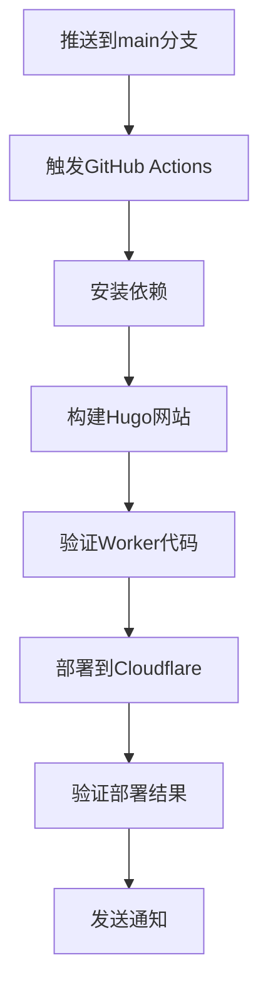
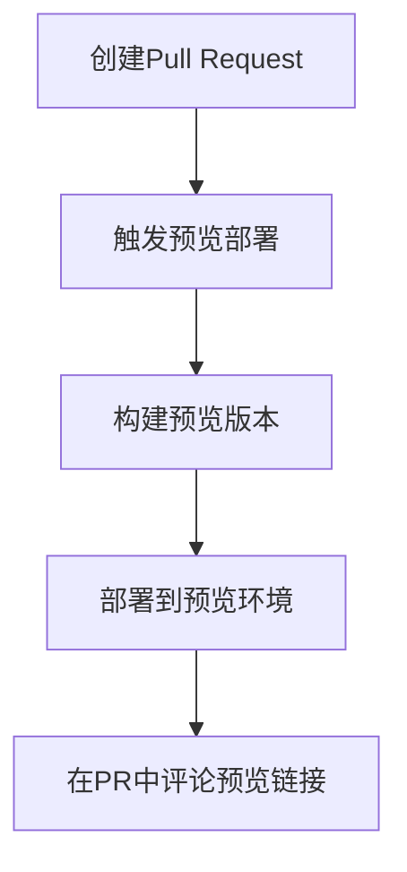

# NSSA GitHub集成部署指南

## 🎯 集成后的变化

### ✅ **保持不变的部分**
- GitHub推送流程完全不变
- `npx wrangler deploy` 命令依然有效
- 项目结构和配置文件位置不变
- 所有现有的Git工作流程继续有效

### 🆕 **新增的功能**
- Admin功能已集成到主站Worker中
- 新增了`admin.nssa.io`域名路由
- 提供了更多部署选项和自动化工具

## 🚀 **部署方式对比**

### 方式1：原有手动部署（推荐保留）
```bash
# 1. 开发和提交
git add .
git commit -m "更新内容"
git push origin main

# 2. 手动部署（任选其一）
npx wrangler deploy                    # ✅ 原有方式，继续有效
npm run deploy                         # ✅ package.json脚本
npm run deploy:integrated             # 🆕 新的集成脚本
```

### 方式2：GitHub Actions自动部署（新增）
```bash
# 只需推送到GitHub，自动触发部署
git push origin main
# 🤖 GitHub Actions自动执行：构建 → 验证 → 部署 → 测试
```

### 方式3：手动触发部署（新增）
- 在GitHub仓库的Actions页面手动触发部署
- 适合紧急部署或测试场景

## 🔧 **GitHub Secrets配置**

在GitHub仓库设置中添加以下Secrets：

### 必需的Secrets
```
CLOUDFLARE_API_TOKEN     # Cloudflare API令牌
CLOUDFLARE_ACCOUNT_ID    # Cloudflare账户ID
```

### 获取Cloudflare API Token
1. 访问 https://dash.cloudflare.com/profile/api-tokens
2. 点击"Create Token"
3. 使用"Custom token"模板
4. 设置权限：
   ```
   Zone:Zone:Read
   Zone:Zone Settings:Edit  
   Account:Cloudflare Workers:Edit
   Zone:Zone:Edit
   ```
5. 账户资源：包含您的账户
6. 区域资源：包含 nssa.io
7. 复制生成的Token

### 获取Account ID
1. 在Cloudflare Dashboard右侧边栏找到"Account ID"
2. 复制该ID

### 配置步骤
1. 进入GitHub仓库
2. 点击 Settings → Secrets and variables → Actions
3. 点击 "New repository secret"
4. 添加上述两个Secrets

## 🔄 **工作流程详解**

### 自动部署流程


### PR预览流程


## 📊 **部署监控和通知**

### 部署状态检查
GitHub Actions会自动验证：
- ✅ Hugo网站构建成功
- ✅ Worker代码包含Admin功能
- ✅ 主站API响应正常
- ✅ Admin API响应正常
- ✅ 所有域名可访问

### 失败处理
如果部署失败，GitHub Actions会：
- 🔍 显示详细的错误日志
- 📧 发送邮件通知（如果配置了）
- 🚫 阻止错误的代码部署到生产环境

## 🎛️ **高级配置选项**

### 环境变量配置
在`.github/workflows/deploy.yml`中可以配置：
```yaml
env:
  HUGO_VERSION: '0.148.1'
  NODE_VERSION: '18'
  DEPLOY_ENVIRONMENT: 'production'
```

### 条件部署
```yaml
# 仅在特定文件变更时部署
on:
  push:
    branches: [main]
    paths:
      - 'content/**'
      - 'layouts/**'
      - 'workers-site/**'
      - 'static/**'
```

### 多环境部署
```yaml
# 生产环境
- name: Deploy to Production
  if: github.ref == 'refs/heads/main'
  run: npx wrangler deploy

# 测试环境  
- name: Deploy to Staging
  if: github.ref == 'refs/heads/develop'
  run: npx wrangler deploy --env staging
```

## 🔍 **故障排除**

### 常见问题

**问题1**: GitHub Actions部署失败
```bash
# 解决方案：检查Secrets配置
1. 确认CLOUDFLARE_API_TOKEN有效
2. 确认CLOUDFLARE_ACCOUNT_ID正确
3. 检查API Token权限设置
```

**问题2**: 部署成功但功能异常
```bash
# 解决方案：本地验证
1. 本地运行: npm run deploy:integrated
2. 检查Worker代码: workers-site/index.js
3. 验证域名配置: wrangler.toml
```

**问题3**: Admin功能缺失
```bash
# 解决方案：检查代码集成
1. 确认workers-site/index.js包含Admin函数
2. 检查域名路由配置
3. 验证DNS记录设置
```

## 📈 **性能优化建议**

### 缓存策略
```yaml
# 在GitHub Actions中启用缓存
- name: Cache dependencies
  uses: actions/cache@v3
  with:
    path: ~/.npm
    key: ${{ runner.os }}-node-${{ hashFiles('**/package-lock.json') }}
```

### 并行构建
```yaml
# 并行执行多个任务
jobs:
  build:
    strategy:
      matrix:
        environment: [production, staging]
```

## 🎉 **总结**

### 集成后的优势
1. **向后兼容**: 所有现有工作流程继续有效
2. **自动化选项**: 可选择手动或自动部署
3. **多环境支持**: 生产、测试、预览环境
4. **质量保证**: 自动验证和测试
5. **简化管理**: 单一Worker，统一部署

### 推荐工作流程
1. **日常开发**: 继续使用 `git push` + `npx wrangler deploy`
2. **重要更新**: 使用GitHub Actions自动部署
3. **功能测试**: 使用PR预览部署
4. **紧急修复**: 手动触发GitHub Actions

您的现有工作流程完全不需要改变，同时获得了更多的自动化选项！🚀
