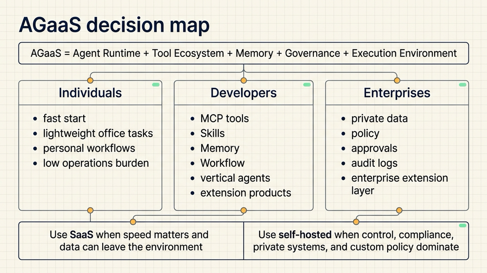
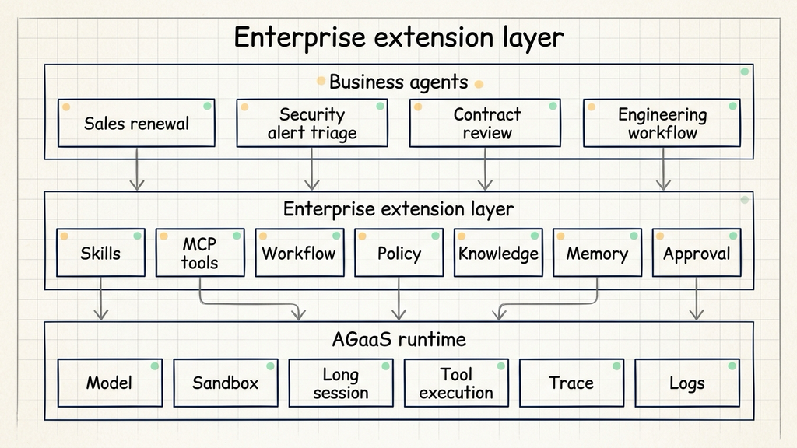
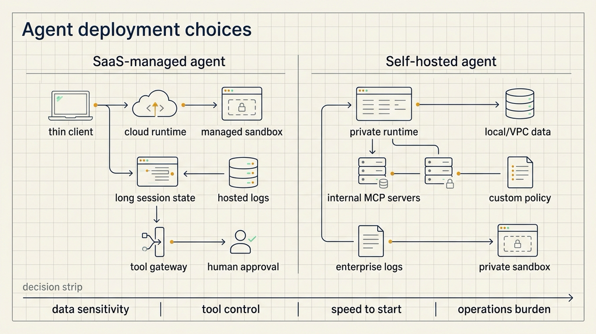

# After Agent SaaS: What Individuals and Enterprises Should Build

## Sources

- User-provided discussion material: `/Users/matthewyin/Desktop/chat.txt`, July 2, 2026.
- Anthropic, "Claude Managed Agents", April 8, 2026: https://claude.com/blog/claude-managed-agents

On April 8, 2026, Anthropic published Claude Managed Agents. The release is a useful signal because it turns a vague idea into a product direction: agent SaaS is moving beyond a chat window. The local user experience may still look like a client, but the actual task execution increasingly happens in a managed runtime.

That is the simplest way to introduce AGaaS, or Agent as a Service. In this framing, the provider does not only host a model. It hosts the runtime around the model: execution environment, sandbox, long-running sessions, tool calls, memory, permissions, logs, tracing, and human approval.

The important question is no longer whether agents will move to the cloud. Some already have. The better question is what individuals, developers, and enterprises should still build when a provider manages the agent runtime. Another question sits next to it: when should a team use a SaaS-managed agent, and when should it self-host?

## Agent SaaS moves runtime outside the local machine

Many people still understand agents at the model layer: the model is stronger, answers are better, and tool calls are more capable. AGaaS sits one layer above that. It is about hosting the process around a task, not only generating a response.

Claude Managed Agents gives a concrete version of this shift. Developers define tasks, tools, and guardrails, and agents run on Anthropic infrastructure. The managed layer handles sandboxed code execution, checkpoints, credential management, scoped permissions, end-to-end tracing, long-running sessions, and tool execution.

That is close to the AGaaS pattern. The user handles interaction and confirmation. The service handles execution, state, tools, and traces.

Imagine an agent organizing project material. Halfway through, the client disconnects. In a SaaS-managed runtime, the session state, files, tool history, and execution trace should remain on the server. If the agent instance fails, the platform can restart it. The user returns later and reviews progress, outputs, and logs.

This is the first difference between SaaS-managed agents and self-hosted agents. In SaaS, the provider owns much of the runtime burden. In self-hosting, the team owns the runtime.

## Individuals mostly buy efficiency

For most individual users, agent SaaS mainly reduces friction. There is less environment setup, less credential handling, less dependency management, and less local operational work. The user opens a client and delegates a task.

The best early personal use cases are relatively low-risk.

Information work is the first category. Reading pages, summarizing meeting notes, organizing interview transcripts, and turning raw material into outlines fit SaaS-managed agents well. The value is availability and continuity across devices.

Lightweight creation and office work is the second category. Weekly reports, copy editing, research drafts, email organization, and table generation do not usually justify running a private agent runtime. The user wants time saved, not another system to maintain.

Low-risk automation is the third category. Renaming downloaded files, cleaning a folder of Markdown notes, turning a travel plan into a schedule, or preparing a checklist are useful because a human can inspect the result and the cost of failure is limited.

Individuals who want more value should not only use agents. They should write down their own work instructions: writing rules, project descriptions, source lists, output formats, allowed changes, and review steps. These can become personal Skills, templates, or workflow notes.

Developers sit in a different position. A developer who only uses a SaaS agent gets productivity gains. A developer who understands runtime, MCP, Skills, Workflow, and Memory can build vertical agents, internal extensions, tool connectors, or a small agent application layer.

The dividing line is simple: ordinary users buy efficiency; developers can build capability.

## Enterprises need their own extension layer

The most common enterprise mistake is treating agent SaaS as a smarter chat entry point. An employee asks a question, the agent calls a few APIs, and a result comes back. That can reduce clicks, but it rarely changes the workflow.

Enterprises need to build an extension layer above AGaaS.

The name is less important than the function. It might be called an Agent Application Platform, an enterprise agent layer, or an extension platform. It connects enterprise skills, tools, knowledge, policies, and approvals to an agent runtime.

Skills capture repeatable procedures. Code review rules, contract review checklists, release gates, weekly reporting standards, and customer renewal heuristics should be written as instructions that agents can load each time.

MCP tools connect enterprise systems. Databases, knowledge bases, ticketing systems, CRM, Jira, GitHub, cloud resources, and approval systems need to become describable, permissioned, and traceable tools.

Workflows define action order. Some steps can run automatically. Some steps must pause for human review. Some outputs need to be written back into existing systems.

Policies control permission and risk. They define what data an agent can read, what actions it can perform, which tasks must be logged, and which tool calls require secondary confirmation.

Knowledge and memory preserve enterprise context. Project background, past decisions, customer preferences, incident retrospectives, and internal terminology should not be re-explained every time a task starts.

This is where enterprises still have work to do. The provider can host a general-purpose runtime. The enterprise has to attach its own operating knowledge.

## SaaS is speed; self-hosting is control

SaaS-managed and self-hosted agents are not ranked by quality. They are useful for different tasks.

SaaS-managed agents are best for personal productivity, lightweight office work, cross-device use, fast pilots, and general tool usage. Their main advantages are fast setup, low operational burden, managed upgrades, ready-made long sessions, and hosted sandbox capabilities. The tradeoff is data and permission exposure to a platform, along with limits on deep customization.

Self-hosted agents are better for private data, internal systems, strong compliance, deep tool integration, and enterprise-owned agent platforms. Their advantages are data control, integration freedom, custom permission models, and tighter alignment with internal workflows. The tradeoff is operational work: runtime, storage, logs, sandboxing, keys, upgrades, and incident handling.

Most individuals should start with SaaS. The operational burden of self-hosting can easily exceed the value saved by the agent. Self-hosting makes sense when the user is already a developer, when the task touches sensitive files, or when the work requires local automation and unusual tools.

Enterprises should split use cases. General office work, knowledge organization, engineering assistance, market research, and support summarization can start as SaaS pilots. Core data, internal systems, production changes, and heavily regulated financial, medical, or government workflows are better candidates for self-hosting or private cloud deployment.

Some tasks should not go straight to SaaS. If an agent needs to modify production configuration, read customer private data, process financial approval, or access systems that only open inside the corporate network, the team should consider self-hosting, private cloud hosting, or a hybrid design first.

Many organizations will end up with a hybrid model. General tasks use SaaS. Sensitive tasks use self-hosting. The enterprise extension layer stays under the organization's control. That lets teams borrow the provider's runtime where appropriate while preserving control over data, permission, and workflow.

## A practical decision rule

The deployment choice should start with what the task touches.

If the task mainly touches public material, personal documents, and lightweight office files, SaaS is usually the better starting point. The user wants speed, not platform maintenance.

If the task touches customer data, financial data, source code, internal systems, production environments, or approval actions, self-hosting or private hosting is safer. The organization needs control, logging, permission, and accountability.

If the task needs both public tools and private systems, use a hybrid approach. A SaaS agent can handle public research and general generation. A self-hosted agent can handle internal data and write-back actions. Enterprise MCP tools, Skills, and Workflow can connect the two.

This decision rule works for individuals too. Use SaaS for ordinary research and writing. Consider local tools or a small self-hosted runtime when the work depends on private files, long-term project memory, local automation scripts, or a deeply customized personal knowledge base.

## The opportunity is above AGaaS

Once AGaaS becomes common, the underestimated layer is the one above it.

For individuals, that layer is personal work method: fixed sources, fixed templates, fixed checklists, and fixed output formats. The user who can describe repeatable work clearly will get more stable results from agents.

For developers, that layer is tools and workflows: MCP, Skills, Memory, Workflow, evaluation, and permission policy. Developers who package a vertical task well can build reusable agent products.

For enterprises, that layer is organizational experience. Senior salespeople know how to spot customer risk. Operations teams know how to classify alerts. Legal teams know where contracts usually fail. Project managers know what demand drift looks like. If that experience becomes agent-readable instructions, tool connectors, and approval flows, the enterprise gains something more durable than a chat interface.

Agent SaaS will not turn everyone into a platform company. Most individuals will gain efficiency. Developers can build tool layers and vertical agents. Enterprises need to connect their processes, tools, knowledge, and policies to a runtime.

The final deployment question is concrete: can the data leave the environment, does the action need approval, and who takes over when the agent fails? Those three answers should decide whether to use SaaS, self-hosting, or a hybrid design.
