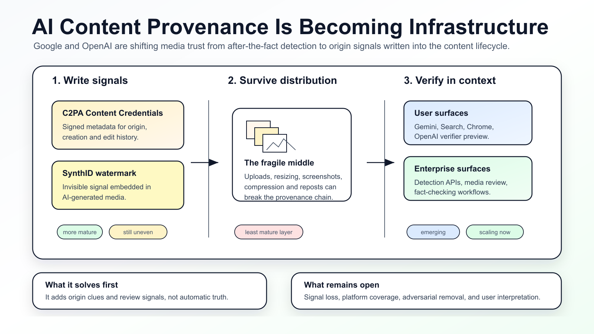
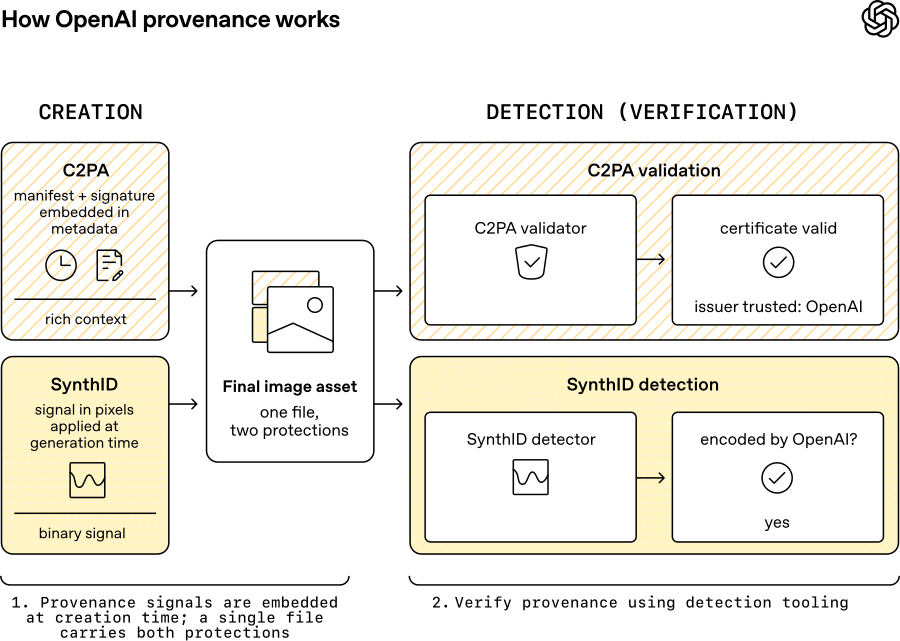
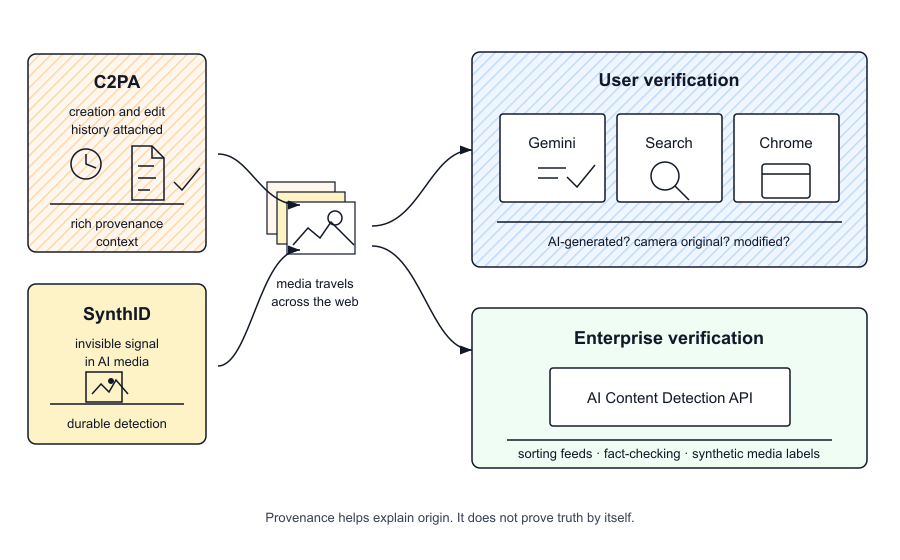

# AI-Generated Content Is Getting an Identity Layer

Google and OpenAI published closely timed updates on the same problem: AI-generated media needs a better way to explain where it came from.

This is not just another AI detector. The real shift is provenance.

When images, video, and audio can be generated or edited at low cost, the useful question is no longer only "was this made by AI?" It becomes: where did this file come from, was it changed, which tools touched it, and can those signals survive normal internet distribution?

The emerging answer has two layers.

C2PA Content Credentials are the provenance layer. They attach signed metadata that can describe how a piece of media was created, whether it was edited, and which tools were involved.

SynthID is the watermarking layer. It embeds an invisible signal into AI-generated media. Google says SynthID has already been used across more than 100 billion images and videos, plus 60,000 years of audio.

The two systems solve different problems. Credentials can carry richer context, but metadata can be stripped during uploads, downloads, resizing, screenshots, and format conversion. Watermarks carry less context, but they can be more resilient when the file moves.

OpenAI is approaching the issue from the generation side. It says it has added Content Credentials to DALL-E 3, ImageGen, and Sora, and is now a C2PA Conforming Generator Product. It is also working with Google DeepMind to add SynthID watermarks to images generated through ChatGPT, Codex, and the OpenAI API.

OpenAI is also previewing a public verification tool that checks whether uploaded images contain OpenAI provenance signals, including Content Credentials and SynthID. The important limit: at launch, the tool focuses on OpenAI-generated content. Broader cross-industry verification is still a future goal.

Google is approaching the issue from the ecosystem side. It has generation tools, Search, Chrome, Gemini, Pixel, and Google Cloud. That gives it both the creation layer and the verification surfaces.

Google is expanding SynthID verification from Gemini into Search and Chrome. It is also adding C2PA verification, so users can better understand whether content was captured by a camera, modified, or created with AI tools. For enterprises, Google is bringing AI Content Detection API capabilities into Google Cloud workflows.

So is this full mutual recognition between Google and OpenAI?

Not yet.

The more accurate framing is partial interoperability moving toward mutual recognition. Both companies are adopting overlapping provenance signals: C2PA credentials and SynthID watermarks. That creates the conditions for cross-platform verification, but the verification ecosystem is not fully unified yet.

The first pain point this solves is origin clues. A user, platform, publisher, or company can get more information about whether media carries AI-generation signals or signed provenance metadata.

For content teams, that changes asset review. AI-generated marketing images, training materials, customer presentations, and public communications will increasingly need a record of how they were produced and edited.

For journalists and researchers, provenance becomes an early verification signal. It will not replace reporting or cross-checking, but it can reduce the cost of the first pass.

For platforms, provenance can help with labeling, moderation queues, and synthetic media policies.

The limits matter. Provenance is not truth. A verified original can still be misleading. A file without credentials is not automatically fake. Credentials can be stripped. Watermarks can be attacked. The middle of the distribution chain remains fragile.

That is the real infrastructure challenge. Generation tools can write signals. Verification tools can read signals. But the web in between still has uploads, compression, screenshots, reposts, and platform-specific transformations.

The direction is clear: AI media trust is moving from after-the-fact guessing toward signals written into the content lifecycle.

The open question is whether those signals can survive the messy path from creation to distribution to everyday verification.
