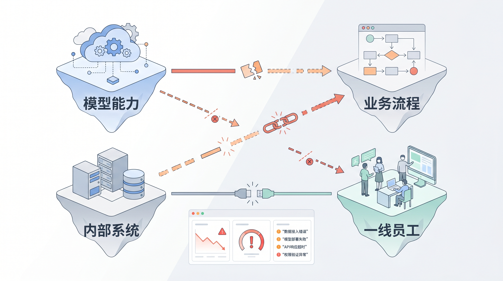
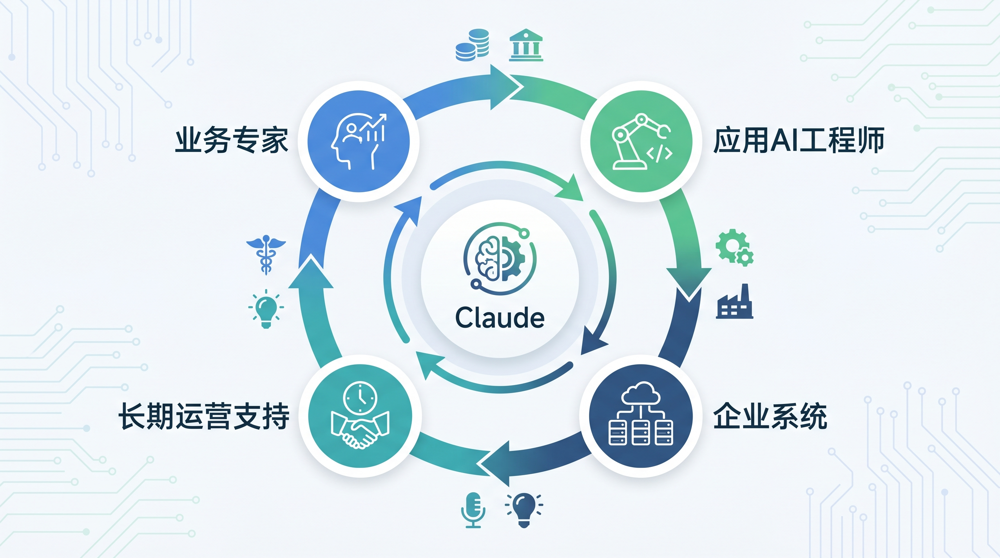
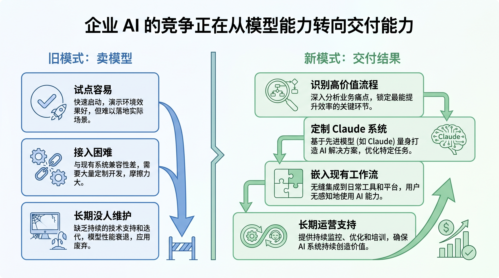

# Anthropic 的新公司，暴露了企业 AI 最大的真问题

你老板让你“把 AI 用起来”的时候，最痛苦的往往不是选哪个模型。

真正让人头大的是下一句：

“能不能直接嵌到业务流程里？”

这句话一出来，问题就不再是买不买 Claude、ChatGPT 或 Gemini，而是另一套更麻烦的东西：谁来理解业务？谁来改流程？谁来接系统？谁来长期维护？出了错谁负责？

很多公司试过 AI 之后都会卡在这里。

演示时很惊艳，落地时很沉默。

个人用起来像神器，企业用起来像工程债。

所以 Anthropic 这次和 Blackstone、Hellman & Friedman、Goldman Sachs 一起成立新的企业 AI 服务公司，我不建议你把它看成一条普通融资或合作新闻。

我的判断很直接：

**企业 AI 的竞争，正在从“卖模型”转向“交付结果”。**

## 旧方法的死穴：模型会了，企业不会落地

过去两年，企业买 AI 的典型路径很简单。

先买模型能力，或者买一套带 AI 的软件。

然后内部团队开始试点：写文档、做客服、查知识库、生成代码、总结会议。

这些事情有价值，但离“核心运营”还差一步。

核心运营是什么？

不是让员工多一个聊天窗口。

而是把 AI 放进企业每天真正跑钱、跑风险、跑责任的流程里。

比如 Anthropic 原文里提到的场景：社区银行、中型制造商、区域性医疗系统。

这些企业不是没有 AI 需求，而是没有足够的内部资源，把前沿模型部署到自己的核心流程中。

大型企业有 Accenture、Deloitte、PwC 这类系统集成商帮它们做复杂转型。它们有预算、有项目制团队、有几十个部门一起配合。

中型企业就尴尬了。

它们也有真实需求，但没有那么厚的 AI 工程团队，也不一定能长期养一支懂模型、懂业务、懂系统集成的人。

这就是旧方法的死穴：

**模型能力解决“能不能做”，交付能力解决“能不能用”。**

很多企业 AI 项目不是死在模型不够强，而是死在没人能把模型变成日常工作的一部分。

## Anthropic 这次补的，不是模型，是交付网络

这家新公司的定位很有意思。

它不是 Anthropic 再发一个模型，也不是简单开一个咨询部门。

原文说得很具体：新公司会面向跨行业的中型企业，把 Claude 带入它们最重要的运营中。Anthropic 的应用 AI 工程师会和新公司的工程团队一起，识别 Claude 最能产生影响的地方，构建定制方案，并长期支持客户。

这里有三个关键词。

第一，**应用 AI 工程师**。

这说明它不是卖完账号就结束。Anthropic 要让懂 Claude 的人进入交付过程，解决“模型能力怎么变成具体系统”的问题。

第二，**定制解决方案**。

企业核心流程很少能直接套模板。医疗、银行、制造，每个行业都有自己的数据、责任边界、审批链条和合规要求。只给一个通用聊天框，解决不了真正的问题。

第三，**长期支持**。

AI 系统一旦进入核心运营，就不是一次性项目。流程会变，数据会变，组织职责会变，模型能力也会变。企业要的不是一场演示，而是能持续跑的能力。

Anthropic 举的医疗服务集团例子很典型。

多地点诊所里的临床医生，每天要花大量时间处理文档、医疗编码、预授权和合规审查。工程团队不是先拍脑袋做一个“AI 医疗助手”，而是先和临床医生、IT 人员坐下来，看时间到底消失在哪里，看现有工作流怎么跑，再围绕这些知识构建工具。

这个动作非常关键。

因为企业 AI 的底层逻辑不是“让模型替人工作”，而是“让模型进入人的工作上下文”。

它需要理解谁在什么时间点做什么决策，需要接入原有系统，需要尊重现实中的审批、责任和合规边界。

说白了：

**企业 AI 不是装模型，是改流程。**

这句话就是这次新闻最值得记住的行业新黑话。

## 为什么要拉上资本和产业网络

这次合作方也很值得看。

Blackstone、Hellman & Friedman、Goldman Sachs，再加上 General Atlantic、Leonard Green、Apollo Global Management、GIC、Sequoia Capital 这些支持方，重点不只是钱。

它们背后有大量企业客户、产业资产、管理经验和关系网络。

这意味着 Anthropic 想扩展的不只是销售渠道，而是交付入口。

大型企业可以通过传统系统集成商进入 Claude Partner Network。原文也明确说，Anthropic 会继续投资 Accenture、Deloitte、PwC 等伙伴。

但中型企业市场更分散。

它们不像超大型企业那样有成熟的转型项目，也不像个人开发者那样可以自己快速试错。这个市场需要一种更轻、更贴近业务、更能持续服务的交付组织。

所以这家新公司本质上是在补企业 AI 生态里的空层：

上面是模型公司。

下面是行业企业。

中间缺一个能把模型、流程、工程和长期运营接起来的组织。

这也解释了 Anthropic 首席财务官 Krishna Rao 的那句话：企业对 Claude 的需求正在显著超过任何单一交付模式所能承载的范围。

翻译成人话就是：

Claude 需求很多，但只靠一种卖法吃不下。

API 吃开发者市场。

订阅吃个人和团队市场。

系统集成商吃大型企业市场。

而中型企业，需要新的交付形态。

## 这件事对行业意味着什么

如果你是产品经理、架构师、研发、运维或基础设施人员，这条新闻真正值得警惕的地方在这里：

未来企业买 AI，不会只问“你模型多强”。

它会问更具体的问题：

能不能接进我的流程？

能不能理解我的业务规则？

能不能和我的系统协同？

能不能长期维护？

能不能在合规和责任边界内运行？

这会改变 AI 公司的竞争方式。

过去大家比参数、比上下文长度、比推理能力、比价格。

接下来还要比行业交付能力、合作伙伴网络、工程实施经验和持续运营能力。

这对模型公司不是纯好事。

因为交付是重活。

它不像卖 API 那样边际成本低，也不像订阅那样标准化。它需要人、需要行业经验、需要项目管理，还需要承担客户真正用起来之后的麻烦。

但这也是企业 AI 绕不过去的一步。

只要 AI 还停留在工具层，它就是效率插件。

一旦进入核心运营，它就变成组织能力的一部分。

这中间差的不是一个更聪明的聊天框，而是一整套交付体系。

## 大尹洞察

我对这件事的判断是：

**未来值钱的人，是会把 AI 变成流程的人。**

模型会越来越强，但企业不会自动变聪明。

真正稀缺的是那些能站在业务现场，把 AI 能力翻译成流程改造、系统设计和运营责任的人。

所以你不用急着背完所有模型发布会。

明天上班前，做一个很小的动作就够了：

把这篇文章转发给你们负责业务系统、流程平台或数据治理的人，配一句话：

“我们现在的 AI 试点，是停在工具层，还是已经进核心流程了？”

这句话比泛泛而谈“要拥抱 AI”更有用。

如果你在团队里负责架构、运维、数据或内部平台，也可以顺手列一个清单：哪些流程最耗人、最重复、最依赖上下文、最容易因为信息断层出错。

这些地方，才是企业 AI 真正该先看的地方。

最后站个队：

你觉得 Anthropic 这一步是在补企业 AI 的关键短板，还是会把模型公司拖进重交付泥潭？

支持“关键短板”的扣 1。

支持“重交付泥潭”的扣 2。

原文链接：https://www.anthropic.com/news/enterprise-ai-services-company
