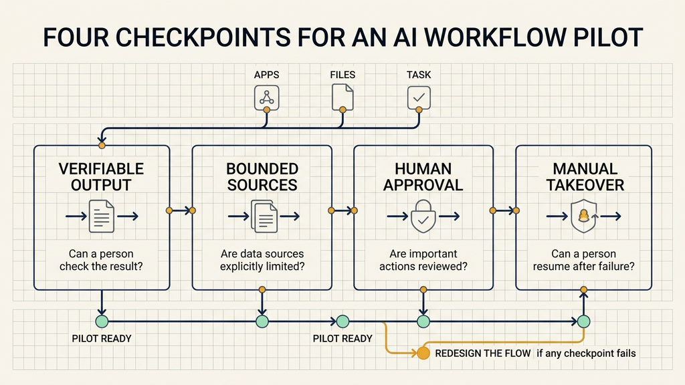
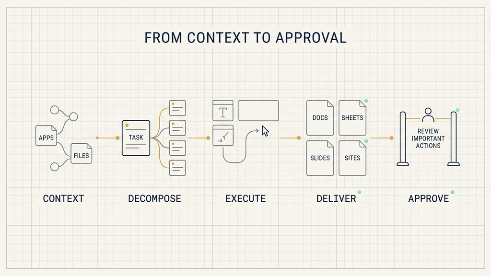
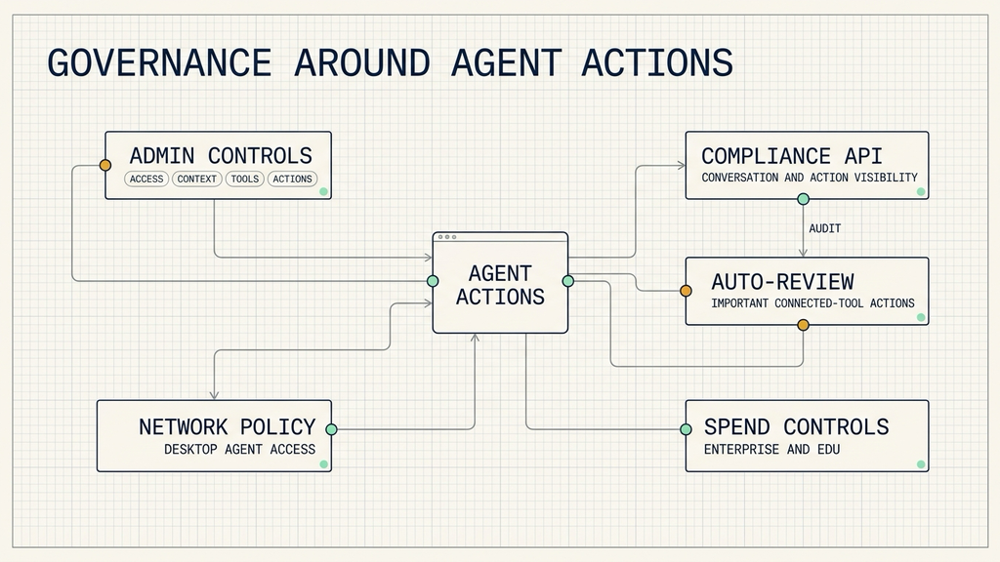

# ChatGPT Work 工作流，团队先查四个检查点

## 资料来源

OpenAI 官方产品发布｜[ChatGPT is now a partner for your most ambitious work](https://openai.com/index/chatgpt-for-your-most-ambitious-work)｜发布时间：2026-07-09｜主题：ChatGPT Work 产品发布

很多团队每天都在重复同一组动作：从 Slack 或 Teams 找讨论，去网盘翻参考文件，把信息整理进文档，再更新表格和演示稿。工具负责各自的一段，员工负责在工具之间搬运上下文、催进度和检查结果。

OpenAI 发布的 ChatGPT Work，试图把这些动作装进一条可持续运行的 **ChatGPT Work 工作流**。它可以连接应用和文件、拆分复杂任务、生成 Sheets、Slides、Docs 与 Sites 等成品；用户可以跟踪进度、补充信息、调整方向，并审批重要操作。

团队评估它时，可以先检查四件事：**结果能否核验、数据源能否限定、重要操作能否审批、失败后能否由人接管**。这四个检查点比功能数量更接近真实工作的要求。

## ChatGPT Work 工作流把一次对话拉成完整任务

ChatGPT Work 是 ChatGPT 内置的工作代理，由 GPT-5.6 驱动，并整合了 Codex 技术。OpenAI 称，它可以把复杂项目拆成较小步骤，独立执行数小时，并在 Web、移动端和桌面端完成实际工作。

官方给出的营销场景很直观：用户提交一次请求，系统先把客户研究整理成营销简报，再根据简报生成素材，并为不同市场调整内容。上下文会沿着各个步骤继续传递。

传统对话的交付物通常是一段回答。工作代理的交付物可以是一组相互依赖的文件和操作。它更像一名拿到任务单的项目成员：先找材料，再拆任务，按模板制作成品，在需要决定或授权的位置回到用户面前。

这里的核心变化是 **工作单位变长了**。用户交给 ChatGPT 的内容，从一个问题扩展成一段流程；人的工作也从逐步操作，转向设定目标、提供上下文、审批动作和检查结果。

## 五类能力组成获取、执行和审批链路

这条链路由五类能力共同组成。

**一是推理与拆分。** GPT-5.6 负责驱动 ChatGPT Work。OpenAI 将其描述为擅长多步任务，以及依照模板和参考文件生成材料。这里的“先进水平”来自官方表述，原文没有提供第三方基准、延迟数据或其他独立验证。

**二是应用连接。** 统一插件目录可以连接 Slack、Microsoft Teams、Google Drive、SharePoint、邮件、日历、客户关系管理系统（CRM）和项目跟踪器。用户还可以在提示词（prompt）中用“@应用名”指定数据来源。

**三是持续执行。** 定时任务（Scheduled Tasks）可以把 Teams 和 Slack 的新消息整理成更新后的 Docs 或 Slides，再向团队分享重要变化。它让信息同步从一次请求变成持续任务。

**四是桌面操作。** 桌面端内置浏览器可用于在线研究和处理网页工具。计算机操作（Computer Use）可以在应用、工具和浏览器中点击、输入和移动文件，也可以成为定时任务的一部分。

**五是成品交付。** ChatGPT Work 可以生成 Sheets、Slides、Docs 和 Web 应用。处于公开测试阶段的 Sites，还能把想法转成可通过 URL 分享的仪表板、项目跟踪器、原型、内部门户或交互式报告。

把它们连起来，工作过程可以概括为：

**获取应用与文件中的上下文 → 拆分多步任务 → 调用工具执行 → 生成可交付成品 → 用户审批重要操作**

用户在执行期间仍能跟踪进度、回答问题和改变方向。工作代理的自主执行因此带有明确的人机交接位置。

## 销售和财务案例说明了什么

OpenAI 披露，每周使用 Codex 的人数超过 500 万，其中超过 100 万人将它用于软件开发之外的工作。OpenAI 还称，公司内部包括财务和销售在内的近 100% 团队已使用 ChatGPT Work 与 Codex。

这些数字描述的是 Codex 的使用规模和 OpenAI 自身的采用情况，不能推导出其他公司的采用率或效果。

在销售案例中，OpenAI 称 ChatGPT Work 把一次需求发现对话转成面向关键问题的定制概念验证（PoC）。系统整理笔记、把需求路由给解决方案架构师，并与技术团队协作。官方给出的结果是：通常需要数周的过程在 24 小时内完成。

在财务案例中，系统查找源数据，将数据移入 Excel 或 Sheets，完成对账、制作演示稿并验证结果。OpenAI 称，月度结账与预测从数日缩短到数小时。

两个案例都包含一条清晰的任务链：输入可定位，步骤可拆分，输出可检查，关键环节有人参与。它们可以帮助团队识别试点形态。**24 小时和“数日到数小时”属于 OpenAI 自述**，原文没有给出样本量、对照基线或第三方复现结果，不能作为普遍效率承诺。

## 三类团队可以从小流程开始

销售或客户团队可以选择“会议记录到内部方案”这条流程。指定会议记录和客户资料作为数据源，让系统生成结构化笔记和方案初稿，在路由给技术人员或对外分享前保留人工审批。验收时检查关键信息是否完整、引用是否来自指定资料、交接对象是否正确。

财务团队可以选择“源数据到汇报材料”中的低风险片段。系统负责定位指定数据、填入固定表格、生成演示稿草稿；财务人员负责对账和结果确认。涉及最终数字、写入正式系统或外发文件时，由人完成审批。

产品、运营和管理团队可以选择“消息到周报”流程。定时任务读取指定的 Teams 或 Slack 消息，更新固定 Docs 或 Slides，并列出重要变化。负责人检查遗漏、归属和表述，再决定是否分享给团队。

开发团队则可以关注合并后的桌面体验。Codex 应用并入新的 ChatGPT 桌面应用后，保留原有开发能力，并加入差异文件内联编辑、侧边栏拉取请求（PR）审阅、由 GPT-5.6 驱动的更快计算机操作，以及单项目多仓库支持。

这些场景的共同点是：**数据范围明确、输出格式固定、结果可以复核**。团队可以据此选择第一条流程，暂时把开放式决策和高风险写操作留给人。

## 企业 AI 治理要落到四个开关

代理能够读取公司资料并操作工具后，权限管理会直接影响可用范围。ChatGPT Work 建立在 ChatGPT Enterprise 的安全、隐私、合规和工作空间管理基础上。Enterprise 和 Edu 管理员可以集中控制：

- 谁可以访问；
- ChatGPT 可以使用哪些公司上下文；
- 可以连接哪些工具；
- 可以执行哪些操作。

合规接口（Compliance API）为企业提供 ChatGPT Work 对话和操作的集中可见性。自动复审（Auto-review）会在涉及连接工具和应用程序接口（API）的重要操作执行前，再用模型进行复审，以降低敏感信息未经授权共享的风险。

Auto-review 的范围是“涉及连接工具和 API 的重要操作”。原文没有说明具体触发标准、误报率和人工复核流程。团队在正式使用前，仍需确认哪些动作会触发复审，哪些动作必须由内部流程补充审批。

桌面端沿用 Codex 的企业治理模型，把管理员控制扩展到本地文件、应用、浏览器和工具，其中包含代理网络访问策略。Enterprise 和 Edu 管理员还可以设置工作区默认用量、组级限制、个人覆盖，并审批额外额度申请。

## 第一条试点用四个检查点验收

选择一条每天或每周重复出现、输入和输出都清楚的流程，然后写下四项约束。

**限定数据源。** 指定允许读取的频道、文件夹、邮件范围或项目工具，避免用模糊的“读取所有资料”。

**固定输出。** 提供现有 Docs、Slides 或 Sheets 模板，明确必须出现的字段和交付位置。

**保留审批。** 对外分享、更新客户系统、移动本地文件和其他重要操作，由明确的责任人确认。

**定义验收。** 检查信息是否完整、格式是否符合模板、数字是否经过核对、重要操作是否留下可见记录。只要其中一项无法检查，这条流程就不适合作为首个自动执行试点。

这组动作不会证明 ChatGPT Work 适合所有流程。它能帮助团队用一条小流程判断连接、执行、审批和监督是否形成闭环。

## 套餐、用量和稳定性仍有未知项

Web 和移动端首批面向 Pro、Enterprise 与 Edu 套餐，Plus 和 Business 将在随后数日陆续开放。桌面应用支持 Mac 和 Windows，Chat、Work 与 Codex 面向包括 Free 在内的所有套餐。OpenAI 将桌面应用描述为可全球下载，但原文没有进一步列出地区和语言范围。

复杂任务可能消耗更多套餐内含用量，整体用量结构与 Codex 相同。原文没有公布完整定价、套餐配额或超额费用。Enterprise 和 Edu 的用量控制也不能直接代表其他套餐具备相同管理能力。

内置浏览器和 Computer Use 等能力位于桌面端。原文没有提供 Computer Use 在长任务中的稳定性数据与失败处理机制，也没有给出 GPT-5.6 的第三方性能指标。

OpenAI 还计划逐步停用独立的 Atlas 浏览器，并把现有 ChatGPT 桌面应用更名为 ChatGPT Classic。迁移步骤、具体时间表和数据处理方式仍未公布。

因此，采购或扩展使用范围之前，团队还需要核对当前套餐、终端能力、用量规则和管理员控制。涉及敏感数据、外部系统写入或无法轻易撤销的操作时，应继续保留人工确认。

## 从问答走向工作代理，团队能力也要跟上

ChatGPT Work 展示的产品方向很明确：ChatGPT 正从回答问题，走向连接上下文、执行多步任务并交付成品。插件、定时任务、桌面操作和 Sites 扩大了它可以进入的工作范围；审批、管理员控制、Compliance API 与 Auto-review 为这些操作提供了治理入口。

这套能力能否进入真实团队，取决于流程设计。**结果可核验、数据源可限定、重要操作可审批、失败后可接管**，构成了更实际的采用标准。

你所在的团队里，哪条重复流程最符合这四个条件？

我会持续拆解 AI Agent 工程化方案，重点看安全架构、Claude Code、工作流和代码执行。

如果你正在做 Agent 应用，可以关注「大尹隐于网」，后面会继续写这一系列。
