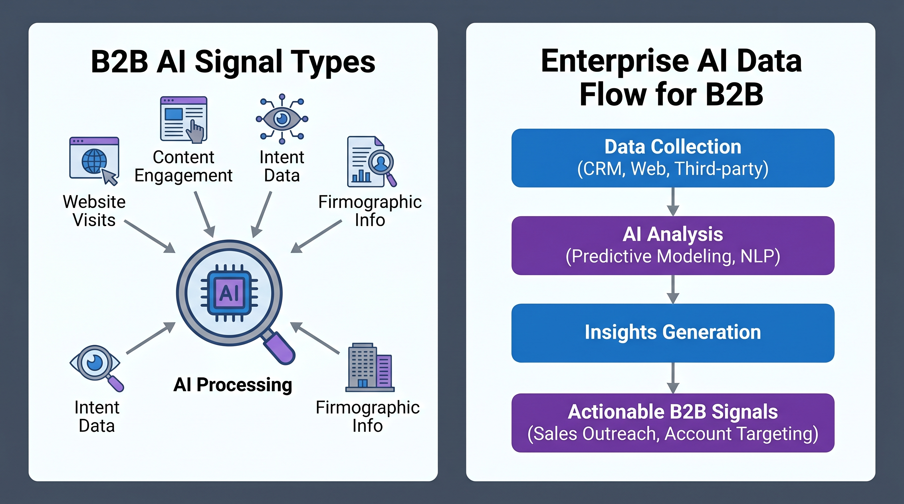
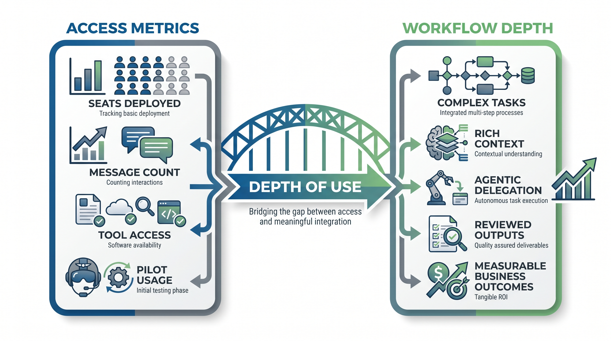
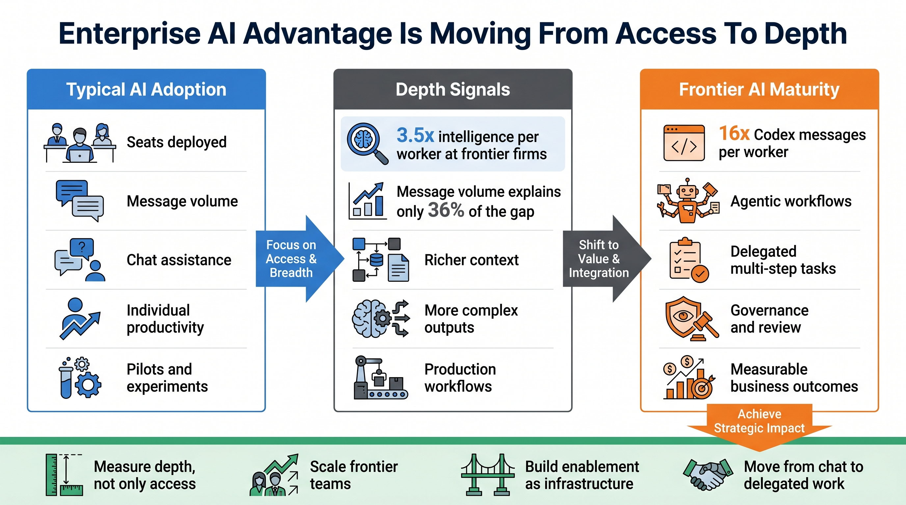

# Enterprise AI Advantage Is Moving From Access to Depth

OpenAI's B2B Signals report is not just another enterprise AI usage update.

The important signal is that the enterprise AI gap is moving from access to depth.

In the first phase, companies measured adoption by seats deployed, access granted, and employees experimenting with chat. That still matters, but it is no longer the differentiator.

According to OpenAI, frontier firms at the 95th percentile of usage now use 3.5x as much intelligence per worker as typical firms, up from 2x a year ago. Message volume explains only 36% of that gap. Most of the advantage comes from deeper, richer, more complex AI use.

That means the difference is not simply "using AI more."

It is using AI for more substantive work.

Typical firms may still use AI for questions, summaries, and writing help. Frontier firms are using AI with richer context, more advanced tools, and more integrated workflows.

## Agentic workflows are becoming the maturity marker

The clearest shift is delegation.

OpenAI says the largest gap appears in advanced and agentic tools. Frontier firms send 16x as many Codex messages per worker as typical firms. ChatGPT Agent, Apps in ChatGPT, Deep Research, and GPTs show similar directional patterns.

This matters because agentic workflows require more than a chatbot.

They require company context, permissions, tools, data, review gates, and recovery paths. The organization has to learn how to delegate meaningful work to AI while keeping human judgment and accountability in the loop.

OpenAI cites Cisco as one example. In production workflows, Codex helped reduce build times by about 20%, save more than 1,500 engineering hours per month, and increase defect-resolution throughput by 10-15x. The key point was treating Codex as part of the team.

That is the real enterprise AI transition: from individual productivity to workflow productivity.

## What teams should do

Do not only count seats and messages.

Measure depth.

Ask whether AI is involved in real workflows, whether it has enough context, whether outputs are reviewed and reused, and whether the impact shows up in business metrics.

Good starting points are frequent, repetitive, reviewable, measurable tasks:

- Customer support triage
- Sales follow-up
- Engineering debugging
- Code review
- Knowledge base answers
- Operations reporting
- Finance analysis

The practical question is not "Are people using AI?"

The better question is "Where is AI completing work?"

## The boundary

Depth is not automatically value.

More tokens can mean richer work, but it can also mean inefficient workflows. More messages can mean stronger adoption, but it can also mean that tools are not yet smooth enough.

Teams still need business metrics: response time, cost, quality, defect rate, customer satisfaction, throughput, and employee time saved.

The lesson is simple: enterprise AI maturity will not be defined by who bought the most licenses. It will be defined by who turns AI from scattered usage into repeatable workflow capability.

The gap will compound for companies that learn this early.
