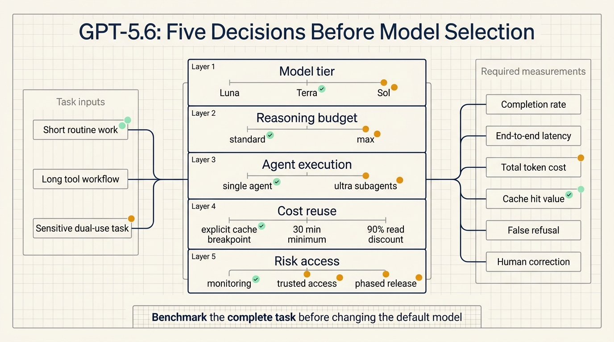
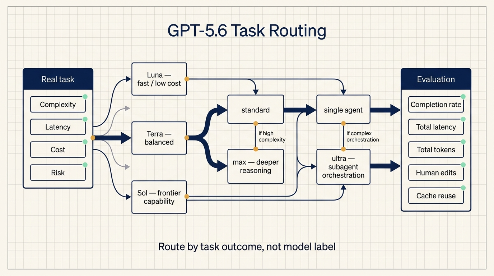
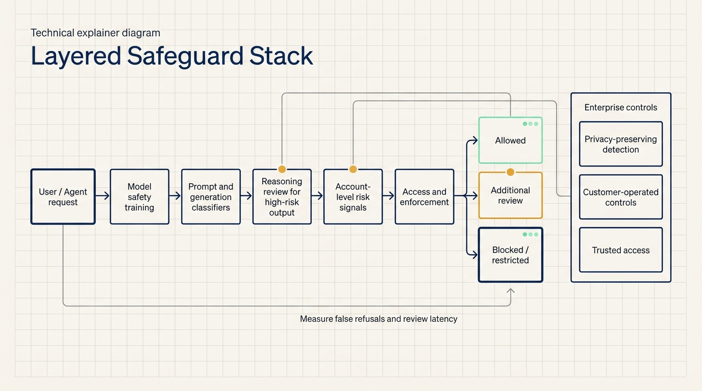

# GPT-5.6 turns model selection into a routing problem

OpenAI's GPT-5.6 preview contains several announcements at once: three model tiers named Sol, Terra, and Luna; a new `max` reasoning effort; an `ultra` mode that uses subagents; stronger cyber capabilities; explicit prompt-cache economics; and an initial release limited to trusted partners.

Together, they point to a larger product change. Choosing a model is becoming a routing decision across capability, latency, cost, execution pattern, and risk.

This matters for Codex, enterprise agents, and API applications. A production model gateway will increasingly resemble a scheduler. Short routine work can use a cheaper tier. Harder work can receive more reasoning time. Decomposable long-running tasks can use subagents. Sensitive requests may require additional monitoring or a different access level.

The evidence is still incomplete. OpenAI has published only part of the evaluation suite, and the GPT-5.6 models are available only to a small group of partners during the preview. Teams should prepare task-level evaluations now and wait for broad API access before changing their default model.

## Three durable capability tiers

GPT-5.6 introduces a new family structure. The number identifies the model generation, while Sol, Terra, and Luna identify capability tiers that can advance on their own cadence.

| Model | OpenAI positioning | Input per 1M tokens | Output per 1M tokens |
| --- | --- | ---: | ---: |
| Sol | Flagship capability for complex work | $5 | $30 |
| Terra | Balanced model for everyday work | $2.50 | $15 |
| Luna | Fast and affordable | $1 | $6 |

OpenAI says Terra is competitive with GPT-5.5 while costing half as much. Luna provides the lowest price in the family. The preview does not yet include enough evaluation data to verify those claims across common enterprise workloads, but the intended routing structure is clear.

Model names are starting to function as workload labels. Classification, extraction, and short summaries are natural candidates for Luna. Tool-heavy coding and long-context analysis can compare Terra with Sol. Frontier research, vulnerability analysis, or difficult cross-repository engineering may justify Sol.

Using Sol for every request would make costs difficult to control. Sending every request to Luna could move costs into retries, failed runs, and human correction. The useful unit of comparison is a completed task.

Teams should record task type, model, input and output tokens, tool calls, elapsed time, human edits, and failure reason. Once GPT-5.6 is broadly available, those records become a ready-made evaluation set for the three tiers.

## `max` spends more reasoning budget; `ultra` orchestrates subagents

GPT-5.6 Sol adds a `max` reasoning effort that gives the model more time for deep reasoning. OpenAI also announced `ultra`, a mode that uses subagents to accelerate complex work.

The two controls address different bottlenecks.

`max` increases the reasoning budget around one model instance. It fits work that benefits from longer analysis, repeated checking, and a deeper plan. `ultra` decomposes a task and assigns pieces to multiple agents, which can search, code, test, or review in parallel before combining results.

This changes how agent workflows can scale. A common approach today is to give one agent more context and more turns. `ultra` introduces another path: divide the work into constrained subproblems.

The additional coordination can also fail. Agents may duplicate work, operate on different repository states, produce conflicting changes, or reach conclusions that do not survive the final merge. If a migration is split into dependency analysis, code changes, test repair, and security review, the coordinating agent must verify that every result applies to the same final code.

An `ultra` evaluation should measure:

1. task completion compared with a single agent;
2. total wall-clock time, not the fastest subtask;
3. total tokens and tool calls across all agents;
4. conflicts, rework, and human corrections during aggregation.

`ultra` is an execution orchestrator. It may raise the capability ceiling, but it also expands the cost and governance surface.

## The published evaluations focus on long-running tool work

OpenAI's preview emphasizes tasks that require planning, iteration, and tool coordination.

For coding, GPT-5.6 Sol reaches a new state of the art on Terminal-Bench 2.1. The benchmark evaluates command-line workflows in which a model must plan, run tools, observe results, and adjust its approach. That is closer to how Codex works than a one-shot code-completion benchmark.

For biology, OpenAI reports that Sol outperforms GPT-5.5 on GeneBench v1 long-horizon genomics and quantitative-biology tasks while using fewer tokens.

For cybersecurity, Sol is described as competitive with Mythos Preview on ExploitBench while using about one-third of the output tokens. The ExploitGym results show that Sol, Terra, and Luna all gain capability as reasoning effort increases.

These results support a narrow conclusion: OpenAI is improving the capability and efficiency of long-horizon, tool-intensive work. They do not prove that Sol is the best option for routine office work, customer service, content generation, or enterprise retrieval.

OpenAI says it will publish a broader evaluation suite at general availability. Until then, benchmark design is more useful than leaderboard rank.

## Prompt caching becomes part of tier selection

GPT-5.6 introduces more explicit prompt-cache behavior: explicit cache breakpoints, a minimum cache life of 30 minutes, cache writes billed at 1.25 times the uncached input rate, and cache reads receiving a 90% input discount.

That pricing affects the economics of long-running agents.

An agent may send the same system instructions, tool definitions, skills, and project policies on every turn. The first cache write costs more than uncached input. Repeated reads of a stable prefix can then reduce later input costs. A one-turn task, or a prompt whose beginning changes frequently, may never recover the write premium.

Routing between Luna, Terra, and Sol may also affect cache continuity. If a task repeatedly changes model tiers, the application may lose reuse opportunities. A routing evaluation should compare the completion-rate improvement from escalation with any cache value lost during the switch.

A minimal cache test should:

1. keep system instructions, tool order, and reusable knowledge stable;
2. place user messages, task state, and tool results after that stable section;
3. run the same task without caching, with one cache write, and across multiple cached turns;
4. record cache creation, cache reads, total input cost, and complete task cost;
5. test whether model escalation invalidates or isolates the cache.

Cache hit rate alone is not an outcome. Total task cost includes retries, extra tool calls, and human rework.

## Limited access reflects the pressure of capability governance

During the preview, GPT-5.6 is available through the API and Codex only to selected trusted partners and organizations. OpenAI says it shared the release plans and model capabilities with the U.S. government before launch and is using a limited preview while work continues on a cyber Executive Order framework.

OpenAI also says this government-access process should not become the long-term default. The preview is therefore both a deployment control and an attempt to establish a repeatable release process for more capable models.

Cybersecurity is the central pressure point. In evaluations involving Chromium and Firefox, Sol identified bugs and exploit primitives but did not autonomously produce a functional full-chain exploit under the tested conditions. OpenAI therefore says the model does not cross the Cyber Critical threshold in its Preparedness Framework.

That conclusion has limits. A benchmark cannot cover every combination of the model, external tools, vulnerability databases, multiple agents, and human operators. OpenAI responded with phased access and a stack of controls that includes model training, generation-time monitoring, account-level signals, differentiated access, and continuous testing.

For enterprise buyers, stronger models introduce additional procurement questions. Which tasks require trusted access? Which logs can contribute to risk review? How much latency can safety review add? How can a legitimate dual-use workload appeal a false refusal? What happens to sensitive data used by a monitoring system?

Those questions are concrete in security research, drug discovery, biological analysis, and financial risk systems. Capability and access design now shape the deployment architecture together.

## The safeguard stack observes a broader behavior chain

OpenAI describes several layers of safeguards.

The first layer is model training. The model is trained to refuse prohibited cyber and biological assistance, including disguised or jailbreak-based requests.

The second layer is generation-time classification. The system checks prompts and generated content. A higher-risk generation can be paused and reviewed by a larger reasoning model. Content assessed as disallowed can be withheld before it reaches the user.

The third layer is account-level review. Related conversations and risk signals can be evaluated together to distinguish sustained malicious behavior from legitimate dual-use research.

The fourth layer is differentiated access and enforcement. Verified defenders and enterprise customers may use trusted-access paths that better match their work, while other accounts can receive stricter controls.

OpenAI says it used more than 700,000 A100-equivalent GPU hours for automated red teaming focused on universal jailbreaks. The system card reports that one discovered universal jailbreak achieved a 10% success rate during an early internal campaign and fell to 0% in the cited test after additional mitigations. That result applies to one attack and evaluation framework; it does not imply that jailbreak risk has disappeared.

False refusals and extra latency remain operational concerns. OpenAI acknowledges that legitimate defensive work may be blocked and that additional review can delay responses. The preview is intended to test whether legitimate users can complete normal work reliably.

Enterprise evaluations should include false-refusal rate, added review latency, escalation and appeal behavior, treatment of sensitive logs, and the ability to use customer-operated controls.

## Prepare task-level evaluations and simple routing rules

GPT-5.6 is not broadly available yet. The most useful preparation is to organize representative tasks and evaluation criteria.

Choose three real workloads:

- a short, high-frequency routine task;
- a complex workflow with multiple tool calls;
- a sensitive task involving privileged data or high-impact actions.

For each task, save fixed inputs, success criteria, a cost budget, permitted tools, and a human handoff condition.

When broad access arrives, test Luna, Terra, and Sol against the same workloads. Add `max` and `ultra` variants for the complex task. Record completion, total latency, total tokens, cache creation and reads, tool errors, human edits, and safety refusals.

Start routing with simple rules. Send low-risk routine work to Luna. Escalate failed or low-confidence results to Terra. Reserve Sol for tasks that cross a defined complexity threshold. Use `ultra` only when the work can be decomposed, run in parallel, and checked after aggregation.

This replaces a vague question — which model is strongest? — with an operational one: which tier completes this workload at an acceptable cost, latency, and risk?

GPT-5.6 remains an incomplete preview, but the product direction is visible. Model competition now spans capability, speed, pricing, caching, agent orchestration, and access conditions. Application teams will need better evaluation and scheduling before they need a new default model.

## Sources

- [OpenAI: Previewing GPT-5.6 Sol](https://openai.com/index/previewing-gpt-5-6-sol/)
- [OpenAI: GPT-5.6 Preview System Card](https://deploymentsafety.openai.com/gpt-5-6-preview)
