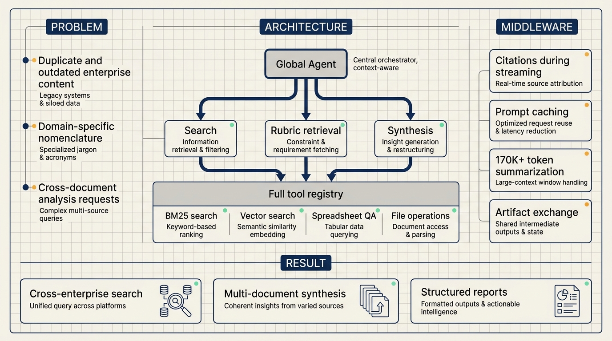
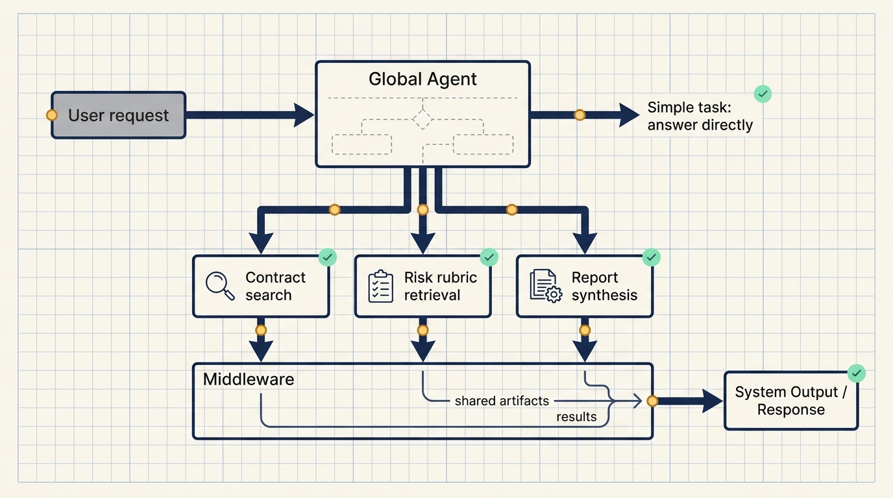
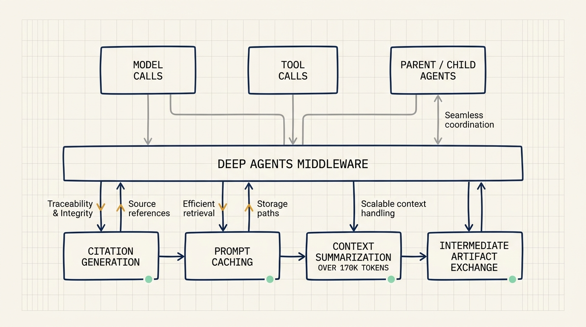

# How Box AI built enterprise content agents with Deep Agents

Enterprise content management is not hard because documents need a place to live. It is hard because a user can ask a cross-document, cross-year, cross-team question and expect the system to find the right material, preserve permissions, cite its sources, and return a useful analysis.

Box's write-up on Box Agent is useful because it describes that shift in concrete architectural terms. Box Agent, part of Box AI, is built on Deep Agents to search across an enterprise content library, synthesize findings across thousands of documents, and generate reports and analysis while respecting Box's existing security and permissions model.

## Start with controlled knowledge sources

The first version of Box Agent allowed users to ask questions inside a single document. That is a narrow but clean problem: one file in, one answer out, limited context, limited retrieval ambiguity.

The next step was Knowledge Hubs, a RAG-based layer that let users query across a defined knowledge source. This is where enterprise content starts to look like enterprise content. Documents may be duplicated. Some information is outdated. Different business units use different names for similar concepts.

Sesh Jalagam, Principal AI Architect at Box, described the original problem as enterprise search. The hard part was not just searching text. It was handling duplicate information, stale information, and company-specific nomenclature.

The first practical lesson is to avoid opening the whole content estate at once. Start with a defined knowledge source and make retrieval, source selection, and permission inheritance reliable before expanding scope.

## Standard Q&A breaks down on compound tasks

Box's users started asking questions that were larger than document Q&A.

A bioscience company might ask Box AI to synthesize existing research before starting a new study. A legal team might ask it to pull all contracts above a certain value from the past decade and evaluate them against a risk rubric.

Those tasks contain several operations:

1. Find the relevant documents.
2. Apply filter conditions.
3. Retrieve the rubric or evaluation standard.
4. Synthesize the result into a report.

This is where a normal RAG answer path becomes too small. The system needs planning, parallel execution, isolated context windows, intermediate artifacts, and final synthesis.

## Box chose Deep Agents for control and iteration speed

Box evaluated multiple frameworks for its agent platform. Two requirements shaped the decision.

First, model agnosticism. Box customers can choose LLM providers including OpenAI, Anthropic, Google, and others. The agent platform had to preserve that flexibility.

Second, iteration speed. Box serves more than 100,000 enterprises, so the engineering team needed to spend time on enterprise-specific problems rather than rebuilding core agent infrastructure.

Deep Agents gave Box both. Its model abstraction layer handled provider-agnostic routing, and its open agent harness allowed Box to keep control while accelerating iteration. Box reported a 3x speed of iteration.

The general selection rule is simple: list the platform controls that cannot be lost, then test whether the framework preserves them. For Box, those controls included model choice, tool use, permissions, citation behavior, and context management.

## The Global Agent creates child agents at runtime

The core Box Agent architecture uses a parent-child model. The parent, called the Global Agent, receives the request, classifies intent, and decides whether to answer directly or create child agents. Both parent and children are Deep Agents.

Child agents are exposed to the parent as tools. This keeps the invocation surface uniform whether the parent is running a keyword search, calling vector search, operating on files, or delegating work to a newly spawned sub-agent.

Box's earlier architecture used hardcoded specialized sub-agents: a search agent, a QA agent, and a compose agent. That design added unnecessary latency. As Shubhro Roy, AI Engineering Leader at Box, explained, simple questions can be handled by the parent node directly without generating a plan.

For complex tasks, the behavior changes. In the contract-analysis example, the Global Agent can create a plan and fan out work:

- one child searches for the relevant contracts;
- another retrieves the risk rubric;
- a third synthesizes and analyzes the results after the first two complete.

Each child runs in an isolated context window and reports back through middleware.

## Keep the full tool registry available

Both parent and child agents can access the same full tool registry: BM25 keyword search, vector search, structured QA over spreadsheets, file operations, and more.

Box did not choose to dynamically select a small subset of tools per request. As use cases expanded, the team found that models were better at choosing tools than static routing logic.

That only works when the platform controls permissions, tool descriptions, and traceability. A full tool registry is not an invitation to expose every capability without control. It is a way to let the agent choose actions inside a governed runtime.

## Middleware handles citations, caching, context, and communication

Deep Agents middleware intercepts model calls and tool calls. Box uses it for application-specific behavior such as guardrails, approvals, dynamic context, and communication between agents.

The article highlights three functions.

Citation generation runs in parallel while the answer streams. When the streamed answer completes, citations are ready to attach. Embedding-based matching handles attribution, with logic to distribute citations across multiple sources.

Prompt caching reduces cost and latency in multi-turn conversations as history accumulates.

Context management summarizes conversation history automatically when it exceeds 170,000 tokens, preventing context overflow without changing agent logic.

Middleware also moves intermediate artifacts between agents. A child agent can write search results through middleware; the parent and other children can then read those results and continue.

## The engineering speedup came from fewer low-level loops

Box reported two useful velocity markers.

With the current stack, the team can ship a new agent in a couple of weeks. The earlier hardcoded sub-agent architecture took roughly three months to develop and ship. The recursive parent-child architecture that followed shipped 4x faster.

The acceleration came from reducing the amount of low-level infrastructure the team had to own directly. Deep Agents handled the agent loop, model abstraction, tool invocation shape, and middleware extension points. Box could focus on permissions, citations, document retrieval, structured reports, and enterprise-specific workflows.

## A small practice scenario

A useful first exercise is a read-only contract analysis agent.

Inputs:

1. a set of contract documents;
2. a value threshold and date range;
3. a risk rubric.

Execution:

1. search for matching contracts;
2. retrieve the rubric;
3. synthesize a risk report;
4. attach citations to the source documents.

Validation:

1. every returned contract matches the date and value filters;
2. each risk judgment maps back to the rubric;
3. citations point to concrete documents;
4. documents outside the user's permission scope do not appear in the answer.

That small scenario tests the foundations of an enterprise content agent: retrieval quality, analysis standards, source traceability, and permission inheritance.

## Source

- Source: LangChain Blog
- Title: How Box AI built enterprise content agents with Deep Agents
- URL: https://www.langchain.com/blog/building-box-ai-how-an-enterprise-content-platform-went-ai-native-with-deep-agents
- Published: June 12, 2026
- Topics: Box AI, Deep Agents, enterprise content agents, parent-child agents, middleware
