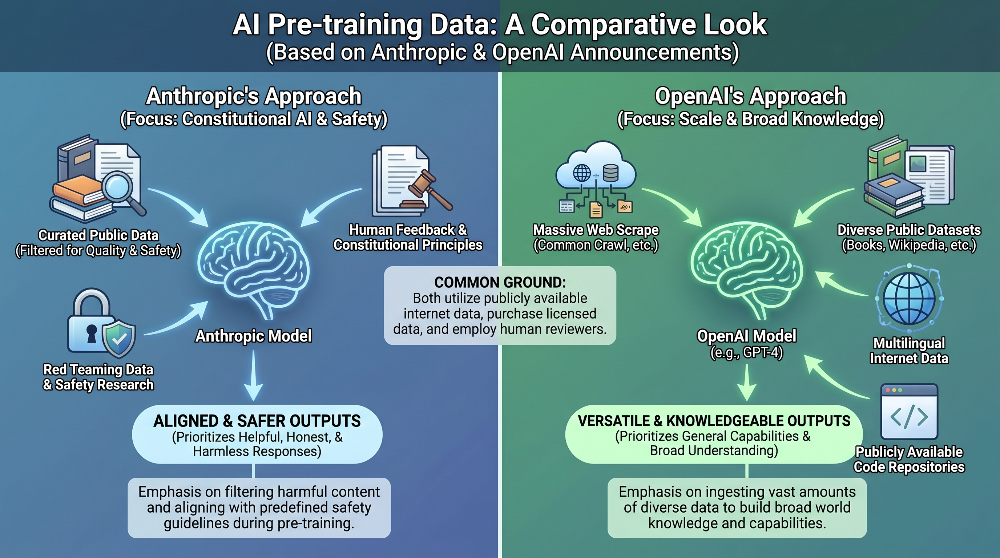
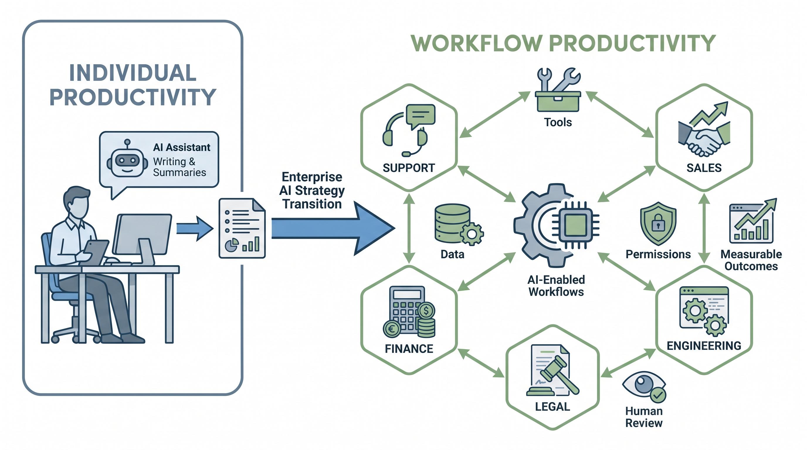
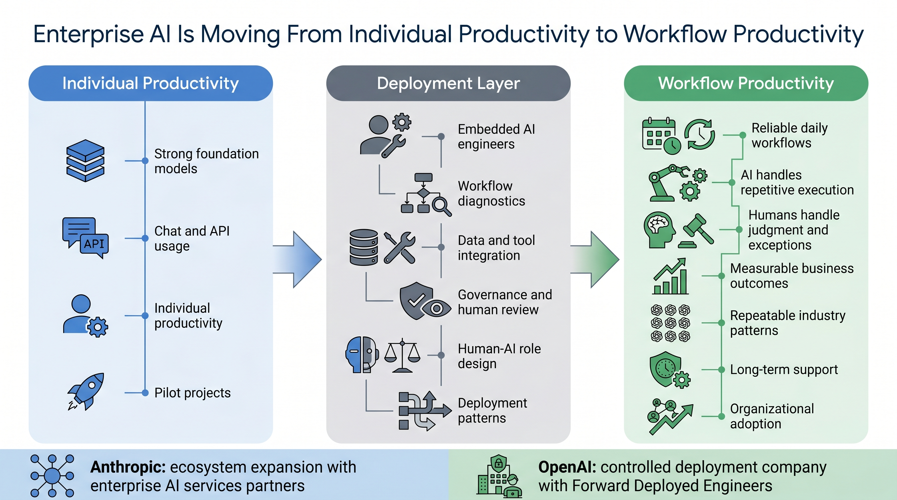

# OpenAI and Anthropic Are Moving Enterprise AI From Models to Deployment

On May 4, Anthropic announced a new enterprise AI services company with Blackstone, Hellman & Friedman, and Goldman Sachs. The goal is to bring Claude into the most important operations of mid-sized companies.

One week later, on May 11, OpenAI announced the OpenAI Deployment Company, or DeployCo. It also agreed to acquire Tomoro, bringing about 150 Forward Deployed Engineers and Deployment Specialists into the new company from day one.

These two announcements should be read together.

The signal is not that model companies are suddenly becoming consulting firms. The signal is that enterprise AI is moving from individual productivity to workflow productivity.

Most companies can already buy strong models. The harder problem is turning those models into reliable workflows connected to data, tools, permissions, human review, and measurable business outcomes. The goal is not to replace every human decision. It is to let AI take over repetitive, standardized, reviewable execution while humans keep judgment, exception handling, and accountability.

## The common bottleneck

Enterprise AI often gets stuck between impressive demos and durable deployment.

A chatbot can answer questions. A pilot can look useful. A team can show a quick prototype to leadership.

But real deployment is different.

Customer support requires ticket systems, customer history, knowledge bases, escalation rules, and human approval.

Sales requires CRM context, meeting notes, pricing rules, contract history, and next-step recommendations.

Engineering requires code repositories, issue trackers, tests, deployment workflows, and review gates.

The model is only one part of the system.

The real bottleneck is workflow integration.

## From individual productivity to workflow productivity

Most enterprise AI use today is still individual productivity.

An employee uses AI to draft an email, summarize a meeting, rewrite a document, write code, or search for information. That is useful, but the workflow itself often remains unchanged.

Workflow productivity is different.

In customer support, AI does not just draft a reply. It reads the ticket, classifies the issue, checks the knowledge base, proposes a resolution, decides whether escalation is needed, and hands the result to a human for approval.

In sales, AI does not just polish a follow-up email. It summarizes the meeting, extracts customer concerns, updates CRM notes, recommends next steps, and reminds the owner.

In finance or legal, AI does not just explain a clause. It performs first-pass checks, flags exceptions, and routes the uncertain cases to people.

That is the deployment layer both Anthropic and OpenAI are now moving toward.

## How Anthropic and OpenAI differ

Anthropic's move looks like ecosystem expansion. It is creating a new services company with major financial and operating partners to help bring Claude into enterprise operations. The logic is that demand for Claude exceeds what any single delivery model can handle.

OpenAI's move looks more vertically controlled. DeployCo is majority-owned and controlled by OpenAI. With Tomoro, it starts with an embedded deployment team focused on identifying high-value workflows, building production systems, and connecting OpenAI models to customer data, tools, controls, and business processes.

The approaches differ, but the strategic target is the same.

Both companies want to own the layer where AI capability becomes operational change.

## What this means for teams

The useful lesson is simple: do not start with "Which model should we buy?"

Start with "Which workflow is most worth redesigning?"

Good early workflows are frequent, repetitive, measurable, and reviewable. Examples include customer support triage, sales follow-up, contract review, meeting summaries, operations reporting, code debugging, and knowledge search.

Then ask:

- What input does the workflow need?
- Which tools and data sources must be connected?
- What should AI draft or decide?
- Where must humans review?
- Which metric proves the workflow improved?

That is how AI moves from a clever answer to a repeatable system.

## My take

Enterprise AI competition is moving down from the model layer into the deployment layer, and from individual productivity into workflow productivity.

Anthropic is expanding Claude's enterprise services ecosystem. OpenAI is building a controlled deployment company around Forward Deployed Engineers. Different paths, same destination.

The companies that win enterprise AI will not only have strong models. They will own the playbook for turning models into daily operational workflows.

That lesson also applies to individual work.

Do not just collect AI tools. Pick one repeated workflow, define the inputs and outputs, let AI handle the repetitive execution, keep human review where judgment matters, and measure whether it saves time or improves quality.

AI adoption becomes real when it becomes a workflow.
