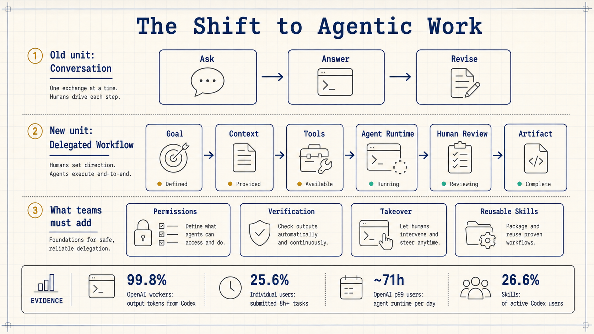
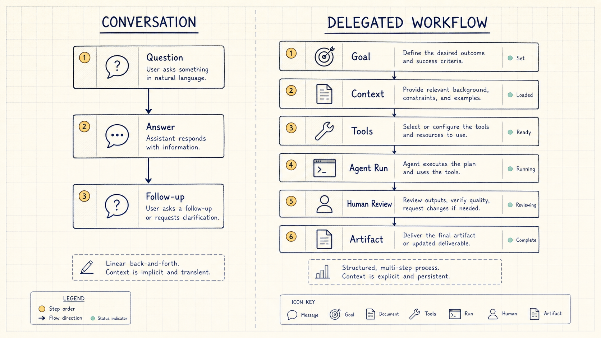
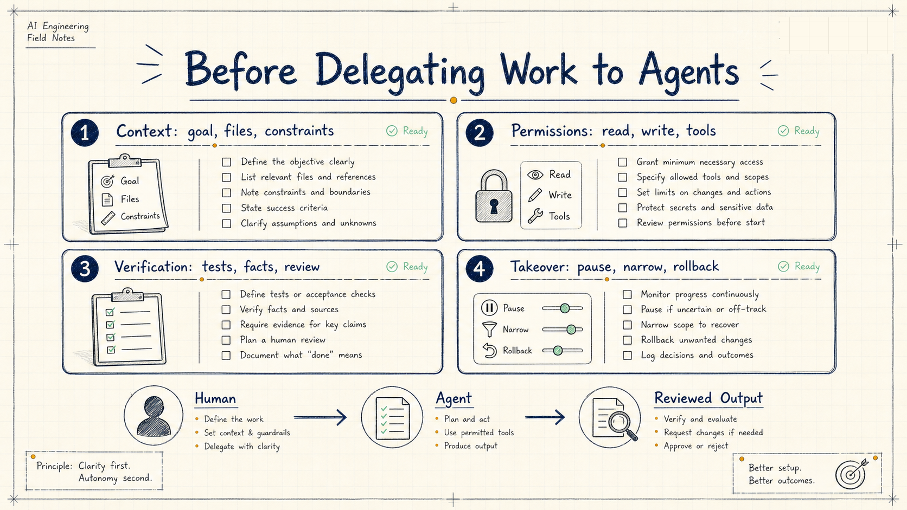

# The Next Step for AI Tools Is Delegated Work

OpenAI's new Codex usage study points to a simple but important shift: the basic unit of AI-assisted work is moving from a conversation to a delegated task.

That matters for anyone using AI at work. In the first wave, the useful skill was asking a good question and getting a good answer. In the next wave, the useful skill is describing a goal, giving the right context, defining tool permissions, and reviewing the resulting artifact after an agent runs part of the workflow.

OpenAI's public article gives the headline data. By May 2026, 80.6% of sampled individual Codex users had made at least one request estimated to exceed 30 minutes of human work. 70.2% had made one estimated to exceed one hour. 25.6% had made one estimated to exceed eight hours. Inside OpenAI, Codex accounted for 99.8% of output tokens generated across Codex and ChatGPT as of June 11, 2026.

The larger story is not just usage growth. It is a change in how work is packaged, assigned, supervised, and reused.

## From Conversation to Delegation

A ChatGPT-style workflow is usually a conversation. You ask, the model answers, you clarify, and the model revises.

An agentic workflow is closer to delegation. You provide a goal, and the system can inspect files, call tools, run commands, modify artifacts, and wait for human review.

OpenAI's research paper, "The Shift to Agentic AI: Evidence from Codex," makes this distinction explicit. Conversational AI is measured poorly by agentic AI metrics. For agents, active users, message counts, and chat volume do not tell the full story. Better measures include task complexity, runtime, concurrency, reusable workflow use, and production output.

That is why Codex should not be read only as a stronger coding assistant. It is evidence for a different work pattern: humans set goals, provide context, and review results; agents execute pieces of work that can be checked.

## OpenAI Is a Low-Friction Preview

The internal OpenAI numbers are striking, but they need context.

The paper is careful about this. OpenAI is not a typical organization. Its employees are familiar with frontier models. Marginal AI usage cost is low. Organizational buy-in is high. Training and informal knowledge sharing are common. Many workflows are close to the systems being built.

So OpenAI's internal usage is best understood as a low-friction preview, not a current enterprise average.

External organizational data looks more like today's market. Fewer than 1% of active individual users used Codex in the previous 28 days. Among organizational users, the share was 17.3%. But among output tokens generated by organizational users across ChatGPT and Codex, Codex already accounted for 63.3%.

Adoption is not yet broad, but adopters use it deeply.

## Non-Developer Growth Means Task Boundaries Are Softening

Codex started as a coding tool, so developers were the first natural users. But OpenAI reports that non-developer use is growing especially quickly. Since August 2025, non-developer individual users rose 137x, non-developer organizational users rose 189x, and non-developer OpenAI users rose 12x.

This does not mean every non-developer becomes an engineer. It means technical execution becomes cheaper to attempt.

An operations person can ask an agent to turn messy feedback into a structured table. A recruiting team can ask an agent to extract candidate signals and prepare interview material. A legal or finance team can ask an agent to transform files, compare clauses, mark anomalies, and prepare review material.

OpenAI's article says that more than one fourth of Codex work by business-function workers was engineering or coding. The practical meaning is that small automation, data transformation, tool glue, debugging, and structured analysis can begin inside the original business function instead of waiting for a separate technical queue.

## Intensive Users Manage Portfolios of Agents

The most important workflow signal in the paper is concurrency.

Codex uses threads. A user can start one agent in one workspace, then start another in a separate workspace. Long-running tasks no longer force the user to wait for a single answer before assigning the next task.

In the week ending June 11, 2026, 28.6% of OpenAI users managed five or more concurrent agents at some point. At the 99th percentile, OpenAI users ran about 71 hours of cumulative Codex agent turns per day. The number can exceed 24 hours because multiple agents run in parallel.

This is a different kind of work. The human role becomes closer to coordination:

- Break a large goal into independent tasks.
- Give each agent different context and completion criteria.
- Respond when an agent needs clarification.
- Review, merge, and reject outputs.
- Turn repeatable workflows into reusable skills.

This skill is not just prompt writing. It is task design, context design, review design, and quality control.

## Skills Are Early Workflow Infrastructure

The paper also studies skills and plugins.

In the seven-day window ending June 11, 2026, 26.6% of active Codex users invoked at least one skill. Inside OpenAI, the share was 96.2%. Among organizational users, it was 30.4%. Among individual users, it was 25.7%. Skill usage rose from 5.4% on March 1, 2026 to 26.6% on June 11, 2026.

Skills matter because they move repeated work from "explain it again" to "reuse the procedure."

A weekly report format, code review routine, document style guide, data analysis definition, or release checklist can become persistent context that an agent reads before doing the task.

For individuals, temporary prompts may be enough. For teams, repeatable AI work requires written procedures, stable standards, tool paths, and review rules.

## Where to Start

Developers can begin with low-risk but time-consuming tasks: understanding legacy modules, writing tests, running validation, preparing change notes, diagnosing build failures, and migrating configuration. Each task should include inputs, allowed file scope, and verification commands. The final human review should inspect diffs, test output, and critical paths.

Product, operations, and marketing teams can start with structured analysis: clustering user feedback, turning competitor updates into tables, converting campaign retrospectives into issue lists, and extracting demand signals from interviews. The agent handles reading, extraction, and draft structure. The human decides which conclusions are decision-grade.

Managers can start with cross-document synthesis: turning meeting notes, project plans, risk lists, and historical emails into a decision memo; combining multiple team updates into an exception list; or converting a goal into a trackable task tree.

Knowledge workers can apply the same pattern to writing and learning. Instead of asking AI to polish a report, ask it to read source material, identify gaps, reorganize by a template, and produce a checklist.

The common condition is simple: the result can be checked, the process can be split, and the inputs contain enough context.

## Four Things Teams Need Before Delegating More Work

First, context. The agent needs the goal, source material, constraints, forbidden actions, and output format. When context is missing, it fills gaps in plausible ways.

Second, permissions. Teams need to define what the agent can read, what it can modify, what tools it can call, and which actions require human confirmation.

Third, verification. Code tasks need tests, lint, builds, or review. Document tasks need source checks and version history. Data tasks need metric definitions, sample checks, and anomaly handling.

Fourth, takeover. When an agent gets stuck, misunderstands the goal, or produces unstable output, the human should be able to pause it, narrow the task, roll back changes, or finish manually.

These four pieces decide whether agents can enter real work.

## The Takeaway

Codex usage data suggests that AI adoption is moving from personal technique into organizational workflow design.

The first stage was asking. The second stage is delegation. The third stage is reuse.

The gap between OpenAI's internal usage and normal organizational usage is not only about model capability. It is also about whether the organization has reshaped work into something agents can accept, run, and return for review.

The practical skill to build now is concrete: split ambiguous goals into executable tasks, provide sufficient context, define verification, add human checkpoints, and turn successful routines into reusable skills.

Using AI is no longer only about writing better prompts.

It is about designing work that can be delegated, checked, and reused.
