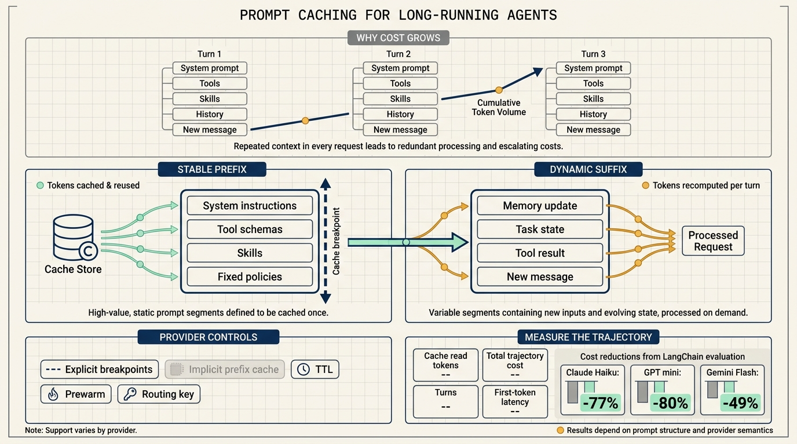
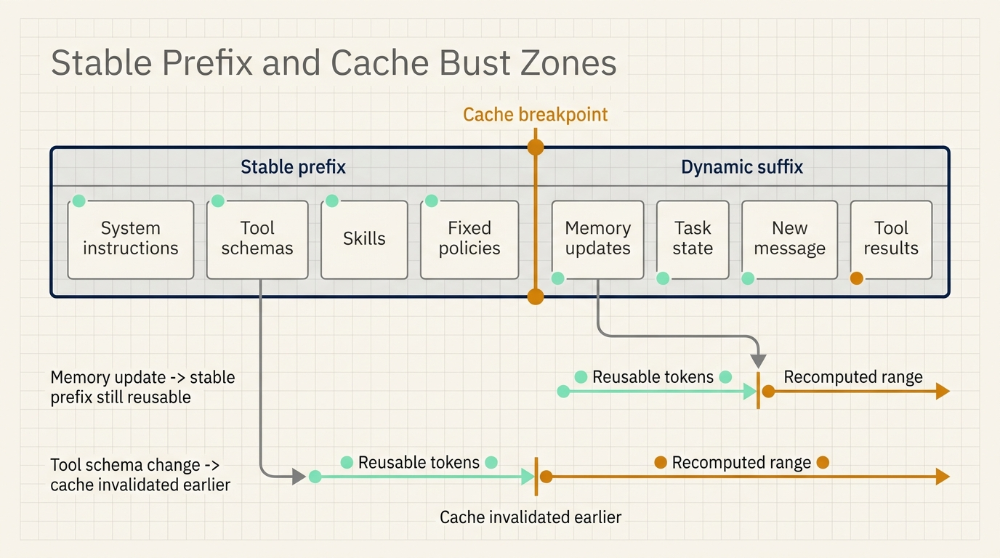
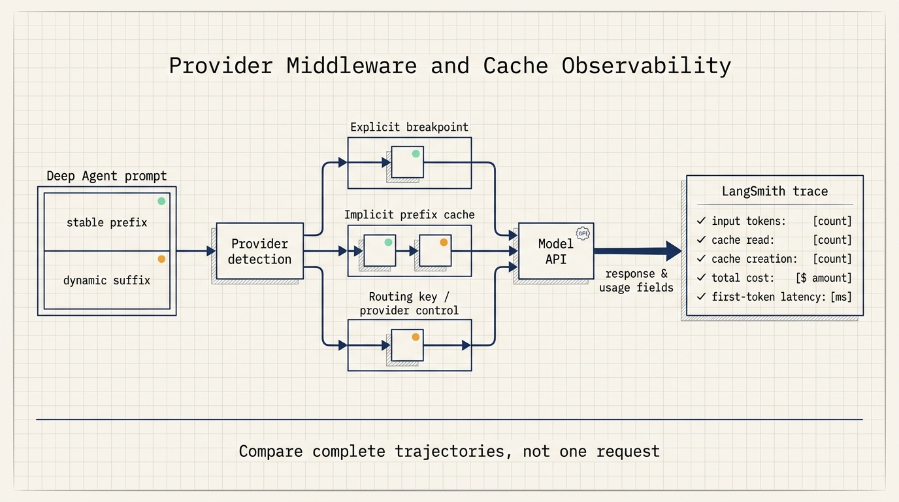

# Agent cost optimization starts with a stable prompt prefix

A long-running agent may add only a small amount of new information on each turn.

The model still receives much more than the latest message. System instructions, tool schemas, loaded skills, memory, and message history are often sent again. As the toolset and operating rules grow, repeated input becomes a larger part of the bill.

Prompt caching targets this repeated work. A model provider stores the state produced after processing a prompt prefix. When a later request starts with the same prefix, the provider can read that state and process only the new suffix.

LangChain reported a 49–80% reduction in token cost across three Deep Agents evaluation trajectories. The number is useful, but the mechanism matters more: savings depend on how much of the prefix stays stable and on the caching semantics of each model provider.

## Every turn repeats the same prefix

An agent model call has two broad regions.

The stable prefix contains system instructions, tool definitions, skills, fixed policies, and other content that changes infrequently. The dynamic suffix contains the latest message, tool results, task state, memory updates, and newly generated content.

Without caching, the model processes the full input on every turn. Consider a stable prefix of 20,000 tokens with 2,000 new tokens added per turn. A ten-turn task repeatedly processes a large amount of identical text. Tool-heavy agents make this effect more visible because tool schemas can occupy a substantial part of the context.

With prompt caching, a matching prefix can be read from the provider cache. The model then processes the content that follows the cached point. Long-horizon tasks benefit more because the same prefix is reused across more calls.

Short prompts and one-turn requests may see little benefit. Providers often apply minimum cacheable input thresholds, and a short request may not create enough reusable work to matter.

## Cache invalidation usually starts near the front

Prompt caches depend on prefix matching. A change near the beginning can invalidate content that follows, even when most of that later content is unchanged.

Common causes include:

- adding or removing tools;
- loading a skill into an early system-prompt section;
- replacing message history with a summary;
- updating injected memory;
- reordering middleware or rewriting the system message.

A practical prompt layout separates stable and dynamic content. Fixed instructions, stable tool schemas, and durable skills belong near the front. Memory updates, current task state, and new messages belong later. When the provider supports explicit breakpoints, the application can place a cache marker after the stable region.

This layout does not eliminate invalidation. It limits the affected range. A memory update can invalidate the suffix while leaving the earlier system rules and tool definitions reusable.

## Providers expose different cache controls

The LangChain blog compares several provider capabilities:

| Capability | Anthropic | OpenAI | Gemini | AWS Bedrock | Fireworks |
| --- | --- | --- | --- | --- | --- |
| Explicit breakpoints | Yes | No | Yes | Provider-dependent | No |
| Configurable TTL | Yes | Model-dependent | Yes | Provider-dependent | No |
| Cache prewarm | Yes | No | No | Anthropic models | No |
| Routing key | No | Yes | No | OpenAI models | Yes |

These controls operate at different layers. An explicit breakpoint tells a provider where a reusable section ends. Implicit caching detects repeated prefixes automatically. A routing key improves the chance that related requests reach a cache-compatible path. TTL controls how long a cached state remains available.

The current Deep Agents documentation adds an important qualification. It explicitly states that prompt caching is applied automatically for Anthropic and Amazon Bedrock models. Other providers require engineers to check the available middleware integrations and model-specific behavior.

The blog describes the harness's cross-provider goal. The documentation defines the current automatic behavior. Production teams should verify the exact model, SDK version, minimum token threshold, pricing, and cache fields before treating a common agent API as a common caching contract.

## Middleware order protects the reusable region

Deep Agents uses provider-aware middleware to handle caching. The broad strategy is:

1. apply explicit cache points when the provider supports them;
2. preserve the longest stable prefix for providers with implicit caching;
3. delegate provider-specific parameters to the relevant integration.

The documented middleware order shows why placement matters. Prompt-caching middleware runs after user middleware, so it sees the prompt that will actually be sent to the model. Memory middleware is placed later, reducing the chance that a memory update invalidates the earlier prefix.

This is a structural optimization. If custom middleware rewrites the system prompt on every turn, a caching layer cannot reconstruct a stable prefix. Tool descriptions that contain timestamps, random identifiers, or unstable ordering create the same problem.

Three checks catch many avoidable cache misses:

- remove per-turn data from the stable system section;
- preserve deterministic ordering for tools and skills;
- place memory, summaries, and task state after the stable prefix.

## The 49–80% result came from three agent trajectories

LangChain tested three mid-tier models with its Deep Agents evaluation suite:

- `claude-haiku-4-5`: 77% lower token cost;
- `gpt-5.4-mini`: 80% lower token cost;
- `gemini-3.5-flash`: 49% lower token cost.

Anthropic used explicit cache breakpoints to preserve a large prompt section. OpenAI used automatic longest-prefix caching. Gemini's implicit caching does not provide a fixed savings guarantee, but the evaluation still measured a 49% reduction.

These results show that prompt caching can materially change agent economics. They are not a universal discount. Actual savings depend on prompt length, number of turns, tool churn, model pricing, cache read and write prices, and provider thresholds.

A budget model should start with representative internal trajectories. Keep the model, task, toolset, and input constant. Compare total input tokens, cache-read tokens, output tokens, total cost, and time to first token with the relevant caching configuration.

The test set should include a short task, a long task, and a task that updates memory or compacts history. Those cases expose very different cache behavior.

## Measure complete trajectories

A high cache-read ratio on one request does not guarantee a cheaper task.

An agent may hit a large cache and still require more turns. Another agent may have a lower cache ratio but finish with fewer calls. Cost should be aggregated at the trajectory level, then investigated call by call.

LangSmith usage metadata can record input tokens, output tokens, total tokens, cache reads, cache creation, and cost. Traces can also expose latency and time to first token.

Four measurements are useful:

- cache-read tokens show whether the stable prefix is being reused;
- uncached input per turn reveals churn caused by tools, memory, or summaries;
- total trajectory cost connects caching to the actual budget;
- first-token latency shows whether cache reads also improve responsiveness.

Provider fields and billing rules differ. Trace data should retain the model name, provider, SDK version, and cache configuration so teams do not aggregate metrics with incompatible meanings.

## Where prompt caching pays first

Long-running research, coding, and analysis tasks reuse a stable prefix across many turns. Tool-heavy agents carry large schemas that usually change less often than user messages. Workflows with fixed skills and operating policies have another natural stable region. At scale, even modest savings per trajectory accumulate.

One-shot requests and very short prompts can begin with measurement. If cache reads stay close to zero, restructure the prompt before adding more provider-specific configuration.

## A four-step rollout

First, establish a baseline with repeatable production-like tasks. Record turn count, input and output tokens, cost, and latency for each trajectory.

Second, stabilize the prefix. Remove timestamps, random values, and dynamic ordering from fixed instructions. Keep tools, skills, and durable policies in deterministic positions.

Third, test each model separately. Confirm automatic caching, explicit breakpoint support, minimum token thresholds, TTL behavior, routing options, and pricing. Repeat the test whenever the model or SDK changes.

Fourth, force invalidation cases. Add a tool, load a skill, update memory, and compact a conversation. When cache reads fall, compare traces to identify the earliest changed prefix segment.

Prompt caching reduces the compute paid for repeated content while preserving a dynamic agent suffix. Deep Agents provides a shared integration layer, but each provider's cache contract and each application's trajectory structure still determine the result.

## Sources

- LangChain Blog, "Prompt Caching with Deep Agents," June 26, 2026: https://www.langchain.com/blog/deep-agents-prompt-caching
- LangChain Docs, "Prompt caching": https://docs.langchain.com/oss/javascript/deepagents/overview#prompt-caching
- LangChain Docs, "Default stack": https://docs.langchain.com/oss/javascript/deepagents/customization#default-stack-main-agent
- LangSmith Docs, "Cost tracking": https://docs.langchain.com/langsmith/cost-tracking
