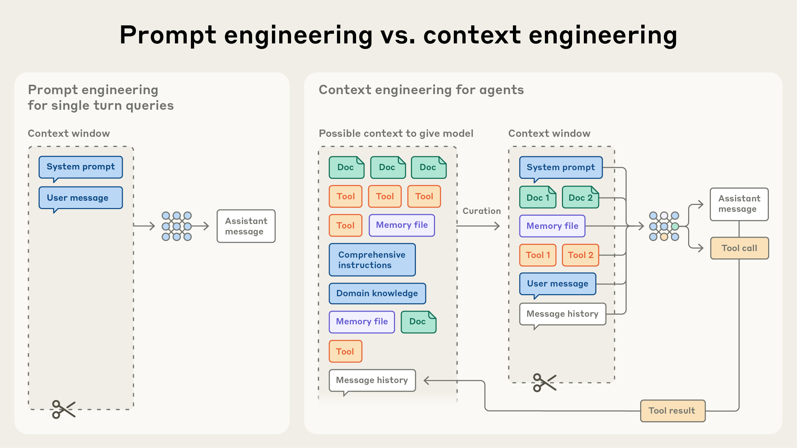
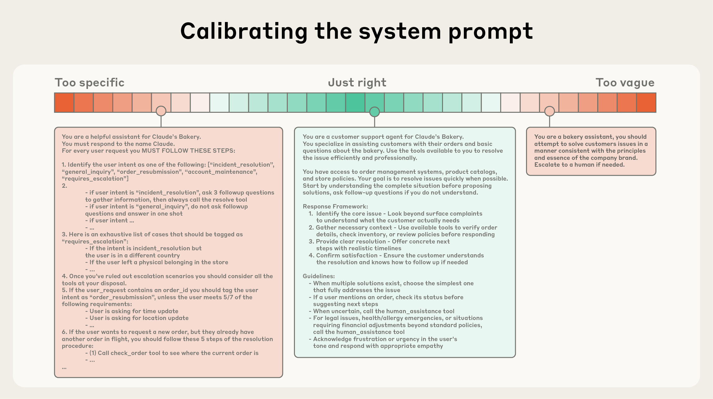

# AI Agent Engineering Series 01: Context Engineering

Source: Anthropic Engineering  
Original: Effective context engineering for AI agents  
URL: https://www.anthropic.com/engineering/effective-context-engineering-for-ai-agents  
Published: September 29, 2025  
Topic: Context engineering for AI agents

## What This Series Will Cover

This series follows five Anthropic Engineering articles and studies several core topics in AI agent engineering, one article at a time:

1. Effective context engineering for AI agents
2. Writing effective tools for agents
3. Equipping agents for the real world with Agent Skills
4. Code execution with MCP
5. Harness design for long-running application development

This post only covers the first article: Context Engineering. The other four topics are listed here only as the series roadmap and are not expanded in this article.

Now we begin with the first topic: Context Engineering.

## What This Article Is About

This article explains a shift in agent engineering: when an AI agent is no longer just answering one question, but instead keeps using tools, reading information, and working across multiple steps, the main engineering task changes from “writing a good prompt” to “managing what the model sees at each step.”

Anthropic’s core principle is direct:

Find the smallest set of high-signal tokens that makes the model most likely to produce the desired behavior.

## Context Engineering vs. Prompt Engineering

After prompt engineering, context engineering is becoming a new focus for using language models.

In early LLM use cases, many tasks were completed in one turn, such as classification, summarization, or generating a piece of text. In that setting, the main engineering work was writing a good prompt, especially the system prompt: defining the model’s role, goal, output format, and constraints.

Agents are different. An agent runs in a loop: it reads information, calls tools, observes the result, and makes the next decision. Its behavior is not determined only by a single prompt. It is shaped by the whole context state.

Here, context means all the tokens the model can see when it samples the next output. That includes:

- system instructions
- tool definitions
- external capabilities connected through MCP
- external data
- message history
- tool outputs
- examples
- intermediate state accumulated during the task

Prompt engineering focuses on “how to write the instruction.” Context engineering focuses on “what information should enter the model’s limited context window at this moment.”

Anthropic treats context engineering as the natural evolution of prompt engineering. As agent tasks run longer, the system keeps producing new data: tool results, error messages, file contents, search results, conversation history, and plan changes. Any of this information may help the next step. Any of it may also become noise.

So context engineering is not about writing one perfect prompt once. It is about repeatedly deciding what should enter a limited context window as the information set keeps changing.

## Why Context Engineering Matters for Agents

LLMs, like humans, can lose focus when there is too much information.

Anthropic cites a phenomenon from needle-in-a-haystack benchmarks: as the context window grows, the model’s ability to accurately recall information from that context declines. This is called context rot. Different models degrade in different ways, but all models are affected.

This means context is not simply “the more, the better.” Context is a finite resource, and it has diminishing returns.

A useful analogy is human working memory. A person can read a lot of material, but when too much is in front of them at once, attention gets diluted. LLMs have a similar attention budget. Every added token consumes part of that budget.

The issue comes from the transformer architecture itself. In theory, each token can attend to every other token. With n tokens, the model has n² pairwise relationships to consider. The longer the context, the harder it is to reliably capture those relationships. There is a natural tension between context size and attention focus.

There is also the training data distribution problem. Models see more short sequences during training, so they have less experience and fewer specialized parameters for long-distance dependencies. Position encoding interpolation can help models handle longer sequences, but token position understanding can still degrade.

This is not a hard cliff. It is a performance gradient. Long-context models can still work, but retrieval precision and long-range reasoning are usually weaker than in shorter contexts.

That is why placing relevant, clear, high-signal information into context directly affects whether an agent can work reliably.

## The Anatomy of Effective Context

Anthropic’s overall guideline is:

Find the smallest possible set of high-signal tokens that maximizes the probability of the desired outcome.

This principle applies to system prompts, tools, examples, message history, and everything else in the context.

### 1. System Prompts: Specific, but Not Brittle

A system prompt should be extremely clear, written in simple direct language, and presented at the right altitude.

Altitude here means the level of abstraction in the guidance. Too low, and the prompt becomes a hard-coded program. Too high, and it becomes vague.

Anthropic describes two common failure modes for system prompts.

The first is hard-coding complex, brittle logic into the prompt in an attempt to precisely induce agent behavior. For example, the prompt may contain a pile of if-else-style rules that ask the model to mechanically match every situation. This increases fragility and maintenance cost, and it tends to fail at the edges.

The second is guidance that is too high-level or vague, lacks concrete signals, or wrongly assumes that the model already shares the same background context as the human. For example, “be professional” or “keep quality high” is not enough if the prompt never explains what “professional” or “high quality” means in this task.

The better position is the Goldilocks zone: specific enough to guide behavior, flexible enough for the model to handle similar cases on its own.

Structurally, prompts can be organized with clear sections, such as:

- `<background_information>`
- `<instructions>`
- `## Tool guidance`
- `## Output description`

XML tags and Markdown headers are both fine. As models become stronger, the exact format may matter less, but clear structure still helps the model understand the role of each part of the information.

Minimal does not mean short. The goal is not to write the shortest possible prompt. The goal is to include only the information needed to fully describe the expected behavior.

In practice, Anthropic recommends starting with a minimal prompt and the best available model, then adding explicit instructions and examples based on observed failure modes.

### 2. Tools: Tool Definitions Are the Contract Between the Agent and the World

Tools let an agent interact with its environment, and they also bring new context back into the model.

A tool definition is effectively a contract between the agent and the information or action space. It tells the model what the tool does, what its inputs are, what its outputs are, and when it should be used.

Good tools should promote efficiency in two ways.

First, tool results should be token-efficient. A tool should not dump a large amount of irrelevant content back into context.

Second, the tool design itself should encourage efficient agent behavior. The model should be able to judge whether to use the tool, how to pass parameters, and how to interpret the result.

Anthropic compares good tools to good library functions: self-contained, robust to errors, clear in purpose, and well scoped.

Input parameters should be clear and unambiguous. Parameter design should play to the model’s strengths rather than forcing it to guess between vague options.

A common failure mode is bloated tool sets: too many tools, too much overlapping functionality, and unclear decision points. If a human engineer cannot clearly explain when to use each tool, an AI agent is unlikely to do better consistently.

Therefore, the tool set itself needs curation. Giving the agent the smallest usable tool set helps with context maintenance and pruning in long interactions.

### 3. Examples: A Few Good Examples Still Matter

Few-shot prompting is still useful.

But Anthropic does not recommend stuffing a prompt with many edge cases in an attempt to list every rule. That makes the context heavier and can make the model overfit to local rules during long tasks.

A better approach is to choose diverse, canonical examples: examples that cover different types of cases and clearly show the expected behavior.

For LLMs, examples are like “pictures worth a thousand words.” A good example can communicate a behavior pattern faster than a long abstract explanation.

## Context Retrieval and Agentic Search

In its earlier “Building effective AI agents” article, Anthropic distinguished workflows from agents. Here, the article uses a simpler definition: an agent is an LLM autonomously using tools in a loop.

As models become stronger, agents can be given more autonomy. They can handle more subtle problem spaces and recover from errors more independently.

Many AI-native applications have used embedding-based retrieval: before inference, they retrieve relevant content from an external knowledge base and place it into context.

The direction is now shifting from “prepare all relevant data upfront” toward just-in-time context.

The pattern is: the agent maintains lightweight references rather than putting full objects into context. These lightweight references can include:

- file paths
- stored queries
- web links
- database query entry points
- other clues that can be expanded on demand

At runtime, the agent uses tools to dynamically load the data it needs.

Claude Code uses a similar pattern. When doing complex data analysis on a large database, the model does not need the entire database in context. It can write targeted queries, save the results, and then use Bash commands such as `head` and `tail` to inspect the shape of the data.

This resembles how humans work. People do not memorize an entire corpus. They rely on file systems, inboxes, bookmarks, notes, and index systems to retrieve relevant information when needed.

Lightweight references also carry useful signals. Take two files with the same name, `test_utils.py`:

- If the file is under a `tests` folder, it is probably test helper code.
- If it is under `src/core_logic/`, it may serve a very different purpose.

Hierarchy, naming, and timestamps all give humans and agents behavioral signals about how and when information should be used.

This kind of autonomous navigation and retrieval supports progressive disclosure. An agent can discover relevant context gradually through exploration:

- File size can imply complexity.
- File names can imply purpose.
- Timestamps can serve as a relevance proxy.
- The agent can build understanding layer by layer.
- When needed, note-taking can persist additional state.

This way, the agent does not start by being flooded with information that may or may not be relevant. It keeps only the necessary working memory first, then expands as needed.

The tradeoff is speed. Runtime exploration is usually slower than upfront retrieval.

It also requires more opinionated engineering. The LLM needs the right tools and heuristics to navigate the information landscape. Otherwise, the agent may misuse tools, chase dead ends, miss important information, and waste context.

Anthropic therefore recommends a hybrid strategy. Some tasks benefit from partial upfront retrieval for speed, while leaving the rest to the agent’s own exploration.

Claude Code is a hybrid system. `CLAUDE.md` is placed into context upfront as project guidance, while primitives such as `glob` and `grep` are used at runtime to navigate files. This avoids problems caused by stale indexing and complex syntax trees.

Legal and financial domains, where content changes less frequently, may also be better suited to hybrid strategies.

The overall recommendation remains: do the simplest thing that works. As models get stronger, agentic design will tend to give intelligent models more autonomy and reduce human pre-curation. But not every task needs maximum autonomy from the start.

## Context Engineering for Long-Horizon Tasks

Long tasks are harder.

If an agent needs to execute an action sequence longer than the context window, it must maintain coherence, context, and goal-directed behavior over a long period of time.

Large code migrations and comprehensive research tasks may run for tens of minutes or hours. They require special techniques to work around context window limits.

Waiting for larger context windows looks like a direct solution, but Anthropic notes that context pollution and relevance problems will still exist regardless of future window sizes, especially when the strongest agent performance is required.

The article introduces three techniques:

- compaction
- structured note-taking
- multi-agent architectures

### 1. Compaction: Compress History Into a New Context

Compaction means that when a conversation approaches the context limit, the system summarizes it and reinitializes a new context window with that summary.

It is the first lever for improving long-term coherence.

The core idea is high-fidelity compression of the context window, so the agent can continue with minimal performance loss.

In Claude Code, the message history is summarized by a model. The summary keeps architectural decisions, unresolved bugs, and implementation details, while dropping repetitive tool outputs and messages. The agent then continues with the compressed context plus the five most recently accessed files.

The art of compaction is deciding what to keep and what to drop. If compaction is too aggressive, it can remove subtle context that looks unimportant now but becomes important later.

Engineering-wise, Anthropic recommends tuning the compaction prompt with complex agent traces. Start by maximizing recall so every relevant detail is captured, then iterate to improve precision and remove unnecessary content.

One low-hanging source of superfluous content is old tool calls and tool results. If a tool result is buried deep in the history, the agent usually no longer needs the raw output.

One safe and lightweight form of compaction is tool result clearing, which Anthropic recently introduced as a feature on the Claude Developer Platform.

### 2. Structured Note-Taking: Put Long-Term Memory Outside the Context Window

Structured note-taking, also called agentic memory, means that the agent periodically writes notes to persistent storage outside the context window, then pulls them back into context later when needed.

This provides persistent memory with relatively low overhead.

Claude Code, for example, creates a todo list. A custom agent might maintain a `NOTES.md` file. These notes help the agent track progress, key context, and dependencies in complex tasks, so it does not lose direction after dozens of tool calls.

Anthropic gives the example of Claude playing Pokémon. The agent kept precise counts across thousands of steps, such as training Pikachu for 1,234 steps. Without extra prompting, it developed maps, recorded achievements, maintained battle strategies, and remembered which attacks worked against which opponents.

After a context reset, the agent could read its own notes and continue hours of training and dungeon exploration.

With Sonnet 4.5, Anthropic introduced a public beta memory tool on the Claude Developer Platform. It stores and queries information outside the context window using a file-system-like approach. This allows agents to accumulate knowledge bases, maintain cross-session project state, and refer back to old work without putting everything into context.

### 3. Sub-Agent Architectures: Split Big Tasks Across Clean Context Windows

A sub-agent architecture is another way to work around context limitations.

Instead of one agent maintaining the entire project state, specialized sub-agents handle focused tasks with clean context windows.

The main agent owns the high-level plan. Sub-agents do deep technical work or use tools to find information.

Each sub-agent may spend tens of thousands of tokens exploring, but it returns only a condensed, distilled summary, often around 1,000 to 2,000 tokens.

The advantage is separation of concerns. Detailed search context stays inside the sub-agent, while the lead agent focuses on synthesizing results instead of carrying every search process in one context.

Anthropic’s article on multi-agent research systems reports that this pattern significantly improves performance on complex research tasks compared with a single agent.

The three techniques can be understood this way:

- Compaction works well for tasks that require a lot of back-and-forth and need to preserve conversational flow.
- Note-taking works well for iterative development with clear milestones.
- Multi-agent systems work well for complex research and analysis, especially when parallel exploration is valuable.

Even as models improve, long-interaction coherence will remain a core challenge in building effective agents.

## The Article’s Conclusion

Context engineering represents a shift in how systems are built with LLMs.

As models become stronger, the challenge is no longer only crafting the perfect prompt. It is thoughtfully curating the information that enters a limited attention budget at every step.

Whether the method is compaction, token-efficient tools, or just-in-time exploration, the same principle sits underneath:

Find the smallest set of high-signal tokens that makes the desired result most likely.

Techniques will keep evolving. Smarter models will need less prescriptive engineering and can take on more autonomous exploration. But context, as a precious and finite resource, will remain central to reliable and effective agents.

## Key Terms

- Context: the set of tokens the model can see during one inference, including instructions, tools, external data, message history, and intermediate results.
- Context engineering: the engineering practice of selecting, organizing, compressing, and maintaining context so the model can work reliably within a limited attention budget.
- Prompt engineering: engineering mainly around prompt and instruction design; it is one part of context engineering.
- Context rot: the decline in a model’s ability to accurately use information as context becomes longer.
- Attention budget: the model’s finite capacity for processing context.
- Just-in-time context: retrieving and expanding information only when needed, rather than loading all material upfront.
- Progressive disclosure: revealing information layer by layer, so the agent starts with necessary clues and digs deeper only when needed.
- Compaction: compressing near-limit context into a summary so the task can continue.
- Structured note-taking: writing long-term state to persistent notes outside the context window.
- Sub-agent architecture: using multiple specialized agents for subtasks, while the main agent receives condensed results.

## Use Cases and Practical Notes

This article is especially useful in three scenarios.

First, when building agent products or internal tools that need system prompts, tool sets, message history, and external data loading strategies.

Second, when using coding agents such as Claude Code or Codex and trying to understand why they read files, search, take notes, and compress history instead of loading an entire repository at once.

Third, when building long-task agents for research, code migration, data analysis, or operations automation, where the agent needs to stay oriented for tens of minutes or longer.

The practical caution is this: do not treat context engineering as “put more information into the prompt.” It is closer to information organization and filtering. What matters is high signal, low noise, retrievability, compressibility, and recoverability.

## Review Points

1. Prompt engineering is part of context engineering; in agent scenarios, the full context state matters more than a single prompt.
2. Context is a finite resource; long context brings attention dilution and context rot.
3. The principle of effective context is the smallest set of high-signal tokens.
4. Tool design directly affects context quality; bloated tool sets make agents more likely to misuse tools.
5. Long tasks need compaction, structured note-taking, and sub-agent architectures to maintain coherence.

## Original Authors

The article was written by Anthropic Applied AI team members Prithvi Rajasekaran, Ethan Dixon, Carly Ryan, and Jeremy Hadfield, with Rafi Ayub, Hannah Moran, Cal Rueb, and Connor Jennings. Thanks are given to Molly Vorwerck, Stuart Ritchie, and Maggie Vo.
