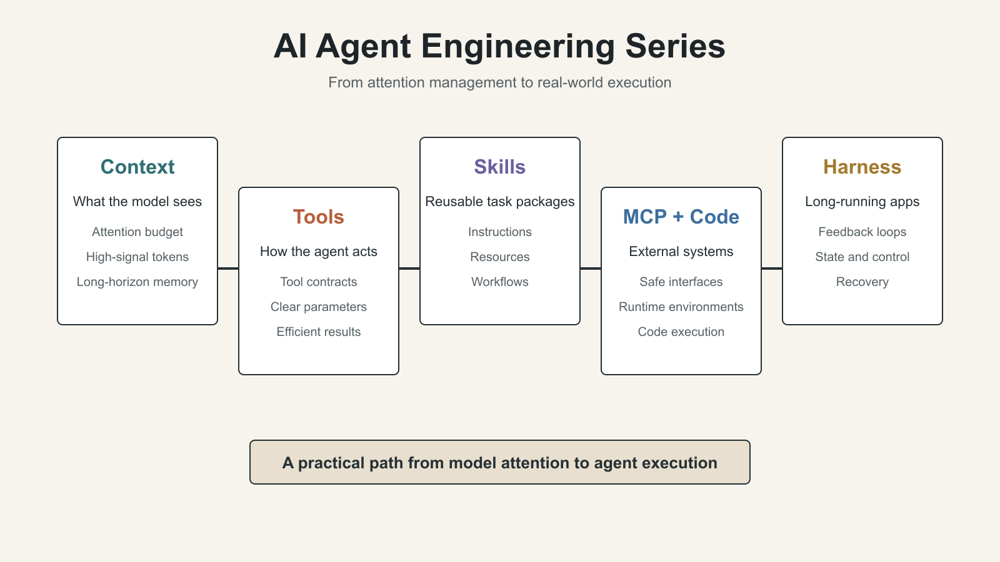
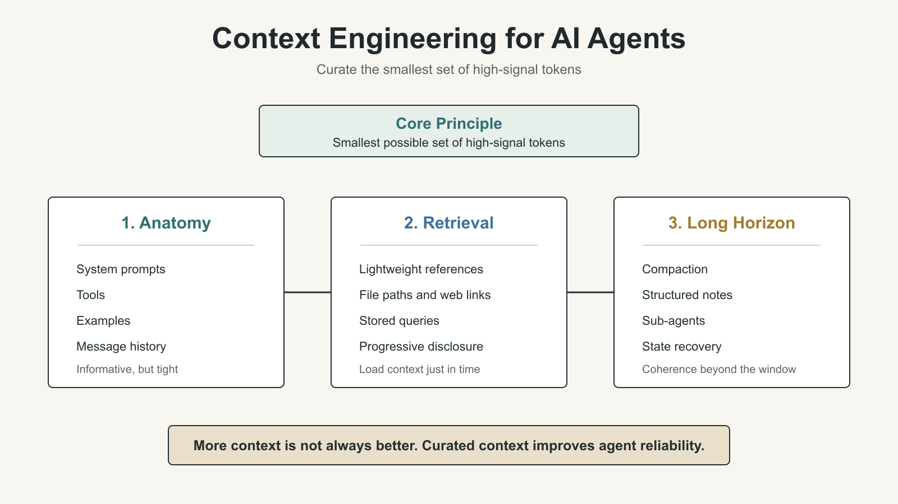

# AI Agent Engineering Series 01: Context Engineering

Source: Anthropic Engineering  
Original: Effective context engineering for AI agents  
URL: https://www.anthropic.com/engineering/effective-context-engineering-for-ai-agents  
Published: September 29, 2025

This is the first article in a five-part learning series on AI agent engineering. This post only covers the first source article: “Effective context engineering for AI agents.” The other four articles are listed as the series roadmap and will be handled separately.

The central idea of this article is simple: capable agents are not built only by writing better prompts. They are built by carefully managing what information the model sees at every step.

Anthropic defines context as the full set of tokens available to a language model when it samples the next output. In agent systems, that context includes system instructions, tool definitions, MCP-connected capabilities, external data, message history, tool outputs, examples, and intermediate state created during the task.

Prompt engineering focuses on writing and organizing instructions. Context engineering is broader: it curates and maintains the best set of information for the model at inference time.

The guiding principle is:

> Find the smallest possible set of high-signal tokens that maximizes the likelihood of the desired outcome.

Context is a finite resource. Long context windows do not remove this problem. As context grows, models can lose focus, retrieval accuracy can decline, and long-range reasoning becomes harder. This degradation is sometimes described as context rot.

Effective context has several parts:

- System prompts should be clear and concrete, but not brittle hard-coded programs.
- Tools should act like clean contracts between the agent and the external world.
- Tool outputs should be token-efficient.
- Examples should be diverse and canonical, not a pile of edge cases.
- Message history should remain informative but tight.

For retrieval, the article emphasizes just-in-time context. Instead of loading all possible data upfront, agents can maintain lightweight references such as file paths, stored queries, and web links, then use tools to expand only what they need. Claude Code uses this pattern when working across large codebases and datasets.

For long-horizon tasks, Anthropic highlights three techniques:

- Compaction: summarize and restart context when the window nears its limit.
- Structured note-taking: write persistent notes outside the context window.
- Sub-agent architectures: use focused agents with clean context windows and return condensed summaries to a lead agent.

The practical lesson is not “put more information into the prompt.” It is to curate information. Reliable agents need high-signal context, clear tools, recoverable memory, and ways to stay coherent beyond a single context window.

The full Chinese WeChat learning draft is maintained in `feature/article/wechat_article.md`.
