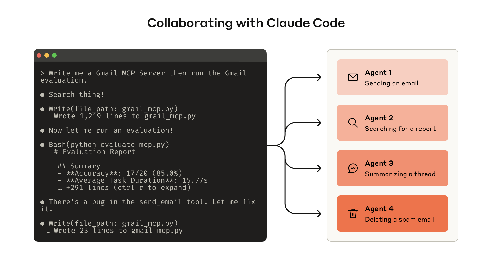
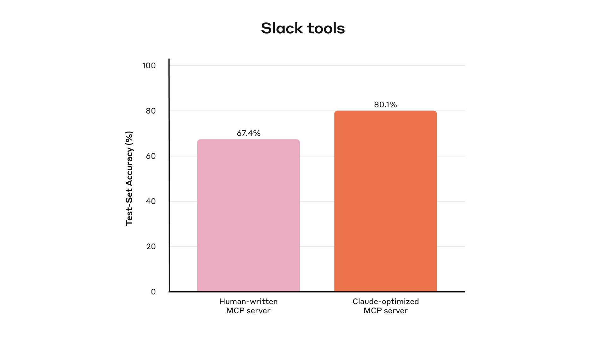
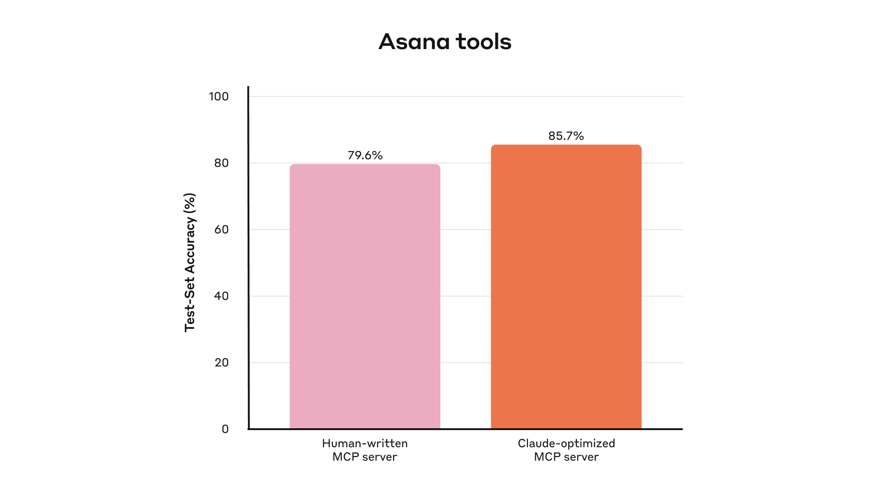
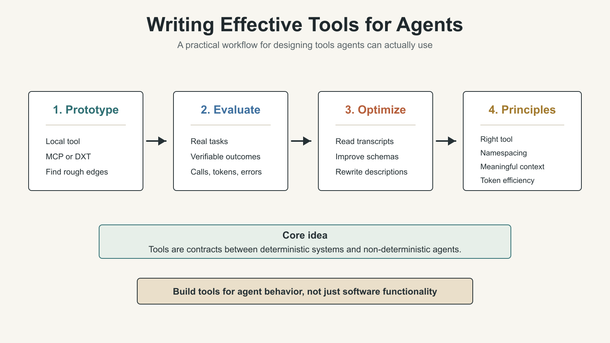
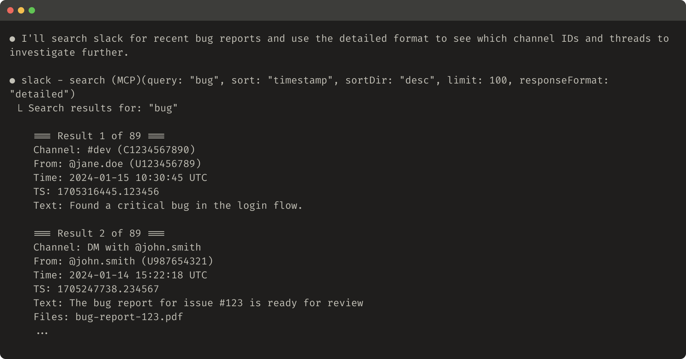
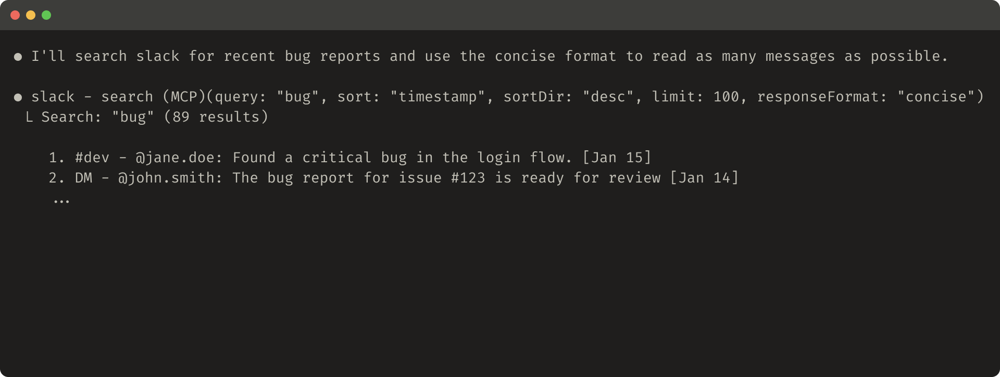
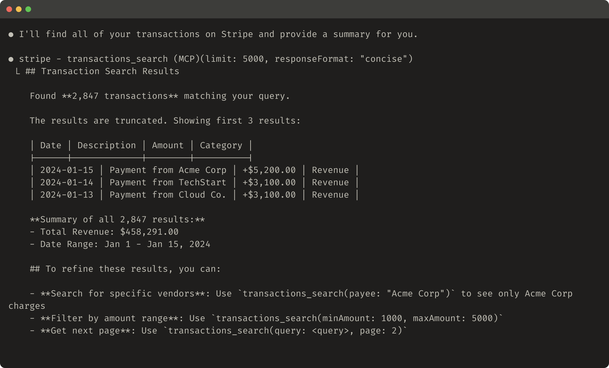
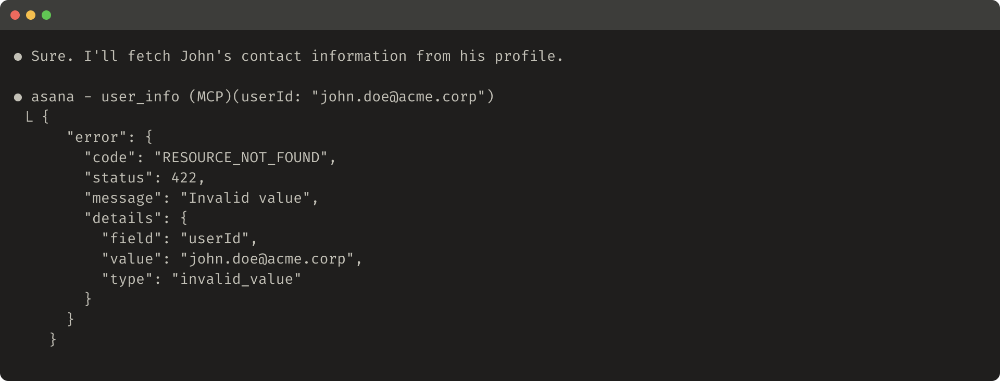
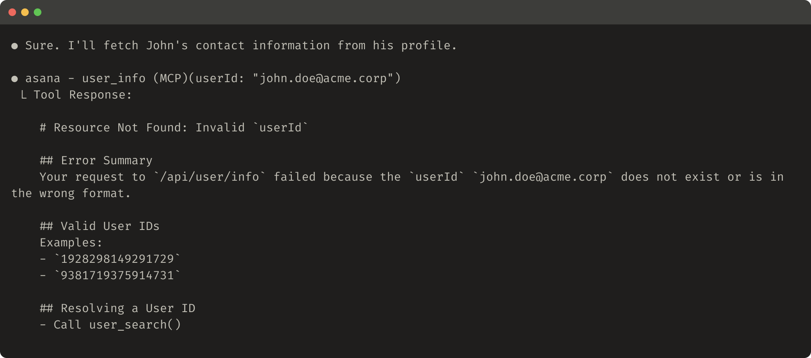

# AI Agent Engineering Series 02: How to Write Tools for Agents

This article studies Anthropic Engineering’s practical method for designing AI agent tools as contracts between deterministic systems and non-deterministic agents.

Source: Anthropic Engineering  
Original: Writing effective tools for agents — with agents  
URL: https://www.anthropic.com/engineering/writing-tools-for-agents  
Published: September 11, 2025  
Topic: How to design, evaluate, and optimize tools for AI agents

## Series Progress

This series follows five Anthropic Engineering articles and studies AI agent engineering one article at a time:

1. Effective context engineering for AI agents
2. Writing effective tools for agents
3. Equipping agents for the real world with Agent Skills
4. Code execution with MCP
5. Harness design for long-running application development

The first article covered context: what the model should see at each step. This second article moves to tools: how agents interact with the outside world, and why agent tools cannot simply copy traditional API design.

## What This Article Is About

The core point of this article is that an agent’s capability depends heavily on the tools we give it.

A tool is not just a normal function. It is not enough to wrap an existing API endpoint and call it done. A tool is the interface between deterministic software systems and a non-deterministic agent.

Anthropic first explains how to build, test, evaluate, and iterate on tools. Then it summarizes several tool design principles: choose the right tools, namespace tools clearly, return meaningful context, control token consumption, and prompt-engineer tool descriptions and schemas.

## What Is a Tool?

In traditional software, a deterministic system produces the same output for the same input. For example, `getWeather("NYC")` queries the weather for New York in a predictable way.

Agents are different. If a user asks, “Should I bring an umbrella today?”, the agent might call a weather tool, answer from general knowledge, ask for the user’s location, or misunderstand which tool to use. It may also hallucinate.

So tools are a new kind of software surface. They express a contract between deterministic systems and non-deterministic agents.

This means we should not design agent tools only as traditional functions, APIs, or MCP servers. The user of the tool is not another deterministic program, and not necessarily a human developer who already understands the interface. The user is an agent that can reason, misunderstand, explore, and take inefficient paths.

Anthropic’s goal is to expand the range of tasks agents can solve effectively. Tools should support multiple successful strategies for real tasks. One useful observation from the article is that tools that are ergonomic for agents are often more intuitive for humans too.

## How to Write Tools

Anthropic recommends an iterative process:

1. Build a quick prototype.
2. Test it locally and find rough edges.
3. Build evaluations to measure tool performance systematically.
4. Let the agent help analyze results and improve the tools.
5. Repeat evaluation and optimization until the agent performs reliably on real tasks.



### 1. Start With a Prototype

It is often hard to predict in advance which tools will be easy or hard for an agent to use. The fastest path is to build a quick prototype and test it directly.

If you use Claude Code to write tools, you can provide Claude with relevant software libraries, API documentation, SDK documentation, and MCP SDK documentation.

Anthropic notes that LLM-friendly documentation is often available through `llms.txt` on official documentation sites. Giving this documentation to the agent helps it understand how the dependencies really work.

To test tools in Claude Code or Claude Desktop, you can wrap them as a local MCP server or as a Desktop Extension, also called DXT.

Common connection paths include:

- connecting a local MCP server in Claude Code with `claude mcp add <name> <command> [args...]`
- connecting a local MCP server in Claude Desktop through `Settings > Developer`
- connecting a DXT in Claude Desktop through `Settings > Extensions`
- passing tools directly into Anthropic API calls for programmatic testing

During the prototype stage, test the tools yourself and identify rough edges. Also collect user feedback so you can build intuition about real use cases and real prompts.

### 2. Run Evaluations

The next step is to measure how well Claude uses the tools.

Evaluation tasks should come from real usage, not overly simple sandboxes. Anthropic recommends collaborating with agents to generate many evaluation tasks, then using agents again to analyze results and propose tool improvements.



### Generate Evaluation Tasks

Once you have an early prototype, Claude Code can quickly explore the tools and generate dozens of prompt-response pairs.

Prompts should come from real use cases and real data sources or services, such as internal knowledge bases and microservices. Anthropic advises against simple, superficial sandboxes because they cannot stress-test the tools with enough complexity.

Strong evaluation tasks may require multiple tool calls, sometimes dozens.

Examples of strong tasks:

- Schedule a meeting with Jane next week to discuss the latest Acme Corp project. Include notes from the previous project planning meeting and book a meeting room.
- Customer ID 9182 reports being charged three times for one purchase attempt. Find all relevant logs and determine whether any other customers were affected by the same issue.
- Sarah Chen just submitted a cancellation request. Prepare a retention offer. Determine why she is leaving, which offer would be most compelling, and what risk factors need attention before making the offer.

Examples of weak tasks:

- Schedule a meeting with jane@acme.corp next week.
- Search payment logs for `purchase_complete` and `customer_id=9182`.
- Find a cancellation request by customer ID 45892.

The difference is that strong tasks resemble real work. They require the agent to plan, combine tools, and manage context. Weak tasks are closer to direct calls into one endpoint.

Each evaluation prompt should have a verifiable response or result. A verifier can be simple, such as exact string comparison between ground truth and sampled response. It can also be more complex, such as asking Claude to judge whether the answer is correct.

But the verifier should not be too rigid. Correct answers may differ in formatting, punctuation, or reasonable wording. Those differences should not turn a correct answer into a failed result.

Each prompt-response pair can also specify expected tool calls to measure whether the agent understands each tool’s purpose. But different tasks may have multiple correct paths, so expected tool use should not overfit the agent to one strategy.

### Run the Evaluations

Anthropic recommends using direct LLM API calls to run evaluations programmatically.

Implementation can be a simple agentic loop: a `while` loop that alternates between LLM API calls and tool calls. Each evaluation task gets its own loop, and each evaluation agent receives the task prompt and the available tools.

In the evaluation agent’s system prompt, Anthropic suggests asking the agent to output not only structured response blocks for verification, but also reasoning and feedback blocks.

If the agent outputs reasoning and feedback before tool calls and response blocks, it may trigger chain-of-thought behavior and improve the effective intelligence of the LLM.

If you use Claude, you can also enable interleaved thinking to get similar benefits. This helps reveal why the agent did or did not call a tool, and it can expose concrete improvement points in tool descriptions and schemas.

Beyond top-level accuracy, you should collect other metrics:

- total runtime of individual tool calls
- total runtime of each task
- total number of tool calls
- total token consumption
- tool errors

Tracking tool calls reveals common workflows. It can also show where multiple tools should be merged.



### Analyze the Results

Agents can help find problems and provide feedback, including:

- tool descriptions that contradict each other
- inefficient tool implementations
- confusing tool schemas
- unclear parameter names
- returned results that do not support the next reasoning step

But Anthropic highlights an important warning: what the agent does not say is often more important than what it does say. LLMs do not always verbalize the real cause of their behavior.

So do not only read the feedback text. Watch where the agent gets stuck or confused. Read the reasoning and feedback. Inspect the raw transcripts, including tool calls and tool results.

If the chain of thought does not mention a problem, that does not mean the problem is absent. The evaluation agent may not know the correct answer or the best strategy. You need to learn to read between the lines.

Tool-call metrics also matter:

- Many repeated tool calls may mean pagination or token-limit parameters need redesign.
- Many invalid-parameter errors may mean the tool description is unclear or lacks better examples.

Anthropic gives the example of Claude’s web search tool. During launch, they noticed Claude unnecessarily appending `2025` to the `query` parameter, which biased search results and reduced performance. They improved the tool description to guide Claude back toward better behavior.

### 3. Collaborate With Agents to Optimize Tools

After evaluation, you can ask the agent to help analyze the results and improve the tools.

The method is simple: concatenate transcripts from evaluation agents and paste them into Claude Code. Claude is good at analyzing transcripts and can refactor many tools at once while keeping implementation and descriptions consistent.

Anthropic says most of the article’s recommendations came from repeatedly using Claude Code to optimize internal tool implementations.

Their evaluations were built on internal workspaces and preserved the complexity of real workflows, including real projects, documents, and messages.

They also used held-out test sets to avoid overfitting to the evaluation set used during optimization. Results showed that even “expert implementation” tools still had room for improvement. These expert tools included both tools written by researchers and tools generated by Claude itself.

## Principles for Writing Effective Tools

Below are the tool design principles Anthropic distilled from this process.



### 1. Choose the Right Tools for the Agent

More tools do not necessarily produce better results.

A common mistake is to wrap existing software features or API endpoints as tools without asking whether those tools fit agent use.

The reason is that agents and traditional software have different affordances. In this context, affordance means how an agent perceives possible actions and chooses among them.

An LLM agent has limited context. Computer memory is cheap and abundant.

Consider looking up a contact in an address book. Traditional software can store and process an entire contact list efficiently. But if an LLM agent calls a tool that returns every contact and then reads the whole list token by token, it is using limited context on mostly irrelevant information.

That is like trying to find one person in a phone book by reading from the first page onward. A better method is to jump to the relevant section, such as by alphabetic index.

Anthropic recommends starting with a small number of carefully designed tools, focused on high-impact workflows and matched to evaluation tasks, before expanding the tool set.

In the address-book example, these tools are more useful than `list_contacts`:

- `search_contacts`
- `message_contact`

Tools can also combine multiple discrete operations or API calls internally. For example, a tool can add relevant metadata to its result, or wrap a frequently chained multi-step task into one tool call.

Examples:

- Instead of `list_users`, `list_events`, and `create_event`, build `schedule_event`, which finds available times and schedules the meeting.
- Instead of `read_logs`, build `search_logs`, which returns relevant log lines and surrounding context.
- Instead of `get_customer_by_id`, `list_transactions`, and `list_notes`, build `get_customer_context`, which summarizes recent relevant customer information.

Each tool should have a clear, independent purpose. Tools should help the agent decompose and solve tasks like a human, while reducing intermediate context consumption.

Too many tools, or too many overlapping tools, can interfere with efficient strategy selection. Being deliberate about what to build and what not to build produces real gains.

### 2. Namespace Your Tools

AI agents may connect to dozens of MCP servers and gain access to hundreds of tools, including tools written by other developers.

When tool functionality overlaps or tool purpose is ambiguous, the agent may not know which one to use.

Namespacing, meaning grouping related tools under shared prefixes, helps the agent distinguish tool boundaries. MCP clients sometimes do this by default.

Examples:

- by service: `asana_search`, `jira_search`
- by resource: `asana_projects_search`, `asana_users_search`

This helps the agent choose the right tool at the right time.

Anthropic found that prefix-style and suffix-style naming can have non-trivial effects in tool-use evaluations. Different LLMs may behave differently, so the best naming scheme should be selected through your own evaluations.

Agent mistakes include:

- calling the wrong tool
- calling the right tool with the wrong parameters
- calling too few tools
- mishandling tool results

By implementing tools selectively and making tool names reflect natural task decomposition, you reduce both the number of tools in the agent’s context and the number of tool descriptions. You also move part of the agentic computation from the agent context into the tool call itself. This lowers the chance of agent error.

### 3. Return Meaningful Context

Tool implementations should return only high-signal information to the agent.

Tool results should prioritize contextual relevance over maximum flexibility. Low-level technical identifiers are often poor direct returns for an agent, such as:

- `uuid`
- `256px_image_url`
- `mime_type`

More useful information for the agent’s next action and response usually looks like:

- `name`
- `image_url`
- `file_type`

Agents tend to handle natural-language names, terms, and identifiers more successfully than opaque technical IDs.

Anthropic found that simply converting arbitrary alphanumeric UUIDs into more semantic and easier-to-understand language, or even into a 0-indexed ID scheme, significantly improved Claude’s precision in retrieval tasks and reduced hallucination.

In some scenarios, the agent needs both natural-language information and technical IDs because later tool calls may require those IDs. For example:

`search_user(name="jane")` -> `send_message(id=12345)`

In this case, expose a simple `response_format` enum parameter so the agent can choose whether the tool returns `concise` or `detailed` output.

You can also add more formats, similar to GraphQL, so the caller chooses which information it needs.

Example enum:

```ts
enum ResponseFormat {
  DETAILED = "detailed",
  CONCISE = "concise"
}
```

The original article gives two examples:

- detailed tool response: 206 tokens
- concise tool response: 72 tokens





In a Slack thread scenario, threads and replies are identified by a unique `thread_ts`. Fetching thread replies requires `thread_ts`; other IDs such as `channel_id` and `user_id` may also be needed for later tool calls.

A `detailed` response can include these IDs so the agent can keep calling tools that need them.

A `concise` response can include only the thread content and omit IDs. In this example, the concise version uses roughly one third of the tokens.

The structure of tool responses also affects evaluation performance. XML, JSON, and Markdown may perform differently. There is no universal best format. Because LLMs are trained through next-token prediction, they often handle formats common in training data more easily. The best response structure depends heavily on the task and the agent, so it should be chosen through evaluation.

### 4. Optimize Tool Responses for Token Efficiency

The quality of returned context matters. The quantity matters too.

For tool responses that can consume a lot of context, Anthropic recommends combining:

- pagination
- range selection
- filtering
- truncation

These parameters should also have reasonable defaults.

Claude Code limits tool responses to 25,000 tokens by default. Anthropic expects effective context lengths for agents to continue growing, but context-efficient tools will still be necessary.

If you truncate a response, give the agent useful instructions. You can directly encourage a more token-efficient strategy, such as making several small and precise searches in a knowledge retrieval task instead of one broad search.

If a tool call fails due to input validation, the error response can also be prompt-engineered. The error should explain the concrete, actionable correction instead of returning only an opaque error code or traceback.

The original article gives an example of a truncated response:



It also compares an unhelpful and helpful error response:





Truncation and error responses can guide the agent toward more token-efficient tool use, such as using filters or pagination, and can provide examples of correctly formatted tool input.

### 5. Prompt-Engineer Tool Descriptions

Finally, Anthropic argues that one of the most effective ways to improve tools is to prompt-engineer tool descriptions and specs.

These descriptions are loaded into the agent’s context, so they directly guide tool-calling behavior.

When writing a tool description, imagine that you are explaining the tool to a new teammate. Make implicit context explicit, including:

- special query formats
- definitions of domain terms
- relationships among underlying resources
- input and output constraints
- when the tool is appropriate and inappropriate

Avoid ambiguity. Clearly describe inputs and outputs, and enforce them with strict data models.

Parameter names matter. For example, `user_id` is better than `user` when the parameter expects an ID.

With evaluations in place, you can measure the effect of prompt engineering more confidently. Even small changes to tool descriptions can produce noticeable gains.

Anthropic notes that Claude Sonnet 3.5 achieved then state-of-the-art performance on SWE-bench Verified, and precise tool description optimization was one important factor. It reduced errors and improved task completion.

If you are building tools for Claude, you can reference Anthropic’s Developer Guide for tool definition best practices and learn how tools are dynamically loaded into Claude’s system prompt.

If you are writing MCP server tools, MCP tool annotations can express which tools require open-world access and which tools make destructive changes.

## Looking Ahead

Building effective tools for agents requires shifting software development practice from a traditional deterministic pattern to a pattern suited for non-deterministic systems.

Through the iterative, evaluation-driven process described in this article, Anthropic identifies several common properties of effective tools:

- tools are deliberately designed and clearly defined
- tools use agent context carefully
- tools compose into diverse workflows
- tools help agents solve real tasks intuitively

The concrete mechanisms by which agents interact with the world will continue to change, including MCP protocol updates and stronger underlying LLMs. But systematic, evaluation-driven improvement lets tools evolve with agent capabilities.

## Key Terms

- Tool: an interface an agent uses to call external systems, retrieve information, or execute actions.
- Deterministic system: a system that produces the same output for the same input.
- Non-deterministic agent: an agent that may produce different responses and action paths even under the same initial conditions.
- MCP server: a service that exposes tools and resources through the Model Context Protocol.
- DXT: Desktop Extension, a way to connect local capabilities to Claude Desktop.
- Evaluation: a method for systematically measuring tool performance with verifiable tasks.
- Held-out test set: a test set not used during optimization, only used for final validation, to avoid overfitting.
- Namespacing: grouping related tools with shared prefixes or structured names so the agent can identify boundaries.
- Response format: the format or detail level of a tool response, such as `concise` or `detailed`.
- Token efficiency: returning more useful information with fewer tokens.
- Tool annotations: MCP metadata that declares tool properties, permissions, and risks.

## When to Use These Ideas

This article is especially useful for three groups.

First, people building MCP servers, internal agent tools, or Claude Code plugins. It helps avoid mechanically wrapping API endpoints as tools.

Second, people evaluating agent products. The article emphasizes that tools should not be improved by intuition alone. They should be iterated with real tasks, real data, and held-out test sets.

Third, people building long-running agents. The more bloated a tool response is, the more likely the agent wastes context. The more ambiguous a tool boundary is, the more likely the agent takes the wrong path.

In practice, tool design is not about “more features.” For agents, tools should make correct actions easier and keep irrelevant context out of the model.

## Review Points

1. Agent tools are not traditional APIs. They are contracts between deterministic systems and non-deterministic agents.
2. Tool development should follow prototype, evaluation, analysis, and iteration. It should not rely only on intuition.
3. Strong evaluation tasks should resemble real work and usually require multi-step tool use.
4. More tools are not always better. Prioritize high-impact tools with clear boundaries.
5. Tool results should be high-signal, low-noise, and token efficient.
6. Tool descriptions and schemas also need prompt engineering.

## Original Author

The original article was written by Ken Aizawa, with contributions from members of Anthropic’s Research, MCP, Product Engineering, Marketing, Design, and Applied AI teams, including Barry Zhang, Zachary Witten, Daniel Jiang, Sami Al-Sheikh, Matt Bell, Maggie Vo, Theodora Chu, John Welsh, David Soria Parra, Adam Jones, Santiago Seira, Molly Vorwerck, Drew Roper, Christian Ryan, and Alexander Bricken.
