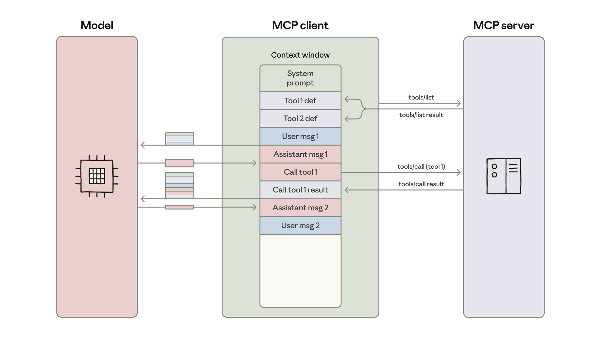
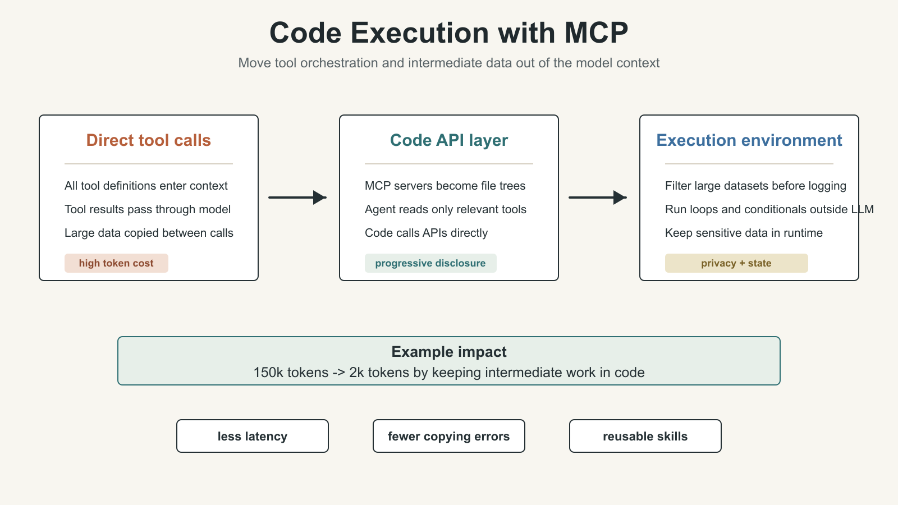

# AI Agent Engineering Series 03: Code Execution with MCP

This article studies how code execution can make MCP-based agents more efficient by keeping tool definitions and intermediate results out of model context.

Source: Anthropic Engineering  
Original: Code execution with MCP: Building more efficient agents  
URL: https://www.anthropic.com/engineering/code-execution-with-mcp  
Published: November 4, 2025  
Topic: Using code execution to make MCP agents more context-efficient

## Series Progress

This series follows Anthropic Engineering articles and studies AI agent engineering one article at a time. With the current adjustment, the order is:

1. Effective context engineering for AI agents
2. Writing effective tools for agents
3. Code execution with MCP
4. Equipping agents for the real world with Agent Skills
5. Harness design for long-running application development

The first article covered context: what the model should see at each step. The second covered tools: what interfaces agents use to interact with the outside world. This third article moves into a more architectural problem: when an agent connects to more and more MCP servers and tools, how do we prevent tool definitions and tool results from overwhelming the context window?

## What This Article Is About

Anthropic’s central point is direct:

MCP solves the standardization problem of connecting agents to external tools and data. But as the number of tools grows, loading every tool definition into the model context and making the model call tools step by step creates significant token cost, latency, and reliability problems.

The proposed solution is not to expose MCP only through direct tool calls. Instead, expose MCP servers as code APIs that can be called inside a code execution environment. The agent writes code to call tools, filter data, compose logic, and return only the necessary results to the model.

In other words, this article is not just saying “agents should write code.” It is saying that when the tool surface grows, code execution can become the tool orchestration layer.

## Background: MCP Solved Connection, Then Created a Scale Problem

MCP, or Model Context Protocol, is an open standard for connecting AI agents to external systems.

Without a unified protocol, every agent and every external system needs a custom integration. That creates duplicate work and makes reusable tool ecosystems harder to build.

MCP’s value is that developers can implement MCP once in an agent and then connect to the broader ecosystem of MCP servers.

Anthropic notes that since MCP was released in November 2024, the community has built many MCP servers, major programming languages now have SDKs, and MCP has become one of the de facto standards for connecting agents to tools and data.

But that success creates a new problem. Developers now connect agents to dozens of MCP servers, which can expose hundreds or even thousands of tools.

At that scale, two problems become prominent:

1. Tool definitions themselves consume a large amount of context.
2. Intermediate tool results repeatedly consume context across tool calls.

## Problem 1: Tool Definitions Can Overload the Context Window

Many MCP clients follow a simple default approach: at the start of a task, load all tool definitions into the model context and let the model call them through direct tool-calling.

A tool definition usually includes:

- tool name
- description
- parameters
- parameter types
- required fields
- return structure
- usage constraints

If there are only a few tools, this works.

But if an agent connects to thousands of tools, the tool definitions alone can consume hundreds of thousands of tokens. Before the model even understands the user’s request, it has to process a large amount of tool information that may be irrelevant to the current task.

This has three direct consequences:

- slower responses
- higher cost
- diluted attention because low-relevance information occupies context

This connects directly to the first article on context engineering: more context is not always better. Low-signal tokens reduce the efficiency of agent work.

## Problem 2: Intermediate Tool Results Repeatedly Pass Through the Model

The second problem is more subtle. Direct tool calls make every intermediate result pass through the model context.

The original article gives a typical example: the user asks the agent to download meeting notes from Google Drive and attach them to a Salesforce lead.

With direct tool calls, the flow roughly looks like this:

1. The model calls a Google Drive tool to read the document.
2. The full meeting notes return into the model context.
3. The model calls a Salesforce tool.
4. The model must pass the meeting notes as an argument to the next tool call.

This means the same long document passes through the model context at least twice.

If the notes come from a two-hour sales meeting, the extra cost may be around 50,000 tokens. Larger documents may exceed the context window entirely and cause the task to fail.

More importantly, copying large data across tool calls through the model increases the chance of errors. Large text blocks, large tables, and complex JSON are not good things for the model to manually carry around.



This diagram shows the typical direct MCP client loop: tool definitions enter the model context, the model initiates a tool call, tool results return to the model context, and the model continues to the next step. The issue is not MCP itself. The issue is forcing the model to carry every piece of intermediate state.

## The Solution: Expose MCP Servers as Code APIs

Anthropic’s solution is to let the agent call MCP servers inside a code execution environment.

MCP does not disappear. What changes is the form in which MCP is exposed to the agent.

The traditional approach is:

> MCP server -> direct tool call -> every tool definition and tool result enters model context

The code execution approach is:

> MCP server -> code API -> agent writes code to call tools -> only necessary results return to the model

One implementation is to generate a file tree for all connected MCP servers. Each server is a directory. Each tool is a file.

For example:

```text
servers/
  google-drive/
    getDocument.ts
    index.ts
  salesforce/
    updateRecord.ts
    index.ts
```

Each tool file contains the interface documentation and wrapper for that tool. The agent can explore available servers and tools through the file system, like a developer.

When it needs to handle the Google Drive to Salesforce task, it does not need to read the entire tool set. It only needs to:

1. List `servers/` to see which servers exist.
2. Find `google-drive` and `salesforce`.
3. Read the small number of tool files needed for the current task.
4. Write code that calls those tools.
5. Pass intermediate data inside the code execution environment.

The effect in the original example is large: token use can drop from 150,000 to 2,000, a reduction of about 98.7%.

The core point is not TypeScript. The core pattern is that the agent uses the file system and code to discover tools on demand, while keeping intermediate computation inside the execution environment.



## Why This Makes Agents More Efficient

Combining code execution with MCP creates several benefits.

### 1. Progressive Disclosure: Tools Are Exposed on Demand

Models are good at browsing file systems.

If tool definitions are organized as files, the agent does not need to read every tool definition upfront. It can inspect the directory, open the relevant server, and read only the few tools needed for the task.

This is progressive disclosure: reveal coarse-grained signals first, then expand details only when needed.

An MCP server can also provide a `search_tools` tool that lets the agent search relevant tool definitions. For example, it can search `salesforce` and load only the Salesforce tools required by the current task.

The article also notes that `search_tools` can support a detail-level parameter so the agent chooses how much information to return:

- names only
- names and descriptions
- full definitions and schemas

This lets the agent decide how much context to read based on task complexity instead of being forced to ingest the full tool universe upfront.

### 2. Context-Efficient Tool Results: Filter in Code First

When a tool returns a large dataset, the code execution environment can filter, aggregate, or transform that data before returning a much smaller result to the model.

For example, consider reading a table with 10,000 rows.

With direct tool calls, the tool may return all 10,000 rows to the model and ask the model to filter them.

With code execution, the agent writes code that reads the table, filters orders with status `pending`, and prints only the count and the first five examples.

The model sees five rows instead of 10,000.

The same pattern applies to:

- aggregation
- joins across data sources
- field extraction
- filtering irrelevant records
- converting complex objects into compact summaries

This moves data processing out of the model context and back into the compute environment.

### 3. Stronger and More Context-Efficient Control Flow

Many tasks require loops, conditionals, and error handling.

If everything is handled by the agent loop, the pattern may look like this:

1. The model calls a tool.
2. The tool returns a result.
3. The model decides whether to continue.
4. The model calls sleep or waits.
5. The model calls another tool.
6. The process repeats.

Each round creates context overhead and model-call latency.

With code execution, the agent can put loops and conditionals inside the code execution environment.

For example, when waiting for a Slack channel to contain a “deployment complete” message, code can repeatedly fetch messages, check the condition, sleep briefly, and check again. The model does not need to wake up every five seconds to evaluate an if-statement.

The benefit is not only lower token use. It also lowers latency.

The original article notes that if conditional trees run inside the code execution environment, the system can reduce time to first token because the model does not need to participate in every branch decision.

### 4. Privacy-Preserving Operations: Intermediate Data Does Not Enter the Model by Default

Code execution also creates an important privacy benefit.

When an agent uses code to call MCP tools, intermediate results stay inside the execution environment by default. The model only sees what the code explicitly logs or returns.

This means data you do not want to share with the model can still flow through the workflow without entering the model context.

The original article gives the example of importing customer contact information from a spreadsheet into Salesforce.

The execution environment can read email, phone, and name fields from the spreadsheet, then call Salesforce to update records. As long as those fields are not printed, the model does not need to see the PII.

For more sensitive scenarios, the agent harness can also perform tokenization automatically.

The model may only see:

- `[EMAIL_1]`
- `[PHONE_1]`
- `[NAME_1]`

The real data can still flow from Google Sheets to Salesforce, but it does not pass through the model.

When another MCP tool call needs the real data, the MCP client can restore it through a lookup table. This reduces exposure of sensitive data and allows deterministic security rules that control which data can flow where.

## State Persistence: Code Execution Lets Agents Keep Working State

If the code execution environment has file system access, the agent can save intermediate state to files.

This matters for long tasks.

For example, after the agent queries a batch of leads, it can save IDs and emails into a CSV. Later, it can keep working from that CSV instead of querying again, parsing again, and loading the same state back into context.

This is the same family of ideas as structured note-taking and agentic memory from the first article: do not keep all state in the context window. If state can live outside context, put it in files, databases, or the execution environment.

## Skills: Agents Can Persist Reusable Code

Code execution has another implication: agents can save reusable functions they wrote.

If an agent often needs to save a table as CSV, it can preserve that logic as a function. The next time a similar task appears, it can reuse the function instead of rewriting it from scratch.

This connects directly to Anthropic’s concept of Skills.

Skills are reusable bundles of instructions, scripts, and resources that help a model perform better on a specific class of tasks. If a directory contains a `SKILL.md`, those code and instruction assets can be organized as a structured capability.

From this perspective, code execution with MCP is not only an optimization for one tool call. It can also help agents gradually accumulate a higher-level toolbox.

Low-level MCP servers provide base capabilities. The agent combines those capabilities in the code execution layer, then turns repeated combinations into Skills.

This is the move from “calling tools” to “building capabilities.”

## The Cost: Code Execution Is Not Free

The article also warns that code execution introduces its own complexity.

If agents are allowed to generate and run code, the system needs a secure execution environment, including:

- sandboxing
- resource limits
- permission control
- monitoring
- network access boundaries
- file system boundaries
- sensitive data handling rules

This infrastructure has real cost.

So it is not correct to say direct tool calls are always obsolete or code execution is always better.

A more accurate judgment is:

When the tool set is small, the task is simple, data volume is small, and the tool chain is short, direct tool calls may be simple and reliable enough.

When there are many tools, long tool chains, large datasets, loops, filtering, aggregation, state persistence, or privacy requirements, code execution with MCP becomes much more valuable.

## How This Article Connects to the Previous Two

The first article, Context Engineering, asks what the model should see at each step.

The second article, Writing Tools, asks how to design tools that agents can use well.

This third article, Code Execution with MCP, explains that when tool count grows, tools should not always enter the model context as “all definitions plus step-by-step results.”

Together, the three articles form a more complete agent engineering frame:

1. Context decides what the model sees.
2. Tools decide what the agent can do.
3. Code execution decides where tool orchestration and intermediate state should happen.

The important shift is from “the model directly calls tools” to “the model writes code that orchestrates tools.”

That makes the agent look more like an operator who can write scripts, rather than a chat assistant that manually copies tool results from one step to another.

But this also raises the next question: if the agent writes code, reads tools, and discovers workflows from scratch every time, the process is still not stable enough.

A mature agent needs more than tool access and code execution. It needs to preserve common work methods: which files to read for a class of tasks, which scripts to call, which constraints to follow, and which templates to reuse.

That leads to the next article: Agent Skills. The core question is how to turn tasks that were completed once into stable capabilities the agent can invoke again and again.

## Key Terms

- MCP: Model Context Protocol, an open protocol for connecting agents to external tools and data.
- Direct tool call: a model directly calls a tool, with tool definitions and tool results entering the model context.
- Code execution: an agent runs code in an execution environment to call tools, process data, and control flow.
- Code API: an interface that wraps MCP tools so they can be called from code.
- Progressive disclosure: revealing information on demand instead of exposing all details upfront.
- Context-efficient result: returning only high-signal, low-noise, task-relevant results to the model.
- Agent harness: the outer system that supports agent execution, tool calls, code execution, security controls, and state management.
- Tokenization: replacing sensitive data with tokens so the model sees placeholders instead of raw PII.
- Skills: reusable bundles of instructions, scripts, and resources that help a model perform better on a specific class of tasks.

## When to Use These Ideas

This article is especially useful for three groups.

First, people building MCP servers or agent tool platforms. It reminds you not only to ask whether tools can be connected, but also how tool definitions and tool results enter context.

Second, people building enterprise agents. Enterprise environments have many tools, many systems, and large datasets. Direct tool calls can quickly run into token-cost and privacy-boundary problems.

Third, people designing agent harnesses. Code execution, sandboxing, permissions, file systems, state persistence, and Skills all become core design points for the harness.

In practice, code execution is not the default answer. It is useful for scaling tool use, but only if you can provide a secure, controlled, and observable execution environment.

## Review Points

1. MCP standardizes tool connection, but tool scale creates context-efficiency problems.
2. The two main costs of direct tool calls are tool definitions consuming context and intermediate results repeatedly passing through the model.
3. Code execution with MCP exposes MCP servers as code APIs so the agent can call tools on demand.
4. Agents can discover tools through the file system, reducing upfront tool definitions.
5. Large datasets should be filtered, aggregated, or transformed in the execution environment before small results return to the model.
6. Loops, conditionals, waiting, and error handling often belong in code execution rather than in the agent loop.
7. Keeping intermediate data in the execution environment helps with privacy and PII tokenization.
8. A file system lets agents persist state and save reusable functions and Skills.
9. Code execution requires sandboxing, resource limits, monitoring, and permission controls.
10. This article connects context and tools to a fuller agent harness design.

## Original Authors

The original article was written by Adam Jones and Conor Kelly. Jeremy Fox, Jerome Swannack, Stuart Ritchie, Molly Vorwerck, Matt Samuels, and Maggie Vo provided feedback on drafts.
