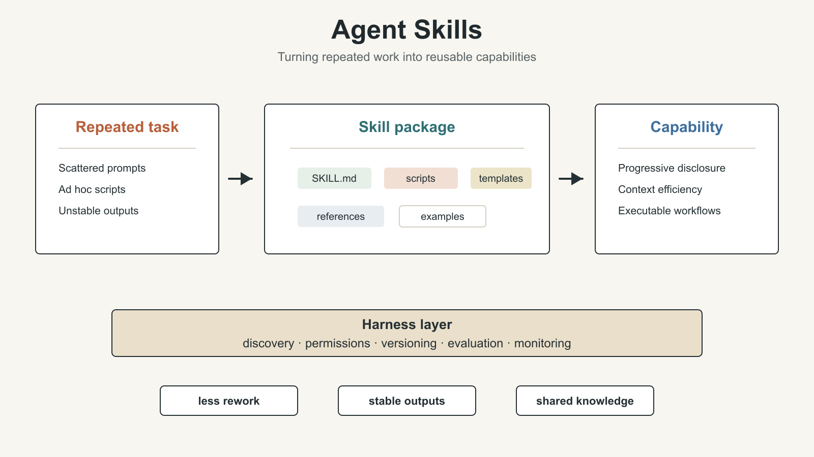
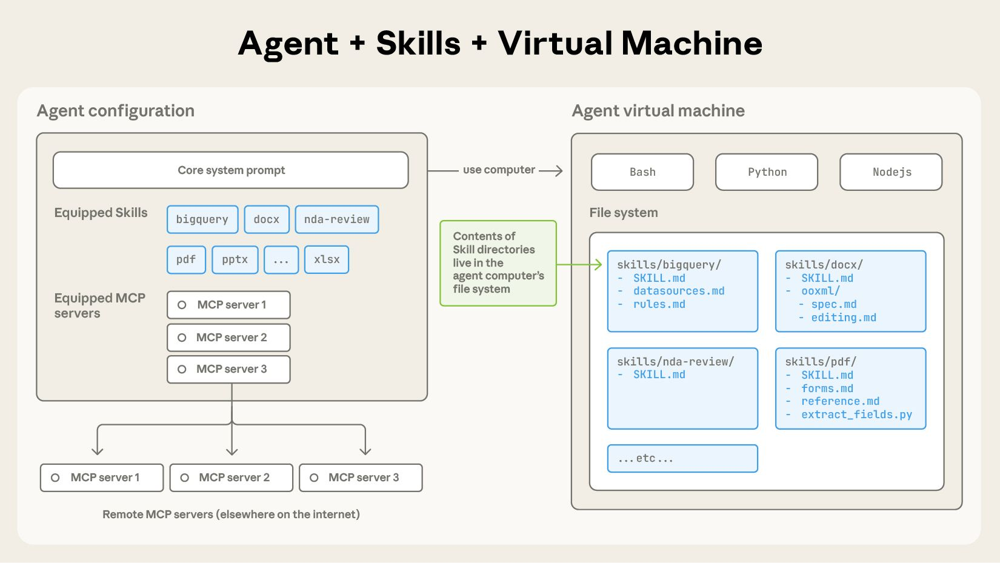
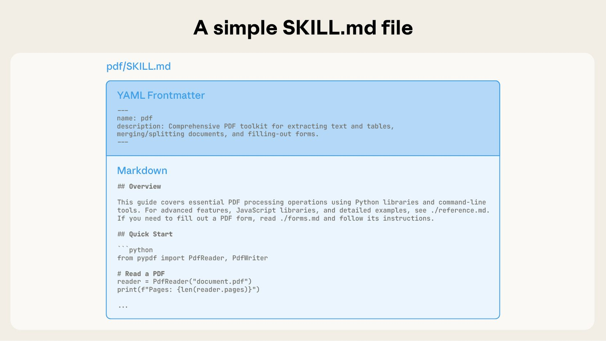
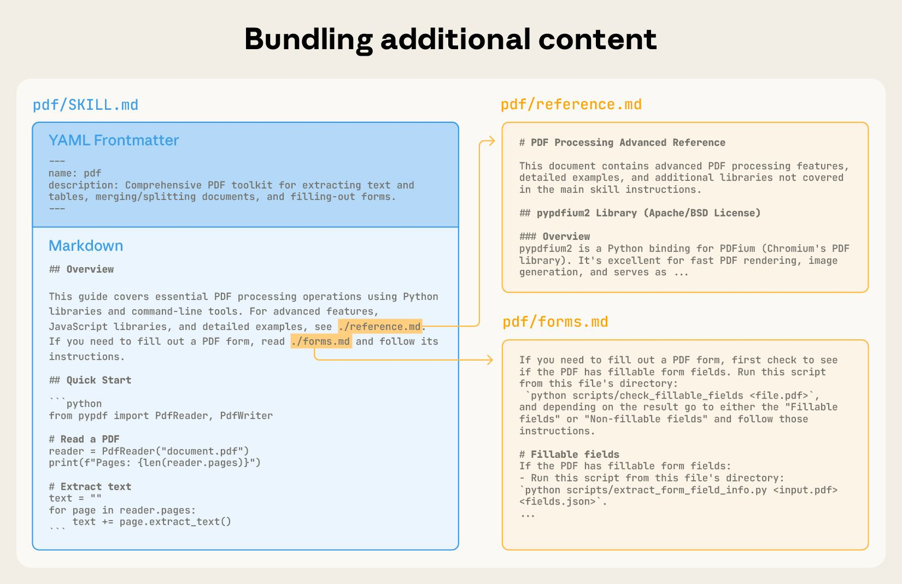
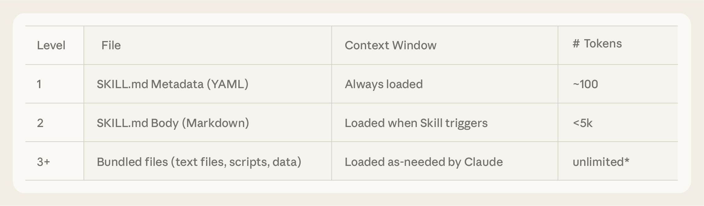
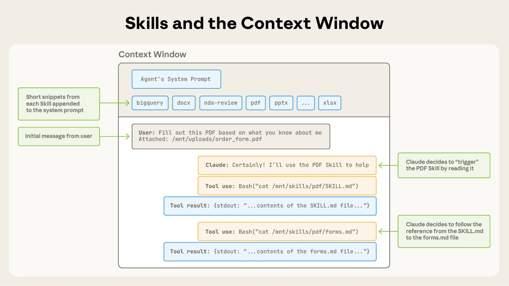
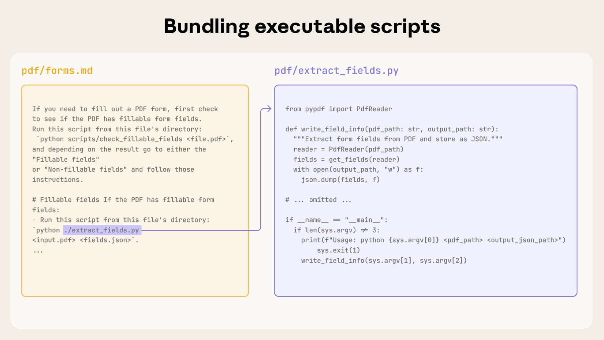

# AI Agent Engineering Series 04: Agent Skills for the Real World

This article studies Anthropic Engineering’s Agent Skills: a way to package repeated task knowledge, scripts, templates, references, and operating rules into reusable capabilities for agents.

Source: Anthropic Engineering  
Original: Equipping agents for the real world with Agent Skills  
URL: https://www.anthropic.com/engineering/equipping-agents-for-the-real-world-with-agent-skills  
Published: October 16, 2025  
Updated: December 18, 2025, when Anthropic announced Agent Skills as an open standard  
Topic: How repeated task experience becomes reusable agent capability

## Series Progress

This series follows Anthropic Engineering articles and studies AI agent engineering one article at a time. The current order is:

1. Effective context engineering for AI agents
2. Writing effective tools for agents
3. Code execution with MCP
4. Equipping agents for the real world with Agent Skills
5. Harness design for long-running application development

The first three articles form a clear progression:

- Context engineering asks what the model should see at each step.
- Writing tools asks what interfaces agents should use to act.
- Code execution with MCP asks where tool orchestration and intermediate state should live.

The fourth article moves into Skills. Its question is: once an agent can call tools and execute code, how can common workflows, scripts, templates, and knowledge be captured so the agent does not start from zero every time?

## What This Article Is About

Anthropic’s central point is simple:

If we want agents to handle real-world tasks, a stronger model, a longer context window, or a larger list of tools is still not enough.

Real work usually requires task-specific knowledge, operating procedures, formatting rules, business constraints, scripts, templates, and examples. A new employee does not receive only a list of software tools. They also receive documents, SOPs, templates, scripts, examples, and institutional experience.

Agent Skills are designed to solve that problem.

A Skill is a folder. At minimum, it contains a `SKILL.md` file. It can also include scripts, reference documents, templates, images, spreadsheets, and other resources. When an agent encounters a relevant task, it can load the Skill on demand and gain the context and capability needed to complete the task.

The December 18, 2025 update is important: Anthropic announced Agent Skills as an open standard, with documentation and a cookbook. That means Skills are not just an internal Claude feature. They are intended to become a reusable way to package agent capabilities across platforms.

## Why Skills Are Needed

The previous articles in this series already showed that agent performance does not depend only on the model itself.

It also depends on:

- what context the model sees
- what tools it can call
- whether tool results are high-signal
- whether code execution handles intermediate state
- whether the system can preserve and reuse long-term task experience

Skills fill the last layer: reusable experience.

Without Skills, an agent treats every task as if it is the first time:

- it re-understands the requirement
- it re-reads documentation
- it re-writes scripts
- it re-discovers formatting rules
- it re-evaluates boundaries
- it re-handles common errors

That wastes tokens and makes outputs unstable.

With Skills, the agent can load a prepared task package when appropriate. It does not merely know which tools exist. It also knows how this type of task is usually done.

## What Is a Skill?

Anthropic defines a Skill as a composable capability package.

A Skill is usually a directory that contains at least:

- `SKILL.md`: the entry point for the Skill

It may also contain:

- scripts
- reference docs
- templates
- examples
- static assets such as images, tables, and configuration files

The smallest Skill can be very simple. For example, a `pdf` Skill may contain only a `SKILL.md` file that explains how the agent should handle PDF tasks.

A more complete Skill can look like a small toolkit. It does not only tell the agent what to do. It also provides scripts and reusable assets that the agent can directly use.

This structure is close to a task manual plus a toolbox for the agent.

`SKILL.md` is not just a normal documentation file. It is the entry point that helps the agent decide when to use the Skill and how to start using it.

## Skill Structure: Metadata, Instructions, and Resources

A `SKILL.md` file usually has two parts.

The first part is YAML frontmatter, which describes the Skill’s basic metadata.

Common fields include:

- name
- description

The `description` field is especially important because the agent or harness uses it to decide whether the Skill is relevant to the current task.

The second part is Markdown content with concrete instructions.

That content can include:

- task goals
- operating steps
- constraints and caveats
- how to call scripts
- where reference files live
- input and output requirements
- recovery paths for common failures

If the Skill needs more material, those materials can live in the same folder. The agent reads `SKILL.md` first, then opens more specific files only when needed.

The key point is that a Skill does not push every piece of knowledge into the model context at once. It organizes knowledge into a file structure that can be read on demand.

## Progressive Disclosure: How Skills Save Context

One core design of Skills is progressive disclosure.

The agent does not need to read the entire Skill directory at the beginning. It usually expands information in three layers.

First layer: load only each Skill’s metadata.

At this stage, the agent sees only the name and description, which it uses to decide which Skill may be relevant. This layer consumes very few tokens.

Second layer: when a Skill may be relevant, load its `SKILL.md`.

At this stage, the agent gets the full operating instructions, but it still does not read all reference files, templates, examples, or script contents.

Third layer: only when the task requires it, open the scripts, templates, examples, or references inside the Skill directory.

This keeps low-frequency information outside the context window until it is actually needed.

This matches the principle from the first article on context engineering: find the smallest high-signal token set that helps the model produce the target behavior.

Skills turn that principle into a file-system-level way to organize agent capability.

## Skills and the Context Window

The original article uses a diagram to show how Skills enter the context window.

Not all content from all Skills enters the model.

A more reasonable flow is:

1. Put metadata for all available Skills into context.
2. Let the model decide whether a Skill is needed for the user’s task.
3. If needed, add that Skill’s `SKILL.md` to context.
4. If `SKILL.md` points to scripts, references, or templates, read those files only when needed.

This solves an important tension:

Agents need many specialized capabilities, but the context window cannot hold every detail of every capability at once.

Skills keep capability details outside the context window. They first expose only an index. When the model decides that a capability is relevant, the system progressively loads more detail.

This also connects to the file-tree idea in the third article, Code execution with MCP. The agent does not have to read every tool definition at once. It can discover and expand capabilities through the file system.

## Skills and Executable Scripts

Skills are not only documents. They can also bundle executable scripts.

This is one of the most important points in the article.

If a task relies only on natural-language instructions, the agent may still need to generate code from scratch each time. That can be unstable.

But if a Skill already contains tested scripts, the agent can call those scripts directly for deterministic work.

Examples include:

- document conversion
- file parsing
- data cleaning
- spreadsheet formatting
- image processing
- API wrappers
- fixed-format output generation

This moves deterministic logic out of the model and into executable files.

The model decides when to use a script, what input to pass, and how to interpret the output. The script performs the repeatable steps reliably.

This matches the second article on writing tools: do not make the model do mechanical work that should be handled by deterministic software.

## How Skills Relate to MCP and Code Execution

Skills, MCP, and code execution are not substitutes for one another.

They solve problems at different layers.

MCP solves the connection problem:

> How does an agent connect to external tools and data?

Code execution solves the orchestration problem:

> When tool calls become complex, where should intermediate state and control flow live?

Skills solve the reuse problem:

> When a type of task appears repeatedly, how can task experience become a reusable capability?

The three can work together:

1. An MCP server exposes low-level tools.
2. The agent uses a code execution environment to combine tools and process data.
3. Common combinations and task workflows are captured as Skills.

For example, a “generate sales report” Skill may include:

- instructions to read CRM data first
- a call to an MCP server for customer information
- a code execution step to clean and aggregate data
- a template for the report
- a script that exports PDF
- company-specific checks for charts and summaries

In this setup, the Skill does not replace MCP. It organizes a higher-level task capability on top of MCP.

## How to Write a Good Skill

The original article does not turn Skills into a complicated framework. It emphasizes a simple and iterative writing style.

When writing a Skill, start from real tasks.

A good Skill should answer several questions:

1. What tasks is this Skill for?
2. What tasks is it not for?
3. What should the agent do first?
4. How should common branches be handled?
5. Which scripts, templates, or references can be reused?
6. What output format and quality bar must be met?
7. How should the agent recover from errors?

The `description` must be clear because it determines when the agent will select the Skill.

The body of `SKILL.md` should be direct. It should not read like an encyclopedia. It should read like instructions for a new teammate: how to start, how to decide, and how to finish.

If steps are stable, put them in scripts.

If information is long, put it in reference files.

If output format is fixed, provide templates.

If mistakes are common, write the recovery path.

## Start From Evaluation

Anthropic also emphasizes that Skills should not be written by intuition alone.

As with tools, it is better to start from evaluation.

First collect real tasks and observe how the agent fails without a Skill:

- Does it miss the correct steps?
- Does it forget business constraints?
- Does it repeatedly rewrite the same code?
- Does it produce unstable output formats?
- Does it not know which reference document to read?
- Does it lose state in long tasks?

Then convert those failure points into Skill content.

For example:

- If failure comes from unclear steps, write the workflow into `SKILL.md`.
- If failure comes from repeatedly wrong scripts, stabilize the script inside `scripts/`.
- If failure comes from long reference material, split it into reference files that are read on demand.
- If failure comes from unstable formatting, provide templates and examples.

Evaluation prevents Skills from becoming documents that look complete but do not improve performance.

The value of a Skill should be measured by whether the agent performs better on real tasks.

## Design From Claude’s Perspective

The original article includes an important recommendation: design Skills from Claude’s perspective.

That means we should not write Skills only according to human documentation habits. We should imagine what the model sees inside the context window and how that content will shape its decisions.

For the model, the most useful elements are usually:

- clear trigger conditions
- explicit step order
- executable commands
- input and output examples
- common errors and recovery paths
- task boundaries
- file paths and resource indexes

The least helpful patterns are:

- being too abstract
- being too long without structure
- hiding key information inside paragraphs
- not saying when to use the Skill
- not saying when not to use the Skill
- providing no examples

This is similar to prompt-engineering tool descriptions in the second article. The Skill itself is written for the model, so its description and structure affect model behavior.

## Use Claude to Iterate Skills

The article also notes that Claude can help write and improve Skills.

That is natural.

Skills are task packages for agents. Claude can analyze task transcripts, failure cases, and existing files to summarize workflows, extract scripts, organize templates, and compress reference material.

A practical workflow is:

1. Let the agent execute a batch of real tasks.
2. Save transcripts, failure points, and successful paths.
3. Ask Claude to analyze what should become a Skill.
4. Write the first version of `SKILL.md` and any necessary scripts.
5. Test it on held-out tasks.
6. Continue revising the Skill based on failures.

This shows that Skills are not one-off documents. They are capability layers that evolve with accumulated task experience.

## Security: Skills Need Boundaries Too

Skills can contain scripts and resources, so they introduce security concerns.

If a Skill contains executable scripts, we must ask:

- What files can the script access?
- Is network access allowed?
- Can it modify external systems?
- Will it handle sensitive data?
- Does it require user confirmation?
- Can malicious prompts induce misuse?

This matches the security boundary from the third article on code execution.

Where there is execution capability, there must be sandboxing, permission control, auditing, and monitoring.

The Skill instructions should also make risk boundaries explicit. For example, which operations are read-only, which operations write files, which operations call external APIs, and which operations require human confirmation.

A mature agent platform should not only support loading Skills. It should also support Skill permissions, provenance, versioning, review, and execution logs.

## Future Direction: Skills Become a Layer of the Agent Ecosystem

The article ends by placing Skills in the broader agent ecosystem.

In the future, agents may not only use human-written Skills. They may also:

- create Skills
- modify Skills
- evaluate Skills
- rate Skills
- share Skills across teams
- automatically select Skills for a task
- update Skills based on failures

This means an agent’s capability will not come only from model parameters and external tools. It will also come from accumulated task experience.

If MCP is the tool connection layer, and code execution is the tool orchestration layer, Skills are the capability accumulation layer.

That is also why Anthropic later released Agent Skills as an open standard. Standardization makes it possible for Skills to be reused across tools, platforms, and agent ecosystems.

## How This Article Connects to the Previous Three

Looking at the first four articles together, the layers of agent engineering become clearer:

1. Context engineering controls what the model sees at each step.
2. Writing tools designs interfaces that agents can use correctly.
3. Code execution with MCP moves complex tool orchestration and intermediate state out of model context.
4. Agent Skills turn repeated task methods into reusable capabilities.

Skills occupy a critical position.

They do not replace context, tools, or code execution. They combine those capabilities into higher-level task packages.

A strong agent is not merely an agent with tools, and not merely an agent that can write code. It should also know the stable way to perform a class of tasks and reuse that knowledge next time.

This naturally leads into the final article: harness design. Once an agent has context, tools, code execution, and Skills, it still needs an outer harness to decide how these capabilities are loaded, scheduled, isolated, monitored, and run over long periods.

## Key Terms

- Agent Skill: A reusable set of instructions, scripts, and resources that helps an agent complete a type of task.
- `SKILL.md`: The entry file of a Skill, containing metadata and task instructions.
- YAML frontmatter: Structured metadata at the top of `SKILL.md`, used to describe a Skill’s name and purpose.
- Progressive disclosure: Loading information gradually on demand instead of putting everything into context at once.
- Executable scripts: Scripts packaged inside a Skill to perform repeatable steps reliably.
- Reference docs: Documents inside a Skill that can be read on demand.
- Templates: Fixed output formats bundled inside a Skill.
- Agent harness: The outer system that loads, schedules, isolates, and monitors agent capabilities.
- Open standard: A standard intended for reuse across platforms and ecosystems.

## Use Cases and Caveats

This article is especially useful for three groups.

First, people building enterprise agents. Enterprise work contains many workflows, formats, scripts, and pieces of internal knowledge. Skills are an important way to structure that experience.

Second, people building agent platforms. A platform does not only need to connect tools. It must also think about capability package loading, permissions, versioning, and sharing.

Third, teams designing AI workflows. Repeated team tasks should not rely on explaining the same process in prompts every time. They should be captured as Skills.

In practice, a Skill is not better just because it is bigger. It should be easy to trigger, read, execute, and evaluate. A Skill that is too long, scattered, or unclear becomes another source of context noise.

## Review Points

1. Skills solve the problem of reusable task capability for agents.
2. A Skill contains at least `SKILL.md`, and may also include scripts, templates, references, and assets.
3. The `description` field is critical because it determines whether the agent selects the Skill.
4. Skills save context through progressive disclosure.
5. The agent first sees Skill metadata, then reads `SKILL.md` and other files only when needed.
6. Executable scripts move deterministic steps out of the model.
7. Skills can combine with MCP and code execution; they do not replace them.
8. Good Skills should start from real evaluations and failure cases.
9. Skills need security boundaries, especially when they include scripts or external-system operations.
10. Skills are a layer that turns one-off tasks into stable capability, setting up the need for harness design.

## Original Authors

The original article was written by Jack Morris and Boris Cherny, with feedback and contributions from Adam Bishop, Deepak Chaplot, Dianne Penn, Dianne Shum, Erol Can Akbaba, Greg Miernicki, Jamie Lawrence, Josh Albrecht, Kate Jensen, Maggie Vo, Nicholas Chamandy, Raul Soto, Ryan Loowe, Scott White, Tom Frank, Trenton Bricken, Will Brown, William Crichton, and Zac Hatfield.
