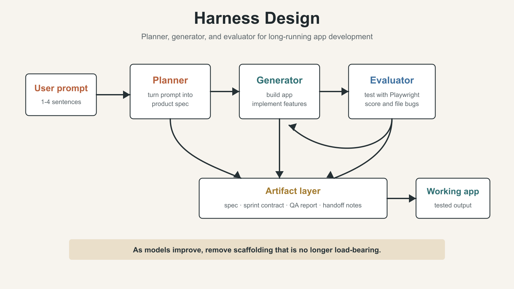
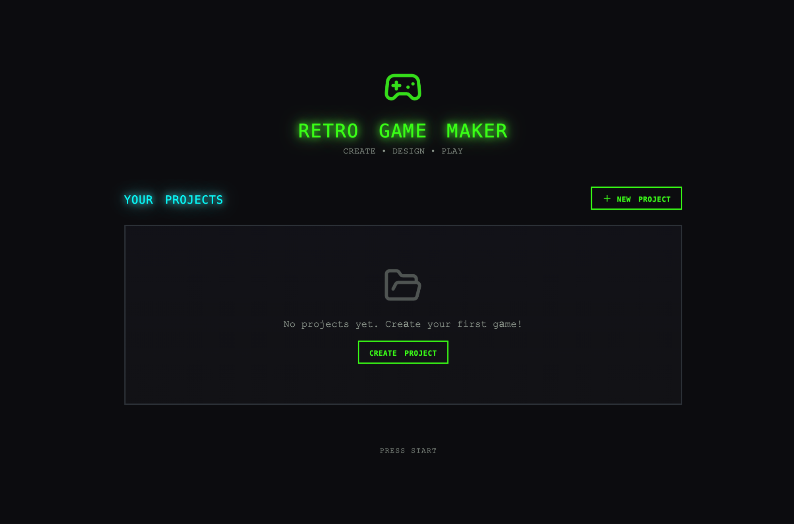
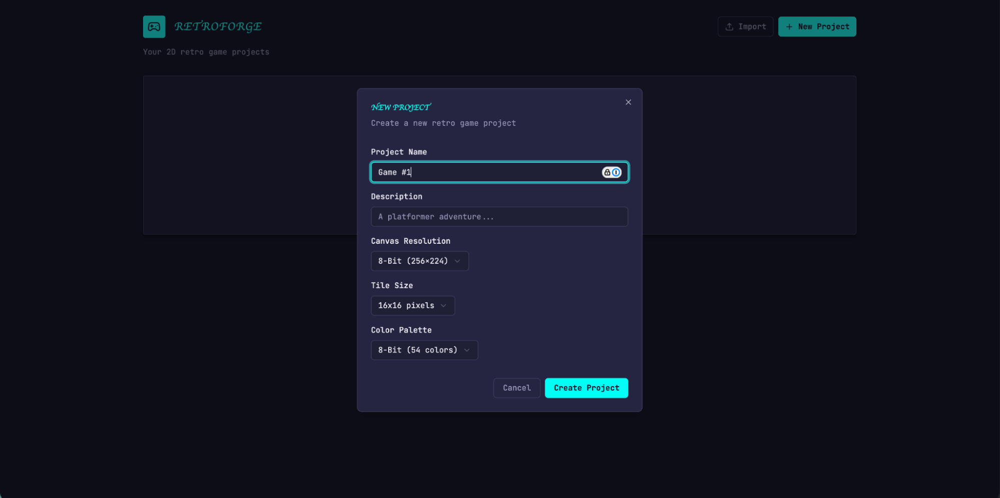
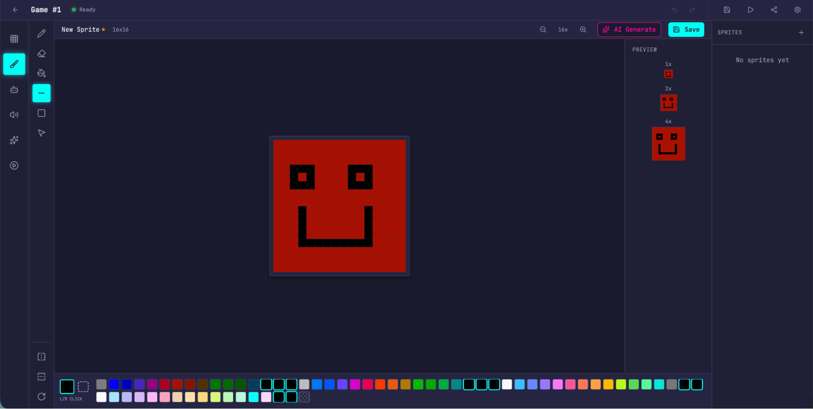
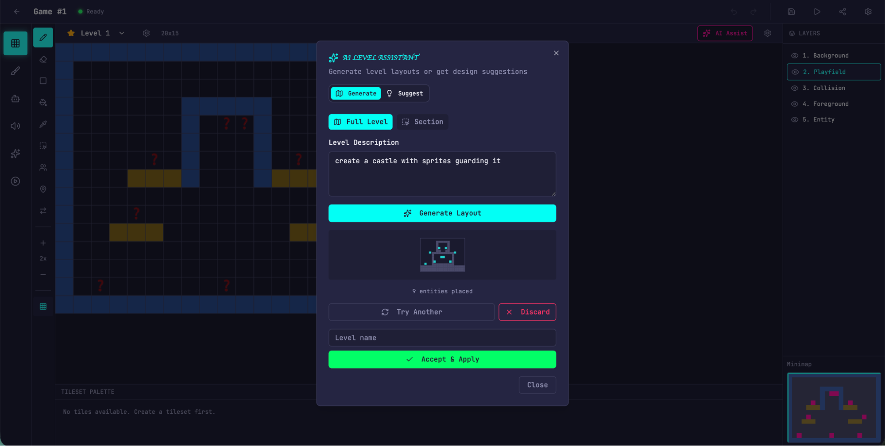
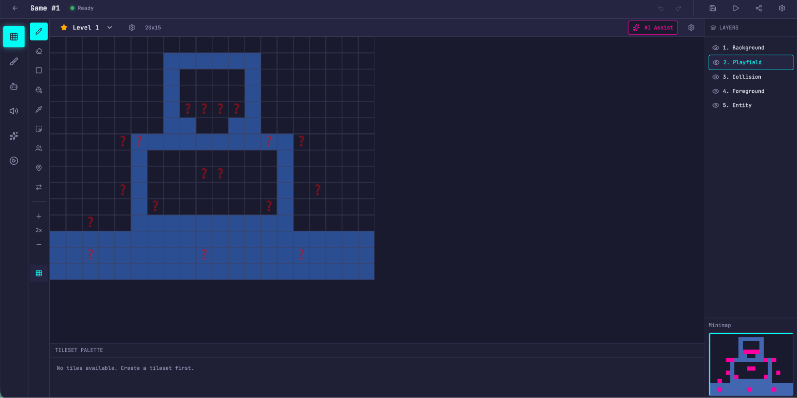
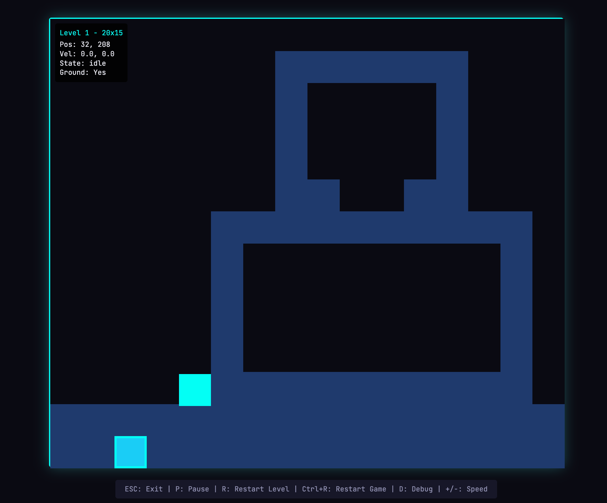

# AI Agent Engineering Series 05: Harness Design for Long-Running Application Development

This article studies Anthropic Engineering's "Harness design for long-running application development": how planner, generator, and evaluator agents can be arranged around a model so it can produce stronger frontend designs and work on full applications for hours.

Source: Anthropic Engineering  
Original: Harness design for long-running application development  
URL: https://www.anthropic.com/engineering/harness-design-long-running-apps  
Published: March 24, 2026  
Author: Prithvi Rajasekaran, Anthropic Labs  
Topic: How harness structures such as planners, generators, evaluators, context resets, and QA loops help Claude handle frontend design and long-running autonomous application development

## Series Progress

This series follows Anthropic Engineering articles and studies AI agent engineering one article at a time. This is the final article:

1. Effective context engineering for AI agents
2. Writing effective tools for agents
3. Code execution with MCP
4. Equipping agents for the real world with Agent Skills
5. Harness design for long-running application development

The first four articles have covered four layers of agent engineering:

- Context engineering controls what the model sees at each step.
- Writing tools designs interfaces that agents can use correctly.
- Code execution with MCP moves complex tool orchestration and intermediate state out of the model context.
- Agent Skills capture repeated task methods as reusable capabilities.

The fifth article moves to the outer layer: the harness.

In this context, a harness is the runtime structure wrapped around the model. It decides how a task is split, how multiple agents cooperate, when evaluation happens, how state is handed off, when work should continue, and when work should be revised.

## What This Article Is About

This article discusses two connected problems.

The first problem is how to make Claude generate better frontend designs.

The second problem is how to make Claude build complete applications over long autonomous development runs without constant human intervention.

The author had already worked on two systems: a frontend design skill and a long-running coding agent harness. Through prompt engineering and harness design, Claude performed much better than a baseline system, but both systems eventually hit a ceiling.

To break through that ceiling, the author borrowed an idea from GANs, or generative adversarial networks: separate generation and evaluation into two roles.

One agent generates. Another agent evaluates.

For frontend design, subjective judgments such as "does this look good" need to be decomposed into more concrete criteria that can be scored. For long-running coding, the evaluator needs to behave like code review and QA: actually use the app, find bugs, and provide actionable feedback.

The final architecture became a three-agent structure:

- planner: expands a short request into a product specification
- generator: builds the application according to the specification
- evaluator: runs and tests the application, then provides feedback



This architecture can produce complete full-stack applications during multi-hour autonomous coding sessions.

## Why a Naive Implementation Is Not Enough

Anthropic had already shown that harness design has a major effect on long-running agentic coding.

In earlier experiments, they used an initializer agent to break a product specification into a task list. A coding agent then implemented one feature at a time, and context was handed across sessions through artifacts.

The developer community has also explored similar ideas. One example mentioned in the article is the "Ralph Wiggum" method, where hooks or scripts keep an agent moving through an iterative loop.

But complex tasks still had two persistent problems.

### Problem 1: Long Tasks Lose Coherence

When a model works on a very long task, its context window gradually fills up and coherence tends to degrade.

Some models also show what the article calls "context anxiety." When the model feels that it is approaching the context limit, it may start wrapping up too early, even if the task is not actually complete.

The proposed solution is context reset.

Context reset does not mean compressing the old conversation and continuing with the same agent. It means fully clearing the context, starting a new agent, and passing the previous agent's state and next steps through a structured handoff artifact.

This is different from compaction.

Compaction summarizes earlier conversation and keeps the same agent moving. It preserves continuity, but it does not give the agent a truly clean context, so context anxiety can still remain.

Reset gives the new agent a clean slate. The cost is that the handoff artifact must be complete enough for the next agent to continue the work. It also increases orchestration complexity, token cost, and latency.

In early testing, Claude Sonnet 4.5 showed enough context anxiety that compaction alone was not enough for strong long-task performance. Context reset became a necessary part of the harness design.

### Problem 2: Agents Are Bad at Evaluating Their Own Work

The second problem is self-evaluation.

When an agent evaluates something it just created, it often praises its own work confidently, even when a human reviewer would immediately see that the quality is only average.

This problem is especially visible in frontend design.

Design does not have a simple binary signal like a unit test. Whether a page feels polished or generic is a judgment call, not a pass/fail assertion. When an agent evaluates its own design, it tends to give a positive judgment.

Even in software tasks with verifiable results, weak judgment can still damage performance.

Separating the "doer" agent from the "reviewer" agent is a strong lever.

Of course, the evaluator is still an LLM, so it can also be too forgiving. But it is easier to tune a separate evaluator to be more skeptical and stricter than it is to make the generator critically judge its own output.

Once external feedback exists, the generator has specific material for iteration.

## Frontend Design: Turning Subjective Quality Into Scorable Criteria

The author first started with frontend design experiments, because self-evaluation is especially obvious there.

Without intervention, Claude often generates safe and predictable layouts. They may be functional, but they are visually ordinary.

The frontend harness had two key insights.

First, aesthetics cannot be fully reduced to a number, but design principles and preferences can be encoded through scoring criteria.

"Is this design beautiful?" is hard to answer consistently.

"Does this design follow the design principles we defined?" is easier to evaluate.

Second, separating frontend generation and frontend grading creates a feedback loop that pushes the generator toward stronger outputs.

The author gave both the generator and the evaluator four scoring criteria.

### 1. Design Quality

Design quality asks whether the design feels like one coherent whole rather than a collection of unrelated parts.

A high-quality design should make color, typography, layout, imagery, and details work together into a clear mood and identity.

### 2. Originality

Originality asks whether the design contains custom design decisions.

If the result is just a template layout, default component-library styling, or a typical AI-generated pattern, it should not score well.

The article specifically calls out unmodified stock components and obvious AI patterns such as "white cards plus purple gradients" as things that should be penalized.

This point matters. The goal is not necessarily visual complexity. The goal is to force the design to contain real choices.

### 3. Craft

Craft is a technical execution check.

It includes typography hierarchy, spacing consistency, color harmony, contrast, and similar fundamentals.

This is closer to a fundamentals check than a creativity check.

The author says Claude is usually already reasonably good at craft and functionality by default.

### 4. Functionality

Functionality focuses on usability that is not directly about aesthetics.

Can users understand what the interface does? Can they find the primary action? Can they complete the task without guessing?

The author places more weight on design quality and originality than on craft and functionality.

The reason is practical: Claude is already comparatively good at basic execution and usability, but it often produces bland outputs in design quality and originality.

The criteria explicitly punish highly generic "AI slop" patterns and encourage the model to take more aesthetic risks.

### How the Evaluator Is Calibrated

The author calibrates the evaluator with few-shot examples.

The evaluator sees examples with detailed score breakdowns, so its judgment becomes more aligned with the author's preferences and less likely to drift during iteration.

Score drift means the scoring standard shifts over time, so earlier and later judgments are no longer consistent.

### How the Generation-Evaluation Loop Works

The author built this loop with the Claude Agent SDK.

The flow is:

1. A generator agent creates an HTML, CSS, and JavaScript frontend from the user prompt.
2. An evaluator opens the page through Playwright MCP.
3. The evaluator browses the page, takes screenshots, and carefully inspects the implementation.
4. The evaluator scores the design across the four criteria and writes a detailed critique.
5. The critique goes back to the generator as input for the next round.
6. A generation usually runs for 5 to 15 iterations.

The important detail is that the evaluator does not only look at a static screenshot. It operates the page.

Each round therefore requires real wall-clock time. A complete run can take up to 4 hours.

The author also asks the generator to make a strategic choice after each evaluation:

- If the score trend is promising, refine the current direction.
- If the current direction is not working, switch to a completely different aesthetic direction.

### Results and Observations

After multiple rounds, evaluator scores usually improve and then plateau.

Some generations improve gradually. Others make dramatic aesthetic turns between iterations.

The criteria themselves affect the direction of generation. For example, when the criteria contain language such as "the best designs are museum quality," the model converges toward a certain visual style.

This means scoring criteria are not neutral. They do not only evaluate outputs. They also shape outputs.

Another observation is that scores do not always improve linearly.

Later iterations are usually stronger overall, but the author often prefers a middle iteration rather than the final one.

As iterations increase, results also become more complex, because the generator becomes more ambitious while responding to the evaluator's critiques.

Even the first round is noticeably better than an unconstrained baseline when the model is given scoring criteria and relevant design language. This shows that the criteria themselves can pull the model away from generic default styling.

### A Dutch Art Museum Example

The author asked the model to create a website for a Dutch art museum.

By iteration 9, the model produced a clean dark landing page. It looked polished and still matched the author's expectations.

By iteration 10, it abandoned the previous direction and rebuilt the site into a spatial experience:

- It rendered a 3D room using CSS perspective.
- The floor used a checkerboard pattern.
- Artworks were placed freely on the walls.
- Users navigated through doorways between gallery rooms instead of traditional scrolling or clicking.

This was the kind of creative leap the author had not seen in single-pass generation.

## Extending the Pattern to Full-Stack Coding

After the frontend design experiment, the author applied the GAN-inspired pattern to full-stack development.

Here, the generator-evaluator loop maps to a software development lifecycle:

- The generator behaves like a developer.
- The evaluator behaves like code review plus QA.

### Architecture

The earlier long-running harness had already solved part of the multi-session coding coherence problem. An initializer agent split tasks, a coding agent implemented one feature at a time, and context resets plus handoff artifacts carried work across sessions.

For the new experiment in this article, the author used Opus 4.5.

Later, the context anxiety problem became less severe in newer models. Opus 4.5 was the strongest coding model when the experiment began, and Opus 4.6 later improved long context, planning, code review, and debugging further.

In the initial full-stack harness, the author designed three agent personas.

### Planner

The planner turns a short 1- to 4-sentence prompt into a complete product specification.

The earlier harness required the user to provide a detailed specification upfront. The author wanted to automate that step.

The planner is instructed to:

- stay ambitious about scope
- focus on product context and high-level technical design
- avoid specifying low-level technical implementation too early

The reason is practical. If the planner writes too many fine-grained technical details upfront and gets them wrong, those mistakes cascade into downstream implementation.

A better approach is to constrain the final deliverable and let later agents find the implementation path during work.

The author also asks the planner to look for opportunities to add AI features to the product specification.

### Generator

The generator does the actual building.

It inherits the previous harness method of working one feature at a time. It works in sprints and chooses one feature from the specification each time.

The technical stack for each sprint is:

- React
- Vite
- FastAPI
- SQLite, later replaced with PostgreSQL

At the end of each sprint, the generator performs self-evaluation and then hands the work to QA.

It also uses git for version control.

### Evaluator

The evaluator performs real testing.

Earlier harness outputs often looked impressive, but still had bugs when actually used.

To address this, the evaluator uses Playwright MCP like a real user. It clicks through the running app and tests:

- UI features
- API endpoints
- database states

It then scores each sprint based on discovered bugs and a set of scoring criteria.

Those criteria came from the frontend design experiment but were adapted for full-stack applications:

- product depth
- functionality
- visual design
- code quality

Each criterion has a hard threshold. If any criterion falls below the threshold, the sprint fails and the generator receives detailed feedback.

### Sprint Contract

Before each sprint begins, the generator and evaluator negotiate a sprint contract.

The sprint contract defines what "done" means for this work block.

Because the product specification is intentionally high-level, another step is needed to turn user stories into testable implementation.

The flow is:

1. The generator proposes what it will build in the sprint.
2. The generator explains how success will be verified.
3. The evaluator reviews the proposal and checks that it does not drift away from the product goal.
4. Both sides iterate until they reach agreement.
5. The generator implements the contract.
6. The evaluator performs QA against the contract.

Agents communicate through files.

One agent writes a file. Another agent reads that file and either responds in the same file or writes a new file for the first agent to read.

This keeps work faithful to the specification while avoiding premature low-level implementation constraints.

## First Full Harness Experiment: A 2D Retro Game Maker

The first version of the harness used Claude Opus 4.5.

The author ran the same prompt through the full harness and through a single-agent system for comparison.

The prompt was:

```text
Create a 2D retro game maker with features including a level editor, sprite editor, entity behaviors, and a playable test mode.
```

The runtime and cost were:

| Harness | Duration | Cost |
| --- | --- | --- |
| Solo | 20 min | $9 |
| Full harness | 6 hr | $200 |

The full harness cost more than 20 times as much, but the quality difference was also very large.

The expected output was an interface where a user could build levels and components such as sprites, entities, and tile layouts, then click play and actually play the level.

### Problems in the Solo Run

The solo run looked reasonable at first.

But problems appeared once the author clicked around and tried to use it:

- The layout wasted space, and fixed-height panels left most of the viewport empty.
- The workflow felt rigid.
- To fill a level, the system required sprites and entities to be created first, but the UI did not guide the user through that order.
- Most importantly, the game itself was broken.
- Entities appeared on screen but did not respond to input.
- The connection between entity definitions and the game runtime was broken, and the UI gave no obvious signal.




### Results From the Full Harness

The full harness started from the same one-sentence prompt.

The planner expanded it into a 16-feature specification distributed across 10 sprints.

It included not only the core editors and play mode, but also:

- a sprite animation system
- behavior templates
- sound effects and music
- an AI-assisted sprite generator
- an AI-assisted level designer
- game export with shareable links

The author also allowed the planner to access the frontend design skill. The planner read that skill and created a visual design language for the application inside the specification.

In each sprint, the generator and evaluator negotiated a sprint contract that defined the concrete implementation details and testable behavior for that round.

The resulting application was more polished and smoother than the solo run.

The canvas used the full viewport. Panels had more reasonable sizes. The UI had a consistent visual identity and matched the design direction in the specification.

However, some awkward experience from the solo run remained. For example, it was still not easy for users to realize that they should create sprites and entities before filling the level.

The author treats this as a product intuition gap in the base model rather than a problem the harness itself was designed to solve. But it also suggests that a harness could add more targeted product-experience iteration.

The sprite editor difference was much clearer. The full harness version had richer functionality, cleaner tool palettes, a better color picker, and more usable zoom controls.

Because the planner was instructed to include AI features in the specification, the application also included a Claude integration. Users could generate different parts of the game through prompting, which made creation much faster.











The largest difference appeared in play mode.

In the full harness version, the author could actually move the entity and play the game.

The physics were still rough. For example, the character could overlap with a platform after jumping onto it, which felt wrong. But the core functionality worked, while the solo run failed at that basic requirement.

The author also found a limitation in AI level construction: a large wall could not be jumped over, leaving the player stuck. This shows that the harness still has room to handle common sense and edge cases.

### Examples of Issues Found by the Evaluator

The logs show that the evaluator kept implementation on track with the specification.

In each sprint, it walked through the sprint contract's test criteria one by one and operated the running app through Playwright. If behavior diverged from the expected result, it reported a bug.

Sprint 3 alone had 27 criteria covering the level editor.

The table below shows examples of issues the evaluator found:

| Contract criterion | Evaluator finding |
| --- | --- |
| Rectangle fill tool allows click-drag to fill a rectangular area with selected tile | FAIL: the tool placed tiles only at the drag start and end points, not across the rectangle. The `fillRectangle` function existed but was not correctly triggered on `mouseUp`. |
| User can select and delete placed entity spawn points | FAIL: the Delete key handler at `LevelEditor.tsx:892` required both `selection` and `selectedEntityId`, but clicking an entity only set `selectedEntityId`. The condition should be `selection || (selectedEntityId && activeLayer === 'entity')`. |
| User can reorder animation frames via API | FAIL: the `PUT /frames/reorder` route was defined after the `/{frame_id}` route. FastAPI parsed `reorder` as an integer `frame_id` and returned 422: `unable to parse string as an integer`. |

The evaluator did not become this useful by default.

The author says Claude is not a good QA agent out of the box.

In early runs, it would identify real problems, then convince itself that they were not serious, and finally approve the work. It also tended to perform only surface-level testing and miss subtle edge cases.

The tuning process was:

1. Read evaluator logs.
2. Identify where its judgment disagreed with the author's judgment.
3. Modify the QA prompt to address those failures.
4. Repeat for several rounds.

Even after tuning, harness outputs still exposed limits in the model's QA ability:

- Small layout problems remained.
- Some interactions still did not feel intuitive.
- Deeper nested functionality still contained bugs the evaluator did not cover.

But compared with the solo run, where the core feature did not work, the improvement was significant.

## Iterating the Harness: Which Components Are Load-Bearing

The first harness results were encouraging, but the system was heavy, slow, and expensive.

The next step was to simplify the harness without reducing performance.

There is an important principle here:

Every harness component encodes a hypothesis about what the model cannot do by itself.

Those hypotheses should be pressure-tested for two reasons.

First, they may have been wrong from the start.

Second, as models improve, they can quickly become outdated.

Anthropic's "Building Effective Agents" article has a similar principle: find the simplest viable approach first, and add complexity only when needed.

The author's first simplification attempt cut the harness down heavily and added some creative new ideas, but it failed to reproduce the original performance.

Worse, it became hard to tell which parts were actually load-bearing and how each part contributed.

So the author switched to a more systematic method: remove one component at a time, then observe how final results change.

During this process, Anthropic also released Opus 4.6.

Opus 4.6 gave the author even more reason to reduce harness complexity. Its release blog said that Opus 4.6:

- plans more carefully
- can sustain longer agentic tasks
- works more reliably in larger codebases
- has stronger code review and debugging ability for finding its own mistakes
- improves long-context retrieval

These are exactly the kinds of weaknesses the harness had been compensating for.

## Removing the Sprint Construct

The author first removed the sprint construct entirely.

The sprint structure originally helped divide work into blocks and maintain coherence.

But given Opus 4.6's improved ability, it was reasonable to test whether the model could complete the task without that decomposition.

The author kept the planner and evaluator because both still had visible value.

Without the planner, the generator tended to under-scope. Given the raw prompt, it started building immediately without first writing a specification, and the final app contained fewer features than the planner-designed version.

After removing sprints, the evaluator changed from scoring every sprint to doing a single pass at the end of the run.

One conclusion here is important:

The evaluator is not a fixed yes/no requirement.

Whether it is worth the cost depends on whether the task exceeds what the current model can reliably do solo.

On Opus 4.5, many builds sat near the edge of what the generator could do by itself, so the evaluator found meaningful problems.

By Opus 4.6, the base model's capability improved and that edge moved outward. Some tasks that previously needed an evaluator could now be handled by the generator alone. For those tasks, the evaluator became unnecessary cost.

But for parts that still sit near the edge of the generator's ability, the evaluator still provides real value.

The author also added new prompting so the harness could build AI features into applications better. The goal was for the generator to build an agent that could drive app functionality through tools.

This also required real iteration, because the relevant knowledge was new and Claude's training data had limited coverage. After enough tuning, the generator could build agents correctly.

## Updated Harness Result: A Browser-Based DAW

To test the updated harness, the author used a Digital Audio Workstation, or DAW, as the task.

A DAW is music production software used for composing, recording, and mixing.

The prompt was:

```text
Build a fully featured DAW in the browser using the Web Audio API.
```

This run was still long and expensive: about 4 hours and $124 in token cost.

Most of the time was spent in the builder. Without sprint decomposition, it ran continuously for more than 2 hours and maintained coherence.

The runtime and cost were:

| Agent & Phase | Duration | Cost |
| --- | --- | --- |
| Planner | 4.7 min | $0.46 |
| Build (Round 1) | 2 hr 7 min | $71.08 |
| QA (Round 1) | 8.8 min | $3.24 |
| Build (Round 2) | 1 hr 2 min | $36.89 |
| QA (Round 2) | 6.8 min | $3.09 |
| Build (Round 3) | 10.9 min | $5.88 |
| QA (Round 3) | 9.6 min | $4.06 |
| Total V2 Harness | 3 hr 50 min | $124.70 |

As before, the planner expanded a one-line prompt into a full specification.

From the logs, the generator did well at planning the application, designing the agent, wiring the agent, testing, and handing the work to QA.

But the QA agent still found real gaps.

In the first round of feedback, it said the app had strong design fidelity, a solid AI agent, and a good backend, but the main failure point was feature completeness. Several core DAW features were display-only and lacked interactive depth:

- Clips could not be dragged or moved on the timeline.
- There were no instrument UI panels, such as synth knobs or drum pads.
- There were no visual effect editors, such as EQ curves or compressor meters.

These were not edge cases. They were core interactions that make a DAW usable, and the specification explicitly required them.

In the second round, QA found more gaps:

- Audio recording was still stub-only. The button could toggle, but there was no microphone capture.
- Clip resize by edge drag and clip split were not implemented.
- Effect visualizations were just numeric sliders, not graphical interfaces, and there was no EQ curve.

This shows that the generator can still miss details or use stubs to pretend a feature is complete. QA remains valuable for last-mile problems.

The author originally expected a program that could create melodies, harmonies, and drums, arrange them into a song, and include an integrated agent that could help.

The final app was still far from professional music production software, and the agent's composition ability still needed major improvement.

Claude also cannot actually hear sound, so the QA feedback loop cannot judge musical taste very well.

But the final application did contain the core pieces of a usable music-making program:

- a working browser-based arrangement view
- a mixer
- transport controls
- short song-fragment creation through prompting

The author could ask the agent to set tempo and key, write a melody, generate a drum track, adjust mixer levels, and add reverb.

In other words, the core primitives for song composition existed, and the agent could drive them through tools to create a simple piece end to end.

## What Comes Next

As models continue improving, we can expect them to work longer and handle more complex tasks.

In some cases, scaffolding around the model will become less important. Developers may be able to wait for the next generation of models and watch some problems disappear naturally.

But stronger models also open more space for harness exploration. They make it possible to build new combinations beyond the baseline model's capability.

The author closes with several lessons.

First, experiment with the model you actually use.

Do not design a harness only from old experience. Run it on real problems, read traces, and tune performance.

Second, for complex tasks, sometimes decomposing the task and assigning specialized agents to different aspects produces extra gains.

Third, when a new model is released, re-evaluate the harness.

Remove components that are no longer load-bearing, and add new components that help reach capabilities the previous system could not reach.

The author's final view is:

The interesting space of harness combinations will not disappear as models improve. It will move.

The interesting work for AI engineers is to keep finding the next effective combination.

## Appendix: The RetroForge Plan Generated by the Planner

The original article includes an appendix showing an example plan generated by the planner agent.

It designs a product called RetroForge for the 2D retro game maker.

RetroForge is a web-based creation studio for designing and building 2D retro-style video games. It combines the nostalgic aesthetics of 8-bit and 16-bit games with modern intuitive editing tools, allowing hobbyist creators and indie developers to turn game ideas into playable experiences without writing traditional code.

The platform contains four integrated creation modules:

1. Tile-based Level Editor: design game worlds.
2. Pixel-art Sprite Editor: create visual assets.
3. Visual Entity Behavior system: define game logic.
4. Instant Playable Test Mode: test gameplay in real time.

By embedding Claude-powered AI assistance throughout the workflow, RetroForge helps users generate sprites, design levels, and configure behaviors through natural language, accelerating the creation process.

The target users are creators who enjoy retro gaming aesthetics but want modern convenience.

Whether they want to recreate the platformers, RPGs, and action games they remember from childhood, or create new experiences within retro constraints, users can quickly prototype, iterate visually, and share their work.

The appendix also gives a more detailed design for Project Dashboard & Management.

The Project Dashboard is the starting point for RetroForge. Users need a clear and organized way to manage game projects:

- Create a new game project with a name and description.
- View existing projects as visual cards, including project name, last modified date, and thumbnail preview.
- Open any project into the full game editor workspace.
- Delete projects that are no longer needed, with a confirmation dialog to prevent accidental deletion.
- Duplicate an existing project as a starting point for a new game.

Each project's data model includes:

- project metadata: name, description, created and modified timestamps
- canvas settings, such as 256x224, 320x240, or 160x144
- tile size configuration: 8x8, 16x16, or 32x32 pixels
- color palette selection
- all associated sprites, tilesets, levels, and entity definitions

The role of this appendix is to show that the planner is not merely splitting tasks. It is generating product context, functional scope, user stories, and data models from a single prompt.

## Key Terms

- Harness: the runtime structure around a model that handles task decomposition, agent scheduling, state handoff, evaluation, and iteration control.
- Generator: the agent responsible for producing the design or code.
- Evaluator: the agent responsible for evaluation, testing, scoring, and improvement feedback.
- Planner: the agent that expands a short request into a product specification and high-level technical design.
- Context reset: clearing context and starting a new agent, while passing state through a handoff artifact.
- Compaction: compressing existing context into a summary and continuing in the same session.
- Context anxiety: the model's tendency to wrap up too early when it gets close to the context limit.
- Sprint contract: an agreement between generator and evaluator that defines the completion criteria for a work block.
- Playwright MCP: a way for an agent to operate a real browser page and test UI behavior.
- Load-bearing component: a harness component that actually contributes to the final result.
- DAW: Digital Audio Workstation, music production software for composing, recording, and mixing.
- Web Audio API: a browser API for audio processing.

## Use Cases and Caveats

This article is especially useful for three types of work.

First, teams building long-running autonomous coding systems.

When the task is no longer "change one function" but "build a complete application from one sentence," a single agent can easily lose direction, miss features, or use stubs as fake implementations. A harness can separate planning, generation, and testing.

Second, teams working on frontend design generation.

If outputs always feel generic, the answer may not be simply writing longer prompts. A more engineering-oriented path is to turn aesthetic judgment into scoring criteria and use an evaluator feedback loop.

Third, teams maintaining agent platforms.

The most important reminder is that a harness is not better because it is more complex. Each component represents a hypothesis about a model weakness. When models improve, those hypotheses need to be retested.

There are two practical caveats:

- The evaluator needs tuning. A default LLM is not automatically a good QA agent and may be too forgiving.
- Harnesses can be expensive. The full harness in the article ran for 6 hours and cost $200, while the updated DAW harness still took nearly 4 hours and cost $124.70.

## Review Points

1. A harness solves task orchestration, state handoff, evaluation, and iteration outside the model.
2. The two core failure modes in long tasks are declining context coherence and overly generous self-evaluation.
3. Separating generator and evaluator gives the generator external, actionable feedback.
4. Subjective frontend quality can be made more evaluable through criteria such as design quality, originality, craft, and functionality.
5. A full-stack harness can use planner, generator, and evaluator agents, plus sprint contracts, to turn a high-level specification into testable implementation.
6. Whether an evaluator is worth using depends on whether the task exceeds what the current model can reliably complete alone.
7. After a new model release, the harness should be rechecked and components that are no longer load-bearing should be removed.
8. As models improve, the interesting harness design space does not disappear. It moves.

## Original Acknowledgments

The author thanks Mike Krieger, Michael Agaby, Justin Young, Jeremy Hadfield, David Hershey, Julius Tarng, Xiaoyi Zhang, Barry Zhang, Orowa Sidker, Michael Tingley, Ibrahim Madha, Martina Long, and Canyon Robbins for contributions to the work.

The author also thanks Jake Eaton, Alyssa Leonard, and Stef Sequeira for help shaping the article.
