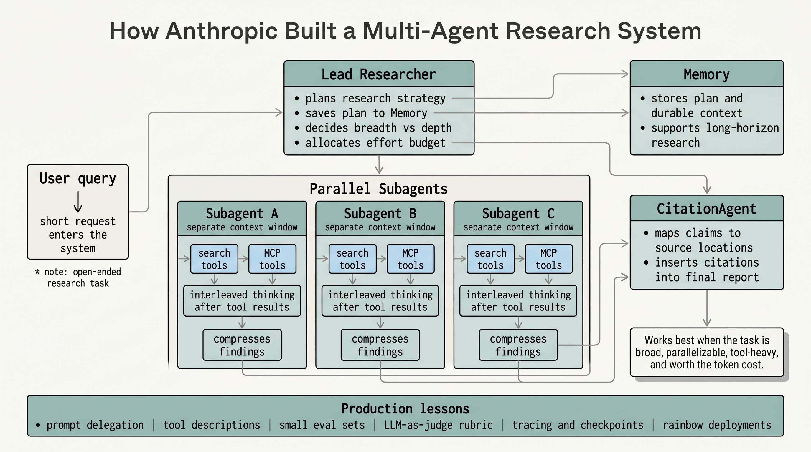
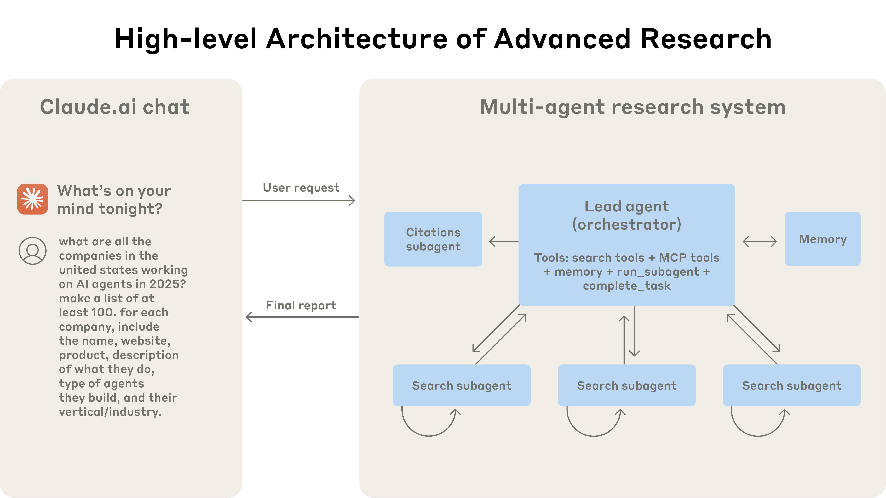
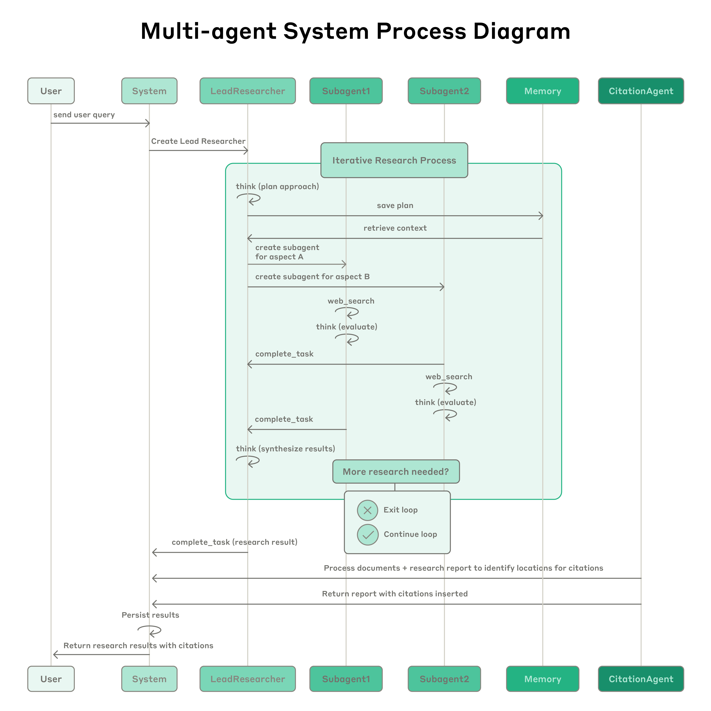
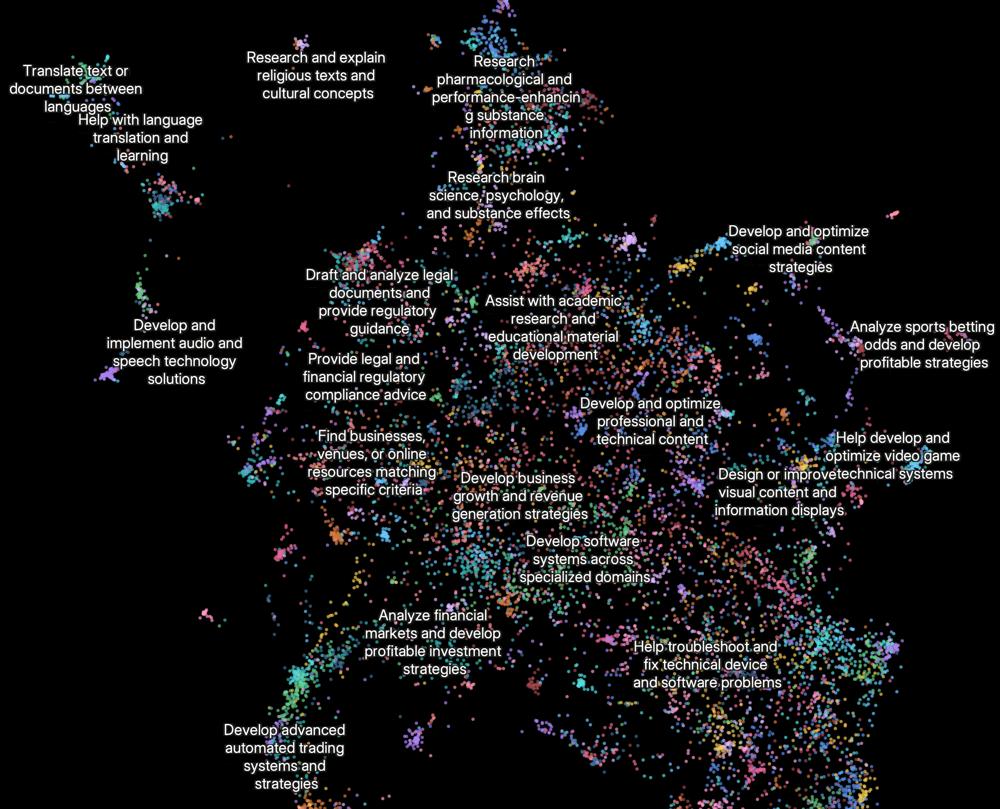

# AI Agent Engineering Series Extra: How Anthropic Built Its Multi-Agent Research System

This learning note studies Anthropic Engineering's "How we built our multi-agent research system." The article explains how Claude Research uses a lead agent, parallel subagents, memory, tools, evaluations, tracing, and production deployment practices to handle complex open-ended research tasks.

Source: Anthropic Engineering  
Original: How we built our multi-agent research system  
URL: https://www.anthropic.com/engineering/multi-agent-research-system  
Published: June 13, 2025  
Authors: Jeremy Hadfield, Barry Zhang, Kenneth Lien, Florian Scholz, Jeremy Fox, and Daniel Ford  
Topic: Building a production multi-agent research system for Claude Research

## What This Article Covers

Claude Research can search across the web, Google Workspace, and other integrations to complete complex tasks.

The system uses multiple Claude agents. A lead agent plans the research process from the user query, then creates parallel subagents that search different aspects of the problem at the same time.

The article is valuable because it does not only describe an architecture. It explains what Anthropic learned while moving the system from prototype to production: coordination, tool design, prompt engineering, evaluation, reliability, error recovery, observability, and deployment.

## Why Research Fits Multi-Agent Systems

Research tasks are open-ended. The required steps are hard to predict in advance.

A researcher usually starts with a broad direction, follows leads, updates the approach, and pivots as new information appears. A fixed one-shot pipeline is a poor fit for that kind of work.

Multi-agent systems help because subagents can explore different parts of a question in parallel. Each subagent has its own context window, prompt, tools, and search trajectory. It then compresses its findings for the lead agent.

Anthropic describes search as compression: the goal is not to put every document into context, but to distill useful signal from a large corpus.

Internal evaluations showed that a multi-agent research system with Claude Opus 4 as lead agent and Claude Sonnet 4 subagents outperformed single-agent Claude Opus 4 by 90.2% on Anthropic's internal research eval.

The system is especially strong on breadth-first queries where multiple independent directions must be pursued at once.

The cost is token usage. Anthropic reports that agents typically use about 4x more tokens than chat interactions, and multi-agent systems use about 15x more tokens than chats.

So the architecture makes sense only when the task value justifies the cost.

It is not a good fit for domains where all agents must share the same context, where there are many dependencies between agents, or where the work is not truly parallelizable. The article notes that most coding tasks currently have fewer truly parallelizable parts than research.

## Architecture Overview

Claude Research uses an orchestrator-worker pattern.

The lead agent is the orchestrator. It analyzes the user query, develops a research strategy, and creates specialized subagents.

Subagents are workers. They use search tools and MCP tools to investigate specific parts of the task, then return compressed findings to the lead agent.

The flow is:

1. User submits a research query.
2. The system creates a LeadResearcher.
3. The LeadResearcher thinks through the approach.
4. The plan is saved to Memory so it is not lost when context grows too large.
5. The LeadResearcher creates specialized subagents.
6. Subagents search, evaluate tool results, identify gaps, and refine searches.
7. Subagents return findings.
8. The LeadResearcher synthesizes results and decides whether more research is needed.
9. If needed, more subagents are created or the strategy is refined.
10. When enough information has been gathered, the system passes the report to a CitationAgent.
11. The CitationAgent maps claims to source locations and inserts citations.
12. The final cited research result is returned to the user.

This differs from static RAG. Traditional RAG retrieves similar chunks and generates an answer. Claude Research performs dynamic multi-step search, adapts to findings, and decides whether to continue.

## Prompt Engineering Lessons

Multi-agent systems increase coordination complexity.

Early versions made errors such as spawning 50 subagents for simple questions, searching endlessly for nonexistent sources, or distracting each other with excessive updates.

Because each agent is steered by a prompt, prompt engineering became Anthropic's main lever.

### Think Like Your Agents

Anthropic built simulations using the same prompts and tools as production, then watched agents work step by step.

This revealed failure modes such as continuing after sufficient results, using overly verbose search queries, and selecting the wrong tools.

Effective prompt iteration requires an accurate mental model of agent behavior.

### Teach the Orchestrator to Delegate

The lead agent must give subagents detailed task descriptions.

Each subagent needs:

- objective
- output format
- guidance on tools and sources
- clear task boundaries

Short vague instructions led to duplicate work and gaps.

For example, a vague instruction like "research the semiconductor shortage" caused one subagent to investigate the 2021 automotive chip crisis while others duplicated work on 2025 supply chains.

### Scale Effort to Query Complexity

Agents struggle to choose the right amount of effort.

Anthropic added explicit effort rules:

- simple fact-finding: 1 agent and 3-10 tool calls
- direct comparisons: 2-4 subagents with 10-15 calls each
- complex research: more than 10 subagents with divided responsibilities

This prevents overinvestment in simple tasks and underinvestment in hard ones.

### Tool Design and Selection Matter

Agent-tool interfaces are as important as human-computer interfaces.

If the needed context is in Slack and the agent searches only the web, the task fails before it really starts.

MCP expands the tool surface, but it also makes tool descriptions more important. Bad tool descriptions can send agents down the wrong path.

Anthropic added heuristics such as checking available tools first, matching tools to user intent, using web search for broad external exploration, and preferring specialized tools over generic ones.

### Let Agents Improve Themselves

Claude 4 models can help improve prompts and tool descriptions.

Anthropic created a tool-testing agent. When given a flawed MCP tool, it tries the tool, observes failures, and rewrites the tool description. After dozens of tests, it found important nuances and bugs.

This process reduced future task completion time by 40% because later agents made fewer mistakes with the tool.

### Start Wide, Then Narrow

Good research starts broad and then narrows.

Agents often default to long specific queries that return few results. Anthropic prompted agents to begin with short broad searches, inspect the available information, and then narrow focus.

### Guide the Thinking Process

The lead agent uses extended thinking to plan approach, choose tools, estimate complexity, decide subagent count, and define roles.

Subagents use interleaved thinking after tool results to evaluate quality, identify gaps, and refine the next query.

### Parallel Tool Calling

Anthropic added two levels of parallelism:

1. The lead agent creates 3-5 subagents in parallel.
2. Subagents use 3 or more tools in parallel.

These changes cut research time by up to 90% on complex queries.

## Evaluation Lessons

Multi-agent evaluation is difficult because successful runs may follow different valid paths.

The right question is not whether the system followed a prescribed sequence. The right question is whether it achieved the desired outcome through a reasonable process.

Anthropic recommends starting evals immediately with small samples. Early agent changes often have large effects, so a small set of about 20 real queries can reveal whether a change helps.

For research outputs, Anthropic used LLM-as-judge evaluation with a rubric:

- factual accuracy
- citation accuracy
- completeness
- source quality
- tool efficiency

They found that a single LLM call with a single prompt, returning 0.0-1.0 scores and a pass/fail grade, was the most consistent and aligned well with human judgment.

Human evaluation still matters. Human testers found hallucinations, system failures, and source selection bias. One early issue was that agents preferred SEO-optimized content farms over authoritative but lower-ranked sources such as academic PDFs or personal blogs. Adding source-quality heuristics helped fix this.

## Production Reliability

Agents are stateful and errors compound.

An agent can run for a long time across many tool calls. A small failure can change the whole trajectory. Restarting from the beginning is expensive and frustrating, so Anthropic built systems that can resume from where the agent failed.

They combine AI adaptability with deterministic safeguards such as retry logic and regular checkpoints.

Debugging also requires new tools. Since agent behavior is dynamic and nondeterministic, users might report that an agent missed obvious information, but engineers need tracing to know whether the failure came from query choice, source choice, tool failure, or coordination.

Anthropic added production tracing and monitors high-level decision patterns and interaction structures while avoiding inspection of individual conversation content.

Deployment is also tricky because agents may be in the middle of a long-running process when code, prompts, or tools are updated. Anthropic uses rainbow deployments, gradually shifting traffic from old to new versions while both run.

The current system executes subagents synchronously. This is simpler, but it creates bottlenecks: the lead agent cannot steer subagents mid-run, subagents cannot coordinate, and one slow subagent can block the system.

Asynchronous execution could unlock more performance, but it makes result coordination, state consistency, and error propagation harder.

## Appendix Lessons

For agents that mutate persistent state, Anthropic recommends end-state evaluation. Instead of checking every step, evaluate whether the final state is correct, with checkpoints for important state changes.

For long-horizon conversations, agents need compression and memory. Completed phases should be summarized and stored externally before moving to the next phase. Fresh subagents can be spawned with clean contexts while continuity is preserved through handoffs.

For subagent outputs, writing artifacts directly to a filesystem can reduce the "game of telephone." Instead of routing all large outputs through the coordinator, subagents can store reports, code, structured data, or visualizations externally and return lightweight references.

## Review Points

1. Multi-agent research works best for broad, parallelizable, tool-heavy tasks.
2. It scales useful token usage by giving subagents separate context windows.
3. Lead-agent delegation must include objective, output format, tool guidance, and boundaries.
4. Evaluation should judge outcomes and reasonable process, not fixed paths.
5. Production systems need tracing, checkpoints, resumability, memory, and careful deployment.

## Original Acknowledgments

The article was written by Jeremy Hadfield, Barry Zhang, Kenneth Lien, Florian Scholz, Jeremy Fox, and Daniel Ford.
