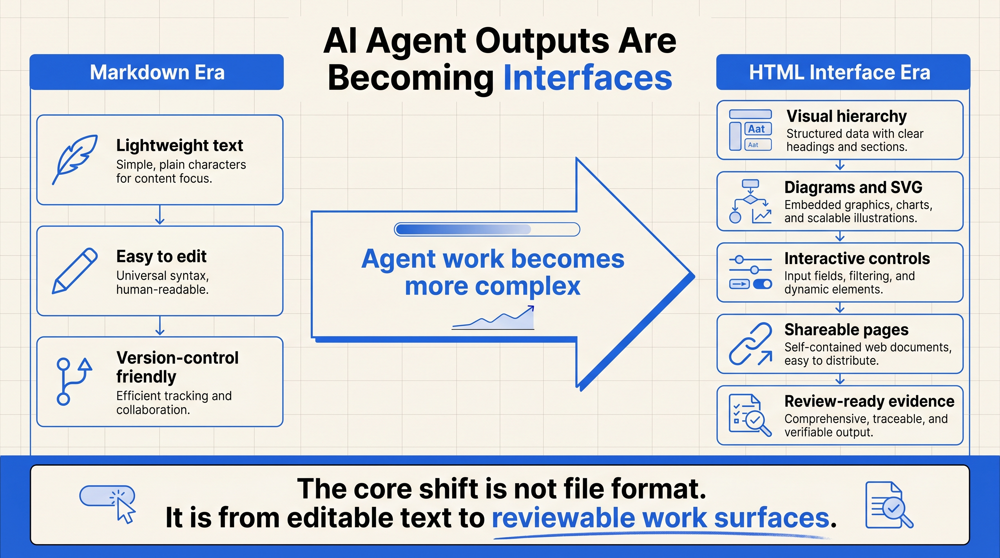
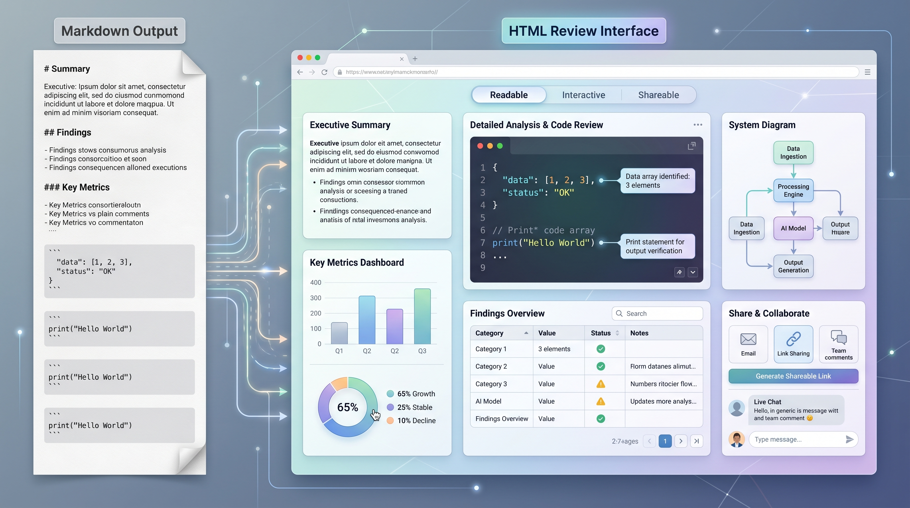
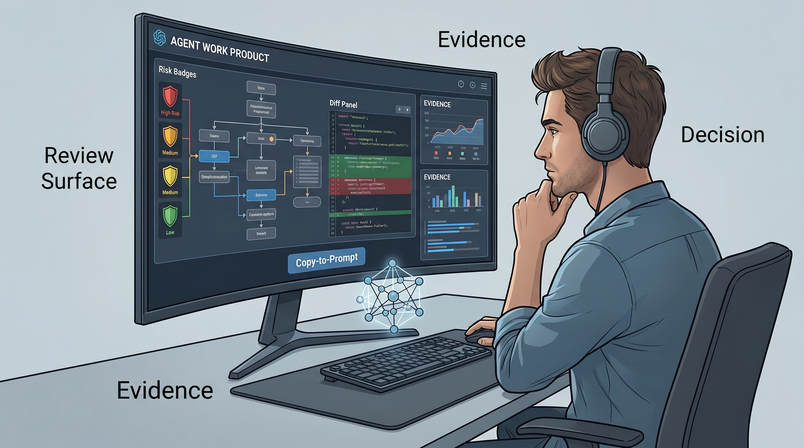

# AI Agent Outputs Are Becoming Interfaces

Thariq's essay on using HTML with Claude Code looks, at first glance, like a file-format preference: ask Claude Code for HTML instead of Markdown.

But the deeper shift is not HTML versus Markdown. It is that agent outputs are moving from editable text files to reviewable work surfaces.

Markdown made sense when agents mostly produced short plans, notes, and explanations. It is lightweight, portable, easy to edit, and friendly to version control. For early AI-assisted coding workflows, those were exactly the right properties.

The problem is that agents are no longer only writing short text. They now read repositories, inspect commit history, connect to MCP tools, browse the web, synthesize evidence, compare designs, and produce long implementation plans or technical reviews.

At that point, the bottleneck is not whether the model can produce the content. The bottleneck is whether a human can still read, review, and challenge it.

HTML is useful because it can become a temporary interface for understanding work. It can combine structure, diagrams, tables, annotated code snippets, SVG, navigation, collapsible sections, and small interactions. A security explanation can become a visual execution path. A code review can become a risk map. A design exploration can become a grid of alternatives.

This does not mean every agent output should become HTML. Markdown is still better for short notes, commands, configuration, and lightweight documentation. HTML becomes valuable when the task involves comparison, spatial reasoning, evidence review, or interaction.

The real product lesson is simple: as agents do more complex work, output format becomes part of the control surface. If humans cannot inspect the intermediate work, they will either ignore it or approve it on trust.

The future of agent workflows will not be only about better models. It will also be about better review surfaces: artifacts that make complex work readable, navigable, and discussable.

Source:

- Thariq: https://x.com/trq212/status/2052809885763747935
- Simon Willison: https://simonwillison.net/2026/May/8/unreasonable-effectiveness-of-html/#atom-everything
