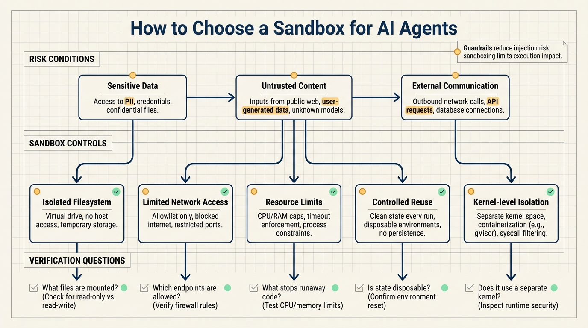
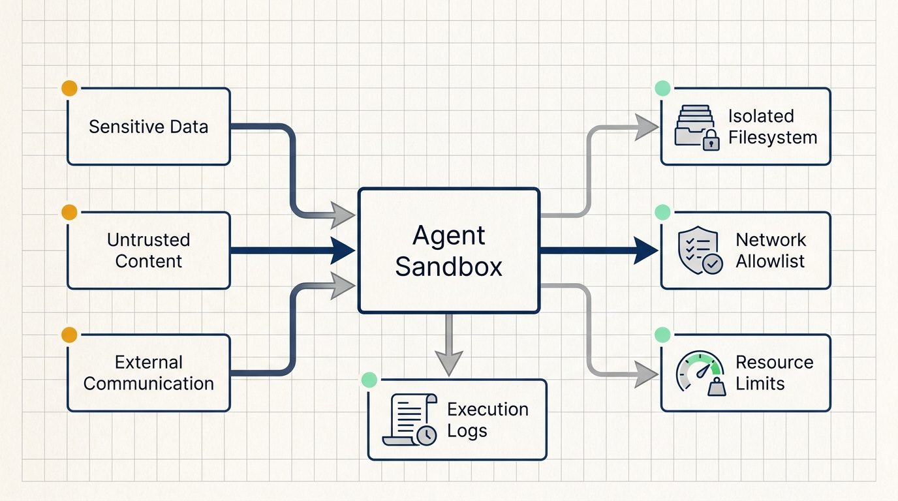
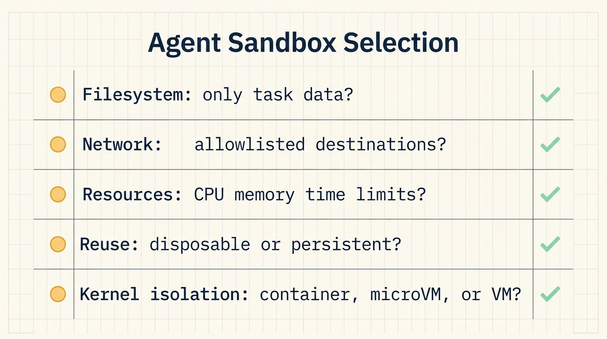

# AI agents need sandboxes before they run code

AI agents become much more useful when they can take action. One of the most valuable actions is code execution: writing a small script, running a data transformation, inspecting files, or creating an intermediate program that finishes a task the user did not want to do manually.

That same capability changes the security model.

Once agent-written code runs, it can touch files, network endpoints, credentials, temporary state, and compute resources. If untrusted content enters the agent context, a prompt injection can try to steer the agent into writing code that reads data or sends it somewhere it should not go.

LangChain's post "How to Choose the Right Sandbox for AI Agents" is useful because it treats sandboxing as part of the agent execution system, not as a deployment detail. The operating model is simple: define where agent-written code runs, what it can access, where it can communicate, and where failure stops.

## Start with the agent lethal trifecta

The article uses Simon Willison's "lethal trifecta" framing. An agent becomes dangerous when three conditions are true at the same time:

1. It has access to sensitive data.
2. It is exposed to untrusted content.
3. It can communicate externally.

Real agents often satisfy all three.

A data analysis agent may need internal reports. It may also read user-uploaded CSV files, external documents, or third-party content. It may need network access to call an API, download an allowed dependency, or publish a result.

Prompt injection detection and LLM guardrails help, but they solve a different part of the problem. Input screening, output validation, PII detection, and policy checks reduce the probability that an attack reaches or leaves the model. They do not replace authentication, authorization, least privilege, and execution isolation.

Sandboxing limits what happens after something goes wrong.

Meta's "Rule of Two" is a useful operating principle: if all three parts of the lethal trifecta apply, the agent should not run fully autonomously. In practice, teams often cannot remove all of those capabilities. Agents need data, context, and tools. The practical answer is to put those capabilities inside a constrained execution environment.

## A useful sandbox has five controls

LangChain lists five capabilities a secure agent sandbox should provide:

- Isolated filesystem
- Limited network access
- Resource limits
- Controlled reusability
- Kernel-level isolation from the host machine

These are not marketing labels. They are the checklist.

### Isolated filesystem

The sandbox should contain only the data needed for the current task. If the agent needs to analyze one CSV file, mount that file and an output directory. If it needs to inspect a temporary repository, mount a copy of that repository. It should not see a user's home directory, production configuration, historical exports, unrelated projects, or secret files.

This reduces the amount of data that compromised code can read. It also makes auditing easier. The team can answer which files were available to a specific execution.

A separate folder is not enough. The process must be prevented from escaping into other paths.

### Limited network access

If agent-written code can freely access the internet, data exfiltration is straightforward: read data, create a request, send it to an attacker-controlled endpoint.

The sandbox should allow teams to specify which external destinations are reachable. Some tasks need network access. That access should be written as an allowlist: internal APIs, trusted storage, approved package sources, or a model service. The default should be no arbitrary outbound communication.

### Resource limits

Agent-written code can contain bugs. It can also be induced to consume too much CPU, memory, disk, or time. The sandbox should enforce limits on all of them.

A first version can start with four numbers:

- Maximum runtime
- Maximum memory
- Maximum disk writes
- Shutdown behavior when the execution exceeds limits

The limits must be enforced, not just documented. A compromised or broken agent should not degrade the host or other workloads.

### Controlled reusability

Reusing sandboxes can be convenient. Dependencies, caches, intermediate files, and agent state may carry over between runs.

That convenience has a cost. A compromised execution can leave files, altered dependencies, or polluted state behind. A later task may inherit that state.

Teams should separate disposable and reusable sandboxes. Disposable sandboxes are a better fit for user uploads, external documents, untrusted web content, and one-off scripts. Reusable sandboxes can work for trusted internal evaluation workflows, but they need logs, cleanup rules, and a path to rebuild from a clean state.

### Kernel-level isolation

Filesystem, network, and resource controls depend on the underlying system enforcing them. If a process can exploit the host kernel, those controls may fail.

That is why LangChain emphasizes kernel-level isolation from the host machine. The solution is virtualization: the sandbox runs with its own kernel, separate from the kernel running the host.

This also explains why "container" and "secure sandbox" are not the same thing. Containers provide useful process, filesystem, and network isolation, but many container deployments share the host kernel. LangChain points out that the open-source Kubernetes Agent Sandbox is secure only if the cluster provides kernel-level isolation between containers, which most Kubernetes clusters do not enforce by default.

For untrusted agent-written code, a microVM-based approach is often closer to the requirement. It provides separate-kernel isolation without the cost of a full virtual machine per task.

## Evaluate a sandbox with six checks

When a vendor or internal platform says it has a sandbox, evaluate it with six concrete checks.

First, filesystem isolation:

- Each execution gets an independent filesystem.
- Only task inputs and output directories are mounted by default.
- Temporary files are cleaned up after execution.
- Logs record file reads and writes.

Second, network access control:

- Outbound traffic is restricted by destination.
- Arbitrary internet access is disabled by default.
- Denied outbound attempts are logged.

Third, resource limits:

- CPU, memory, disk, and runtime limits are enforced.
- Executions stop when limits are exceeded.
- Failed and stopped executions keep enough logs for review.

Fourth, state handling:

- Untrusted tasks use disposable sandboxes by default.
- Reusable sandboxes declare which files, dependencies, and caches persist.
- The team can rebuild a clean environment from a known base image.

Fifth, isolation level:

- Untrusted code runs with a separate kernel when the risk model requires it.
- The platform identifies whether execution uses containers, microVMs, or full virtual machines.
- Kubernetes-based designs explicitly verify kernel-level isolation between workloads.

Sixth, credential handling:

- Secrets are not placed directly inside the sandbox environment.
- An authorization proxy can inject credentials after traffic leaves the sandbox.
- Agent-written code cannot read long-lived credentials directly.

These six checks turn "sandbox" from a feature checkbox into an engineering decision.

## LangSmith Sandboxes as a reference design

The article then introduces LangSmith Sandboxes. They are integrated with the LangSmith agent engineering platform, so teams using LangChain, LangGraph, or Deep Agents can test, deploy, monitor, and run sandboxed code in the same ecosystem.

The design details are the useful part:

- Each sandbox is backed by a dedicated microVM.
- Each sandbox has its own filesystem.
- Sandboxes have kernel-level isolation from each other and from the underlying infrastructure.
- Teams control the lifecycle: start, shutdown, destruction, and reuse.
- Teams decide what network access a process inside the sandbox gets.
- An authorization proxy injects credentials into outbound traffic after it leaves the sandbox.
- Management uses the same API and authentication as the rest of LangSmith.

The credential design is especially important. If secrets live inside the sandbox, untrusted code may be able to read them. If credentials are injected by a proxy after outbound traffic leaves the sandbox, the code can use approved access paths without directly holding the secret.

LangChain is clear that sandboxing does not eliminate the lethal trifecta. It shrinks sensitive-data exposure and limits external communication so prompt injection risk becomes smaller and more manageable.

## A minimal practice scenario

A good first exercise is a read-only data analysis agent.

Give the agent one sanitized CSV file. Ask it to write and run a Python script that creates a statistical summary. Put only the CSV and an output directory in the sandbox. Disable arbitrary network access. Set a two-minute runtime limit and a fixed memory limit. Destroy the sandbox after the task. Log the script, stdout, stderr, resource use, and output files.

Then verify the execution with five standards:

- The agent cannot read files outside the mounted task data.
- The script cannot reach the public internet.
- The execution stops on timeout.
- Outputs are written only to the intended directory.
- The next task starts from a clean environment.

The goal is not a powerful agent. The goal is to prove that execution control works before adding more tools.

## NSSA practice scenario

For an enterprise environment such as NSSA, a small operations workflow is enough to test the idea.

Let an agent analyze sanitized logs from a test server and generate troubleshooting suggestions. The sandbox receives only the log copy and a read-only diagnostic script template. Network access is limited to an internal documentation retrieval service. The agent can generate and run diagnostic scripts, but it cannot modify production configuration or connect to production hosts.

The verification is direct: inspect file access logs, confirm no unknown outbound requests, and confirm timeout and memory limits stop abnormal scripts.

That exercise maps directly to LangChain's five sandbox requirements: filesystem isolation, network control, resource limits, lifecycle control, and stronger isolation for untrusted execution.

## Source

- LangChain Blog: How to Choose the Right Sandbox for AI Agents
- URL: https://www.langchain.com/blog/how-to-choose-the-right-sandbox-for-your-agent
- Published: Fri, 12 Jun 2026 15:00:16 GMT
- Topics: prompt injection, lethal trifecta, Rule of Two, microVMs, LangSmith Sandboxes
