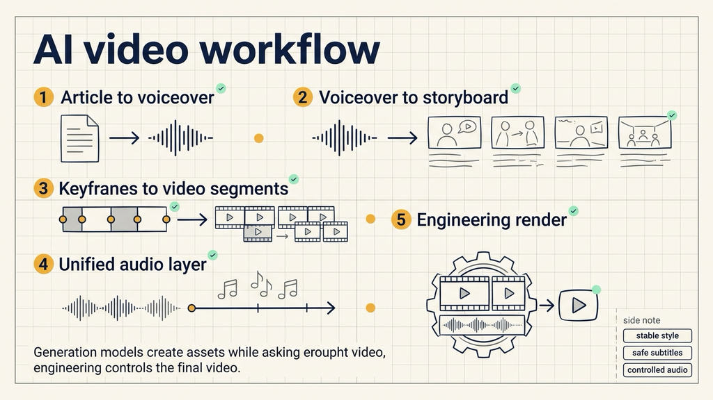
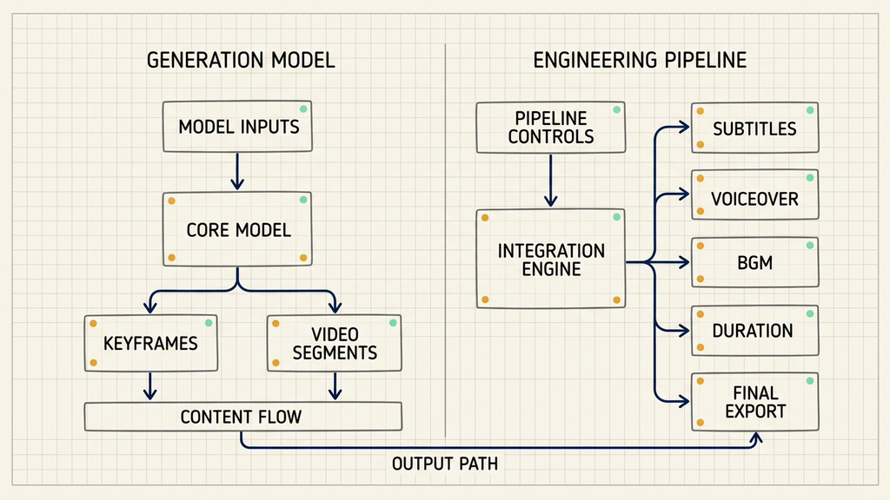
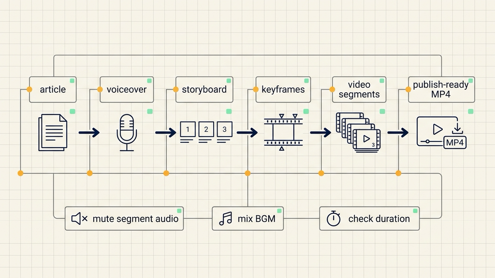

# 公众号文章转视频：我跑通了一套 AI 视频生产工作流

我最近把一篇 LangChain 文章，改成了一条 70 秒左右的竖屏视频。

这次不是把公众号配图裁成 9:16，也不是随便加一段音乐，让它看起来像视频。而是完整跑了一遍流程：文章先变成口播稿，口播再拆成分镜，分镜生成关键图，关键图变成短视频段，最后用工程工具统一处理字幕、音频、BGM 和导出。

最后验证下来，一个比较明确的结论是：

**AI 视频生产不能只靠生成模型，必须把“生成”和“工程控制”分开。**

## 一、真正难的不是生成视频

一开始，我以为目标很简单：把公众号文章做成 1 分钟左右的视频。

但真正做起来才发现，难点不是“能不能生成视频”，而是三个更底层的问题。

第一，视频要有固定的账号风格。

如果每篇文章都重新生成一套视觉，画风就会漂。观众看完一条视频，很难形成账号识别。所以这次先固定了一套视觉规范：米白背景、柔和科技感、青绿、柔蓝和暖黄作为识别色，不用黑底，不用真实人脸，也尽量避免生成不可读的伪文字。

第二，视频不能直接复用公众号图片。

公众号图片是阅读资产，适合停下来细看。视频号是时间线资产，画面要跟着口播流动。直接把文章插图裁成竖屏，只会变成“带字幕的图片幻灯片”。

第三，画面必须跟着口播走。

不是先有图，再往图上硬塞文案。正确顺序应该是：先写口播稿，再按口播切分段落，最后为每一段生成对应画面。

所以这次流程的核心不是“文章配图视频化”，而是：

**把文章重新翻译成视频语言。**

## 二、核心方法：模型负责素材，工程负责成片

这次踩过一个很重要的坑：不要让一个生成模型包办所有事情。

生成模型擅长从无到有，比如生成角色、场景、关键图、短视频段。但它不擅长稳定控制整条片子的工程细节，比如字幕安全区、音频轨、BGM 音量、段落时长、最终导出。

如果把这些都交给一个模型，就会出现很多不可控问题：

人物位置不稳定，字幕容易压到画面重点；每段视频自带的背景音不一致；口播和画面时长对不上；BGM 忽大忽小；画面虽然有动感，但整体剪辑不可控。

所以最后采用的是分层流程：

Dreamina 生成关键图，Seedance 2.0 mini 把关键图变成短视频段，MiniMax 生成统一口播，本地 BGM 目录提供背景音乐，HyperFrames 负责拼接、字幕、音频和最终渲染。

一句话概括就是：

**模型负责生成素材，工程流程负责控制成片。**

## 三、第一步：先把文章切成口播稿

视频不是从图片开始的，而是从口播开始的。

这次测试用的是一篇关于 LangChain 的文章，主题是 `Context Management for Deep Agents`。我先把它拆成 7 个小节，每节大约 9 到 11 秒，总时长控制在 70 秒左右。

每一节只讲一个意思：

长任务 Agent 的记忆会变乱；工具结果和中间推理会挤满上下文窗口；活跃上下文和文件系统要分开；长工具输出应该变成文件指针；摘要只是任务路标，不能替代原文；需要细节时再从文件系统找回；长任务记忆来自上下文、文件系统和评测一起工作。

这一步看起来像写稿，其实更像分镜。

口播稿没切好，后面画面再好也没用。因为视频会不知道每一段到底在表达什么。

## 四、第二步：按口播生成统一风格的关键图

口播切完后，每一节生成一张 9:16 关键图。

这里用的是 Dreamina，但不是随便生成。每张图都继承同一套账号级视觉规范：米白背景、柔和科技感、底部预留字幕区域，不使用真实人脸，不生成大段可读文字。

同时，我预设了一些可以反复使用的视觉元素：

上下文信息带、文件系统卡片、工具结果块、摘要芯片、找回光标、评测清单。

这些元素的作用，是让每条视频都有统一的视觉语言。观众不一定能说清楚它们是什么，但会逐渐形成感知：这是同一类内容，同一个账号。

人物也没有每一节都出现。之前测试里，人物出镜太多会抢内容。所以这版只在开头和结尾出现，用来做栏目识别。

## 五、第三步：图生视频，但只保留画面

关键图本身还是静态的。

如果只是把图片放进剪辑工具里，再让字幕淡入淡出，视频还是会像幻灯片。所以这一步用 Seedance 2.0 mini，把每张关键图生成 9 到 11 秒的视频段。

每一段都有明确的运动方向：

信息带轻微流动，工具结果块滑入，文件卡片分层展开，指针卡移动到模型旁边，摘要芯片亮起，光标扫过知识卡，评测清单逐项点亮。

这里的重点不是炫技，而是让画面的运动来自内容本身。

但还有一个很关键的小步骤：每段视频生成后，第一件事是去掉音频轨。

因为 Dreamina 或 Seedance 生成的视频段，可能会带背景音、环境音，甚至偶发人声。单独看问题不大，但多段拼在一起时，声音会变得很乱。

所以规则很简单：

**视频段只保留画面，声音全部交给后面的统一音频层。**

## 六、第四步：统一口播、BGM、字幕和导出

口播用 MiniMax TTS 生成。

这次用的是 `speech-2.8-hd`，音色选了 `male-qn-jingying`。为了让口播和 70 秒画面匹配，语速调到 0.78，人声音量设为 1.3。

这里的经验是，先不要追求“声音自然到极致”。更重要的是三个基础条件：声音稳定、时长可控、能压住 BGM。

BGM 也不交给生成模型。

项目里单独建了一个 `BGM/` 目录，以后只要把 MP3 放进去，流程就从这个目录里选。合成时有两个规则：视频多长，BGM 就截断或循环到多长；不修改原始 MP3 文件。

这次 BGM 音量固定为 0.1。这个值是反复试出来的，太高会压人声，太低又没有氛围。

最后由 HyperFrames 负责成片。

它会拼接 7 段 Seedance 视频，叠加标题、章节编号、中文字幕，加入统一口播和 BGM，最后输出 MP4。

这一步还必须跑检查：

`hyperframes lint`、`hyperframes validate`、`hyperframes inspect`、`hyperframes snapshot`，最后再用 `ffprobe` 看视频和音频信息。

这些检查能发现很多肉眼容易漏的问题，比如素材路径错了、字幕溢出、音频流缺失、视频时长不对。

## 七、这套流程真正解决了什么

这套流程不是最短的。

如果只是为了快速生成一条视频，当然可以更简单。但我真正想验证的不是“一次性做出一条视频”，而是能不能形成一条长期可复用的生产链路。

现在这条链路基本跑通了：

文章通过审核后，先写中文口播稿；按口播切分视频段落；按段落生成关键图；关键图转成短视频；去掉每段视频自带音频；用 MiniMax 生成统一口播；从本地目录选择 BGM；最后用 HyperFrames 做拼接、字幕、混音和导出。

它的价值在于，把不可控的生成任务限制在“图片”和“视频段”这两层，把最终质量交给工程流程控制。

这比“一键生成视频”麻烦，但更接近真正能长期运行的内容生产系统。

因为最后需要的，不是偶然做出一条好看的视频，而是每篇文章都能稳定产出一条风格一致、节奏可控、音频统一、可以发布的视频。

这才是公众号文章视频化真正要解决的问题。

后面我会继续拆这套流程，包括口播稿怎么切、关键图提示词怎么写、Seedance 视频段怎么控风格，以及 HyperFrames 怎么做最终合成。

如果你也在做 AI 内容生产工作流，可以关注「大尹隐于网」，我会继续记录这些真正跑通的工程化流程。
