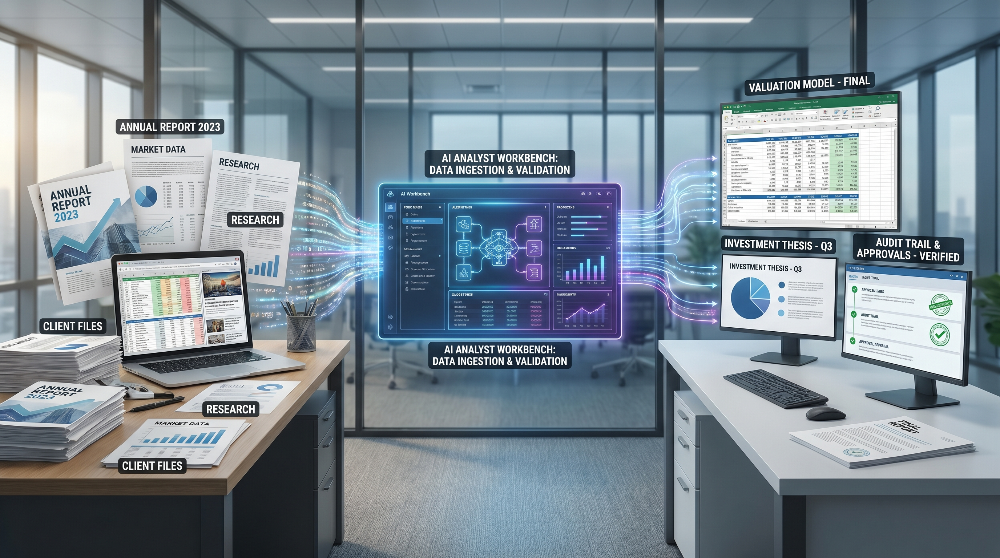
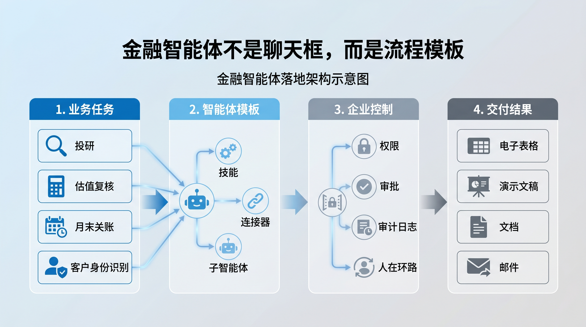
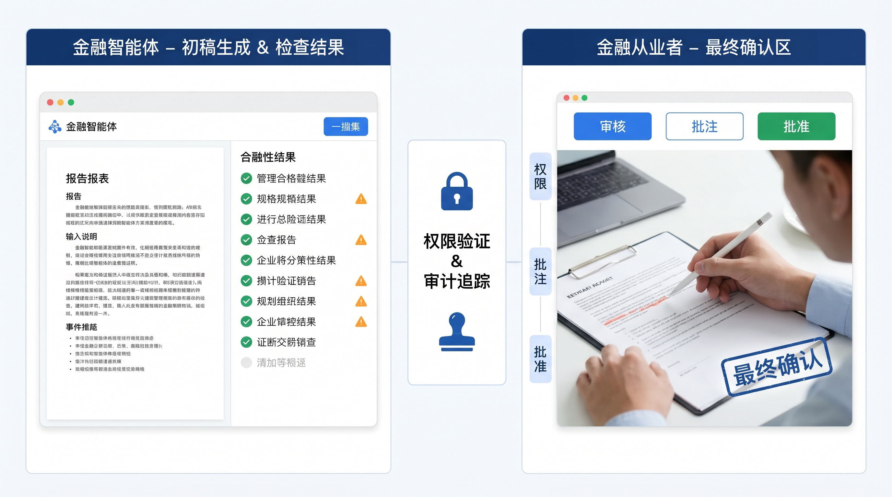

# Anthropic 把金融智能体（Agent）做成模板，企业 AI 落地正在换挡

Anthropic 这次发布的金融服务智能体（Agent），不应该只看成一次行业方案更新。

更准确的判断是：企业 AI 正在从“给员工一个更强的聊天助手”，转向“把高频流程拆成可复用、可审计、可接入系统的工作模板”。

这才是这次发布真正值得关注的地方。

## 金融行业为什么会先出现这种形态

金融服务业有一个天然特点：工作高度依赖资料、表格、模型、审批和留痕。

投行要做客户会议材料，研究员要读财报和电话会纪要，风控要做估值复核，运营团队要月末关账，合规团队要筛查客户身份识别（KYC）文件。

这些工作看起来分散，本质上却有共同结构：

第一，需要大量读取内部和外部数据。

第二，需要按照固定流程形成判断。

第三，需要输出到电子表格（Excel）、演示文稿（PowerPoint）、文档（Word）、邮件或内部系统。

第四，最终不能完全自动通过，必须有人审核、修改和批准。

所以金融行业并不只是“AI 有用”的行业，而是特别适合把 AI 做成流程型智能体（Agent）的行业。

Anthropic 这次发布的 10 个金融智能体（Agent）模板，正是围绕这些流程展开：Pitch builder、Meeting preparer、Earnings reviewer、Model builder、Market researcher、Valuation reviewer、General ledger reconciler、Month-end closer、Statement auditor、KYC screener。

这些名字本身已经说明问题：它们不是通用聊天能力，而是岗位任务能力。

## 真正的产品变化：不是模型更强，而是交付形态变了

过去企业采购 AI，常见路径是先买一个聊天入口，再让员工自己探索怎么用。

这种方式的问题是明显的：效果取决于个人能力，流程不可控，数据接入零散，也很难沉淀成组织能力。

Anthropic 现在给出的方向不同。

它把智能体（Agent）模板拆成三类组件：技能、连接器和子智能体（Agent）。

技能负责描述任务规则和领域知识；连接器负责接入受控数据；子智能体（Agent）负责处理比较、校验、方法复核等子任务。

这个组合的意义是，企业不必从零开始设计智能体（Agent），只需要在参考架构上替换自己的模板、风控要求、数据源和审批流程。

这比“让员工自己写提示词”更接近企业软件。

它也更接近金融机构真正能接受的 AI 形态：可配置、可控、可审计，而不是一个黑箱助手到处自由发挥。

## Microsoft 365 集成是另一个关键信号

这次 Anthropic 同时强调 Claude 可以进入电子表格（Excel）、演示文稿（PowerPoint）、文档（Word），邮箱（Outlook）也即将加入。

这件事很重要。

因为金融从业者的主要工作成果并不是聊天记录，而是模型、文档、演示稿和邮件。

如果 AI 只能停留在对话框里，它就只能给建议。只有进入电子表格（Excel）和演示文稿（PowerPoint），它才可能真正参与交付物生产。

更关键的是上下文贯通。

一名分析师在电子表格（Excel）里建模型，再转到演示文稿（PowerPoint）里做客户材料，如果每一步都要重新解释背景，效率会很快被消耗掉。

Anthropic 想表达的是：Claude 不只是一个入口，而是可以在多个办公工具之间延续上下文。

这会改变企业 AI 的评价标准。

以前看的是模型回答得好不好。以后更重要的是：它能不能沿着真实工作流，把结果交付到正确工具里。

## 连接器和模型上下文协议（MCP）才是壁垒

金融智能体（Agent）的难点从来不只是生成文字。

真正难的是数据。

市场数据、研究报告、财务报表、交易材料、客户关系系统、内部知识库，这些信息分散在不同供应商和内部系统里。

Anthropic 这次扩展的连接器，包括 Dun & Bradstreet、Fiscal AI、Financial Modeling Prep、Guidepoint、IBISWorld、SS&C IntraLinks、Third Bridge、Verisk，以及 Moody's 的模型上下文协议（MCP）应用。

这说明 Anthropic 正在补一块关键拼图：让 Claude 能在受控权限下访问金融专业数据，并把供应商工具直接嵌入工作流。

这里的判断很直接：模型厂商正在从“模型能力竞争”进入“数据和流程生态竞争”。

谁能接入更多高质量专业数据，谁能把工具调用、权限、审计和交付打通，谁就更接近企业核心流程。

## 这件事对企业的启发

如果只把这次发布看作“金融行业多了几个智能体（Agent）”，价值会被低估。

它真正给企业的启发是：不要先问“我们能不能用 AI”，而要先找出哪些工作天然适合被智能体化。

适合的流程通常有几个特征：

输入资料多，规则相对稳定，输出格式明确，需要人工审核，且重复频率高。

金融里的投研、风控、关账、合规就是这种流程。

换到其他行业，也可以是采购评审、合同审查、故障复盘、需求转译、项目材料编制、资源核查。

关键不是让 AI 替代某个人，而是把一类重复工作变成可执行、可追踪、可复用的流程模板。

## 最大风险也在这里

不过，这类智能体（Agent）越接近核心流程，风险也越不能轻描淡写。

金融工作不是普通文本生产。模型错一次，可能影响估值、合规、客户承诺或内部控制。

所以 Anthropic 在文章里反复强调人在环路中：用户需要审核、修改和批准 Claude 的输出，才能用于客户、归档或实际行动。

这不是保守措辞，而是金融智能体（Agent）能否落地的前提。

企业真正要建设的不是“自动化一切”，而是“让 AI 先完成高成本草稿和检查，再让人做关键判断和最终确认”。

这条边界如果守不住，智能体（Agent）会从效率工具变成风险源。

## 结论

Anthropic 这次发布的重点，不是金融行业终于有了几个现成智能体（Agent）。

重点是企业 AI 的产品形态正在变清楚：模型只是底座，真正的产品是模板、连接器、权限、审计、办公工具集成和人工确认流程。

这意味着企业 AI 落地会越来越不像“聊天机器人部署”，而越来越像“把关键业务流程重新包装成可执行工作台”。

金融行业只是先走一步。

接下来，所有流程密集、文档密集、审批密集的行业都会面对同一个问题：哪些工作还只是人在重复操作，哪些工作已经可以被改造成可控的智能体（Agent）流程。

谁先把这个问题想清楚，谁就不是在试用 AI，而是在重构工作方式。
