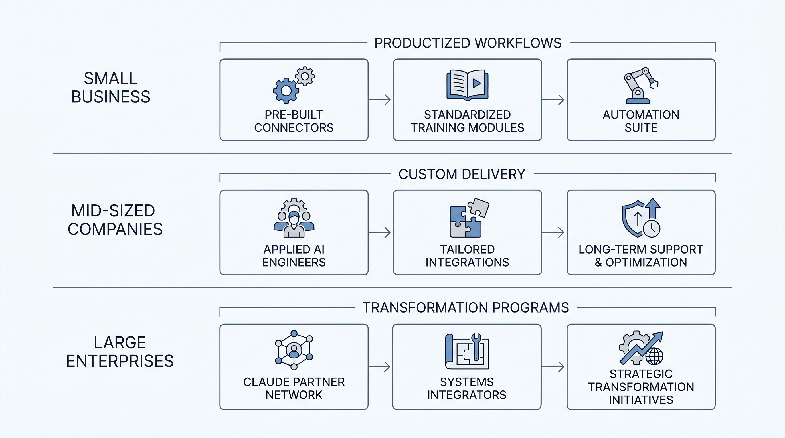
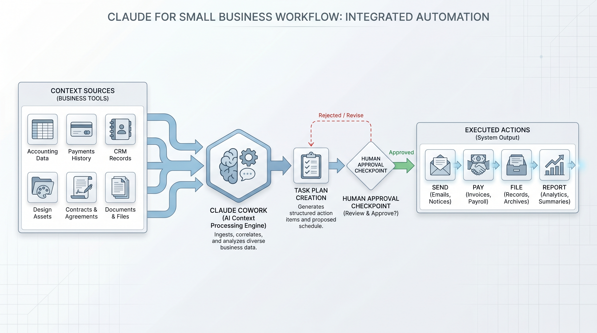
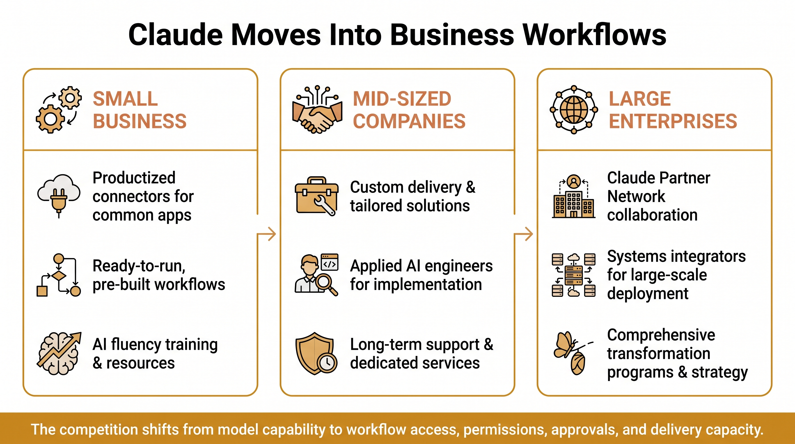

# Anthropic Is Building A Tiered Delivery System For Claude

Anthropic's Claude for Small Business looks like a product launch. Read alongside Anthropic's May 4 announcement of a new enterprise AI services company with Blackstone, Hellman & Friedman, and Goldman Sachs, it points to a broader strategy.

Anthropic is trying to move Claude from the chat window into business workflows, with different delivery models for different company sizes.

For small businesses, the answer is productized workflow access. Claude for Small Business connects to tools that owners already use, including QuickBooks, PayPal, HubSpot, Canva, Docusign, Google Workspace, and Microsoft 365. It ships with ready-to-run agentic workflows for payroll planning, monthly close, campaign planning, invoice chasing, contract review, lead triage, and other routine business tasks.

For mid-sized companies, Anthropic is taking a heavier route. The new AI services company will work with businesses such as community banks, mid-sized manufacturers, and regional health systems. Anthropic Applied AI engineers will work with the firm's engineering team to identify where Claude can matter, build custom systems, and support customers over time.

For large enterprises, Anthropic continues to rely on the Claude Partner Network, including systems integrators such as Accenture, Deloitte, and PwC.

The pattern is clear: small businesses need productized workflows, mid-sized companies need custom delivery, and large enterprises need transformation partners.

This changes what matters in enterprise AI competition. Model capability still matters, but it is not enough. The harder question is who can enter the workflow, respect permissions, preserve human approvals, connect to existing systems, and provide enough delivery capacity to make AI useful in daily operations.

Claude for Small Business is not an autonomous company operator. It is closer to a workflow assistant that can use existing business context, draft or execute routine tasks, and keep humans in the loop for sensitive actions such as sending, posting, paying, or filing.

That makes the real question practical: which parts of a company already have repeatable inputs, clear approval paths, and data inside existing software? Those are the places where AI can move beyond chat and become part of the operating system of work.

