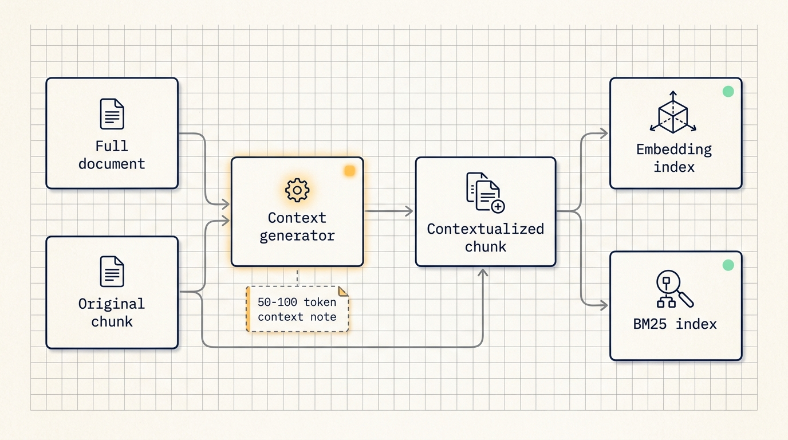
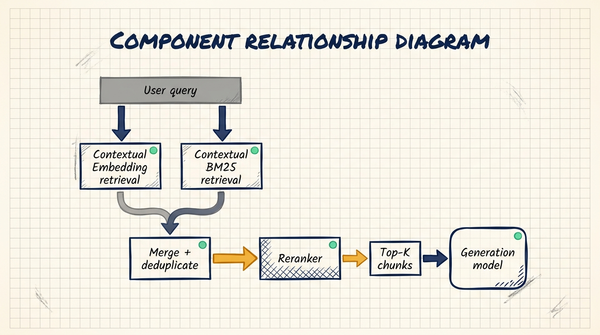
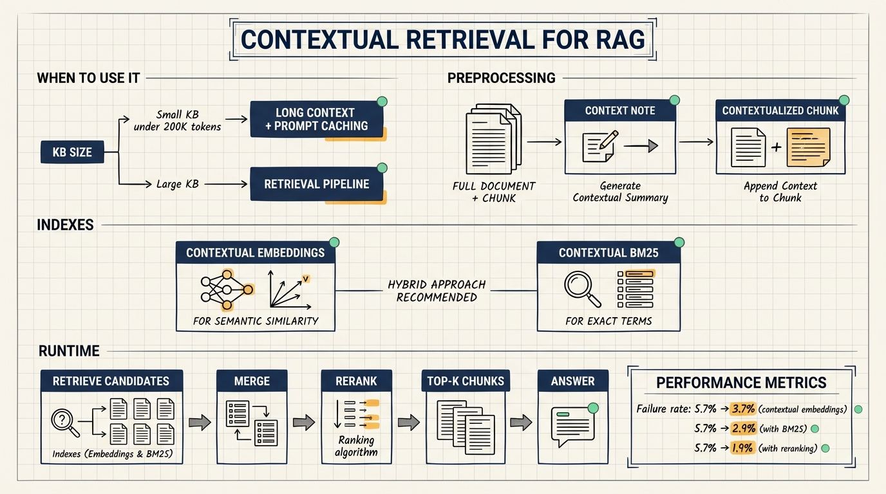

# Anthropic's Contextual Retrieval: Giving Every Chunk Its Context Back

Many RAG systems fail before the generation model starts writing. The system retrieves the wrong chunks, or it retrieves chunks that look relevant but lack the surrounding information needed to answer the question. Anthropic's engineering article on Contextual Retrieval focuses on this earlier step: how knowledge chunks are prepared before they enter embedding and lexical search indexes.

The practical idea is simple. Before a chunk is embedded or indexed, generate a short context note for that chunk based on the full source document. Then prepend that note to the chunk and use the enriched text for both semantic retrieval and BM25 retrieval.

## Start with the simpler option for small knowledge bases

Anthropic first points out that not every knowledge base needs RAG. If the knowledge base is smaller than about 200,000 tokens, roughly 500 pages of material, the simpler path is to include the full knowledge base in the prompt. With prompt caching, repeated long prompts can be reused with lower latency and lower cost. Anthropic states that prompt caching can reduce latency by more than 2x and cost by up to 90%.

This matters for implementation planning. A small internal manual, a compact product FAQ, or a single project documentation set may be easier to test with long context first. RAG becomes more useful when the knowledge base grows beyond what is practical to pass into the model each time.

## Standard RAG loses context during chunking

A standard RAG pipeline usually works like this:

1. Split the corpus into chunks of a few hundred tokens.
2. Convert those chunks into vector embeddings.
3. Store them in a vector database.
4. At query time, retrieve chunks by semantic similarity.
5. Pass the retrieved chunks to the generation model.

This scales well, but chunking can remove important context. Anthropic uses a financial filing example. A chunk might say that a company's revenue grew by 3% over the previous quarter. By itself, that chunk does not say which company, which quarter, or which filing it came from. A user asking about ACME Corp's Q2 2023 revenue growth may miss the relevant chunk because the chunk no longer carries those details.

The failure happens during retrieval. Once the wrong material is retrieved, the generation model has limited room to recover.

## Embeddings and BM25 solve different retrieval problems

Semantic embeddings are good at meaning. They can connect a query about refunds to chunks about returns, cancellations, and customer support policies.

BM25 is useful for exact terms. It is better suited for error codes, API names, function names, contract IDs, product versions, and other identifiers where the exact string matters.

A stronger retrieval system often uses both:

1. BM25 for exact lexical matches.
2. Embeddings for semantic similarity.
3. Result merging and deduplication.
4. Reranking to choose the final chunks.

Contextual Retrieval improves the material that goes into both indexes.

## How Contextual Retrieval works

For each chunk, the system asks a model to read the full document and the target chunk, then produce a short context note. The note usually has 50-100 tokens and explains where the chunk sits inside the full document.

The note should capture information such as:

1. Source document.
2. Entity or object being discussed.
3. Time period, section, or topic.
4. Missing referents, metrics, or assumptions from nearby text.

The enriched chunk is then used in two places:

1. Contextual embeddings.
2. Contextual BM25.

In the financial filing example, the original chunk says revenue grew by 3%. The contextualized version also says it comes from ACME Corp's Q2 2023 SEC filing and includes the previous quarter's revenue figure. Now both semantic search and lexical search have more useful signals.

## Preprocessing cost versus runtime cost

The context note is generated during preprocessing. Anthropic estimates that, with 800-token chunks, 8,000-token documents, 50-token instructions, and 100-token context notes, the one-time cost is about $1.02 per million document tokens.

That is different from per-query runtime cost. If the knowledge base changes slowly and receives many queries, the preprocessing cost can be amortized. If the knowledge base changes frequently, update strategy and index rebuilding become part of the system design.

## Reported retrieval results

Anthropic reports results across codebases, fiction, ArXiv papers, and scientific papers. The metric is one minus recall@20, which measures the share of relevant documents that fail to appear in the top 20 retrieved chunks.

The article reports:

1. Contextual embeddings reduce top-20 retrieval failure rate from 5.7% to 3.7%, a 35% reduction.
2. Contextual embeddings plus contextual BM25 reduce it from 5.7% to 2.9%, a 49% reduction.
3. Adding reranking reduces it from 5.7% to 1.9%, a 67% reduction.

The pattern is useful: chunk context improves retrieval, lexical search complements semantic search, and reranking filters the candidate set further.

## Reranking at runtime

Reranking is a runtime step. The system first retrieves a larger set of candidate chunks, such as the top 150. A reranker then scores those chunks against the user's query and selects the final top-K chunks, such as the top 20, for generation.

This improves accuracy but adds latency and cost. It is most suitable for applications where wrong answers have meaningful cost, such as legal search, support knowledge bases, compliance workflows, and engineering documentation.

## Implementation checklist

1. Check chunking strategy. Prefer section, paragraph, table, and code-block aware splitting before falling back to token length.
2. Compare embedding models on your own data. Anthropic reports strong results with Gemini Text 004 and Voyage embeddings, but local evaluation matters.
3. Tune the context generator prompt. Product docs may need product line and version. Code docs may need module, class, and function purpose. Contract search may need party, clause type, and effective date.
4. Tune top-K and reranking. Higher K improves recall but increases context size, latency, and possible distraction.
5. Run evaluations. Track recall@20, answer accuracy, average latency, and query cost.

## NSSA practice scenario

For NSSA, a good first test would be incident response documentation. A runbook chunk might say: "restart the sync task and check queue backlog." Without context, that chunk lacks the system name, alert code, affected version, and rollback step.

The contextualizer can add system name, incident type, alert code, applicable version, and the section where the procedure appears. Then NSSA can compare ordinary RAG, contextual embeddings plus contextual BM25, and reranked retrieval using real alert questions.

The AI system should retrieve and draft recommendations. Production operations should still require human review, logging, and rollback procedures.

## Source

- Anthropic Engineering: Introducing Contextual Retrieval
- URL: https://www.anthropic.com/engineering/contextual-retrieval
- Published: September 19, 2024

## Review points

1. Use long context first when the knowledge base is small enough.
2. RAG retrieval often fails because chunks lose document context.
3. Contextual Retrieval prepends a short document-aware note to each chunk.
4. Embeddings and BM25 cover different retrieval needs.
5. Reranking can improve accuracy, but it must be evaluated against latency and cost.
