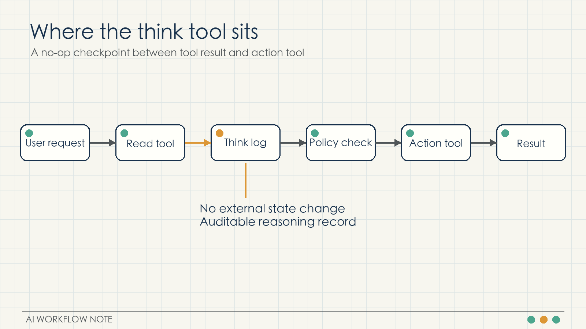
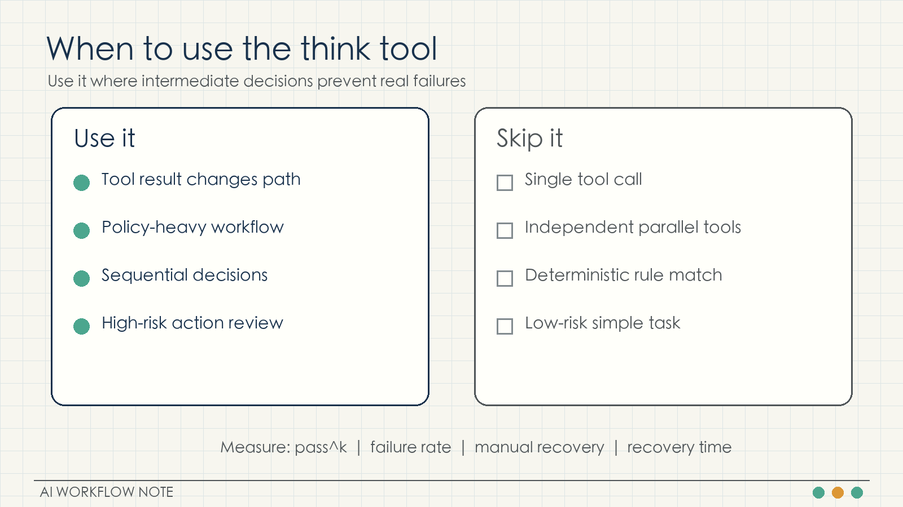
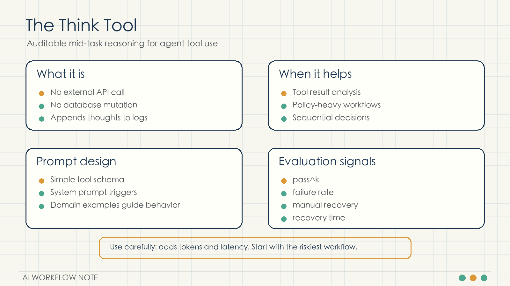

# Anthropic's Think Tool: An Auditable Checkpoint Between Agent Tool Calls

An agent that can call tools is not automatically reliable. The hard part often appears between two tool calls: the model receives a tool result, interprets it, applies policies, and decides whether to keep going, ask for more information, or stop.

Anthropic's engineering post on the "think" tool addresses that exact point. The think tool is a deliberately simple no-op tool. It does not fetch new data, mutate a database, or call an external service. It gives Claude a structured place to write down its intermediate reasoning during a tool-use workflow.

That small design choice matters because many agent failures are not caused by missing tools. They come from uninspected transitions: the model has the relevant data, but it fails to combine the latest tool result with the rules that should control the next action.

## What the think tool is

Anthropic's example tool definition is intentionally minimal:

```json
{
  "name": "think",
  "description": "Use the tool to think about something. It will not obtain new information or change the database, but just append the thought to the log. Use it when complex reasoning or some cache memory is needed.",
  "input_schema": {
    "type": "object",
    "properties": {
      "thought": {
        "type": "string",
        "description": "A thought to think about."
      }
    },
    "required": ["thought"]
  }
}
```

The important property is that the tool has no side effect. It only appends a thought to the log. In an engineering system, that log can be inspected later. Teams can review whether the model had enough information, whether it understood the tool result, and whether it checked the required policy before taking an action.

The think tool is therefore not a replacement for better models, better tools, or better prompts. It is a control point inside the execution path.



## How it differs from extended thinking

Anthropic separates the think tool from extended thinking.

Extended thinking happens before the model begins the response. It is useful when the task benefits from deeper upfront reasoning: coding, math, physics, long-document analysis, or complex planning.

The think tool happens during execution. The model has already started the workflow, received tool output, and now needs to reason over new information before choosing the next step.

A practical way to separate the two:

- Use extended thinking when the main difficulty is planning before action.
- Use the think tool when the path can change after a tool result.
- Use the think tool more carefully when the workflow is sequential, policy-heavy, or risky.

Anthropic's December 2025 update adds an important caveat: as extended thinking improves, it should be the default for many reasoning-heavy cases. The think tool remains useful for workflows where fresh tool results, policy checks, and sequential decisions need a visible intermediate record.

## What the evaluations show

Anthropic tested the think tool on tau-bench, a benchmark for customer-service-style tool interactions. The useful metric is pass^k, which measures consistency across repeated independent trials.

In the airline domain, the article summary reports that think plus a domain-optimized prompt reached 0.570 pass^1, compared with a 0.370 baseline, a 54% relative improvement. The chart on the same page shows the same comparison with a different display basis: 0.584 versus 0.332. The exact display differs, but the direction is consistent: in difficult policy domains, think plus domain-specific prompting helped the most.

The chart also shows:

- Think alone: 0.404
- Extended thinking: 0.412
- Baseline: 0.332
- Think plus prompt: 0.584

The lesson is not that the tool by itself solves the problem. The tool creates a place for intermediate reasoning. The domain prompt tells the model what to check there.

In the retail domain, think alone reached 0.812 versus a 0.783 baseline. Anthropic's explanation is that retail policies are simpler, so a generic thinking space already helps.

Anthropic also tested a version of the tool in SWE-Bench. In that setting, the tool description was adapted to code work: it records thoughts without modifying the repository. The model was encouraged to use it after identifying the bug source and before choosing a fix, and again after test failures. Anthropic reports an average improvement of about 1.6 percentage points with statistical significance.

That is not a dramatic capability leap. It is a useful reliability gain in a difficult, multi-step workflow.

## Put triggers in the system prompt

Anthropic recommends keeping the tool schema simple and placing detailed usage rules in the system prompt.

The tool definition should say what the tool does:

- It records a thought.
- It does not obtain new information.
- It does not change external state.

The system prompt should define when to use it:

- After receiving a tool result that changes the decision path.
- Before taking an action governed by policy.
- When required information may be missing.
- When the model must verify whether a tool result satisfies a rule.

This separation is easier to maintain. The interface stays stable. The strategy can change by domain. A team can run A/B tests on system prompt variants without changing the tool implementation.

## Give the thought a fixed shape

The think output should not become a free-form scratchpad. A useful structure is:

1. Current goal: what this step is trying to accomplish.
2. Evidence: what tool results are already available.
3. Missing information: which fields, rules, or confirmations are still needed.
4. Next action: continue querying, execute an action, ask the user, or stop.
5. Risk handling: how to stop, roll back, or hand off to a human if the next action fails.

This structure turns intermediate reasoning into an inspectable artifact. When an agent makes a mistake, the team can check whether it failed to call think, missed a policy inside the thought, or ignored its own intermediate conclusion.

## Start with the riskiest workflow

The think tool adds tokens and latency. It should be tested where the risk is real.

Good first candidates:

- Tool outputs that require interpretation: order states, test failures, monitoring metrics.
- Sequential actions: query order, check policy, execute refund.
- Policy-heavy decisions: refunds, flight changes, approvals, compliance checks.

After adding it, measure:

- pass^k or repeated-trial success rate
- failure rate
- manual recovery count
- average recovery time

Those metrics reveal whether think reduces error propagation. A single successful demo is not enough.



## Keep simple tasks simple

Anthropic also names the weak-fit cases:

- Single tool calls
- Independent parallel tool calls
- Simple instruction following

For these tasks, the model does not need to inspect a changing decision path between tool calls. Adding think may increase cost without improving correctness.

## A minimal support-agent exercise

Consider a support agent with three tools:

1. Look up the order.
2. Look up the refund policy.
3. Execute the refund.

Add a system rule:

After looking up the order and before executing a refund, call think to verify order status, shipped items, refund amount, and policy match. If any required field is missing, continue querying or ask the user before calling the refund tool.

The workflow becomes:

1. Look up order.
2. Think: check status, item state, amount fields.
3. Look up refund policy.
4. Think: check whether the policy matches this case.
5. Execute refund or request human confirmation.

The point is not the extra call. The point is that the decision made after receiving new information becomes visible in logs.

## NSSA exercise

For an NSSA-style operations environment, start with a small diagnostic case: a production server's CPU stays above 90%.

The first version should only produce diagnosis and recommendations. The agent can call monitoring APIs, inspect CPU curves, inspect process lists, and write a think log after each result. It should check whether the load is a spike or sustained trend, whether the current time is a business peak, whether upstream services are affected, and whether the high-CPU process is safe to restart.

Do not allow restart, scaling, or process-kill actions in the first version. Review the think logs manually. Only after the reasoning is stable should low-risk actions be opened gradually.



## Key takeaways

The think tool is a no-op tool that records intermediate reasoning.

Extended thinking is better for upfront planning. The think tool is better for mid-execution review after tool results.

In difficult policy domains, think works best with domain-specific prompts and examples.

The tool schema should stay simple. The system prompt should define triggers and checks.

Start with risky, sequential, policy-heavy workflows and measure reliability with repeated trials, failure rate, manual recovery, and recovery time.

Source: Anthropic Engineering, "The \"think\" tool: Enabling Claude to stop and think in complex tool use situations", March 20, 2025. Updated December 15, 2025.
https://www.anthropic.com/engineering/claude-think-tool
