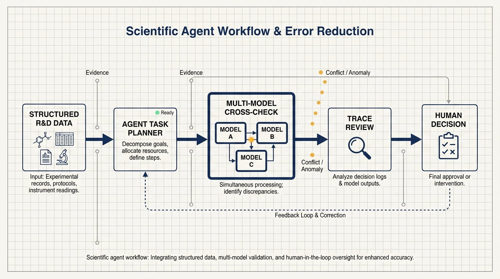
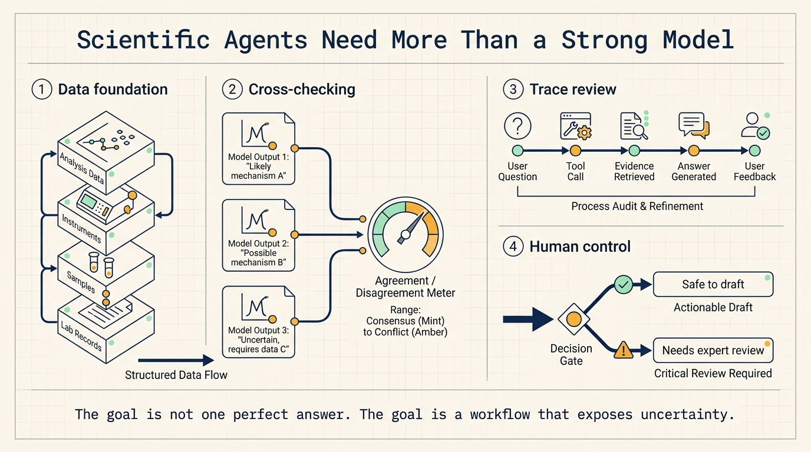
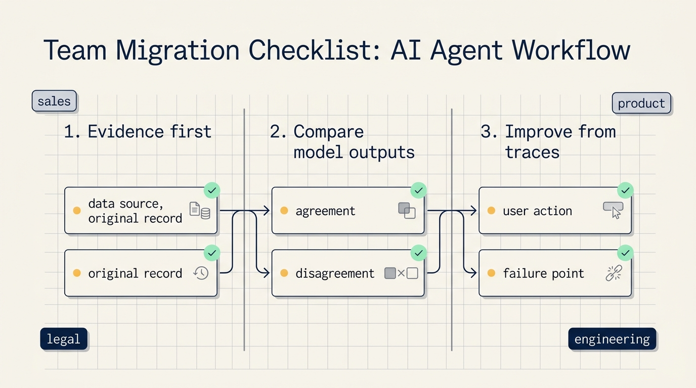

# Benchling Shows Why Scientific Agents Need Workflows, Not Just Stronger Models

Scientific agents are hard to build with a single stronger model.

Benchling's recent conversation with LangChain points to a more useful answer: production AI systems need to know when to trust a model, when to compare outputs, when to inspect traces, and when to hand the decision back to a person. Model quality matters, but the system around the model often decides whether the agent can be used in serious work.

Benchling is not a casual chatbot use case. It is a research and development data platform for life sciences companies. Scientists use it to manage experiments, samples, instruments, and analysis. In October 2025, Benchling launched Benchling AI, an intelligence layer with a chat interface backed by an agent that helps scientists find data, design experiments, and write reports.

That context matters. Scientific work is not forgiving. A fluent answer is useless if the agent misunderstood a sample, pulled the wrong experiment, missed a constraint, or turned a weak hypothesis into a confident recommendation. One bad answer can waste days of lab work.

The broader lesson applies outside biology. Many enterprise teams are asking the same question in different words: AI can search documents, draft summaries, and suggest next steps, but how do we know when it is wrong?

## Agents need data before they need autonomy

Benchling has been around since 2012. Its agent sits on top of years of structured R&D data. That gives it a different starting point from a generic assistant connected to a folder of documents.

Scientific questions usually refer to specific records: experiments, samples, instruments, analysis runs, protocols, and reports. The agent must understand where the data lives, what each field means, which records can be trusted, and which records should only be treated as clues.

That makes Benchling's path closer to adding intelligence to an existing system than launching a standalone agent. The chat interface is the front door. The real work happens in the data layer, query layer, task planner, evaluation loop, and review process.

For ordinary companies, the implication is direct. Before buying or building agents, teams should ask whether their business data can be retrieved in a stable way. If customer notes live in chat threads, contract versions live in someone's memory, and process states only exist in meeting notes, the agent will fill gaps by guessing. A polished answer will not make that safe.

## Disagreement between models can become a signal

Benchling does not simply run the same model several times. It runs tasks across different model providers because different model families make different mistakes.

When several models converge on the same answer, the team treats that as a stronger signal. When the outputs diverge, that disagreement often points to a problem in the input, data, or task definition.

This is a useful design pattern.

Many teams treat AI output as a single path: user asks, model answers, human reads. Benchling turns the answer into a set of comparable outputs. The differences between model outputs become diagnostic material.

That matters in science because one model may be better at summarizing records, another may be more cautious with uncertainty, and another may surface contradictions in the data. The team is not only reading answers. It is reading relationships between answers.

Other teams can copy the pattern. For customer complaint analysis, two models can classify the same batch of messages and a third can extract evidence. For contract review, one model can identify clauses, another can score risk, and another can point to the source text. The reviewer then focuses on agreement, disagreement, and evidence.

The goal is not to maximize model count. The goal is to make disagreement visible inside the workflow.

## Trace review turns AI usage into product evidence

Benchling also relies on trace review. In scientific work, offline evaluations only cover part of the problem. Benchling reviews production traces, assigns a rotating weekly owner to handle and flag issues, and brings those issues into its weekly technical operations meeting. Product managers and engineers also inspect traces for the features they own so they can see how users behave after release.

This solves a common production problem: real users ask questions in ways pre-release tests did not anticipate.

A scientist may ask a short question that points to a complex experiment history. Another user may paste a long prompt with internal shorthand, assumptions, and missing context. When the agent fails, the cause may not be the model alone. The system may have retrieved the wrong context, queried the wrong scope, missed a field, or failed to educate the user on what the tool can do.

Trace review shows where the failure happened.

Repeated questions may indicate that a product feature should become a fixed workflow. Repeated mistakes around a field may indicate that the data model or prompt needs work. Repeated negative feedback may indicate that the answer format, evidence citation, or human handoff needs to change.

Teams often watch two metrics after launching AI: usage and satisfaction. Usage proves that people tried the feature. Satisfaction tells you how they felt. Traces show the actual path: what the user asked, what the system called, what evidence it found, how the answer was produced, where the person intervened, and where the system failed.

For agents, logs are not only an operations artifact. They are product material.

## The same pattern works outside science

Benchling's domain is specialized, but the operating pattern applies to many teams.

First, knowledge-heavy retrieval. A scientist asking about an experiment is not that different from a salesperson asking about customer history, a lawyer asking about contract clauses, or a product manager asking about user feedback. The agent must find the relevant records, decide which information is reliable, and turn it into an action-ready answer.

The efficiency gain comes from less manual searching, less context switching, and fewer follow-up questions. The prerequisite is a reliable source of truth.

Second, report and memo generation. Benchling AI can help scientists write reports. Other teams use AI for weekly updates, customer summaries, postmortems, project briefs, and requirement documents. The hard part is not prose. The hard part is whether the report uses the right facts, names its assumptions, and avoids turning guesses into conclusions.

A practical pattern is to make the agent list evidence before drafting. Every important claim should point back to the original record. Reviewers inspect the evidence chain before they polish language.

Third, experiment and plan design. Benchling notes that agents can help scientists design experiments more rigorously and reduce the number of rounds needed to reach a conclusion. In business terms, the same idea applies to campaign planning, support process design, product discovery, and incident response.

Before launching a marketing campaign, an agent can list segments, message variants, measurement rules, and failure responses. Before changing a support workflow, an agent can simulate common exceptions from historical conversations. Before debugging an incident, an agent can rank possible causes using logs and recent changes.

The gain is not that the agent makes the final decision. The gain is that it exposes missing information earlier.

## Humans still own the high-cost judgment

Benchling's story also points to a limit: not every scientific task should be delegated to a model.

Some tasks are verifiable. Does a record exist? Does a field match? Did the answer cite the right experiment? Did the report include the right analysis? Other tasks are harder to verify. Is this research hypothesis sound? Is this experiment design robust enough? Does this explanation fit the biology?

Agents are better suited to the verifiable layer first: retrieve records, organize context, draft summaries, propose options, and flag conflicts. Humans should take over when the judgment is uncertain, expensive, or scientifically sensitive.

The same applies to other domains. AI can summarize customer feedback, but a product leader should own the roadmap tradeoff. AI can flag contract risk, but legal and business owners should approve commitments. AI can draft an experiment report, but scientists should decide what to do next.

Every production agent needs clear human decision points. If those points are vague, teams will start trusting fluent output because it feels complete.

## The real time saved is waiting time

Nicholas Larus-Stone says agents can compress scientific workflows and reduce the number of experiments needed to get an answer. When dead time between steps shrinks, a day saved can become a week saved.

That maps cleanly to business work.

Many workflows are slow because of waiting. Waiting for data. Waiting for someone to confirm context. Waiting for another team to search records. Waiting for meeting notes. Waiting for an issue to move to the right owner. An agent that prepares context, evidence, and candidate actions can reduce that empty time.

A sales manager should not wait for someone to dig through six months of CRM notes before a customer call. An agent can prepare the customer history, unresolved objections, and previous commitments. A product manager should not wait for operations to classify hundreds of feedback messages. An agent can cluster themes and point to original quotes. An engineering manager should not wait until an incident meeting to see the disputed causes. An agent can assemble logs, recent changes, and likely failure paths first.

The gain is not one minute of writing. The gain is one fewer stalled handoff.

## The larger lesson

Benchling's case does not make the agent look like an all-purpose scientist. It makes the agent look like a mirror for the team's operating habits.

If the data is messy, the agent will expose it. If processes are undocumented, the agent will guess. If failures are not traced, the team will not know what to improve. If product and engineering do not inspect traces together, the system will keep repeating the same mistakes.

The stronger the model, the more this matters. Weak models fail loudly. Strong models often fail fluently.

Agent adoption is moving from prompt craft toward workflow design. The useful question is no longer "Can the model answer?" It is "Can the system retrieve evidence, compare outputs, expose uncertainty, and hand the decision to the right person?"

For individuals, the same test is simple:

- Which facts in this task can be traced back to source material?
- Which judgments should I still own?
- If AI gives me two different answers, what evidence will decide between them?

If you can answer those questions, AI starts to behave like an assistant. If you cannot, it is just a very fluent search box.
