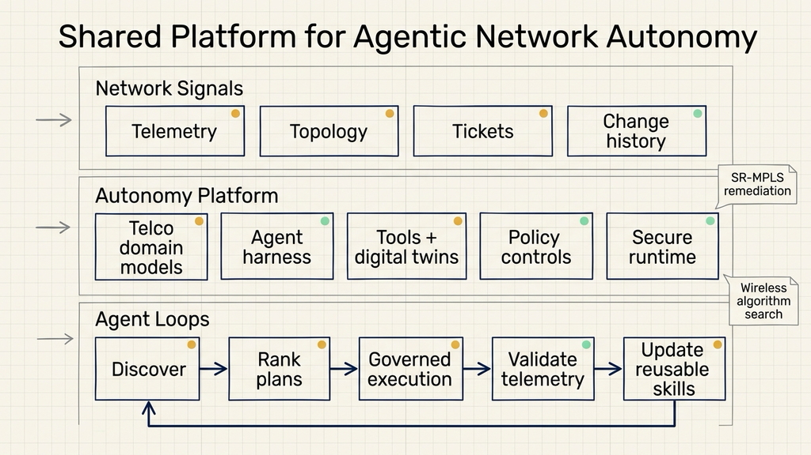
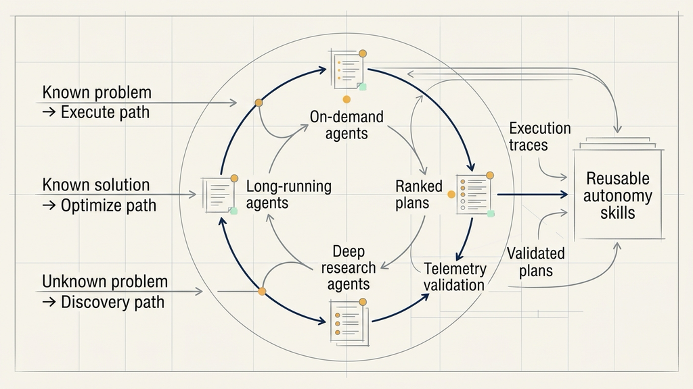
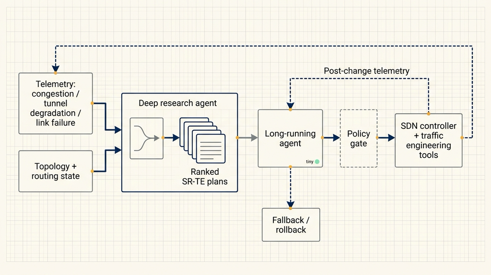

# Building Agentic AI Networks Starts with a Shared Platform

Source: NVIDIA Developer Blog  
Original: https://developer.nvidia.com/blog/how-telcos-build-autonomous-networks-with-agentic-ai/  
Published: June 22, 2026  
Topic: telecom network autonomy, agentic AI, digital twins, secure runtime, deep research agents

Telecom network automation becomes difficult when the problem crosses operational domains.

The alarm is in telemetry. The topology is in a controller. The change record is in tickets and scripts. Risk approval sits in a separate process. Teams can write many scripts, but scripts do not decide which remediation path is appropriate, when to roll back, or which action needs human approval.

NVIDIA's article makes a clear architectural point: moving from Level 2-3 automation to Level 4-5 autonomy requires a shared platform around the agents. That platform must provide telco-domain models, real-time network signals, tools, digital twins, policy controls, and a secure runtime. Only then can agents discover problems, research plans, execute governed actions, and validate the result inside the same operating model.

Agentic AI in this context is not a chat assistant for network operations. It is closer to a constrained operational control loop: it observes network state, calls tools and simulations, proposes multiple plans, acts under policy, and keeps adjusting or escalates to humans when the result does not meet target conditions.

## Network autonomy is a cross-domain closed loop

NVIDIA uses the TM Forum autonomous networks levels taxonomy as the backdrop. Many network automation programs still sit around Level 2-3. Systems can execute predefined procedures in selected network domains: run scripts, apply configuration changes, process tickets, or follow established runbooks.

Level 4-5 autonomy requires more. The system must understand operator intent, sense the network in real time, research possible plans, weigh performance and risk, and coordinate governed actions across domains.

Those domains include wireless, transport, core networks, OSS/BSS systems, telemetry, topology, controllers, digital twins, approvals, and rollback paths.

Single-point automation has three failure modes at that level.

First, scripts handle scenarios that are already written down. When a new pattern appears, the system lacks a mechanism for combining logs, topology, telemetry, and historical incidents into a diagnosis.

Second, a single tool does not watch long-running impact. After a network change, congestion, latency, and business impact may need to be observed over time. Execution and validation must live in the same loop.

Third, risk cannot be left to model judgment. Telecom networks have reliability and regulatory requirements. Agent access to filesystems, networks, tools, and inference endpoints must be governed by policy.

That is why the article frames network autonomy as a platform problem. Agents are researchers and executors inside the platform. The platform supplies data, models, tools, simulation, policy, and isolated execution.

## Three agent types match three network problem paths

The article divides telco agents into three useful categories.

On-demand agents handle bounded tasks: applying configuration changes, running NOC scripts, or answering customer-care questions. They are suitable for known workflows with clear inputs and outputs.

Long-running agents stay with a changing problem over time. They continuously sense the network, coordinate actions across systems, and decide when to escalate, roll back, or re-optimize. Network remediation often needs this class of agent because a change is not done until the post-change metrics confirm recovery.

Deep research agents explore unknown space. They collect evidence across data, tools, and digital twins, then propose and rank multiple plans. They answer questions like: what kind of problem is this, what remediation paths exist, and what is the risk of each path?

These agent types map to three problem paths.

The execute path covers encountered problems with known solutions. A ticket, anomaly, or fixed alert pattern maps to expert procedures, historical incidents, or runbooks. An on-demand agent can execute the known procedure, while a long-running agent can validate its effect over time.

The optimize path covers known domains where the desired outcome needs improvement. Energy efficiency, latency, resilience, and cost are measurable targets. Deep research agents generate ranked optimization plans; long-running agents apply the chosen plan under policy and keep watching the impact.

The discovery path covers unencountered problems. A deep research agent correlates cross-domain signals and turns an unfamiliar pattern into a defined problem. On-demand agents then take discrete actions, while long-running agents manage longer-horizon recovery and tuning.

The loop also creates reusable skills. Once an unfamiliar problem is researched, validated, and executed, its trace can become a new runbook or skill. The next time the same pattern appears, it can move from discovery into governed execution.

## The shared platform has four layers

The telco autonomy platform in NVIDIA's article can be understood as four layers: data and models, agent harnesses, tools and digital twins, and secure runtime.

The first layer is data and models. Telco agents need high-quality network and customer data to understand network state. NVIDIA mentions NeMo Data Designer and NeMo Safe Synthesizer for synthetic data generation and sensitive record anonymization. The goal is to expand production-like datasets while reducing privacy risk.

At the reasoning model layer, NVIDIA Nemotron can be fine-tuned on those datasets and grounded in telco ontologies and operational context. In practical terms, a telco ontology is structured knowledge about network objects, service relationships, fault categories, and policy rules. Agents need this knowledge to interpret telemetry, form hypotheses, and reason about whether a sequence of actions is safe.

Time-series signals are handled by models such as NVIDIA NV-Tesseract. It analyzes multivariate network telemetry for anomaly detection and behavior forecasting. For autonomous networks, it acts as the sensor layer: where congestion is appearing, which tunnels are degrading, and which metrics may worsen.

The second layer is the agent harness. The harness is the agent's control loop. It receives intent, maintains state and memory, decides when to retrieve more context, chooses which telco tool or digital twin to use, and hands work to deep research capabilities when needed. NVIDIA Agent Toolkit provides building blocks for connecting enterprise agents to shared tools, observability, and evaluation frameworks.

The third layer is tools and digital twins. Before an agent touches the network, it needs access to topology, routing state, SDN controllers, OSS/BSS systems, simulation environments, and historical records. Digital twins let a plan run inside a simulated network first, so teams can examine performance, risk, and rollback behavior before a production approval.

The fourth layer is secure runtime. NVIDIA OpenShell creates an isolated sandbox for each agent and uses corporate policies to control access to filesystems, networks, tools, and inference endpoints. NVIDIA NemoClaw manages agent deployment, lifecycle, and policy rollout. This layer answers operational questions: what can the agent do, what is prohibited, how are policies updated, and how is the agent contained when something goes wrong?

Together, these layers form a shared autonomy platform. Different agent workflows use the same models, tools, simulations, and policies. Each new use case adds skills, traces, and validation data to the platform instead of creating another isolated automation.

## SR-MPLS remediation separates research from execution

NVIDIA gives a concrete example: autonomous anomaly detection and remediation in carrier-grade SR-MPLS backbone networks. SR-MPLS is a segment routing approach used in carrier backbones. Problems may appear as congestion, tunnel degradation, or link failure.

In that workflow, a deep research agent pulls topology and routing state, analyzes performance metrics, and compares different SR-TE paths or routing policies. It outputs a ranked set of remediation plans, scored by performance, risk, and policy fit.

A long-running agent then handles execution. It selects a plan, orchestrates steps across SDN controllers and traffic-engineering tools, and keeps watching post-change telemetry. If the network does not recover to target conditions, it switches to a fallback plan or triggers rollback.

The useful engineering separation is clear: research and execution are distinct phases. The research phase can explore multiple paths. The execution phase must be constrained by policy, approval, telemetry validation, and rollback behavior. Both phases need logs and traces because successful traces become future reusable skills.

A smaller real-world trial could start in a non-core network domain. Feed historical alarms, topology, change records, and rollback rules into a test environment. Let the agent produce ranked plans and risk notes, but do not let it change production configuration. Validate the plan with simulation or replayed telemetry. At that stage, the test is about the platform and loop, not full network takeover.

## Agentic AI also enters network R&D

The article also discusses NVIDIA Research's AI Telco Engineer. It takes a wireless PHY- or MAC-layer problem and a scoring function, then uses agentic evolutionary search to discover new algorithms.

In each iteration, a meta agent proposes algorithm ideas. Parallel agents implement and evaluate those ideas. The evaluation can use NVIDIA Sionna, a GPU-accelerated wireless simulation library for 6G research. Stronger ideas are kept, combined, and further developed in later generations, while the system continues exploring new ideas.

NVIDIA reports early experimental results: AI Telco Engineer generated explainable PHY/MAC-layer algorithms that matched strong classical methods on channel estimation and delivered more than a 3% spectral-efficiency gain over the industry standard solution for link adaptation.

This example expands the scope of the autonomy platform. Operations use it for anomaly detection, remediation, rollback, and validation. R&D can use the same class of capabilities for algorithm search, simulation scoring, and explainable outputs. Both sides depend on high-quality data, simulation, traceability, and controlled execution.

## Which teams should pay attention

This architecture is most relevant for operators and large network teams with large-scale networks, many domains, and long remediation chains. Typical scenarios include backbone traffic engineering, wireless optimization, cross-domain alert correlation, application migration, customer-care automation, and long-horizon capacity tuning.

Teams can start with four checks.

First, can telemetry, topology, change records, and tickets be accessed together? Without usable context, the agent becomes a chat wrapper around existing scripts.

Second, is there a replayable or simulated environment? SR-MPLS remediation, wireless algorithm design, and capacity optimization all require evaluation in conditions that approximate reality.

Third, are policy and approval rules machine-readable? The agent needs to know which actions can run automatically, which actions require human confirmation, and which actions are prohibited.

Fourth, are outcome metrics observable? Autonomous networks need to measure whether post-change congestion, latency, failure rate, energy use, or spectral efficiency actually improved. Without metrics, agents can only produce plausible recommendations.

The low-return scenarios are also clear: small networks, simple incident workflows, severely fragmented data, no simulation environment, and manual-only change approvals. In those conditions, organizing telemetry, tickets, runbooks, and rollback procedures is the more practical first step.

## The main decision

Building agentic AI networks starts with putting models, data, tools, digital twins, policies, and secure runtime into one platform. The platform must first support observation, research, simulation, execution, and rollback. Only then can agents move from assistant scripts toward governed network autonomy.

If a network team is evaluating this direction, one practical question is enough to start: for the most common network fault today, do we have accessible telemetry, topology, historical remediation, simulation, approval policy, and rollback metrics? If the answer is unclear, agentic AI will stay in demo mode. If the answer is clear, the shared platform has its first verifiable path.
