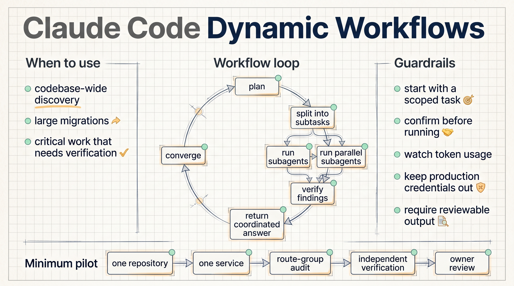
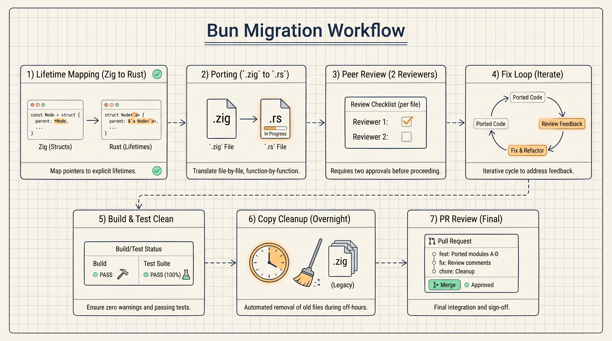

# Claude Code Dynamic Workflows: Start With Scoped, Verifiable Work

Claude Code dynamic workflows are best understood as a way to turn a large engineering task into a temporary team of coordinated agents.

The important shift is not simply that Claude can run more agents. The useful part is the structure: Claude plans from the prompt, splits the work into subtasks, fans those subtasks out across parallel subagents, checks results before merging them, and returns one coordinated answer.

This matters most when the task is too large for a single pass: codebase-wide bug hunts, profiler-guided optimization audits, security audits, large migrations, API deprecations, language ports, or critical changes that need independent review before implementation.

Anthropic says dynamic workflows are available in research preview in Claude Code CLI, Desktop, and the VS Code extension for Max, Team, and Enterprise plans, with Enterprise requiring admin enablement. They are also available through the Claude API, Amazon Bedrock, Vertex AI, and Microsoft Foundry.

The feature has two common entry points. You can ask Claude to create a workflow directly, or you can enable the Claude Code-specific `ultracode` setting from the effort menu. `ultracode` sets effort to `xhigh` and lets Claude decide when a workflow is needed.

The first practical lesson is to start small. Dynamic workflows can consume substantially more usage than a typical Claude Code session. A first pilot should be scoped to one repository, one service, or one migration theme, with an output that humans can review.

A good pilot prompt should define the task boundary, the split strategy, the verification rule, and the output format. For example, an internal service audit could ask Claude to split work by API route group, look for missing authorization checks and unsafe input handling, verify each candidate independently, and return only findings with reachable call paths.

The Bun migration example shows the shape of work dynamic workflows can support. Jarred Sumner used dynamic workflows to port Bun from Zig to Rust, reaching 99.8% of the existing test suite passing, roughly 750,000 lines of Rust, and about eleven days from first commit to merge. One workflow mapped Rust lifetimes for Zig struct fields. Another wrote behavior-identical `.rs` files from `.zig` files, with hundreds of agents working in parallel and two reviewers on each file. A fix loop then drove build and test until both ran clean.

That case is impressive, but the lesson is not to hand every large rewrite to agents immediately. The lesson is to structure work as mapping, transformation, review, build, test, fix loop, and final human review.

For an enterprise team such as NSSA, a practical first exercise could be a dead-code and authorization-check audit on one internal web service. The workflow should read code and docs, split by route group, generate candidate findings, run independent verification, and return a reviewable table. It should not touch production credentials, production networks, or protected branches.

The guardrails are straightforward:

1. Scope the task before starting.
2. Keep credentials and production systems out of reach.
3. Require evidence for each finding.
4. Ask for build, test, or reviewable output where possible.
5. Keep a human owner responsible for final merge decisions.

Dynamic workflows are useful when the work can be divided and checked. They are a poor fit when the task is vague, the verification target is missing, or the run would need unrestricted access to production systems.

Source: Anthropic, "Introducing dynamic workflows in Claude Code", May 28, 2026.
