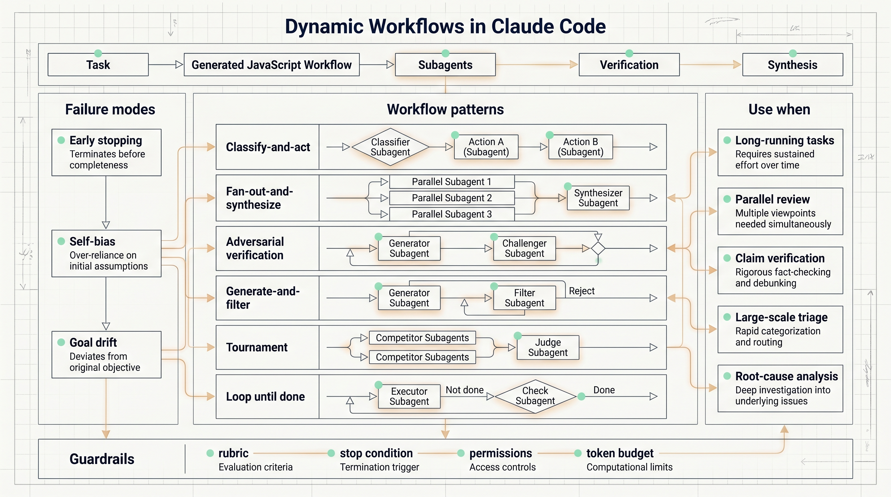
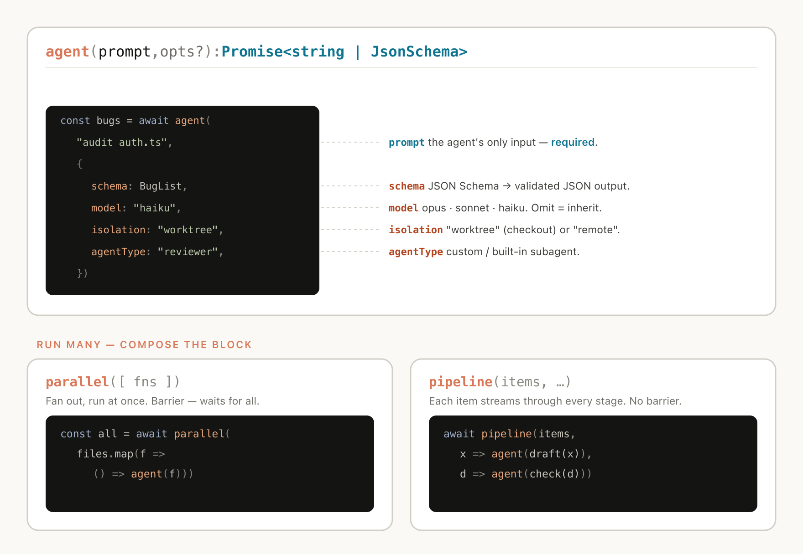
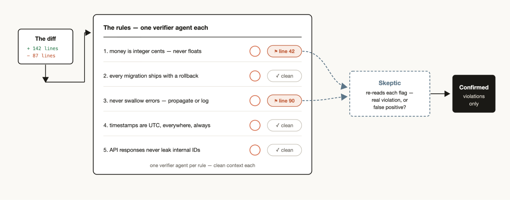
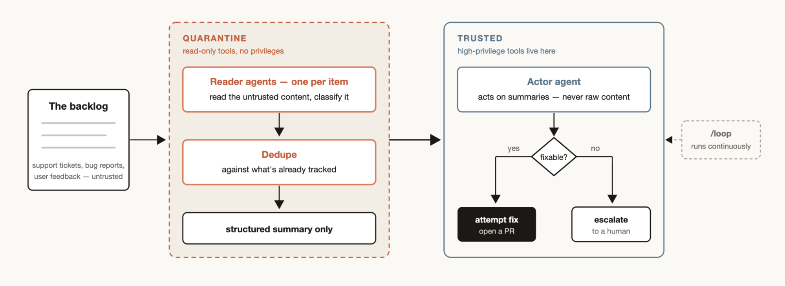
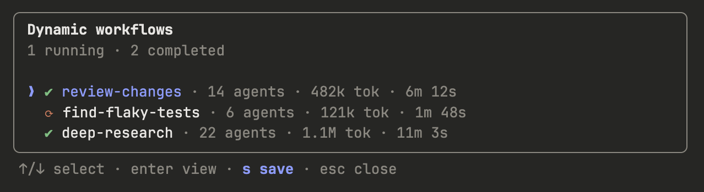
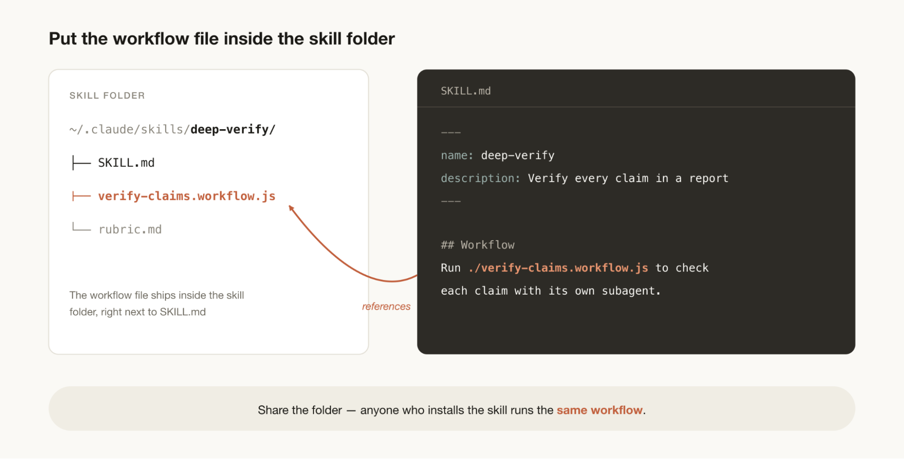

# Claude Code Dynamic Workflows: When an Agent Should Build Its Own Execution Harness

Claude Code now supports dynamic workflows: task-specific JavaScript workflows that can spawn and coordinate subagents, choose models, use isolated worktrees, verify outputs, and synthesize results.

The core idea is simple. The default Claude Code harness works well for normal coding tasks, where one context window can plan, edit, run commands, and iterate. Longer and higher-risk tasks behave differently. They need parallel work, independent verification, explicit stop conditions, and protection against goal drift.

Anthropic describes three failure modes that dynamic workflows try to reduce:

- Agentic laziness: the agent stops after partial progress and declares the job done.
- Self-preferential bias: the same agent that produced an answer also grades it too generously.
- Goal drift: long sessions and compaction gradually lose edge-case requirements and constraints.

Dynamic workflows address these by separating roles. One agent can generate hypotheses, another can verify claims, another can synthesize structured outputs. The workflow coordinates them and keeps the task state outside any single subagent context.

Useful workflow patterns include:

- Classify-and-act: route work based on task type.
- Fan-out-and-synthesize: split many small tasks, then merge results.
- Adversarial verification: assign a separate verifier to challenge each output.
- Generate-and-filter: create many candidates, dedupe, then filter by rubric.
- Tournament: let several agents solve the same task and compare results pairwise.
- Loop until done: keep launching work until a stop condition is met.

The strongest use cases are migrations, deep research, factual verification, qualitative sorting, rule adherence checks, root-cause analysis, large-scale triage, lightweight evals, and model routing.

The boundary matters. Dynamic workflows use more tokens and add execution overhead. For ordinary small coding tasks, the default Claude Code harness is usually enough. Use workflows when the task is long-running, parallel, adversarial, evidence-heavy, or hard to validate inside one context window.

Source: Anthropic Claude Blog, "A harness for every task: dynamic workflows in Claude Code", published June 2, 2026.

## Source Image Reuse

The following images are reused from the Anthropic source article, including mechanism diagrams, workflow diagrams, and page images.

