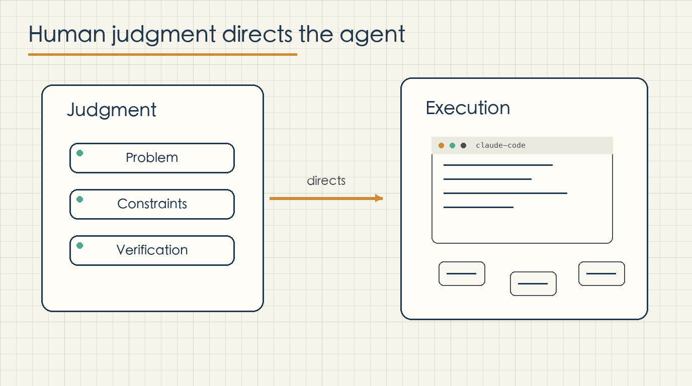
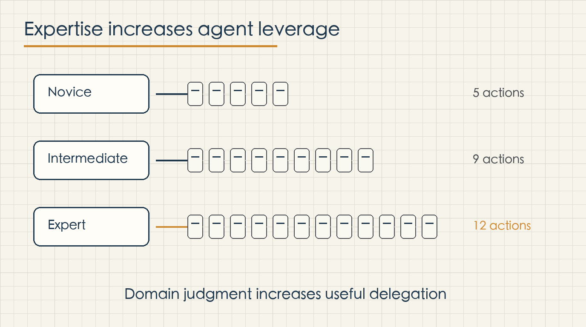
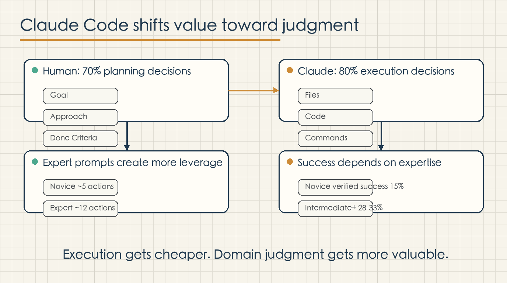

# Claude Code Makes Domain Judgment More Valuable

Claude Code is making domain judgment more valuable.

That is the core takeaway from Anthropic Research's report, "Agentic coding and persistent returns to expertise." The report analyzes roughly 400,000 Claude Code sessions from October 2025 to April 2026. It is not a demo story, and it is not a single benchmark result. It is a look at how people actually use Claude Code in interactive work: what they ask it to do, who makes which decisions, and which sessions end successfully.

The clearest pattern is that Claude Code reduces the cost of execution, but it does not remove the value of human judgment. It moves value earlier in the workflow. The person still needs to define the problem, describe the constraints, steer the approach, and verify the result. Claude can take on more implementation work, but the user still has to bring enough understanding for that work to be useful.

This distinction matters because much of the public conversation around AI coding tools is framed as a replacement question: will coding agents replace programmers, or will non-programmers become programmers? Anthropic's data suggests a more practical answer. Coding background matters less than it used to for some kinds of software work, but domain understanding still matters a lot. The important skill is not just writing code. It is turning a real problem into a task the agent can execute and checking whether the output actually solves the problem.

## The division of labor is already visible

Anthropic separates decisions in a Claude Code session into two categories. Planning decisions are about what to do: the goal, the approach, and what counts as finished. Execution decisions are about how to do it: which files to edit, what code to write, what commands to run, and how to operate the environment.

In a typical session, humans make about 70% of the planning decisions, while Claude makes about 80% of the execution decisions. That is the most important frame for understanding the report.

Claude Code is not simply adding a few lines of code to a complete human plan. In real sessions, the human often defines the direction, while Claude handles a large share of the implementation path. This means the user’s value moves toward judgment: problem framing, constraints, and verification.

Consider a finance worker who wants to automate month-end reconciliation. In the past, they might have needed to learn Python file handling, spreadsheet parsing, comparison logic, and command-line execution before building a useful script. With Claude Code, much of that execution can be delegated. But the worker still needs to know which accounts can be matched, which exceptions matter, which thresholds are acceptable, and which output can be trusted.

The same pattern applies to legal review, operations analysis, product workflows, and internal tooling. Claude Code lowers the barrier to implementation. Once that barrier falls, the quality of the user’s domain judgment becomes more visible.

When execution becomes cheaper, direction becomes more valuable.

## Experts get more useful work from the agent

Anthropic also studies how user expertise affects Claude's activity. Expertise here is task-specific. It is not the same as job title. A senior engineer asking a first Rust question may be a beginner for that task. An accountant who has never written Python but can precisely define reconciliation rules may be an expert for a finance automation task.

The report finds that novice sessions trigger about five Claude actions and roughly 600 words of output per user prompt. Expert sessions trigger about twelve actions and roughly 3,200 words of output per prompt.

This is not mainly about clever prompting. It is about information density. A novice prompt may say, "Help me write a script." An expert prompt can say, "Read these three tables, merge on this field, flag differences above this threshold, treat month-end carryover separately, and generate a business-readable summary."

Both requests ask Claude to write code. Only the second request gives the agent a usable model of the real problem. It contains inputs, rules, constraints, and a way to judge the output.

That is why domain experts gain leverage. They know where data comes from, why the workflow exists, how exceptions behave, and what result will actually be useful. Claude can supply much of the execution, but those judgments need to come from the user.

## Success depends more on understanding the task than on job title

One of the strongest findings in the report is the difference between occupation and expertise.

Among sessions that produce code changes, software-related users reach verified success in about 34% of sessions. Users from other occupations reach verified success in about 29%. Under a looser partial-success measure, the gap nearly disappears: 89% for software-related occupations and 88% for other occupations.

This does not mean software expertise is irrelevant. It means that Claude Code allows more people outside software occupations to complete coding tasks when they understand the problem well enough.

The larger gap appears in task expertise. Novice-rated sessions reach the strict verified-success threshold about 15% of the time. Intermediate and higher sessions reach roughly 28% to 33%. When a session runs into trouble, the gap becomes more visible. Novice sessions recover to verified success about 4% of the time, while expert sessions recover about 15% of the time.

This pattern is easy to recognize in real work. An AI-generated implementation can be wrong. The important question is whether the user can see what is wrong, explain the missing constraint, and steer the tool back toward a useful result. The code running is not enough. The result must match the business logic, the operational context, and the actual use case.

Claude Code makes hand-written implementation less scarce in some situations. It makes judgment easier to convert into working artifacts.

## Knowledge work is being reordered

Historically, many useful ideas were blocked by implementation capacity. People who could write code could turn ideas into tools. People who could not write code often had to write requirements, wait for engineering time, or settle for manual work. Domain knowledge stayed trapped in documents, spreadsheets, meetings, and personal habits.

Claude Code changes that conversion path.

If someone understands a domain well, they can now turn judgment into scripts, workflows, data analysis, internal tools, and automation more directly. Anthropic's data shows this shift in the composition of Claude Code work. The share of sessions spent fixing broken code fell from 33% to 19%. Operating software, analyzing data, and writing documents grew. The estimated value of the average task rose by about 27% over the seven-month period.

This suggests that Claude Code is moving beyond "help engineers edit code." It is becoming a way for more forms of knowledge work to become executable.

The value stack changes accordingly.

The first layer is defining the problem. What should be solved, why it matters, what counts as success, and what is currently wrong.

The second layer is defining constraints. Which data sources can be trusted, which rules cannot be violated, which exceptions matter, and which actions require human approval.

The third layer is verifying results. The code running is the minimum. The real question is whether the output matches the domain logic, covers important cases, and can be used by the next person.

The stronger Claude Code gets, the more these human contributions matter.

## The practical lesson

The practical lesson is not that everyone should imitate software engineers. It is that people should make their domain judgment more explicit.

A finance worker should be able to describe reconciliation rules, budget logic, invoice exceptions, and cost allocation. An operator should be able to describe metric definitions, user segments, attribution logic, and abnormal patterns. A lawyer should be able to describe clause risk, review order, and unacceptable conditions. A product person should be able to describe user flows, state changes, edge cases, and done criteria.

The clearer those judgments are, the more Claude Code can turn them into working systems.

Claude Code does not simply make people "coders" in the old sense. It gives more people technical execution power when they understand the problem deeply enough.

The future question is not whether Claude Code makes you less valuable. The better question is whether you can provide judgment worth executing.

If you can define the problem, describe the constraints, and verify the result, Claude Code makes you more valuable in exactly that dimension.
