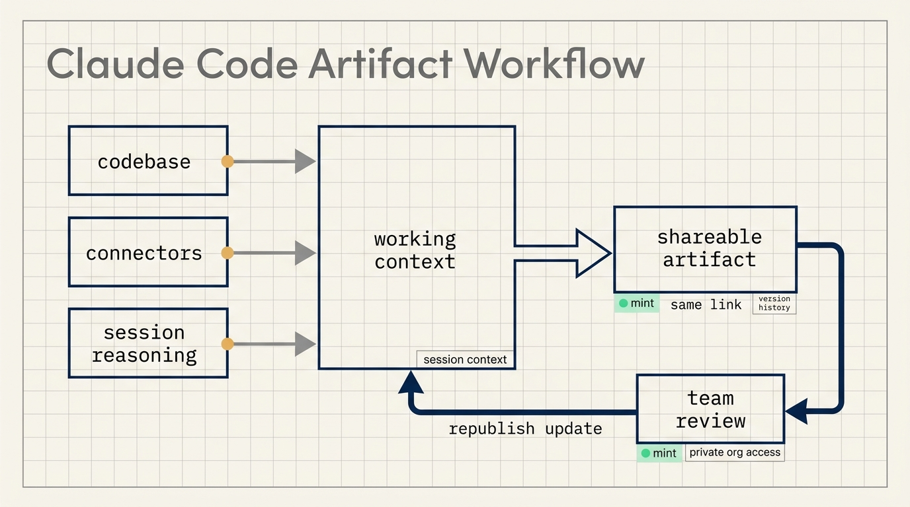
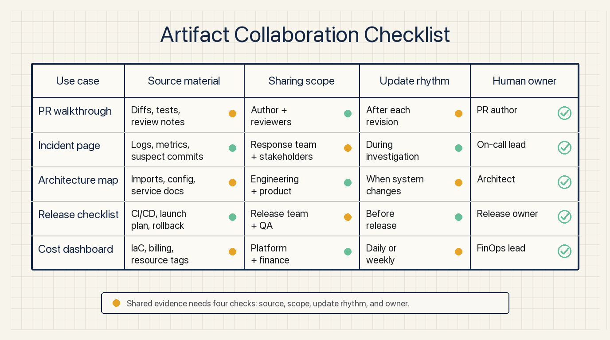
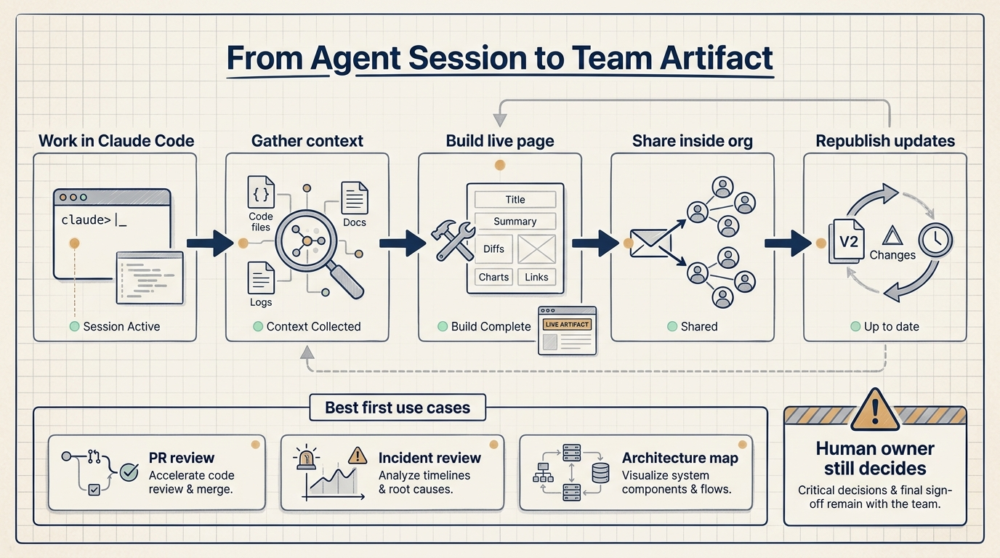

# Claude Code's New Canvas: Live Team Pages That Update

Claude Code artifacts turn an agent session into a page the team can open, inspect, and revisit.

That matters because AI coding work often disappears into a chat transcript. A developer asks Claude Code to investigate an incident, inspect logs, read code, compare commits, and reason through likely causes. The final message may be useful, but the team usually receives a compressed summary. The evidence, intermediate reasoning, links to files, and current state of the investigation still need to be explained in Slack, in standup, in a pull request, or in a postmortem.

Artifacts add a live canvas around Claude Code. The page is built from the full session context, including the codebase, connected tools, and the conversation. It can be shared with teammates. It can also be republished as the session progresses, so the same link reflects the current state of the work.

## Teams need the same working view

Claude Code can already operate across a large amount of context. A session may involve source files, test failures, monitoring data, pull request diffs, security findings, infrastructure definitions, or design components. The weak point is often not the agent's ability to gather material. The weak point is how that material becomes readable to everyone else.

There are three common gaps.

The first gap is between the operator and the team. One person works with the agent. Everyone else sees the conclusion later.

The second gap is between process and output. The chat contains intermediate work, but long chat logs are poor team documents. A short summary is easier to read, but it can lose the evidence chain that made the conclusion credible.

The third gap is between versions. AI-assisted work changes as more context is gathered. An incident page may begin with a timeline, then add a suspect commit, then add a monitoring chart, then add a mitigation note. If every update is copied manually into another channel, people quickly lose track of the latest state.

Artifacts compress these gaps into one page. The team opens the same link, sees the same structured view, and can return to it as the session updates.

Anthropic's example focuses on debugging. An engineer starts an incident investigation before standup. Claude Code works through logs and publishes an artifact with a timeline, suspect commits, and an error-rate chart. As the investigation continues, the page is republished with new material. By standup, the team is looking at the same updated view instead of waiting for someone to narrate what the agent found.

## The artifact is a collaboration surface for agent work

An artifact is not just a saved file or a screenshot. It is a live page generated from the working context of a Claude Code session.

That makes it useful for work that needs both context and explanation:

- A pull request walkthrough that shows the diff, the reasoning, the tests, and the review focus.
- An incident page that combines a timeline, monitoring signals, suspected commits, and next actions.
- A system explainer generated from real imports and service relationships.
- A release checklist that updates as work is completed.
- A cost or resource view generated from infrastructure-as-code and cloud configuration.

These use cases share the same pattern. The material is scattered across tools, but the team needs a single readable view. Claude Code already touches the relevant context during the session. The artifact turns that context into something other people can inspect.

This changes how teams use AI coding tools. A chat session becomes more than a private workspace. It can produce a team-facing intermediate object. Teammates can review the state earlier, ask for more evidence, and take over the work with less translation.

## One link reduces status-sync work

Artifacts update in place. When Claude Code republishes the page, the open artifact refreshes. Each publish creates a new version under the same link, with version history available for restore. A gallery lets users browse and manage the artifacts they have created.

That update model fits engineering work because the work itself is rarely static.

Incident investigations collect evidence over time. Pull request explanations change after review feedback. Release checklists move from pending to completed or blocked. Architecture maps improve as the agent reads more files. A stable page with update history reduces the need to resend screenshots, paste logs, and rewrite the current state in multiple tools.

The efficiency gain is not only writing speed. It is a reduction in the work required to explain work. Reviewers can see the reasoning. Managers can see current status. New teammates can see the structure. Compliance and security teams can see access and retention policies instead of relying on informal chat summaries.

## Private org access shapes the use case

Artifacts are available in beta for Claude Team and Enterprise organizations. They can be created from the Claude Code CLI and desktop app, and viewed in a browser.

The access model matters. Artifacts are private to the author by default. They can be shared with teammates and the organization from the page. They are viewable only by authenticated organization members and cannot be made public. Admins can manage access through an organization-level toggle, role-based scoping, retention policies, and the compliance API.

That makes artifacts an internal collaboration feature rather than a public publishing tool.

The reason is practical. An artifact may contain real code, monitoring data, dependency licenses, infrastructure cost structure, incident details, or internal team process. Sharing it publicly would create security and compliance risk. Keeping it inside the organization makes the feature more useful for real work.

Teams still need operating rules. They should decide who can create artifacts, who can share them, how long pages are retained, which connector data may appear, and whether incident or security artifacts need narrower access. Once AI outputs become live pages, they become access-controlled internal assets.

## Start with three low-risk workflows

Teams can begin with three practical workflows.

The first is pull request review. Ask Claude Code to create a PR walkthrough from the diff, the relevant code, and the tests. The page should explain what changed, why it changed, what was tested, and where reviewers should focus.

The second is incident review. Ask Claude Code to create a page with the timeline, symptoms, monitoring signals, suspected commits, rejected hypotheses, and next actions. The human owner still decides the fix, but the team can review the same evidence.

The third is architecture explanation. Ask Claude Code to map how a service fits together from the real import graph, configuration, or infrastructure files. This helps onboarding and reduces repeated verbal explanations.

Each workflow needs a simple check:

- Which source materials appear on the page?
- Which claims come from code, logs, or configuration?
- Which claims come from model reasoning?
- Who can view the page?
- What changed after the latest update?
- Who owns the final decision?

These questions keep the artifact grounded. The page is useful because it makes the session readable. The page is not a substitute for human responsibility.

## AI workflows are gaining a delivery layer

Claude Code artifacts point to a broader product direction: AI coding tools are moving from private task execution toward shared work delivery.

The first generation of AI coding workflows focused on individual productivity. The user gave a goal, the agent read context, called tools, changed files, and summarized the result. Team collaboration still happened through pull requests, documents, meetings, and chat.

Artifacts add a delivery layer between the agent session and the team. The output of the session can be code, tests, a PR, documentation, and now a live page that explains the work.

This changes procurement and workflow design. A tool that only writes code mainly improves individual speed. A tool that turns investigation, reasoning, and progress into a shared page can change team coordination. Reviewers get evidence. Managers get state. New teammates get explanation. Admins get access and retention controls.

If a team already uses Claude Code, Codex, or another coding agent, the easiest experiment is a small one: ask the agent to produce a team-readable page for the next pull request, incident investigation, or architecture explanation. Then measure two things: whether review time drops, and whether status-sync messages decrease.

When those two numbers move, the artifact is not just a visual feature. It has entered the cost structure of team collaboration.

## Source

Claude Blog, "Claude Code now supports artifacts", published June 18, 2026.

https://claude.com/blog/artifacts-in-claude-code
