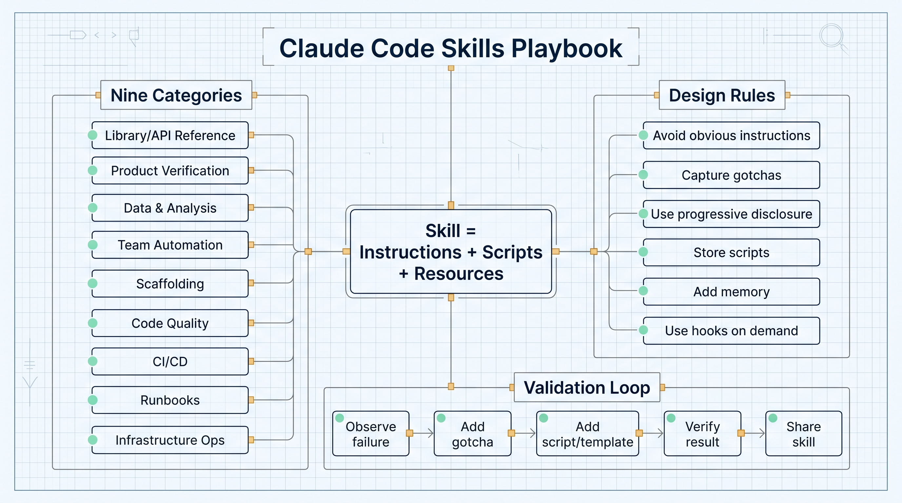
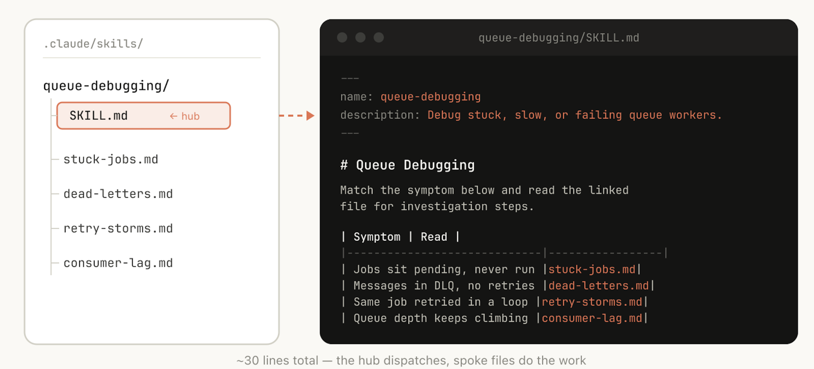
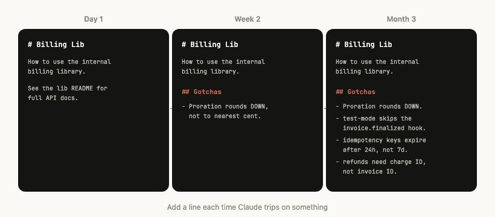
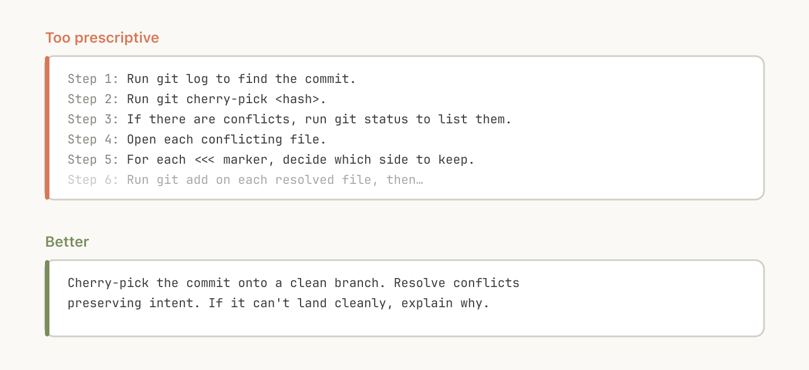
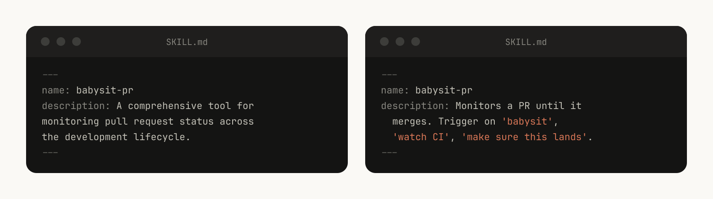
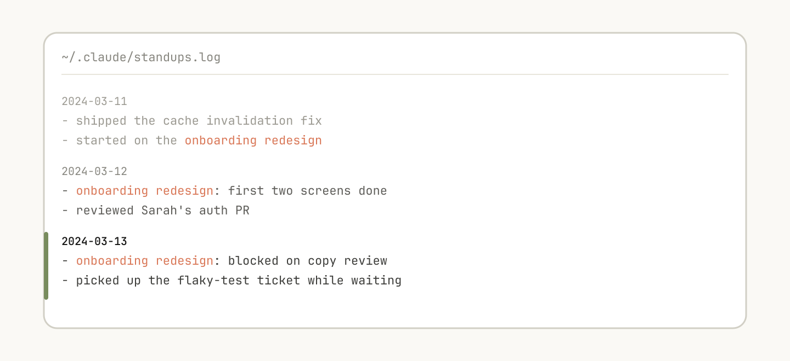

# Claude Code Skills: A Practical Playbook for Turning Team Knowledge Into Agent Workflows

Many teams start using coding agents and quickly run into the same problem: one-off tasks work, but experience does not compound. Every investigation, deployment, review, or verification task requires the team to explain context, tools, constraints, and known failure modes again.

Claude Code Skills are designed to solve that problem. A skill is not just a Markdown prompt. It is a folder of instructions, scripts, references, assets, configuration, and sometimes memory that an agent can discover and use during work.

Anthropic has hundreds of skills in active internal use. Their main lesson is simple: the best skills solve one clear class of problem, encode high-signal gotchas, and use the filesystem to reveal context only when it is needed.

## Skills Are Folders, Not Prompt Snippets

A useful skill can include `SKILL.md`, `references/`, `scripts/`, `assets/`, setup config, and log files. This structure enables progressive disclosure. The agent reads the entrypoint first, then opens the specific reference, script, or template required for the task.

## The Nine Skill Categories Anthropic Found

Anthropic grouped its internal skills into nine categories: library and API reference, product verification, data fetching and analysis, business process automation, scaffolding, code quality and review, CI/CD and deployment, runbooks, and infrastructure operations.

The best skills usually fit cleanly into one category. Skills that try to cover too many categories often confuse the agent.

## Gotchas Are the Highest-Signal Content

A skill should not restate what the model already knows. The most valuable content is the team-specific failure mode: append-only tables, mismatched request ID fields, staging endpoints that return success before the real webhook state is updated.

These details are hard for a general model to infer. They are exactly what should be captured in a skill.

## Verification Skills Have the Biggest Quality Impact

Anthropic notes that product verification skills had the most measurable internal impact on Claude's output quality. A verification skill can drive a browser, run a CLI through a TTY, assert state programmatically, record output, and prove that the task actually works.

This shifts the agent from "looks done" to "verified with evidence."

## Scripts Let Agents Compose Instead of Rebuilding Boilerplate

One of the strongest assets inside a skill is code. Scripts and helper libraries let the agent spend less effort reconstructing boilerplate and more effort choosing the right action.

For engineering teams, a read-only code review skill is a good first exercise: define when it triggers, require file and line references, store team-specific failure modes in `references/gotchas.md`, add focused-test scripts, and use a strict output template.

Source: Anthropic Claude Blog, "Lessons from building Claude Code: How we use skills", June 3, 2026. https://claude.com/blog/lessons-from-building-claude-code-how-we-use-skills
