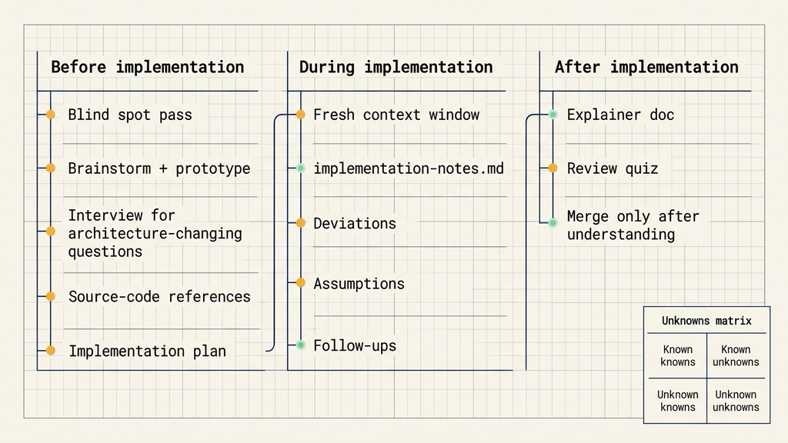
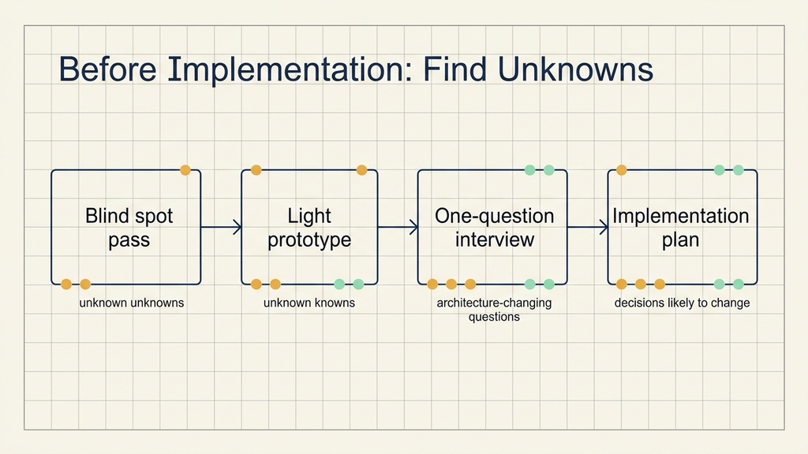
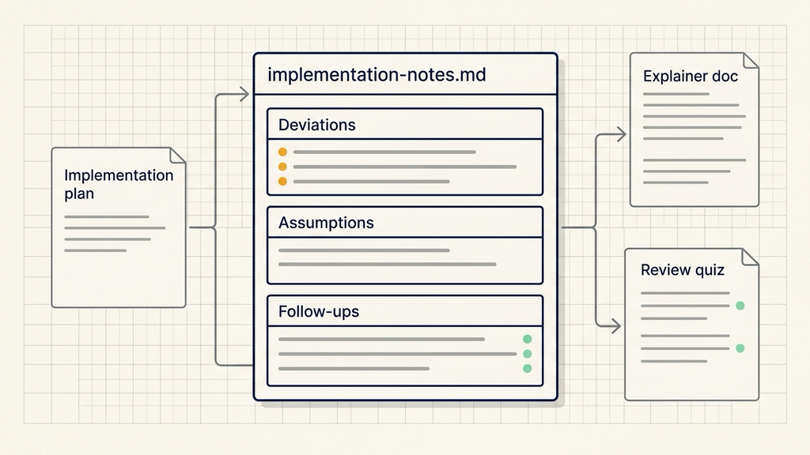

# Claude Code 实战：先找到你的未知点

## 资料来源

- 来源：Claude Blog
- 原文：A field guide to Claude Fable 5: Finding your unknowns
- 链接：https://claude.com/blog/a-field-guide-to-claude-fable-finding-your-unknowns
- 发布时间：July 6, 2026
- 主题：Claude Code 使用中如何发现任务里的未知点

很多人用 Claude Code 写代码时，已经会给需求、贴上下文、要求先出计划。问题出在下一层：Claude Code 未知点没有被提前暴露出来，长任务就会在实现中靠猜测前进。

这里的未知点不是“模型不知道某个知识点”。原文把它放在“地图”和“领土”的差距里讲。地图是你给 Claude 的提示词、技能和上下文；领土是代码库、真实业务和各种实际限制。两者之间没有写清、没有发现、没有验证的部分，就是任务里的未知点。

Claude Fable 5 让原作者明显感到，工作质量的瓶颈开始转移到人能不能说清这些未知点。模型越能做长任务，越需要人把模糊处、判断标准、转向条件和验证方式暴露出来。

## 先把未知点分成四类

原文用四类未知点来拆任务，这个分类适合放进任何一次 Agentic coding 会话前面。

第一类是已知的已知。它基本就是你已经写进提示词里的内容：要做什么、交付什么、限制是什么、哪些文件可以改。

第二类是已知的未知。你知道自己还没想清楚，但至少能指出问题在哪里。比如认证流程里该不该兼容旧 token，前端状态要放在本地还是服务端，错误提示要不要暴露底层原因。

第三类是未知的已知。它通常存在于你的经验里，但没有被写出来。比如一个按钮怎样摆才顺眼，一段代码风格怎样才像这个项目，某个业务判断看到结果时就能识别对错。这类信息很容易让 Agent 走偏，因为它没有进入上下文。

第四类是未知的未知。你没有意识到自己缺了哪些知识，也不知道什么样的结果可以算好。比如第一次做视频调色，不知道该问色彩空间、肤色、对比度还是曝光；第一次改陌生认证模块，不知道历史兼容、回滚路径和审计日志会影响实现。

很多 Agent 任务失败，常见原因是第三类和第四类信息没有被挖出来。Claude 会根据行业常见做法补空白，但常见做法未必适合你的代码库。

## 实现前先做盲区检查

盲区检查适合用于陌生模块、陌生技术和陌生设计任务。做法很直接：把自己的起点告诉 Claude，让它先找 unknown unknowns。

原文给了一个认证模块的例子：

> 我正在添加一个新的认证提供方，但我完全不了解这个代码库里的认证模块。你能做一次 blind spot pass，帮我找出相关的 unknown unknowns，并帮助我更好地提示你吗？

这个提示词里有三个信息：任务是什么，自己不知道什么，希望 Claude 先帮忙改进提示词。它让 Claude 的第一步从“开始写代码”变成“先搜索代码库、找风险、补问题”。

如果任务换成设计或视频，也可以这样写：

> 我不知道什么是调色，但我需要给这个视频调色。你能教我理解自己在调色上的 unknown unknowns，让我能更好地写提示词吗？

盲区检查完成后，不急着让 Agent 实现。先看它列出的未知点里，哪些会改变方案，哪些只是背景知识。会改变方案的问题，应该进入下一轮访谈或计划。

## 用原型暴露你说不出的判断标准

有些标准很难提前写清楚，只有看到结果才知道要什么。原文把这类信息称为 unknown knowns。

典型场景是界面、交互、文档结构和数据展示。你可能不知道怎样描述一个仪表盘的视觉方向，但看到四个完全不同的方案时，可以很快指出哪个方向接近目标。

原文给的提示词是：

> 我想为这批数据做一个仪表盘，但我没有视觉品味，也不知道有哪些可能性。请做一个 HTML 页面，给出 4 个差异很大的设计方向，让我可以反馈。

这类原型要刻意做轻。比如只用单 HTML 文件、假数据、静态按钮，不接后端，不维护真实状态。它的目的，是让你把“看到才知道”的判断标准说出来。

另一个例子是编辑器工具栏：

> 在接任何真实逻辑之前，先做一个单 HTML 文件，用假数据模拟新的编辑器工具栏。我想在你碰真实应用之前先看布局。

这个动作可以降低返工成本。UI 方向、信息层级、按钮密度和交互入口，越早通过原型暴露，越不会在真实代码写完后才返工。

## 让 Claude 采访你，而不是一次问完所有问题

完成头脑风暴后，仍然会有模糊点。这时可以让 Claude 采访你。

原文给的提示词很短：

> 请一次问我一个问题，采访我关于所有模糊点的答案。优先问那些答案会改变架构的问题。

做法落在“一次问一个问题”和“优先改变架构的问题”上。很多澄清清单会一次抛出十几个问题，回答成本高，也容易把注意力放在无关细节上。逐问逐答更适合把影响方案的未知点排出来。

可以把问题分成三类处理：

- 会改变数据模型、权限、接口或用户流程的问题，先回答。
- 只影响文案、样式或局部命名的问题，放后面。
- Agent 可以从代码库里确认的问题，让它自己查，不要转给人。

这样做的结果，是把“问用户”从停工动作变成设计动作。Agent 问的问题越接近架构和限制，后续实现越不容易偏。

## 用源代码做参考，比截图更可靠

当你描述不出想要的行为时，参考资料比解释更有效。原文强调，最好的参考资料是源代码。

如果有一个库实现了你想要的退避策略，就直接让 Claude 读那个目录：

> vendor/rate-limiter 里的这个 Rust crate 实现了我想要的精确退避行为。请读它，并在我们的 TypeScript API client 里重新实现相同语义。

这里要盯住“相同语义”。截图只能告诉 Agent 长什么样，文档只能告诉它大概意图，源码能给出特殊情况、错误处理、命名结构和真实调用方式。

跨语言参考也可以用。Rust 的退避逻辑可以迁移到 TypeScript，旧系统里的权限判断可以迁移到新接口，已有设计组件的结构可以迁移到新的页面。需要写清楚的是：参考什么，不参考什么，哪些语义必须保持。

## 实施计划要先暴露会变的部分

准备实现时，可以让 Claude 写实施计划。但计划的顺序很重要。

原文建议把最可能被人调整的部分放在前面，比如数据模型、类型接口、用户流程和任何用户可见行为。机械性重构可以放后面。

示例提示词是：

> 请写一份 HTML 格式的实施计划，但开头先写我最可能想调整的决策：数据模型变化、新类型接口，以及任何面向用户的部分。机械性的重构放到底部，我信任你处理那些部分。

这个要求能避免计划看起来很完整，但真正需要人判断的地方被埋在下面。对长任务来说，计划最重要的作用，是提前暴露会改变方案的选择点。

审计划时可以重点看四件事：数据结构是否会影响迁移或兼容；新接口是否会影响调用方；用户可见流程是否符合产品判断；回滚、日志、错误处理是否足够支撑上线。

这些问题确认后，再让 Agent 开新会话进入实现，会比在同一个长上下文里一路继续更稳。

## 实现中维护 implementation-notes.md

再好的计划，也会在实现中遇到未知的未知。原文建议让 Claude Code 维护一个临时的 `implementation-notes.md` 或 `.html` 文件，用来记录实现过程中的决策。

示例提示词是：

> 请维护一个 implementation-notes.md 文件。如果你遇到迫使你偏离计划的特殊情况，请选择保守方案，把它记录在 “Deviations” 下，然后继续。

这个文件至少应该记录三类信息：

- Deviations：哪些地方偏离了原计划，为什么偏离。
- Assumptions：Agent 做了哪些假设，依据是什么。
- Follow-ups：哪些问题没有在本轮解决，需要后续处理。

它不替代代码 review，但能让人快速理解 Agent 在代码 diff 之外做了哪些判断。尤其是长任务里，很多行为依赖既有代码路径，单看 diff 很难知道影响范围。

实现记录还有一个好处：下一次尝试可以复用这些信息。如果本轮方案失败，新的会话可以带着计划、原型和 implementation-notes.md 重新开始，不必让 Agent 从零猜。

## 实现后用解释材料和测验确认理解

交付之后，原文建议生成推介材料和解释材料。它们帮助评审者快速理解：任务解决了什么，哪些未知点被处理了，哪些失败点已经考虑过。

示例提示词是：

> 请把原型、规格和实施记录打包成一个我可以发到 Slack 里争取支持的单一文档。开头先放演示 GIF。

如果是代码变更，还可以让 Claude 生成一份带测验的报告：

> 我想确认自己理解了这次变更里发生的一切。请给我一份 HTML 报告，包含这次变更的上下文、直觉解释、做了什么等内容，并在底部附上一个我必须通过的测验。

这个动作适合用在合并前。读完报告后，如果你答不出测验，就说明自己还没有真正理解这次改动。对 Agent 写出的长任务来说，这比“看过 diff”更接近实际风险控制。

测验可以问这些问题：新增路径会在什么条件下触发；哪些旧行为保持不变；失败后怎么回退；哪些权限、日志或配置会影响结果；哪个测试能证明核心行为正确。

能回答这些问题，再进入合并和发布，会减少“代码能跑但人没理解”的风险。

## 一次小任务可以这样跑

可以用一个很小的 Claude Code 任务练这套方法。比如给后台页面增加一个只读审计日志入口。

第一步，让 Claude 做盲区检查：

> 我准备给后台页面增加一个只读审计日志入口，但我不熟悉这个项目的权限和日志模块。请先做一次 blind spot pass，找出会影响实现方案的 unknown unknowns，并告诉我需要补哪些上下文。

第二步，让它做轻原型：

> 在不接真实接口的前提下，用假数据做一个单文件原型，展示审计日志入口、筛选项和详情弹层。我先确认信息结构，再决定是否接入真实代码。

第三步，让它采访你：

> 请一次问我一个问题，优先问会改变权限、数据模型或用户流程的问题。

第四步，让它写计划：

> 请写实施计划，先列出权限判断、接口形状、数据模型和用户可见流程，机械重构放最后。

第五步，实现时维护记录：

> 实现过程中维护 implementation-notes.md。遇到偏离计划的特殊情况，选择保守方案，记录到 Deviations，再继续。

第六步，结束后生成解释材料和测验：

> 请把规格、实现记录和代码变更整理成一份报告，并在底部给我 5 道测验题。我答对后再合并。

这套流程会增加一点前期时间，但它把返工成本提前到原型、访谈和计划阶段。对长任务、陌生模块和高权限功能尤其有用。

## 哪些场景不适合照搬

这套方法适合有一定复杂度、需要判断、会影响多人协作的任务。它不适合所有事情。

如果只是改一个明显拼写错误、调整一个静态文案、补一行配置，直接改和跑测试更快。

如果需求负责人自己还没有决定方向，盲区检查只能暴露问题，不能替你做业务决策。此时应该先缩小任务范围，再让 Agent 参与。

如果任务涉及生产数据、权限提升、支付、删除、批量迁移或外部系统调用，需要先把权限、回滚、日志和人工审核写清楚。Agent 可以帮忙找未知点，但不能替代这些保护措施。

如果团队不愿意看 implementation-notes.md、解释材料或测验，流程也会失效。记录只有被审阅，才会变成质量控制。

## 结尾：先发现未知点，再交给 Agent 长跑

Claude Code 未知点管理的核心动作很朴素：实现前找盲区，实现中记录偏离，实现后确认理解。它把“提示词写长一点”换成了更稳定的协作流程。

模型越能做长任务，人越需要把自己的模糊判断、隐含标准和转向条件说出来。下一次让 Agent 接手陌生模块时，可以先做一次 blind spot pass，再用原型、访谈、实施计划和 implementation-notes.md 把未知点逐步摊开。

我会持续拆解 AI Agent 工程化方案，重点看安全架构、Claude Code、工作流和代码执行。

如果你正在做 Agent 应用，可以关注「大尹隐于网」，后面会继续写这一系列。
