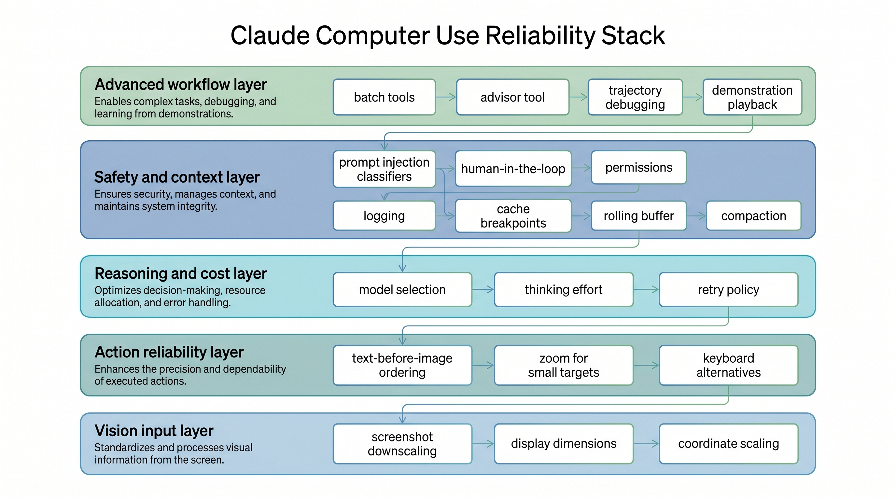
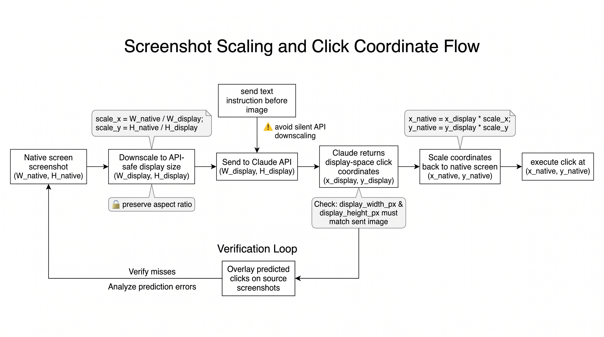
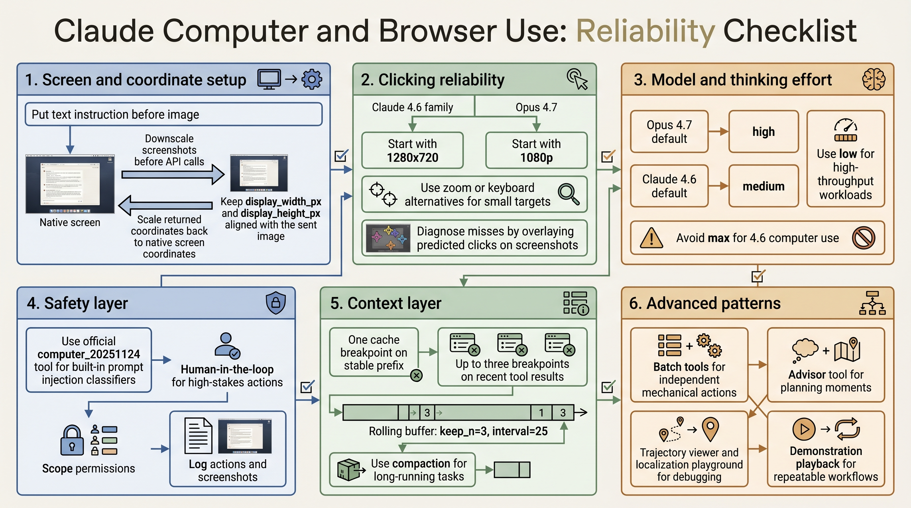

# Claude Computer and Browser Use: A Practical Reliability Checklist

Anthropic's guide to computer and browser use with Claude is best read as an engineering checklist. It covers what has to be true before a visual agent can reliably click, type, navigate, recover, and operate safely in real applications.

The core idea is simple: computer use reliability is not only a model problem. It is a system problem across screenshots, coordinate scaling, model selection, safety, context management, debugging, and workflow reuse.

## Start With Screen and Coordinate Setup

Click accuracy is the foundation. If clicks miss their targets, everything downstream fails.

The first rule is to downscale screenshots before sending them to the API. For the Claude 4.6 family, images above a 1568px long edge or 1.15MP total pixels are internally downscaled. For Opus 4.7, the limits are higher: 2576px long edge and 3.75MP total pixels.

Start with:

- 1280x720 for Claude 4.6 family
- 1080p for Opus 4.7
- Max API fit when you want to preserve aspect ratio and use the available pixel budget

Then make sure `display_width_px` and `display_height_px` match the image actually sent to the model. If you resize the screenshot, scale the returned coordinates back to native screen space before clicking.

## Improve Clicking Reliability

Place the text instruction before the image in the message content array. This helps the model know what it is looking for while it processes the screenshot.

Small targets need special handling. Checkboxes, tray icons, dropdown arrows, small toggles, and tree expand controls are less reliable than normal buttons and input fields. Use zoom, keyboard alternatives, UI scaling, lower DPI, or cropped screenshots when small targets matter.

If clicks fail, inspect the failure. Log the transcript and overlay predicted clicks on the source screenshots. Some failures are not click accuracy issues at all: for example, a browser screenshot may not capture a system-level dropdown. In those cases, JavaScript, keyboard navigation, or DOM manipulation may be more reliable than clicking.

## Choose Thinking Effort by Workload

More thinking is not always better. UI automation is often perceptual and mechanical rather than deeply logical.

For Opus 4.7:

- Default: high
- High-throughput or cost-sensitive: low
- Simple and fastest: try Sonnet 4.6
- Complex one-shot tasks: max

For Claude 4.6 models:

- Default: medium
- High-throughput or cost-sensitive: low
- Simple and fastest: disable thinking
- Complex one-shot tasks: high

The article does not recommend max effort for 4.6 computer use because it adds cost without consistent accuracy gains over high.

## Add Safety at the Boundary

Computer use agents interact with untrusted content. Screenshots, web pages, and application UIs can contain hidden or adversarial instructions.

If you use the official `computer_20251124` tool type, Claude's prompt injection classifiers run automatically. They add almost no latency and no extra cost. If you build custom screenshot and click tools, those built-in classifiers do not currently run automatically.

Regardless of classifier use:

- Add human confirmation for irreversible actions.
- Scope the agent's permissions.
- Log actions and screenshots.
- Treat web and application content as untrusted input, not user instruction.

## Manage Context and Cost

Screenshots accumulate quickly. Each screenshot can consume roughly 1,000 to 1,800 tokens. A long-running agent can fill a 200k context window in fewer than 100 screenshots.

A good default stack:

- One cache breakpoint on the stable prefix
- Up to three cache breakpoints on recent tool results
- A cache-aware rolling buffer with `keep_n = 3` and `interval = 25`
- Compaction for longer workflows

If server-side compaction runs, mirror the truncation on the client. Otherwise the client may keep sending history that the server has already compacted, increasing cost and breaking cache-stable assumptions.

## Use Advanced Patterns Selectively

Batch tools can reduce round trips when actions are independent: filling several fields, chaining keyboard shortcuts, or scrolling and clicking a known target. Avoid them when each action depends on the visual result of the previous one.

The advisor tool is useful when an executor model handles mechanical steps but occasionally needs stronger planning. It is most relevant for long-horizon tasks with occasional recovery or strategic choices.

For debugging, the reference implementation includes trajectory viewing, tool debug panels, and localization playgrounds. These tools help determine whether a failure came from the model, the screenshot pipeline, or the harness.

For repeated workflows, demonstration playback is often stronger than more prompt text. Record the user performing the task, capture screenshots and actions, then replay the demonstration as context. Claude should adapt the demonstration to the current UI rather than blindly replay recorded coordinates.

## Takeaway

Claude computer and browser use integrations become reliable when the whole system is engineered: image scaling, coordinate mapping, model effort, safety controls, context management, debugging tools, and reusable demonstrations all matter.

The model is one part of the loop. The harness around it decides whether the agent can operate safely and repeatedly in production.
