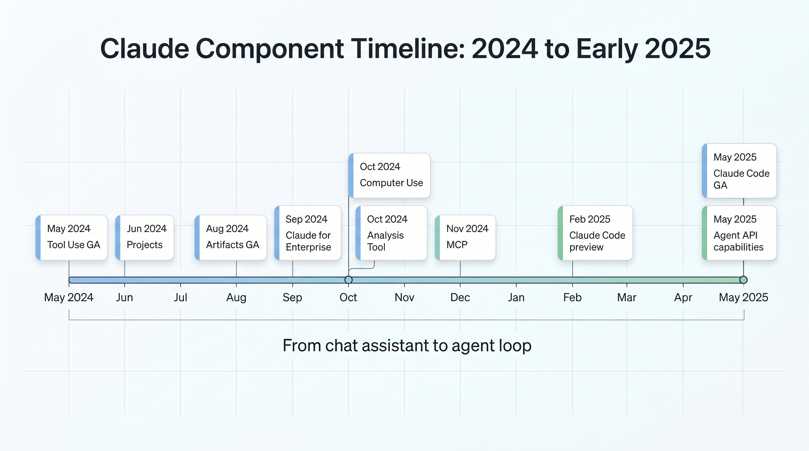
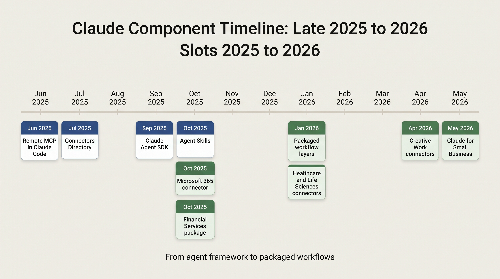
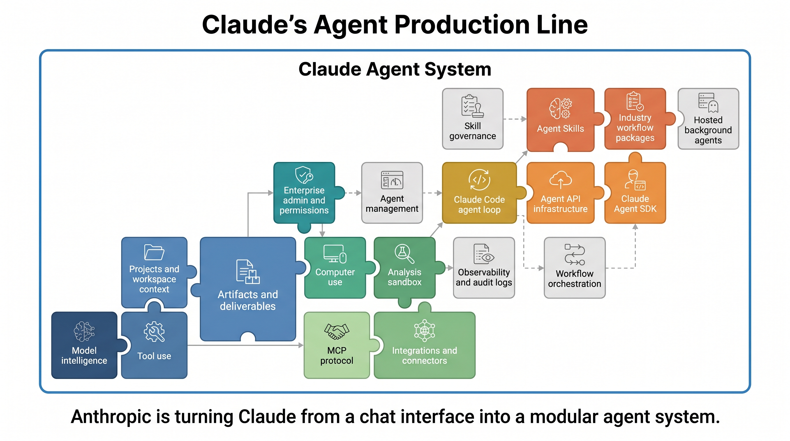

# Claude Is Becoming an Agent Production Line

The previous piece looked at Anthropic's external map: compute, enterprise systems, delivery partners, industry workflows, and the Stainless acquisition as a connectivity move.

This piece looks inside Claude.

Anthropic is not only expanding through partnerships and acquisitions. It is also adding components inside Claude itself. The pattern is clearer if the timeline starts before MCP or Claude Code. The better starting point is May 2024, when tool use became generally available.

That was the moment Claude started moving from "answering" toward "acting."

## The First Layer Was Tool Use

Tool use gave Claude a structured way to interact with external tools and APIs.

Without tool use, Claude could suggest that you query a database, call an API, or update a ticket. With tool use, Claude could translate natural language intent into structured tool calls.

That created the first internal layer of the Claude agent stack: action through tools.

Almost everything that came later depends on this layer: MCP, Claude Code, Agent Skills, integrations, and the Claude Agent SDK.

## Claude Then Needed Workspace And Outputs

Tool use gave Claude a path to action. But enterprise work also needs context and deliverables.

Projects, launched in June 2024, gave Claude a workspace for ongoing context. Artifacts, made generally available in August 2024, gave Claude a container for substantial outputs like code, diagrams, dashboards, documents, and prototypes.

Claude for Enterprise, announced in September 2024, added the organizational boundary: SSO, role-based permissions, admin tooling, more capacity, and enterprise control.

Together, these were not just product features. They gave Claude the early shape of a work system:

- Projects: workspace context
- Artifacts: output container
- Enterprise: organizational control

## October 2024 Added Execution

In October 2024, Anthropic added two important execution layers: computer use and the analysis tool.

Computer use allowed Claude to interact with software like a person: looking at a screen, moving a cursor, clicking, and typing. This matters because many enterprise systems are not clean APIs. They are browser dashboards, legacy tools, internal workflows, and interfaces that people operate manually.

The analysis tool gave Claude a code execution sandbox inside Claude.ai. It allowed Claude to process data, run calculations, analyze CSVs, and produce more reproducible results.

One layer lets Claude operate software interfaces.

The other lets Claude run analysis and verify work.

This is where Claude started to look less like a chat assistant and more like an actor inside a work environment.

## MCP Standardized Connection

MCP, introduced in November 2024, was not the start of Claude's component expansion. It was the standardization of the connection layer.

Before MCP, each tool or data source needed its own integration. MCP proposed a common protocol for connecting AI applications to external tools and data.

This is where the connection story becomes strategic.

Tool use gave Claude the ability to call tools.

MCP gave the ecosystem a standard way to expose tools and data to AI systems.

Stainless, acquired later, fits into this same logic from another angle: turning API specifications into SDKs, CLIs, and MCP servers. MCP is the connection standard. Stainless helps manufacture connection surfaces.

## Claude Code Productized The Agent Loop

Claude Code entered research preview in February 2025 and became generally available in May 2025.

It is easy to describe Claude Code as a coding tool. That is true, but too narrow.

The more important point is that Claude Code productized an agent loop:

1. Gather context.
2. Take action.
3. Verify the result.
4. Iterate.

Claude Code gave Claude a real work environment: files, commands, search, editing, tests, and feedback from execution. It proved that Claude could move beyond a conversational interface into a goal-directed workflow.

That makes Claude Code a reference implementation for Anthropic's broader agent strategy.

## The API Started Adding Agent Infrastructure

In May 2025, Anthropic also announced new API capabilities for building agents: code execution, the MCP connector, the Files API, and longer prompt caching.

These are not random API upgrades.

They are agent infrastructure.

Code execution helps agents run analysis. The MCP connector lets agents connect to remote MCP servers. The Files API gives agents a way to manage uploaded files across tasks. Longer prompt caching helps agents maintain context more cost-effectively during multi-step work.

Claude Code was Anthropic's own agent product.

These API capabilities helped external developers build their own agents.

## Connectors Turned MCP Into Product

A protocol is not enough. Users do not want to think about protocols. They want Claude to connect to their tools.

In May 2025, Anthropic introduced Integrations for Claude apps, allowing Claude to work with remote MCP servers across services like Jira, Confluence, Zapier, Cloudflare, Intercom, Asana, Square, Sentry, PayPal, Linear, and Plaid.

In June 2025, Claude Code added remote MCP support.

In July 2025, Anthropic introduced a connectors directory, allowing users to discover and connect tools like Notion, Canva, Stripe, Figma, Socket, and Prisma.

The pattern is clear:

- MCP is the protocol.
- Integrations bring MCP into Claude apps.
- Remote MCP brings it into Claude Code.
- The connectors directory gives users a productized entry point.

This is the transition from connection architecture to connection product.

## The Claude Agent SDK Turned Claude Code Into A Platform

In September 2025, Anthropic described the Claude Agent SDK as a way to build agents using the same underlying harness that powers Claude Code.

This is a major shift.

Claude Code is a product.

The Claude Agent SDK turns its underlying agent harness into reusable infrastructure.

That means developers can build other agents with the same pattern: tools, files, commands, context gathering, action, verification, and iteration.

This is the platform move.

Anthropic does not need to build every agent itself if it can expose the agent-building framework.

## Skills Turn Organizational Knowledge Into Components

Agent Skills, introduced in October 2025, add another layer.

A skill is a folder containing instructions, scripts, and resources. Claude loads the relevant skill when a task requires it.

This is not just prompt management.

Skills turn organizational knowledge into reusable components.

A finance team can package modeling templates and scripts. A legal team can package review rules and clause examples. A brand team can package voice guidelines and approval logic. An engineering team can package release procedures and security checks.

MCP answers the question: what can Claude connect to?

Skills answer the question: how should Claude perform this task in our organization?

That makes Skills one of the most important pieces of Claude's internal map.

## Industry Packages Are Bundles Of These Components

By late 2025 and 2026, Anthropic started packaging these components into more specific workflows and sectors.

Claude for Financial Services combined an Excel add-in, market and portfolio connectors, and prebuilt Agent Skills.

Claude's productivity platform integrations connected Microsoft 365 context across SharePoint, OneDrive, Outlook, Teams, and Calendar.

Claude for Creative Work used connectors to bring Claude into creative software workflows.

Claude for Small Business packaged connectors and ready-to-run workflows across QuickBooks, PayPal, HubSpot, Canva, Docusign, Google Workspace, and Microsoft 365.

These are not just vertical marketing pages. They show how Anthropic is bundling the same internal stack:

model, tools, MCP, connectors, execution, workspaces, skills, and workflows.

## The Bigger Point

Claude is not just getting more features.

Anthropic is turning Claude into a modular agent system.

The internal stack now looks like this:

- Model intelligence
- Tool use
- Workspace context
- Output containers
- Enterprise administration
- Computer use
- Analysis sandbox
- MCP protocol
- Integrations and connectors
- Claude Code agent loop
- Agent API infrastructure
- Claude Agent SDK
- Agent Skills
- Industry workflow packages

That is the internal counterpart to Anthropic's external enterprise AI value chain.

The external map is about compute, enterprise systems, partners, and industry delivery.

The internal map is about how Claude itself becomes connectable, executable, manageable, deployable, and reusable.

## What Is Still Missing

The map is not complete.

Agent management will become more important: who can create agents, run them, change permissions, stop execution, or approve sensitive actions?

Agent observability will also matter: which tools did an agent call, which files did it read, which systems did it change, where did it fail, and can the process be replayed?

Skills will need governance: versioning, permissions, security review, reuse quality, and lifecycle management.

Workflow orchestration will become a larger need as agents move from one-off tasks to recurring business processes.

And deployment form factors will keep expanding. Claude Code is a developer entry point. Claude.ai is the general interface. The API is the platform. Enterprises will eventually need more hosted, background, workflow-native agents.

That is the direction to watch.

Anthropic is building the external value chain around Claude, and the internal production line inside Claude.

If those two maps converge, Claude stops being only a model product.

It becomes an enterprise system for deploying agents.

## Sources

- Claude Tool Use GA: https://www.anthropic.com/news/tool-use-ga
- Claude Projects: https://www.anthropic.com/news/projects
- Claude Artifacts: https://www.anthropic.com/news/artifacts
- Claude for Enterprise: https://www.anthropic.com/news/claude-for-enterprise
- Claude Computer Use: https://www.anthropic.com/news/3-5-models-and-computer-use
- Claude Analysis Tool: https://www.anthropic.com/news/analysis-tool
- Model Context Protocol: https://www.anthropic.com/news/model-context-protocol
- Claude Code release notes: https://docs.anthropic.com/en/release-notes/claude-code
- Claude Integrations: https://www.anthropic.com/news/integrations
- Agent API capabilities: https://www.anthropic.com/news/agent-capabilities-api
- Remote MCP support in Claude Code: https://www.anthropic.com/news/claude-code-remote-mcp
- Connectors directory: https://www.anthropic.com/news/connectors-directory
- Claude Agent SDK: https://www.anthropic.com/engineering/building-agents-with-the-claude-agent-sdk/
- Agent Skills: https://www.anthropic.com/news/skills
- Claude and productivity platforms: https://www.anthropic.com/news/productivity-platforms
- Claude for Financial Services: https://www.anthropic.com/news/advancing-claude-for-financial-services
- Claude for Creative Work: https://www.anthropic.com/news/claude-for-creative-work
- Claude for Small Business: https://www.anthropic.com/news/claude-for-small-business
