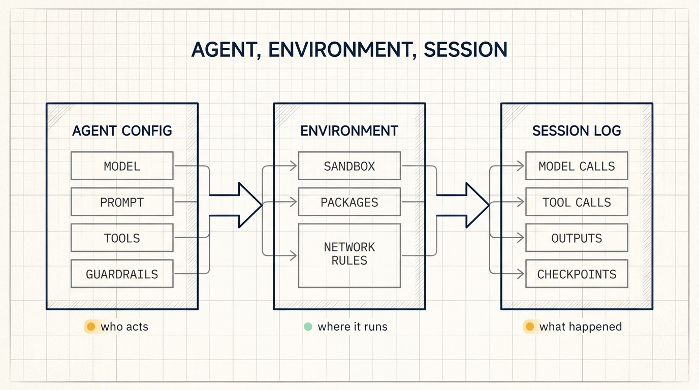
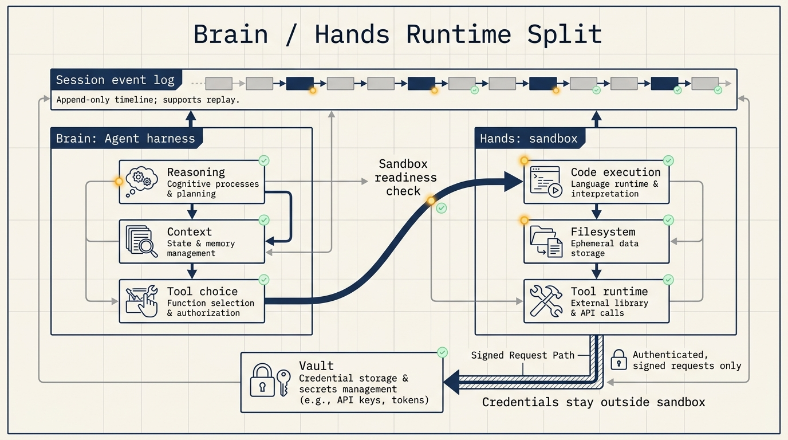
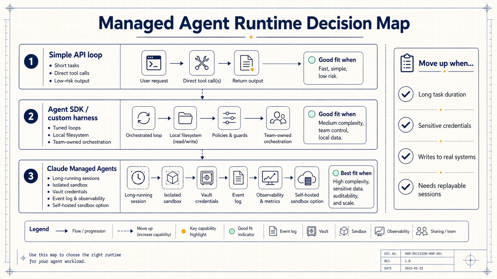

# Claude Managed Agents: Why Enterprise Agents Need a Runtime, Not Just a Loop

Many teams start agent work by choosing a model and wiring tools into it.

That is a useful starting point. But Claude Managed Agents points to a deeper production problem: an agent that works in a demo still needs somewhere reliable to run, a way to store session history, a safe execution environment, credential handling, observability, and recovery.

The product Anthropic is selling here is not a single agent. It is a managed runtime for building many agents that can run inside real enterprise workflows.

## Prototypes need loops. Production agents need runtime records.

A prototype can be simple: ask the model what to do, run a tool, send the result back, and repeat.

Production work adds harder questions. How long can the process run? What happens after interruption? Where does code execution happen? Which network can it reach? How close are credentials to generated code? Can the team reconstruct the whole run after a user reports a bad action?

Claude Managed Agents organizes that problem around three resources: agents, environments, and sessions.

An agent is the configuration: model, prompt, tools, and guardrails. An environment is the execution context: sandbox container, network rules, and installed packages. A session is the run record that connects an agent to an environment and preserves the event history, sandbox state, and outputs.

In plain terms: who acts, where it runs, and what happened.

## The brain and hands split matters for security.

Anthropic describes Managed Agents as separating the brain from the hands.

The brain is the harness that calls Claude, manages context, and decides which tools to use. The hands are the sandbox where code runs and files are written.

That split changes the risk model. In a common one-container setup, the agent loop, generated code, file system, and credentials may live close together. Prompt injection can try to convince the model to inspect local environment variables or configuration files.

Managed Agents moves credentials into vaults. A proxy fetches and decrypts them only when needed, and retrieval requires signed request tokens. The sandbox can execute generated code without becoming the place where long-lived secrets are stored.

The session log also sits outside the running process. Every model call, tool call, and result becomes part of an append-only record. That gives teams a way to replay and inspect what happened after the fact.

## Harness maintenance is real engineering work.

Agent harnesses change as models change.

Anthropic gives one example from Claude Sonnet 4.5. The model sometimes rushed to finish near the end of its context, so the harness added context resets. Claude Opus 4.5 no longer showed that behavior, making the old reset strategy unnecessary overhead.

That is the kind of maintenance many teams do not want to own. Context compaction, tool execution, caching, retries, subagents, and session management all depend on model behavior.

Claude Managed Agents moves more of that burden to Anthropic. Teams still own task design, domain context, tool quality, permission policy, and output review. The managed platform owns the general runtime machinery.

This distinction is important. A managed runtime can reduce infrastructure work, but it does not replace product judgment.

## The customer examples point to delegated work.

The examples in the Claude Blog are mostly about agents working inside existing systems.

Notion runs Custom Agents on Managed Agents, allowing teams to assign work from a task board. The agent reads docs, meeting notes, and connected data, then returns code, decks, or sites to the workspace for review.

Sentry connects Seer with a Claude agent that writes fixes and opens pull requests. Asana and Atlassian put agents into project and Jira workflows. Rakuten uses specialist agents across product, sales, marketing, and finance.

The pattern is delegated work. Users give the agent a task, context, and target system. The agent works asynchronously and returns an artifact to the place where the team already operates.

That product shape needs stronger runtime guarantees than a chatbot. The system needs progress, logs, session recovery, scoped credentials, and a place for human review.

This also explains why these examples are embedded inside existing products. The point is not to create another chat surface. The point is to let a user assign work from a task board, a bug report, a customer thread, or a document workspace, then receive a concrete artifact in the same system.

For Sentry, that artifact can be a pull request after root cause analysis. For Notion, it can be a page, a deck, a site, or code returned to the workspace. For Asana and Atlassian, it can be task progress inside the project system users already check every day.

That means the runtime has to support product details that are easy to ignore in demos: task identity, user identity, tool permissions, session visibility, artifact storage, and a clean review step before changes become final.

## When a managed runtime is worth considering

For short text tasks, a direct API loop can be enough.

For longer work, the runtime question becomes harder. Teams should look at four signals:

- Task duration: long tasks need session durability and recovery.
- Credentials: private systems require scoped secrets and audit records.
- Side effects: file writes, pull requests, ticket changes, and messages need review paths.
- Scale: many users and parallel sessions require hosting, queues, and observability.

Claude Managed Agents is most relevant when these signals appear together. It gives teams a faster path to production, especially when the alternative is building an internal agent platform from scratch.

There are tradeoffs. The service is tied to Claude Platform. Pricing includes normal token costs plus runtime session-hour charges. Teams also need to decide which parts of execution can run in Anthropic-managed infrastructure and which parts should stay inside their own environment through self-hosted sandboxes or MCP tunnels.

Cost should be evaluated at the workflow level, not only at the token level. A long session can spend money on model calls, tool execution, and runtime hours. A failed internal platform also has a cost: engineers maintaining queues, sandboxes, secret stores, replay logs, and monitoring instead of building the product workflow.

The practical evaluation is simple. Pick one production-shaped task, run it through the managed runtime, and measure four things: time to first useful output, amount of human correction, failure recovery effort, and confidence in the audit trail. If the managed runtime improves only the first metric, a lighter API or SDK setup may be enough. If it improves recovery, credential handling, and traceability, the platform layer is doing real work.

Teams also need a clear ownership split. Anthropic can own generic runtime mechanics. The product team still owns domain context, tool design, permission policy, output quality, and user review. A managed agent with weak tools and vague success criteria will still fail; it will simply fail inside better infrastructure.

## The larger shift

Enterprise agents are moving from chat surfaces toward delegated work surfaces.

The user does not sit with the model for every turn. The user assigns work, the agent runs in a controlled environment, and the result comes back into an existing workflow.

That shift makes runtime design visible. A useful enterprise agent needs model intelligence, but it also needs sessions, sandboxes, credentials, observability, and recovery.

Claude Managed Agents is Anthropic's answer to that runtime layer.

This is the direction many enterprise AI products are moving toward. The interface may still look conversational at the start, but the important action happens after the handoff. The system has to accept a task, preserve state, call tools safely, produce artifacts, and let the user inspect the trail.

The harder question for builders is no longer only "which model should we use?" It is "which parts of our agent system are product-specific, and which parts are generic runtime work?" Claude Managed Agents is one answer: keep product context close to the team, and move common runtime machinery into a managed service.
