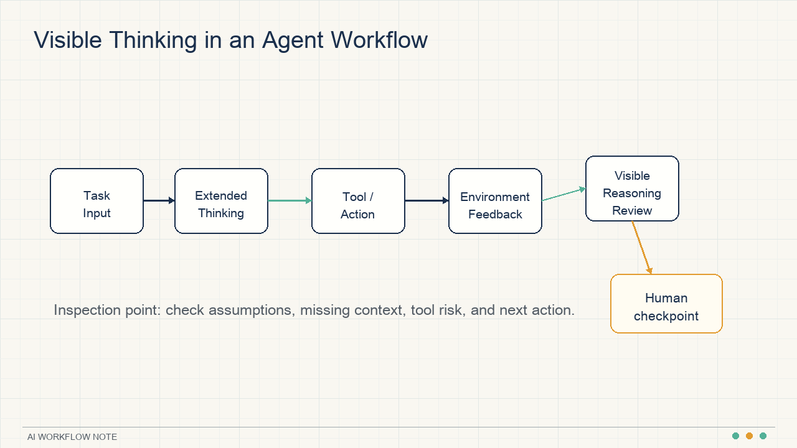
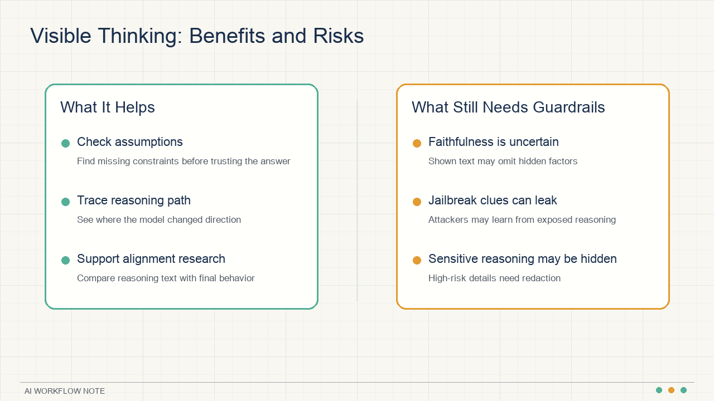
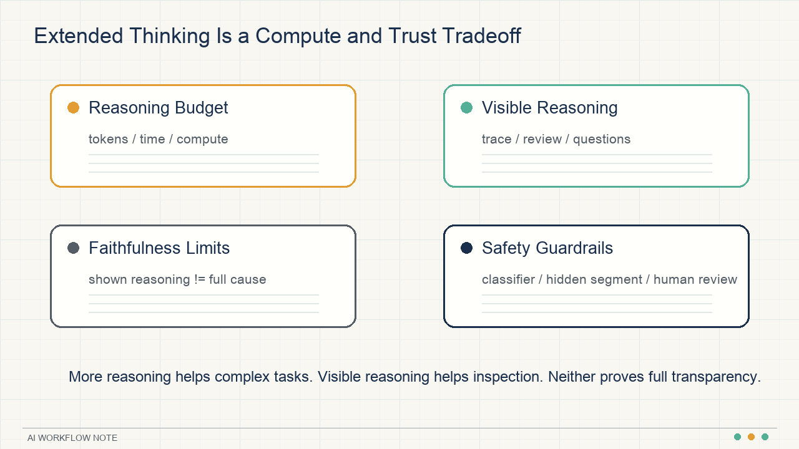

# Claude's Visible Thinking: More Reasoning, Not Full Transparency

When Claude shows its reasoning, the tempting interpretation is simple: now we can see how the model thinks.

That interpretation is too strong.

Anthropic's article on Claude's extended thinking is really about a tradeoff: letting a model spend more compute before answering can improve performance on hard tasks; showing parts of the reasoning can make answers easier to inspect; but visible reasoning text is not a complete explanation of why the model made a decision, and it is not a strong safety proof.

The useful distinction is between **extended thinking** and **visible thought process**. Extended thinking is about how much reasoning compute the model can spend before producing an answer. Visible thinking is about how much of that process a user can inspect.

## Extended thinking moves more compute into the answer

Extended thinking lets the same model spend more time and effort on a hard problem before producing a final answer. Developers can set a thinking budget, which controls how long the model may reason.

This matters because complex tasks are not only a function of what the model learned during training. They also depend on how much compute the model can spend at inference time: searching, checking, comparing, and revising.

Simple tasks do not need this. A translation, a date lookup, or a short factual answer can often be handled directly. Harder tasks benefit from more intermediate reasoning:

- Debugging a non-obvious code failure
- Solving a multi-step math problem
- Comparing competing plans under constraints
- Analyzing inconsistencies in a long document
- Deciding the next step in a tool-using agent workflow

This is why extended thinking belongs in the broader category of test-time compute. The weights are fixed, but the model can still spend more compute at answer time.

## Visible thinking makes answers easier to inspect

Anthropic chose to expose the model's thought process in a relatively raw form. That can help in three ways.

First, users can inspect the path to the answer. If the model shows which assumptions it used, which constraints it noticed, and where it made a judgment call, the user has more surface area to check.

Second, researchers can use visible reasoning for alignment work. Anthropic has studied gaps between what a model appears to think internally and what it says externally. More observable reasoning gives researchers more material to examine.

Third, the reasoning process itself can be useful. For math, physics, code debugging, and planning, the intermediate attempts often matter as much as the final answer.

In practical terms, visible thinking turns Claude into a collaborator that can show part of its scratchpad. You should not blindly trust the scratchpad, but it gives you a better place to ask follow-up questions.

## The reasoning text is not a screenshot of the model's mind

The hardest part is faithfulness: does the visible reasoning text faithfully represent the real causes of the model's behavior?

Anthropic is clear that this is still unresolved. Natural language may not be capable of fully describing the internal causal process of a neural network. More importantly, Anthropic says current models often make decisions based on factors they do not explicitly discuss in their visible thinking.

That means visible reasoning is useful for inspection, but it cannot be used as a strong safety argument.

For example, a model might recommend changing a contract clause and show reasoning about payment timing and liability. The actual behavior may also be shaped by patterns in training data, subtle signals in the prompt, or assumptions that never appear in the visible text.

So visible thinking is best used for three things:

1. Checking whether obvious constraints were missed
2. Finding where the intermediate reasoning drifted
3. Identifying what to ask next

It should not be treated as proof that the model is honest, safe, or fully interpretable.

## Agents amplify the value of reasoning budgets

Extended thinking becomes especially important for agents.

Agents do not just answer once. They observe, call tools, read results, update plans, and act again. Every step can change the next step.

Anthropic discusses computer use as one example: a model can observe a screen, click, type, and continue based on environmental feedback. In this setting, more reasoning and more interaction steps can improve performance.

The Pokemon Red example is a more playful version of the same idea. The model received basic memory, screen pixel input, and button-press function calls. The task required long-horizon navigation, inventory management, battles, and strategy revision. The real lesson is not about games. It is about persistence under changing state.

That pattern appears in real workflows:

- A coding agent reruns tests and changes its diagnosis after a failure
- A data analysis agent asks a second question after seeing a chart
- A support agent reconciles order state, policy, and user intent
- An operations agent checks metrics, logs, and process state before recommending action

In these workflows, the answer is shaped by the path. More reasoning and more inspection can reduce the odds of committing too early to a bad path.

## Serial and parallel test-time compute

Anthropic describes extended thinking as **serial test-time compute**. The model reasons step by step before finalizing an answer. For math tasks, the article reports that more thinking tokens tend to improve accuracy in a predictable way, even though the model may stop before using the full budget.

There is also **parallel test-time compute**: sample multiple independent reasoning paths, then choose the best answer with majority voting, consensus, another model, or a learned scoring model.

In Anthropic's GPQA experiments, using the equivalent compute of 256 independent samples, a learned scoring model, and a maximum 64k-token thinking budget produced a GPQA score of 84.8%, including 96.5% on the physics subset.

The bigger point is that model performance is increasingly about how compute is allocated at answer time:

- Serial reasoning goes deeper along one path
- Parallel sampling explores multiple paths
- Scoring chooses among candidates

For users, the practical move is simple: for high-stakes complex tasks, do not rely on one answer. Ask for alternatives, assumptions, failure modes, and comparison criteria.

## Safety gets harder when reasoning becomes visible

Visible reasoning creates a safety problem: some thoughts may contain information that should not be shown.

Anthropic's approach is to hide sensitive reasoning segments in rare high-risk cases. The model can still internally process information needed to produce a benign answer, but the user may see a message saying the rest of the thought process is unavailable.

This is not just content moderation. It is a design tradeoff between inspection and misuse prevention.

Computer use adds another layer. If an agent can see a screen and take actions, it can encounter prompt injection hidden in webpages, emails, documents, or images. Anthropic reports that new training, a system prompt, and a classifier improved prevention of prompt injection attacks from 74% without mitigations to 88%, with a 0.5% false positive rate.

The operational lesson is direct: the more an agent can act, the closer safety controls need to be to the action layer. Final-answer filtering is not enough.

## How to use visible thinking at work

Visible thinking is most useful in tasks where a human still needs to judge the result.

For developers, use it in debugging, architecture review, and test failure analysis. Check whether the model looked at the right evidence before changing code.

For product and operations work, use it for requirement analysis, user feedback grouping, and campaign planning. Check whether the model separates user evidence from its own assumptions.

For managers, use it in decision memos and meeting summaries. The visible reasoning can reveal which assumptions the recommendation depends on.

For everyday users, use it in learning, writing, travel planning, and purchase decisions. The value is not that the model is automatically right. The value is that you can see where to challenge it.

A simple workflow:

1. Ask the model to list the criteria it will use
2. Ask it to mark uncertain information
3. Ask for more than one option
4. Ask what would make each option fail
5. Then ask for a recommendation

The goal is to surface assumptions before trusting the output.

## The larger shift: auditable AI

The important direction here is not just smarter answers. It is more auditable AI.

We used to ask whether a model's answer was correct. Increasingly, we will ask:

- What information did it use?
- What did it ignore?
- Why did it choose this tool call?
- Why was this action considered safe?
- Did it stop when uncertainty was too high?

For individual users, visible thinking helps with follow-up questions. For teams, visible reasoning has to be combined with logs, permissions, monitoring, classifiers, and human review.

Visible reasoning creates a feeling of transparency. Real reliability still requires testing and control.

Source: Anthropic Research, "Claude's extended thinking"  
https://www.anthropic.com/research/visible-extended-thinking
