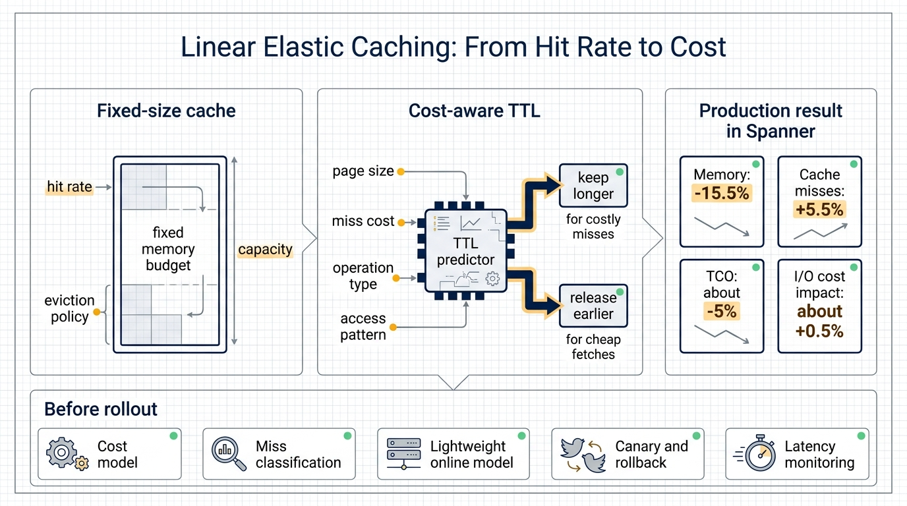
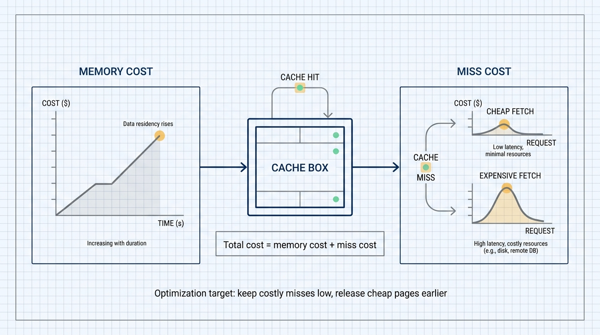
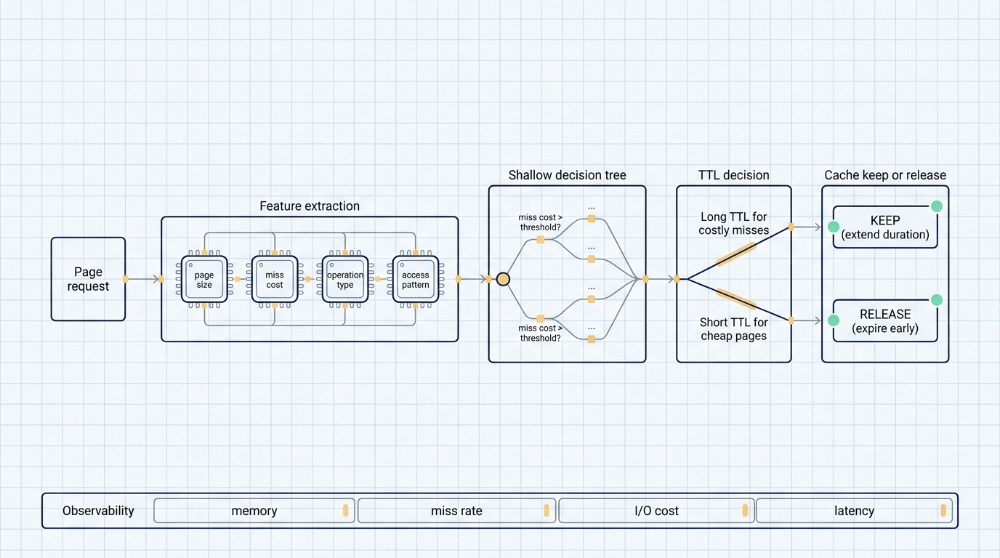

# Cloud cache optimization needs a cost model, not only a hit-rate target

Many cache optimization discussions begin with hit rate.

That is reasonable in a fixed-capacity world. If a machine already has a fixed cache budget, the engineering problem is to use that memory well. Keep useful pages, evict less useful pages, reduce backend reads, and protect latency.

Cloud infrastructure changes the accounting. Memory has a price. I/O has a price. Remote storage reads have a price. Network and CPU also have prices. Keeping a page in memory is a continuous cost. Releasing it and fetching it later is a different cost.

Google Research's article "Optimizing cloud economics with linear elastic caching" is about this shift. It treats cache entries as resources with an ongoing holding cost and assigns each page a time-to-live, or TTL, based on access patterns and cost signals.

The system was integrated into Spanner production servers over several months. Google reports a 15.5% reduction in memory usage, a 5.5% increase in cache misses, and about a 5% reduction in total cost of ownership. Because the algorithm is cost-aware, the extra misses mostly landed on data that was cheap to fetch, so the actual I/O cost impact was about 0.5%.

The useful lesson is simple: cache optimization can move from "maximize hits" to "spend memory where misses are expensive."

## Fixed-size caching assumes memory is already committed

Traditional cache policies usually start from a fixed capacity. A service has a cache of a certain size. The eviction policy decides which pages stay and which pages leave.

LRU uses recency. LFU uses frequency. GDSF, or greedy dual size frequency, generalizes LRU for pages with different sizes and value profiles.

These policies solve a capacity allocation problem. The memory budget is fixed, so the question is how to use it.

Cloud systems expose a different question. If memory can be reduced, that may lower machine size, instance count, or resource pressure. If the cache gets smaller, backend reads may rise. Both sides can be expressed as cost.

Linear elastic caching removes the assumption that the cache should always use a fixed budget. A cached page continues to consume memory. An evicted page may later create a miss. The policy compares those costs.

## TTL turns cache residency into an economic decision

Google frames the problem through the ski rental problem.

In the ski rental problem, a person can rent equipment day by day or buy it once. Renting is better for a short trip. Buying is better for a long trip. The hard part is that the skier does not know the trip length in advance.

Cache residency has a similar shape. Keeping a page in memory is like renting. Re-fetching it after expiration is like paying a one-time purchase cost. The system does not know when the next access will arrive, so it predicts based on history and cost.

Google's production approach assigns a TTL when a cached page is requested. Pages with frequent reuse, high miss cost, and favorable size characteristics can stay longer. Pages that are cheap to fetch or unlikely to be reused can expire earlier.

The target is total cost: memory cost plus miss cost. Hit rate remains useful, but it is not the final objective.

## Spanner used a shallow decision tree

Production constraints matter here.

Spanner handles billions of requests per second. A cache policy that requires a heavy online model would add CPU cost, latency, and operational complexity. The optimization could consume the savings it tries to create.

Google used a shallow decision tree for TTL prediction. That is an engineering choice as much as a modeling choice. A shallow tree can be translated into a few lines of C++ code, executed cheaply on the request path, and inspected by engineers.

The model uses features such as page size, cache miss cost, operation type, and workload characteristics to predict an appropriate TTL.

For this kind of infrastructure, the model has to be light enough to run constantly and explainable enough to debug when the miss distribution changes.

## More misses can still lower total cost

The production result is the part worth reading carefully:

- Memory usage fell by 15.5%.
- Cache misses increased by 5.5%.
- Total cost of ownership fell by about 5%.
- Actual I/O cost impact was about 0.5%.

If hit rate were the only metric, a 5.5% increase in misses would look bad. In a cost-aware system, the important question is where those misses occur.

If a page is cheap to fetch and expensive to keep in memory, early expiration can be a good trade. If a page creates expensive I/O or affects important latency paths, the policy should give it a longer TTL.

That is the core idea. The policy is not trying to eliminate all misses equally. It is trying to avoid expensive misses while reducing memory spent on cheap pages.

## Public traces tested whether the idea generalizes

Google also evaluated elastic caching on publicly available cache traces. This matters because production Spanner workloads are not a universal benchmark.

The fixed-size baseline was an optimized implementation of GDSF. Google then evaluated several elastic caching variants based on the ski rental algorithm used and whether the variant included learning.

Public traces did not include the application-level features available in production, so Google did not use the same decision tree. Instead, it split each trace in half. The first half was used for training. For each page seen during training, the system computed the TTL that minimized cost over that training segment.

During testing, pages seen during training used their precomputed TTL. Pages not seen before used breakeven or randomized policies.

The evaluation also used cache warm-up. A prefix of the test trace populated the cache before measurement started, which avoids measuring cold-start artifacts as policy performance.

The broader method is clear: define a cost model, assign TTLs, then test on both production workloads and independent traces.

## Where this approach fits

Linear elastic caching is most relevant when three conditions are present.

First, the system has a meaningful memory bill. Reducing cache memory should translate into lower machine size, lower instance count, or better resource sharing.

Second, misses have different prices. Some misses may hit local SSD. Others may trigger remote storage, cross-region reads, or expensive downstream work. A cost-aware cache needs those differences.

Third, the system can collect stable features for each cached item: size, operation type, access pattern, miss path, and backend cost.

Small systems may not need this. If cache size is modest, backend fetch cost is uniform, and operations are easy to reason about, fixed-size caching plus a conventional eviction policy may be enough.

At large scale, the accounting changes. Memory saved in one cache layer can become real infrastructure savings, but only if the extra misses stay cheap.

## What teams need before trying it

A cost-aware cache needs more than an eviction algorithm.

It needs a memory cost model: how cache memory maps to machine type, resource pressure, or fleet cost.

It needs miss classification: whether a miss goes to local SSD, remote storage, another service, or a cross-region path.

It needs observability: memory usage, miss count, miss cost, I/O cost, latency percentiles, and error rate should be tracked separately.

It needs rollout control: canary deployment, per-service or per-tenant enablement, and a quick path back to fixed-size caching or conservative TTLs.

Google's result came from months of production integration in Spanner. The more portable takeaway is not the exact 5% TCO number. It is the method: translate cache behavior into cost, keep the online model simple, and verify that added misses land on cheap paths.

## Source

- Google Research: Optimizing cloud economics with linear elastic caching
- URL: https://research.google/blog/optimizing-cloud-economics-with-linear-elastic-caching/
- Published: June 25, 2026
- Topics: linear elastic caching, Spanner, TTL prediction, cloud cost optimization, cache economics
