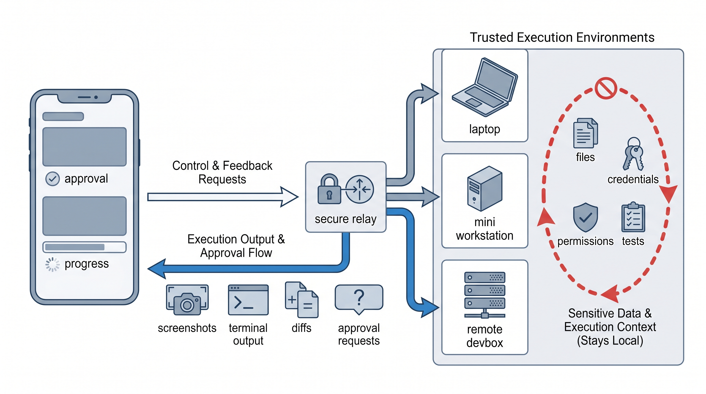
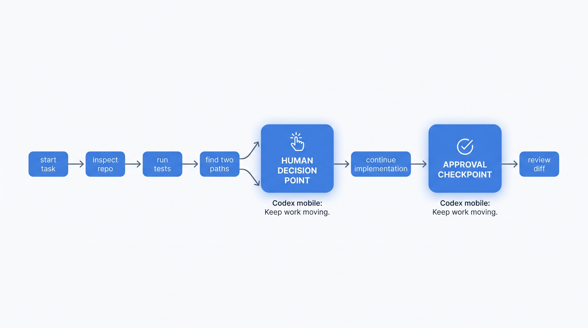
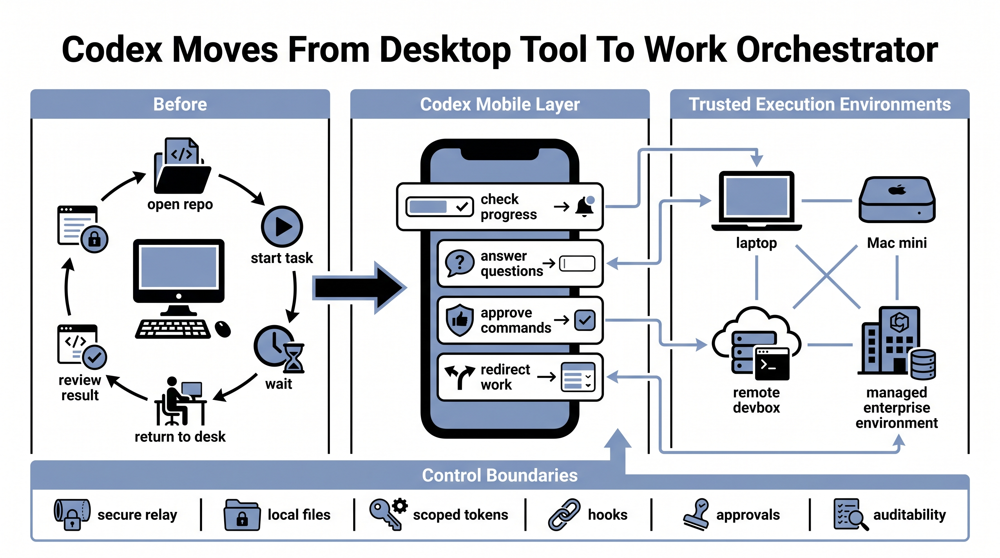

# Codex Is Moving From Desktop Tool To Work Orchestrator

OpenAI's update that brings Codex into the ChatGPT mobile app looks like a mobile feature. It is more than that.

The real shift is that coding agents are starting to leave the desktop-only workflow. Codex still runs in a real development environment: a laptop, Mac mini, devbox, or managed remote machine. The phone becomes the place where a human can check progress, answer a question, approve a command, redirect the task, or start a new thread before the idea goes cold.

That matters because long-running agent work does not fail only because the model is weak. It often stalls because nobody is available at the decision point.

A bug investigation can split into two plausible causes. A refactor can surface two implementation paths with different risk profiles. A command may need approval before it can continue. In the old rhythm, those moments waited for the developer to return to the desk. With Codex in the mobile app, the human does not need to take over the whole task. They only need to make the judgment that keeps the work moving.

The infrastructure details are the important part.

Codex uses a secure relay layer so trusted machines can stay reachable across devices without being directly exposed to the public internet. Files, credentials, permissions, dependencies, and local setup stay in the execution environment. Updates flow back to the phone: screenshots, terminal output, diffs, test results, and approval requests.

Remote SSH is now generally available, which lets Codex connect into managed enterprise development environments. Hooks are generally available too, giving teams a way to scan prompts for secrets, run validators, log conversations, create memories, and customize behavior for specific repositories or directories. Programmatic access tokens give Business and Enterprise customers scoped credentials for CI, release workflows, and internal automation.

Taken together, this is not just "Codex on mobile." It is OpenAI building the control layer around agentic software work: trusted machines, remote environments, secure relay, approvals, hooks, and scoped automation credentials.

The developer's role changes with that.

Instead of supervising every step from a desktop, a developer can start a long task in the morning, choose a direction from the phone during a commute, add a missing constraint at lunch, and review the diff later from the desk. That does not remove human judgment. It makes judgment more important, because a task that can keep running from anywhere also needs clearer boundaries.

For teams, the main question is not whether people should write code on phones. They should not. The better question is which tasks are safe to let Codex run for longer periods, which checkpoints require human approval, and which credentials or repositories must stay inside managed environments.

My read: coding agent competition is moving beyond "who writes more code in one shot." The next layer is who can plug into real work environments, preserve control, and support long-running execution without losing the human at the moments that matter.

Codex on mobile is the visible feature. The bigger story is work orchestration.
