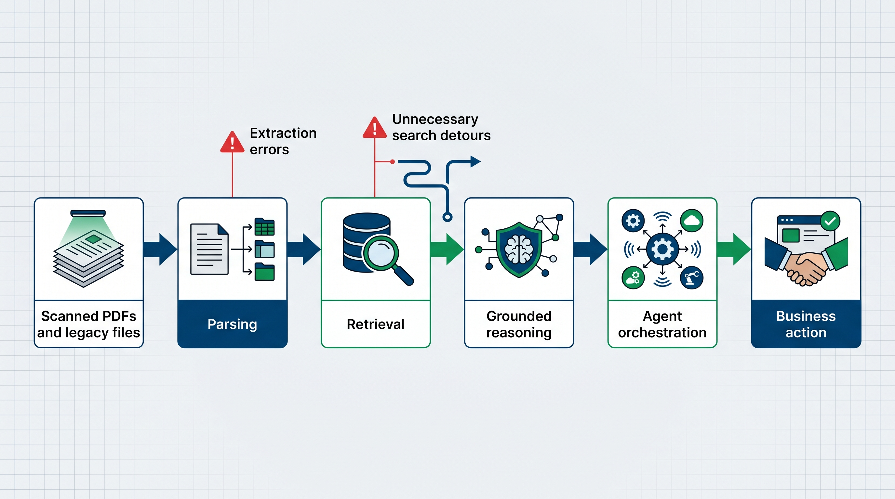
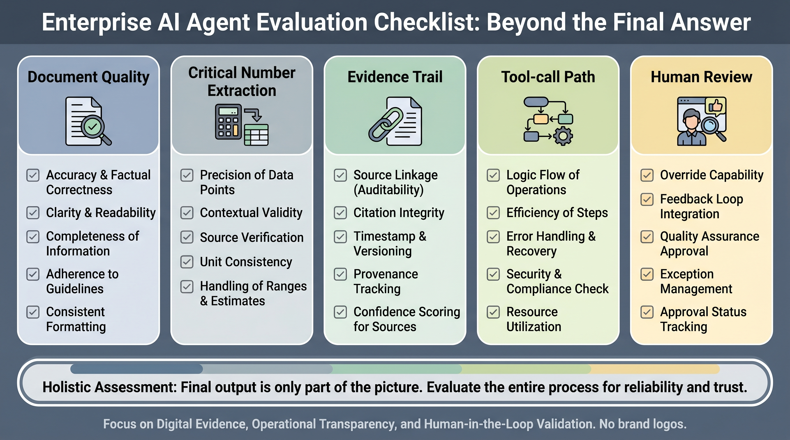
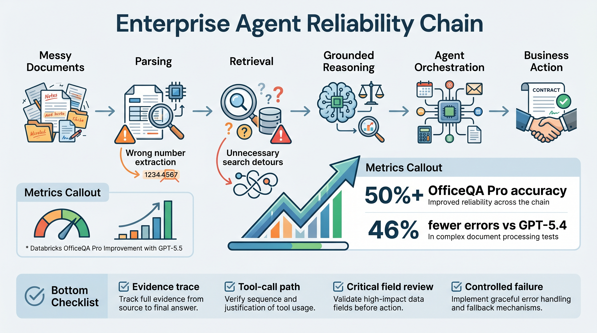

# Databricks Shows Where Enterprise Agents Still Break

OpenAI's Databricks case study looks like a model-performance story. GPT-5.5 reached a new state of the art on OfficeQA Pro, Databricks' benchmark for complex enterprise agent tasks. It exceeded 50% accuracy and reduced errors by 46% compared with GPT-5.4 in the agent-harness setting.

The more useful signal is where the improvement happened.

OfficeQA Pro tests the kind of document work that breaks enterprise agents: scanned PDFs, legacy files, long-context documents, parsing, retrieval, and grounded reasoning. These are not glamorous tasks, but they are where production workflows fail.

## The real bottleneck is document reliability

Enterprise agents do not usually fail because they cannot produce fluent text. They fail because their inputs are messy.

A scanned PDF may hide a critical number. An old file may have inconsistent formatting. A long document may contain the relevant clause on one page and a conflicting exception twenty pages later. A small extraction error can corrupt the whole workflow.

Databricks research engineer Arnav Singhvi described the issue clearly: if a model cannot extract a certain digit or number, the entire trajectory of the agent changes.

That is the core problem. Once the evidence layer is wrong, downstream reasoning becomes unreliable.

## What GPT-5.5 improved

Databricks reported two practical improvements.

First, GPT-5.5 performed better on parsing-heavy workflows, especially older documents and scanned PDFs. That matters because enterprise work often depends on exact dates, amounts, IDs, tables, and contractual terms.

Second, GPT-5.5 improved multi-step orchestration. Databricks noted that GPT-5.4 sometimes took unnecessary search detours, creating inefficient trajectories. GPT-5.5 was more reliable at retrieving relevant context and completing complex workflows without additional supervision.

This means the gain is not only "better answers." It is better handling of the chain:

- parse the document correctly
- retrieve the right context
- reason from grounded evidence
- coordinate specialized agents or tools
- complete a business workflow

## Why Databricks' production path matters

Databricks is making GPT-5.5 available through AI Unity Gateway, where customers use it inside workflows built with AgentBricks and the Agent Supervisor API.

That detail matters because enterprise adoption is not just model access. Companies need control over routing, supervision, tool use, data boundaries, monitoring, and failure handling.

In this setup, GPT-5.5 is not just answering prompts. It helps supervise workflows across parsing, retrieval, and execution.

## What teams should learn from this

Teams building internal agents should not only test clean examples. They should test the documents that actually appear in production: scanned files, old PDFs, broken tables, long reports, and mixed-format attachments.

They should also separate final-answer accuracy from workflow quality. A good evaluation should ask:

- Did the agent extract critical numbers correctly?
- Did it retrieve the right evidence?
- Can the output be traced back to source material?
- Did the agent take unnecessary search or tool-call detours?
- Where should human review remain mandatory?

Those questions matter more than a polished demo.

## The right conclusion

GPT-5.5's OfficeQA Pro result is a meaningful improvement, but it is not a sign that enterprise agents are solved. A 50% accuracy threshold on a hard benchmark still means the task is difficult.

The useful lesson is narrower and more practical: enterprise agents need stronger document parsing, better retrieval discipline, clearer evidence trails, and supervision across multi-step workflows.

The agents that reach production will not be the ones that sound the most impressive. They will be the ones that can show where the evidence came from, avoid unnecessary detours, and stop cleanly when confidence is low.
