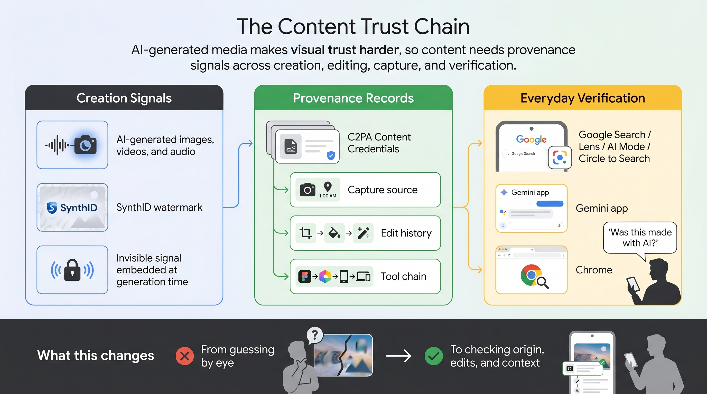
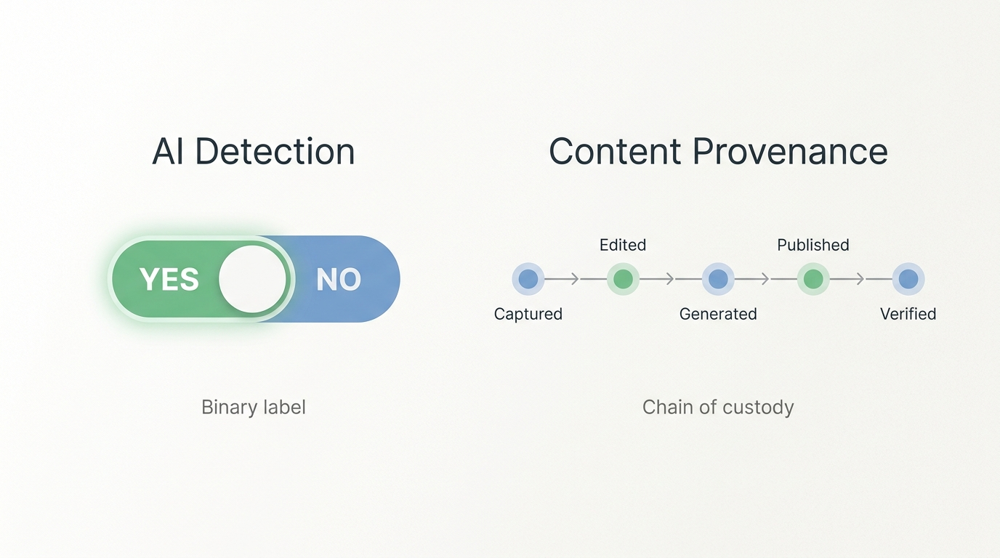
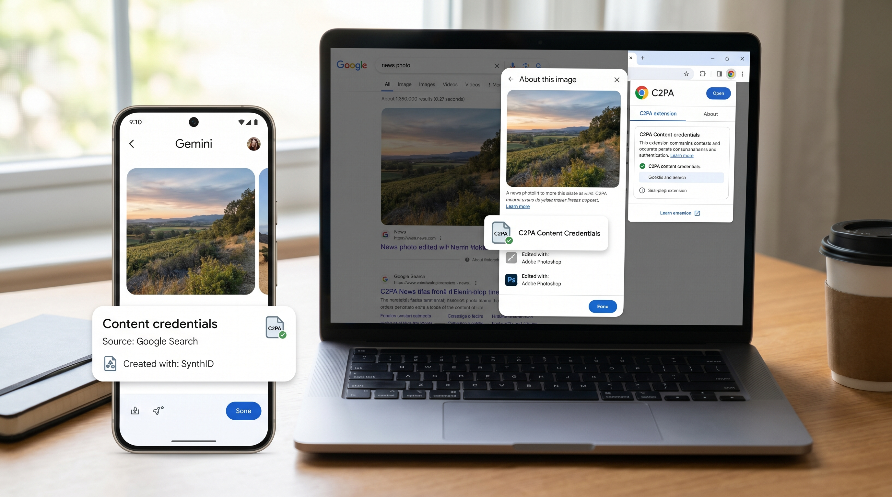

# Digital Content Needs an Identity Layer

Google's latest update is easy to misread as another AI detection feature. The more important shift is deeper: digital media is starting to need an identity layer.

As images, videos, and audio become easier to generate or edit, the useful question is no longer only "was this made by AI?" It is also "where did this come from, was it changed, and which tools touched it?"

Google is approaching that problem through two complementary systems.

SynthID is the watermarking layer. It embeds imperceptible signals into AI-generated content. Google says SynthID has already been used across more than 100 billion images and videos, plus 60,000 years of audio.

C2PA Content Credentials are the provenance layer. They help show how media was created and modified, whether or not AI was involved. Pixel 10 already supports Content Credentials for photos in the native camera app, and Google says video support is coming to Pixel 8, 9, and 10.

The distinction matters. AI detection asks a binary question. Provenance records a chain of custody.

A photo can be captured by a camera and later edited with AI. An image can be generated by AI and then manually revised. A video can be authentic but still lack enough context to explain what happened. A binary label cannot handle all of those cases.

That is why Google is also moving verification into everyday surfaces. SynthID verification is already available in the Gemini app and has been used 50 million times globally. Google is expanding it to Search and Chrome. Users will be able to use Lens, AI Mode, Circle to Search, and Gemini in Chrome to ask whether an image was made with AI.

For content teams, this changes asset review. Marketing, brand, PR, and operations teams will need to check not only copyright and quality, but also whether the source of a piece of media can be explained.

For journalists and researchers, provenance can become an early signal in verification. It will not replace investigation, but it can reduce the cost of the first pass.

For companies, provenance will likely become part of compliance. If AI-generated media is used in ads, training materials, customer presentations, or public communications, teams will need a record of how that content was produced and edited.

The limits are important. These systems depend on ecosystem adoption. Metadata can be stripped. Watermarks can become part of an adversarial game. A verified original can still be misleading if it lacks context. A file without credentials is not automatically fake.

So this is not a truth machine. It is one layer in a content trust chain.

The long-term signal is clear: platforms are moving from displaying content to explaining content origin. In the AI media era, digital literacy will mean more than searching well. It will mean knowing how to ask where a file came from.
