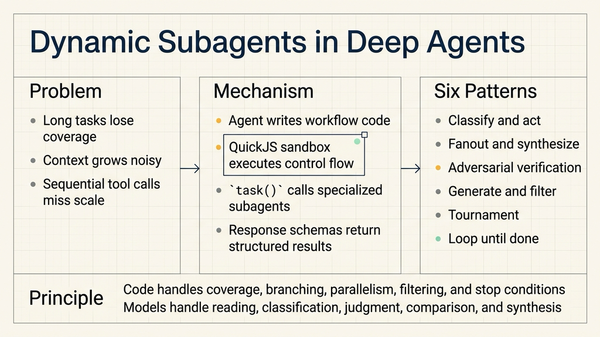
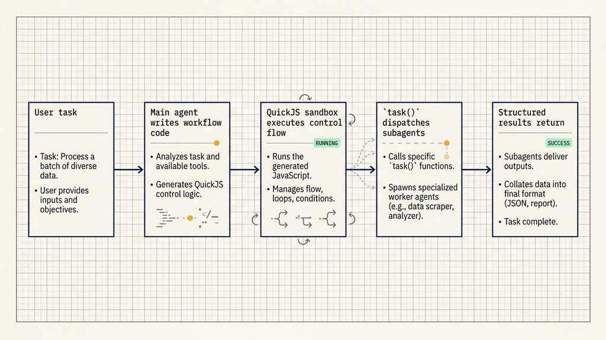
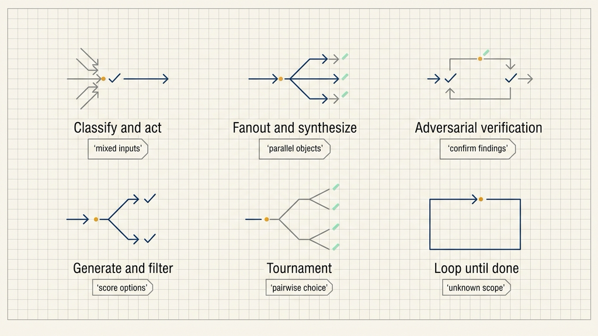

# Dynamic Subagents in Deep Agents: Code Handles Coverage, Models Handle Judgment

## Source

- Source: LangChain Blog
- Original article: Introducing Dynamic Subagents in Deep Agents
- Link: https://www.langchain.com/blog/introducing-dynamic-subagents-in-deep-agents
- Published: June 29, 2026
- Topic: Dynamic subagents in Deep Agents, code interpreters, `task()` dispatch, and six orchestration patterns for agent workflows

When agents are asked to review a directory, summarize hundreds of pages, process a batch of support tickets, or run a security scan, the visible failure is often simple: the task scope gets smaller while the agent is working. It checks a few files and summarizes early. It handles part of a batch and stops. It finds several issues and treats them as the whole result.

LangChain's Dynamic Subagents feature in Deep Agents addresses that problem by changing how multi-step work is orchestrated. Instead of relying on the agent to remember a long sequence of tool calls through conversation, the agent writes a short workflow script. That script then drives subagent execution.

The important split is direct: code handles loops, branching, concurrency, filtering, deduplication, and stop conditions. Models handle classification, review, verification, comparison, and synthesis.



## Why Regular Multi-Step Agents Lose Coverage

Deep Agents already supports subagents. A main agent can delegate a discrete unit of work to a subagent, keep the subagent's intermediate context out of the main context window, and receive a result back.

That works well for small, contained tasks:

- reviewing one file;
- summarizing one page;
- analyzing one support ticket;
- checking one finding;
- answering one specialized question.

The failure pattern changes when the task becomes wide or multi-stage. A request such as "review every file under `src/routes/`" requires reliable enumeration. A request such as "summarize 300 pages" requires repeated execution across every page. A request such as "find possible security issues and then verify them independently" requires a two-stage workflow with a clear handoff.

Those requirements are control-flow requirements. Prompting can state the goal, but code can make the workflow explicit.

Dynamic subagents are designed for this gap. The agent still reasons about the task, but once the work shape is clear, it can write workflow code and let the interpreter execute that workflow.

## How Workflow Code Dispatches Subagents

Deep Agents gives the agent access to a code interpreter. When a task requires a workflow, the agent can write JavaScript. The interpreter executes that script.

When subagents are configured, the interpreter exposes a global `task()` function. Workflow code can call `task()` to send work to a specific subagent type.

A typical workflow has six parts:

1. identify the list of objects to process, such as files, pages, tickets, logs, or candidate plans;
2. build a subtask description for each object;
3. call `task()` with the right subagent type;
4. run calls in parallel or in stages;
5. filter, sort, deduplicate, or loop based on structured results;
6. ask the main agent to synthesize the final report.

The article's document example is straightforward. If the input is a 300-page document, the workflow can loop over the page list and dispatch one summarization task per page. As long as the page list is complete, every page is scheduled. The main agent no longer needs to keep the remaining page count in its conversational context.

The implementation detail is also small: add QuickJS support and include `CodeInterpreterMiddleware` in `create_deep_agent`. LangChain's terminal coding agent `dcode` can be used for quick experimentation because it already has the code interpreter enabled.



## `task()` Connects Control Flow and Model Judgment

The `task()` function is the bridge between deterministic workflow control and model-based judgment.

It normally carries three kinds of information:

- `description`: what the subagent should do in this task;
- `subagentType`: which configured subagent role should handle it;
- `responseSchema`: what structured shape the result should return.

The response schema matters because it turns subagent output into data the workflow code can use. For example, a security reviewer can return a severity field and an issue list. The workflow can then keep only high-severity findings or pass medium-and-above findings to a verifier.

That division is the practical center of the design.

Code is good at deterministic actions:

- iterating over every item;
- running tasks concurrently;
- applying if-then branches;
- sorting and deduplicating results;
- stopping when no new result appears.

Models are useful for judgment-heavy actions:

- reading code;
- understanding documents;
- classifying tickets;
- judging risk;
- comparing proposals;
- writing a synthesis.

Dynamic subagents let each side do the part it is better suited for.

## Six Orchestration Patterns

LangChain organizes common dynamic-subagent workflows into six patterns. They are useful because they map different task shapes to different orchestration structures.

| Pattern | Workflow shape | Useful work type |
| --- | --- | --- |
| Classify and act | classify first, then route to different roles | mixed inputs that need different handling |
| Fanout and synthesize | process many independent objects, then merge | many files, pages, services, or records |
| Adversarial verification | discover first, then independently verify | audits where false positives are expensive |
| Generate and filter | generate multiple options, then score and keep the best | architecture plans, refactoring strategies, prompt variants |
| Tournament | compare options pairwise until one winner remains | subjective or relative selection |
| Loop until done | repeat discovery until no new result appears | unknown-scope searches, scans, or dependency reviews |



### Classify and Act

Classify and act fits a mixed input stream.

A support queue may contain bugs, feature requests, and ordinary usage questions. A single agent handling every item in one pass can mix the response style. A cleaner workflow first classifies each item, then routes the item to a specialized subagent.

The workflow can be:

1. read each ticket;
2. classify it as bug, feature request, or support question;
3. route bugs to a `bug-investigator`, feature requests to a `feature-analyst`, and usage questions to a `support-responder`;
4. merge the results by type.

This pattern is also useful for feedback lists, logs, alert streams, and inbound triage queues. The code owns the routing. Each subagent owns the judgment inside one category.

### Fanout and Synthesize

Fanout and synthesize fits many independent objects.

Code review is the easiest example. The agent can enumerate every TypeScript file under `src/`, dispatch one security reviewer per file, and collect structured results. The final synthesis can sort findings by severity and group them by subsystem.

Document work follows the same shape. A 300-page document can be split into page-level or section-level tasks. Each summarizer sees only its assigned segment. The final report merges local summaries into a global view.

This pattern solves two problems at once: coverage and parallelism. If the list is complete, every item is processed. If the items are independent, the work can run concurrently.

### Adversarial Verification

Adversarial verification fits work where false positives are expensive.

Security auditing is the typical case. The first auditor can use a broad search strategy and return possible findings. A second verifier then checks each finding independently and returns a narrow result such as `CONFIRMED` or `REFUTED`.

The final report keeps only verified findings.

This pattern trades speed for confidence. It can also apply to compliance checks, finance rule checks, policy reviews, or any task where a false positive would waste human review time.

Code handles the handoff between stages. It expands first-round findings into verification tasks, waits for results, and filters the final list. Models judge whether each finding holds up.

### Generate and Filter

Generate and filter fits solution exploration.

If an agent needs to refactor a rate limiter, asking for one plan can lock the result into a single path. A better workflow is to ask several architect subagents to propose independent plans. Each plan can be written to a separate artifact. Then code can score the plans against task-specific criteria.

The criteria need to come from the work: behavior under burst traffic, support for multi-instance deployment, operational complexity, and maintainability.

This pattern works for architecture design, refactoring strategies, prompt variants, product copy, and test-plan alternatives. It expands the candidate set first, then narrows it with explicit criteria.

The weak point is vague scoring. If the criteria are unclear, the workflow may produce many different-looking options without a reliable way to choose.

### Tournament

Tournament fits subjective selection.

Some choices are hard to score directly. For example, multiple rewrites of a complex `createOrder` handler may trade readability, brevity, error handling, and testability differently. A judge subagent can compare two candidates at a time. The winner advances until one candidate remains.

This reduces the cognitive load on the judge. Instead of assigning absolute scores to many options, it repeatedly answers a smaller question: which of these two is better under the stated criteria?

The result depends on candidate quality and judge consistency. The criteria should be stable before the tournament starts.

### Loop Until Done

Loop until done fits unknown-scope discovery.

Dead-code detection, dependency audits, legacy configuration scans, and incident log investigations often start without a known final list. One discovered item may lead to another.

The workflow can repeat:

1. run a discovery pass;
2. deduplicate new findings against known findings;
3. start another pass if new findings exist;
4. stop when a pass returns no new findings.

The stop condition is the key. Writing "stop when no new findings appear" into code is more reliable than asking an agent to remember when to stop through a long conversation.

## A Practical First Trial

A good first trial is a read-only directory review.

Ask the agent to review every file under `src/routes/` and return a risk summary for each file plus a prioritized final report.

Example prompt:

```text
Run a workflow that reviews every file in src/routes/ and summarizes the top risks.
Do not modify files. Return a grouped report with file path, risk level, and suggested next step.
```

Three checks matter.

First, coverage. The report should include every file in the target directory.

Second, structure. Each file result should include a path, risk level, issue summary, and suggested next step.

Third, traceability. The execution should show workflow logic such as enumeration, loop, parallel dispatch, or staged verification, not just a generic final summary.

For an enterprise engineering team, the same exercise can be run as a small read-only review workflow. Keep the agent from modifying code. Keep logs of the dispatch script, per-file results, and final synthesis. That preserves human review and rollback while making the orchestration pattern visible.

The pattern is not necessary for every task. If the job only covers two or three files, normal tool calls may be enough. If the environment cannot safely run interpreter code, the workflow should wait. If subagent roles are poorly specified, code-based dispatch can still send work to the wrong role.

## The Operating Principle

Dynamic subagents can be summarized as one operating principle:

Code handles coverage. Models handle judgment.

Code handles how many objects must be processed, how tasks branch, how concurrency is used, how results are filtered, and when the loop stops.

Models handle code reading, document understanding, ticket classification, risk judgment, proposal comparison, and final synthesis.

For long, wide, or multi-stage agent work, that division is more reliable than asking a single agent to carry the whole workflow in context. LangChain's dynamic subagents make the workflow explicit: the agent writes the process first, then uses that process to coordinate more agents.
