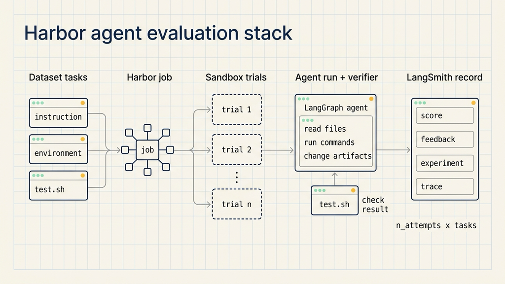
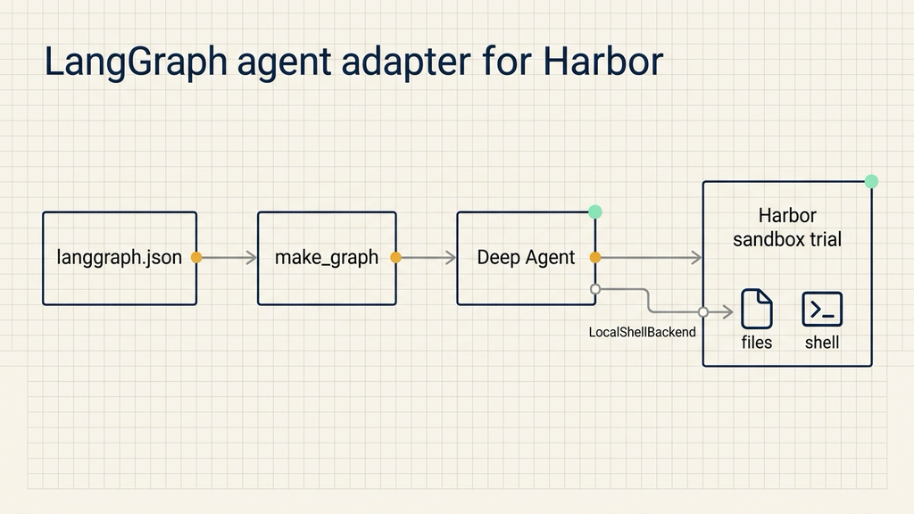
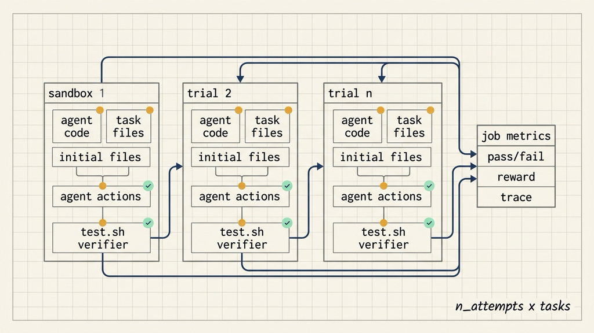

# Evaluating AI agents in real environments with Harbor

Source: LangChain Blog  
Original: https://www.langchain.com/blog/unified-stack-for-evaluating-agents  
Published: June 30, 2026  
Topic: Harbor, Deep Agents, LangSmith Sandboxes, and LangSmith Observability as a unified stack for agent evaluation

Once an AI agent gets access to a repository, a terminal, and a filesystem, evaluation changes shape. A single test may need a clean directory, a set of starting files, a command to run, artifacts to inspect, and a script that decides whether the result is acceptable. Reading the agent's final message is no longer enough.

Harbor and LangChain approach the problem as an environment-level evaluation. The agent, dataset, sandbox, and deterministic verifier all belong in the same repeatable run. Each trial starts in an isolated machine. The agent performs work inside that environment. A script checks the result. LangSmith records the score and the execution trace.

That is the useful shift: the evaluation target is no longer "what did the model say?" It is "what did the agent do in a real environment?" Which files did it read? Which state did it change? Which artifacts did it create? Did the final filesystem satisfy the task?



## Harbor evaluates a full task, not a final answer

Harbor is an eval harness. It expects three inputs:

- An agent under test.
- A dataset containing tasks.
- A sandbox where each task can run.

Each task contains three concrete parts:

- An environment, usually a Dockerfile or Docker Compose YAML.
- An instruction, usually Markdown.
- An evaluation script, usually `test.sh`.

This is different from a simple LLM evaluation. A basic LLM eval can often compare a generated answer to a reference answer. Agent evals need an execution environment because the agent may read files, run commands, write code, generate artifacts, and change state. The evaluation script becomes the judge for those artifacts.

A Harbor task is closer to a temporary lab. The environment starts clean. The instruction and starting files are already on the table. The agent enters, works, and leaves behind files, logs, or command results. `test.sh` checks the lab after the run.

## Where LangChain fits into Harbor

LangChain connects to Harbor in three places.

Deep Agents provides the agent under test. A deep agent built with LangChain can run inside Harbor's sandboxed environment.

LangSmith Sandboxes provides the execution environment. Harbor can create a clean LangSmith sandbox for each trial, so every run gets its own machine.

LangSmith Observability records the results. Harbor writes a job into LangSmith as a dataset and experiment. Each trial can include feedback and, when supported, a trace of the agent's steps.

The flow is:

```text
dataset/task -> Harbor job -> sandbox trial -> agent run -> test.sh -> LangSmith experiment
```

Harbor orchestrates the run. The sandbox isolates the environment. `test.sh` determines whether the task passed. LangSmith keeps the score and the trace.

## Connecting a LangGraph agent

Harbor includes a `langgraph` agent adapter. You select it with:

```bash
--agent langgraph
```

Harbor then reads `langgraph.json`. This file acts like a registry: it declares dependencies and maps a graph name to the function that builds the graph.

A minimal file looks like this:

```json
{
  "dependencies": [
    "deepagents>=0.6.10,<0.7.0",
    "langchain-fireworks>=1.3.1,<1.4.0"
  ],
  "graphs": {
    "deep_agent": "./agent.py:make_graph"
  }
}
```

The graph name `deep_agent` resolves to `make_graph` in `agent.py`. That function builds the Deep Agent and returns the compiled graph Harbor will invoke:

```python
from deepagents import create_deep_agent
from deepagents.backends import LocalShellBackend


def make_graph():
    return create_deep_agent(
        model="fireworks:accounts/fireworks/models/glm-5p2",
        backend=LocalShellBackend(),
    )
```

`make_graph` is the entry point Harbor calls. The agent remains your own code; Harbor only needs a stable way to load it.

`LocalShellBackend` matters when the eval checks real files or shell behavior. By default, `create_deep_agent` keeps files in an in-memory virtual filesystem. That is useful for some agent workflows, but it will not touch the sandbox filesystem. If the task expects the agent to edit files inside the Harbor environment, the Deep Agent needs the shell backend.

For every trial, Harbor copies the agent into that trial's sandbox, installs the dependencies from `langgraph.json` into a fresh virtual environment, and runs the graph inside the container. Trials do not share state.



## Passing the model from the command line

The first example fixes the model in code:

```python
model="fireworks:accounts/fireworks/models/glm-5p2"
```

Harbor can also pass the model through the run config. The graph entry point receives `config`, and Harbor places the `--model` value under `configurable.model`:

```python
from deepagents import create_deep_agent
from deepagents.backends import LocalShellBackend


def make_graph(config):
    return create_deep_agent(
        model=config["configurable"]["model"],
        backend=LocalShellBackend(),
    )
```

That lets a team keep the agent, dataset, and verifier stable while changing only the model. The resulting scores and traces then show how different model choices affect pass rate, failure mode, and cost.

## Why each trial needs its own sandbox

Agent behavior is not fully deterministic. One task run is rarely enough. Harbor uses `n_attempts` to repeat every task multiple times and average the result.

The job size is:

```text
n_attempts x tasks
```

Each repetition is its own trial.

For each trial, Harbor provisions a new sandbox and copies in the agent code, the task, and the starting files. It runs the agent, runs the verifier, and records the result.

LangSmith Sandbox is one environment provider:

```bash
-e langsmith
```

Harbor can also use Daytona, Docker, Modal, and E2B behind the same `-e` flag. Switching the provider does not require changing the agent, dataset, or verifier.

The practical rule is simple: the environment belongs to the task. If an agent edits files, runs commands, or calls tools, it should be evaluated in an environment that can be recreated. Otherwise a pass may be hard to reproduce, and a failure may be hard to diagnose.



## LangSmith records scores and traces

The `harbor-langsmith` integration is enabled with:

```bash
--plugin langsmith
```

With the plugin enabled, Harbor records each job in LangSmith. It syncs the dataset, creates an experiment, logs a run for every trial, and writes the verifier reward as feedback.

If the agent supports LangSmith tracing, those traces attach to the experiment. That gives two views of the same evaluation:

- The score says whether the trial passed.
- The trace shows what the agent did on the way there.

This is where agent eval becomes easier to debug. A score can tell a team that a run failed. A trace can show whether the failure came from instruction interpretation, file access, command execution, dependency installation, or the final verifier.

## A minimal first run

If you already have a LangSmith account and dataset, install Harbor with the LangSmith extra:

```bash
pip install "harbor[langsmith]"
```

Set LangSmith, tracing, and model credentials:

```bash
export LANGSMITH_API_KEY="<LANGSMITH_API_KEY>"
export LANGSMITH_PROFILE=prod
export LANGSMITH_TRACING=true
export LANGSMITH_PROJECT=harbor-deepagents
export FIREWORKS_API_KEY="<FIREWORKS_API_KEY>"
```

Then run:

```bash
harbor run \
  --agent langgraph \
  --model fireworks:accounts/fireworks/models/glm-5p2 \
  --ak project_path=./deep-agent --ak graph=deep_agent \
  -d terminal-bench@2.0 \
  -e langsmith \
  --plugin langsmith
```

The important pieces are:

- `--agent langgraph` tells Harbor to load a LangGraph application.
- `--ak project_path=./deep-agent --ak graph=deep_agent` points to the agent project and graph name.
- `-d terminal-bench@2.0` selects the dataset.
- `-e langsmith` selects LangSmith Sandbox.
- `--plugin langsmith` sends the results into LangSmith.

For a first run, keep the check narrow:

- Did each trial get an independent sandbox?
- Did `test.sh` judge the agent result consistently?
- Does the LangSmith experiment contain score, feedback, and trace?

Once those three checks work, increase the number of tasks and `n_attempts`. Starting with a large dataset makes failures harder to attribute. The problem may be the agent, the task definition, the sandbox image, dependency installation, or the verifier.

## A small transferable exercise

A useful practice task is code review or bug repair. Give the agent a small repository and a Markdown instruction. Ask it to fix one failing test. Put the starting files inside the sandbox. Use `test.sh` to run the unit test and check whether the expected file changed.

That exercise covers the core stack: Harbor repeats trials, LangSmith Sandbox provides a clean environment, and LangSmith trace records which files the agent read and which commands it ran.

Keep a human review step before any agent-produced patch enters a real repository. Keep logs and a rollback path. If the Docker environment cannot be reproduced, if `test.sh` is unstable, or if tracing is missing, the setup is not ready for longer tasks.

## When Harbor is a good fit

Harbor is useful for agent evaluations where the environment matters.

It fits agents that operate on a filesystem: fixing code, adding tests, editing configuration, or generating project files. In these cases, `test.sh` can check file content, test output, and command results.

It fits long-running agents that read, write, execute, and adjust over several steps. Trial isolation and traces help locate the failure point.

It fits model or strategy comparisons. Keep the agent entry point, dataset, and verifier fixed; change `--model` or runtime configuration; compare pass rate and traces.

It is less useful for tasks that only require answer scoring. If the agent does not touch the environment and does not create artifacts, a simpler LLM eval may be enough. If there is no stable `test.sh` and the score depends on subjective human judgment, Harbor can still run the workflow, but the score will be weak. If a task needs production resources, replace them with sandboxed mocks before letting the agent act.

The short learning path is: connect one agent through `langgraph.json`, write a tiny dataset, run several trials in LangSmith Sandbox, and check whether `test.sh` plus trace explain the failures. When failures are explainable, agent evaluation becomes maintainable.
