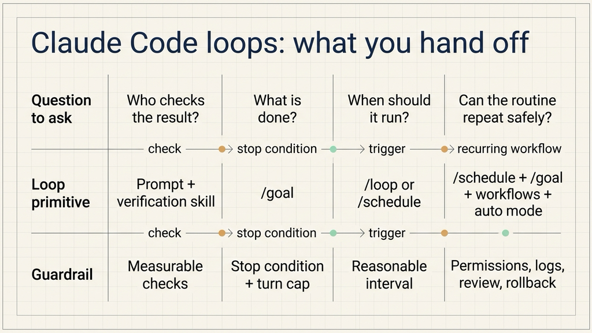
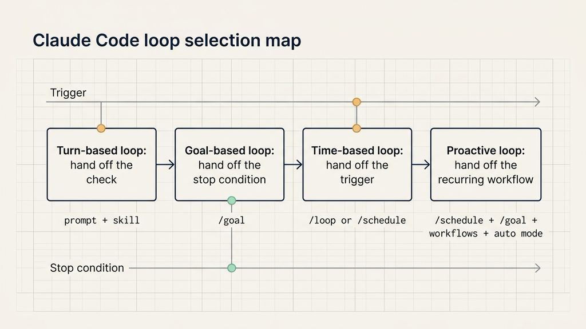
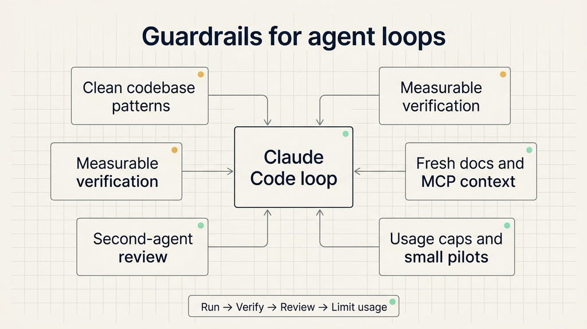

# Four Claude Code loops: how to hand off checks, stop conditions, triggers, and recurring work

Source: Claude Blog  
Original link: https://claude.com/blog/getting-started-with-loops  
Published: June 30, 2026  
Topic: How Claude Code defines agentic loops, and how to choose between turn-based, goal-based, time-based, and proactive loops.

When people use Claude Code for real work, the first bottleneck is often not code generation. It is the repeated human handoff around the code generation: ask Claude to make a change, wait for the result, ask it to run tests, ask it to check the browser, ask it to fix CI, ask it to try again.

Anthropic's Claude Code team frames this as a loop design problem. A loop is a repeated cycle of agent work that continues until a stop condition is met. The practical question is not simply "how do I prompt the model?" It is: who triggers the next run, what tells the agent to stop, which Claude Code primitive should be used, and what kind of task should be handed off?

The source article separates Claude Code loops into four types:

| Loop type | What you hand off | Use it when | Primitive |
| --- | --- | --- | --- |
| Turn-based loop | The check | You are exploring or still deciding | Prompt + custom verification skill |
| Goal-based loop | The stop condition | You know what done looks like | `/goal` |
| Time-based loop | The trigger | The work happens on a schedule or in an external system | `/loop`, `/schedule` |
| Proactive loop | The recurring prompt and execution path | The work is repeated and well-defined | `/schedule`, `/goal`, dynamic workflows, auto mode |



The useful pattern is gradual delegation. First hand off the check. Then hand off the stop condition. Then hand off the trigger. Only after the work is repeatable should the whole routine run proactively.

## Start with trigger and stop condition

Loop design becomes clearer when trigger and stop condition are separated.

The trigger answers: who starts the next run? It may be a human prompt, a five-minute interval, a daily routine, or a new item appearing in a feedback queue.

The stop condition answers: when should the loop end? It may end when Claude thinks the task is complete, when tests pass, when a Lighthouse score reaches 90, when a PR is merged, or when all bug reports found during the current run have been triaged and answered.

Once those two questions are explicit, the four loop types are easier to choose.

## Turn-based loops: hand off the check first

A turn-based loop is the normal Claude Code interaction. A user sends a prompt. Claude gathers context, modifies files, checks its work, repeats if needed, and replies. Claude stops when it judges the task is complete or needs more context.

This is suitable for short tasks, exploratory tasks, and one-off changes.

For example, ask Claude to create a like button. It reads the code, edits the component, runs tests, and returns a result. The human still reviews whether the button appears, whether clicking it changes state, whether the browser console is clean, and whether performance was affected.

The weak point is verification. If the human keeps writing "open the browser", "click it", "take a screenshot", and "check the console", those checks should be encoded into a skill.

The source article gives this SKILL.md example:

```markdown
---
name: verify-frontend-change
description: Verify any UI change end-to-end before declaring it done.
---
# Verifying frontend changes
Never report a UI change as complete based on a successful edit alone. Verify it the way a human reviewer would:

1. Start the dev server and open the edited page in the browser.

2. Interact with the change directly. For a new control (button, input, toggle): click it, confirm the expected state change, and screenshot before/after.

3. Check the browser console: zero new errors or warnings.
4. Use the Chrome Devtools MCP, run a performance trace and audit Core Web Vitals.

If any step fails, fix the issue and rerun from step 1. Do not hand back partially verified work.
```

The important detail is measurability. Screenshots, state transitions, browser console errors, and Core Web Vitals can be observed by tools. The more measurable the check is, the less the agent has to guess.

Turn-based loops are not the right fit for unattended work. They still depend on a human to continue the process. Use them when the work is new, short, or not yet stable enough to automate.

## Goal-based loops: hand off the stop condition

When a task requires multiple attempts and the success condition is already known, use a goal-based loop.

The source article uses this example:

```text
/goal get the homepage Lighthouse score to 90 or above, stop after 5 tries.
```

This prompt contains two controls:

1. A measurable success condition: the homepage Lighthouse score reaches 90 or above.
2. A maximum attempt count: stop after five tries.

Each time Claude tries to stop, an evaluator checks the goal. If the condition has not been met and the turn cap has not been reached, Claude continues working.

Goal-based loops work well for:

- all unit tests passing,
- a performance score reaching a threshold,
- lint and type checks clearing,
- a script producing expected output,
- screenshots matching expected behavior,
- a specific regression disappearing.

They work poorly when the goal is vague. "Make the homepage feel more polished" does not give the evaluator a stable way to decide whether to continue. A better goal would be: "mobile first viewport has no overlap, primary button is clickable, no new console errors, and Lighthouse performance is at least 90."

The value of `/goal` is that the human no longer has to monitor every attempt. The stop condition and maximum turns are written up front. That also prevents a loop from running indefinitely after the improvement has flattened out.

## Time-based loops: hand off the trigger

Some work depends on external systems. A PR may receive review comments later. CI may fail ten minutes after the first push. A Slack channel may need summarizing each morning. A feedback queue may receive new bug reports at irregular intervals.

For these cases, Claude Code can rerun a prompt on a time interval:

```text
/loop 5m check my PR, address review comments, and fix failing CI
```

Here the work is not simply "fix PR". It is "check every five minutes, see whether something changed, and act if needed."

`/loop` runs on the local machine. If the machine shuts down, the loop stops. For cloud-based recurring routines, the article points to `/schedule`.

A practical split:

- Use `/loop` for short-lived monitoring while you are actively working on the machine.
- Use `/schedule` for recurring work that should happen on a fixed cadence, such as morning summaries or hourly queue checks.

The interval matters. Too short and the routine burns tokens polling a system that has not changed. Too long and it responds too late. Start with a conservative interval, observe the actual waiting time for a few runs, then adjust.

## Proactive loops: compose the whole recurring workflow

Proactive loops are for repeated, well-defined work streams: bug reports, issue triage, migrations, dependency upgrades, and similar routines.

The source article composes several Claude Code primitives:

1. `/schedule` runs a routine that checks for new reports.
2. `/goal` defines what done means for the current run.
3. Dynamic workflows orchestrate agents that triage each report, fix it, and review the fix.
4. Auto mode lets the routine run without stopping for every permission prompt.

The combined prompt looks like this:

```text
/schedule every hour: check #project-feedback for bug reports. /goal: don't stop until every report found this run is triaged, actioned, and responded to. When fixing a bug, use a workflow to explore three solutions in parallel worktrees and have a judge adversarially review them.
```



This prompt includes the trigger, the stop condition, the execution pattern, and the review pattern.

A proactive loop should not start from a loose instruction such as "handle all bugs." A safer routine says what to check, which items belong to the current run, how to triage, when code changes are allowed, where worktrees should be created, and which reviewer checks the fix.

Proactive loops should not be fully automatic for high-risk operations. Payment, permissions, data deletion, production configuration, compliance-sensitive workflows, and irreversible operations need human confirmation, logs, rollback plans, or approval gates.

## Code quality depends on the system around the loop

More loops do not automatically mean better work. The loop follows the surrounding system.

First, the codebase needs consistent patterns. Claude copies local conventions. If a repository has inconsistent naming, missing tests, or unclear file structure, the loop can reproduce that mess faster.

Second, verification needs to be encoded. A skill, script, test suite, browser check, screenshot comparison, or log check is better than repeated human reminders.

Third, documentation needs to be reachable. Framework, library, SDK, MCP, and browser tooling behavior changes. If the loop depends on those tools, Claude needs access to current docs rather than stale assumptions.

Fourth, a second agent can review the result with fresh context. The agent that produced the patch is biased toward its own path. A separate reviewer is better positioned to find missing cases, over-edits, and weak verification.

When a result misses the standard, the fix should feed back into the system: update the skill, the script, the checklist, or the routine. That changes future loops, not only the current patch.

## Token usage needs explicit limits

Loops consume tokens. Dynamic workflows can spawn many agents, so cost needs to be designed into the loop.

The article suggests several controls:

- Choose the right primitive and model. Small tasks do not need many agents. Simple classification or routine cleanup can often use faster models, while judgment-heavy steps can use stronger models.
- Write clear success criteria. Vague goals cause repeated attempts; measurable goals end earlier.
- Pilot before scaling. Run a dynamic workflow on five issues before sending it across fifty.
- Use scripts for deterministic work. File conversion, form filling, formatting, and fixed checks should be scripts when possible.
- Do not run routines more often than the watched system changes.
- Review usage. `/usage` shows recent usage by skills, subagents, and MCPs. `/goal` without arguments shows turn count and token usage. `/workflows` shows each agent's usage and allows stopping an agent.



The practical rule is simple: every delegated control point should have a measurable result and a cost limit.

## A small way to start

A team does not need to build a full proactive workflow first.

If the repeated work is manual checking, write a verification skill.

If the task has a measurable finish line, use `/goal`.

If the task depends on something changing later, use `/loop` or `/schedule`.

If the task is repeated, well-defined, and safe to run with guardrails, combine schedule, goal, workflow orchestration, review, and auto mode.

Claude Code's four loop types are best understood as gradual delegation. Hand off the check. Then hand off the stop condition. Then hand off the trigger. Only then hand off the recurring routine.
