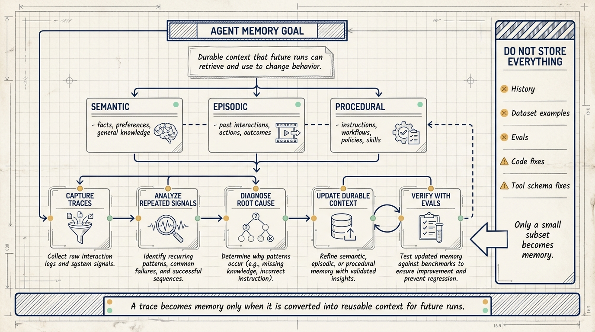
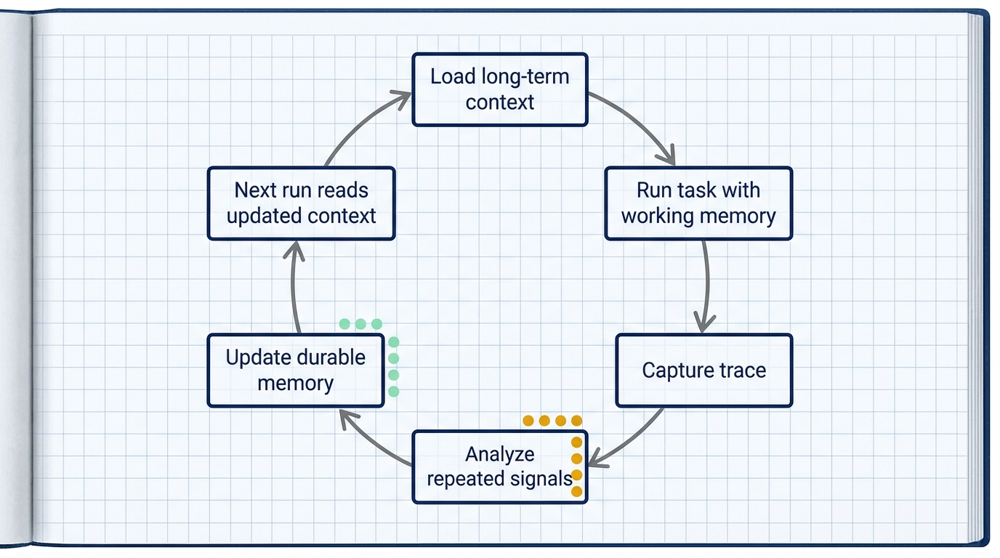
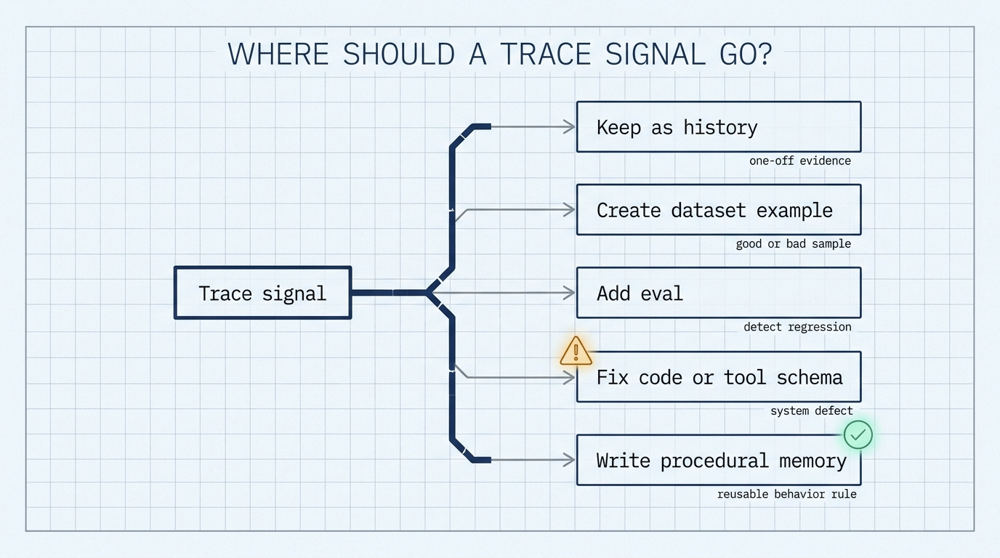

# From Trace to Durable Context: How to Build Memory into AI Agents

Many agent projects run into the same practical problem: the agent makes the same mistake again after the user has already corrected it.

It may use the wrong output format, call tools in the wrong order, skip a review step, route a task to the wrong subflow, or ignore a tone rule that was clarified in a previous run. Teams often respond by adding another sentence to the prompt. After several rounds, the prompt becomes a pile of patches, and nobody can tell which rules still matter.

LangChain's article "How to Build Memory into AI Agents" describes a more manageable pattern: turn agent traces into durable context. The core loop is simple: capture traces, analyze traces, and update memory.

Memory in this context is reusable context that future agent runs can retrieve and use to change behavior.



## Memory is context that changes future behavior

The article defines memory as durable context that an agent can retrieve across runs to guide its behavior. It can include facts, preferences, past interactions, instructions, skills, examples, and learned patterns.

A trace is evidence. It records what happened during a run: the user input, model calls, tool inputs and outputs, retrieved documents, routing decisions, latency, errors, and user feedback.

Memory is what gets extracted from that evidence and made available to future runs.

For example, suppose a code review agent repeatedly focuses on style comments while missing actual bugs and missing tests. The trace can show the input diff, the system instructions, the files read, the final review, and the user's correction. If the system only stores the trace, future runs may not improve. If the lesson becomes procedural memory, the next run can start with a rule such as:

```text
In code review, order findings by risk: bugs, behavioral regressions, and missing tests first. Style comments should appear only when they affect clarity or consistency.
```

That is the point where history becomes memory.

## Short-term memory is for the current task

The article separates memory into short-term memory and long-term memory.

Short-term memory, or working memory, is the context available while the agent is doing the task in front of it. It can include the current thread, recent messages, tool results, retrieved documents, intermediate reasoning artifacts, temporary files, and runtime state.

This memory helps the agent finish the current task. It answers the question: what does the agent need right now?

## Long-term memory shapes later runs

Long-term memory persists beyond the current run. It can include facts, preferences, examples, workflows, policies, instructions, and skills.

The relationship between short-term and long-term memory is a read-and-write loop:

1. A run starts by loading relevant long-term context.
2. The agent works with short-term memory during the task.
3. The run produces a trace.
4. A background process analyzes the trace.
5. A small subset of useful signals becomes updated long-term context.
6. Future runs load that updated context.



The article also maps long-term memory into three categories:

- Semantic memory: what the agent knows, such as facts, preferences, and general knowledge.
- Episodic memory: what the agent has experienced, such as past interactions, examples, actions, and outcomes.
- Procedural memory: how the agent should behave, such as instructions, workflows, policies, skills, and tool-use rules.

In practice, many visible behavior improvements come from procedural memory. If the agent uses the wrong format, calls tools in the wrong order, delegates to the wrong subagent, or ignores a tone rule, the durable fix often belongs in instructions, workflow policy, skills, or routing logic.

## Step 1: capture traces

The first layer is trace capture.

A useful trace records the path the agent took through a task:

- user input
- model calls
- tool inputs and outputs
- retrieved documents
- routing decisions
- latency
- errors
- user feedback

This matters because agent behavior is less deterministic than traditional software. The same symptom can come from different causes. A poor answer may come from a weak prompt, a missing tool, a confusing tool schema, stale retrieved context, or a broad routing rule.

Without traces, teams guess. With traces, they can inspect what the agent actually saw, what it called, what came back, and where the behavior changed.

## Step 2: analyze traces

After traces are captured, the next step is to find useful signal.

Some signals are explicit: user feedback, failed evals, invalid tool calls, or repeated errors.

Other signals appear as patterns:

- the same bad output format
- the same tool argument mistake
- the same routing error
- the same ignored instruction
- the same skipped approval step

Diagnosis is the hard part. If the agent ignores a tone rule, the cause may be vague wording, bad placement, a missing skill rule, or a conflicting instruction.

The trace should drive the diagnosis. Adding another prompt rule without diagnosis can make the system noisier.

## Step 3: update memory

Once the signal is understood, the system decides whether future context should change.

The update may be:

- a clearer instruction
- a routing change
- a new example
- a skill update
- a tool schema fix
- a user preference
- an eval
- a code change

The article's core design rule is that trace data needs triage. Most trace data should remain history. Some should become dataset examples, evals, code fixes, or tool-schema fixes. Only a small subset should become durable context.

A practical triage rule:

- One-off evidence stays in history.
- Good or bad samples become dataset examples.
- Regressions become evals.
- System defects become code or tool-schema fixes.
- Reusable behavior rules become procedural memory.



This decision is where many memory systems become messy. A correction from one user can be a local preference, a product bug, a missing eval, or a durable rule. Treating all of them as memory creates a growing context file that future agents must read even when most entries do not apply.

The cleaner path is to ask what future behavior should change. If the answer is "none, but we want a record," the signal belongs in history. If the answer is "we need a regression check," it belongs in evals. If the answer is "the tool was hard to call correctly," the schema or implementation needs work. If the answer is "future agents should follow this rule in this class of tasks," procedural memory is a good fit.

This keeps memory small enough to load, specific enough to execute, and testable enough to maintain.

## A LangSmith implementation path

The article describes this loop with three LangSmith components:

- LangSmith Observability captures traces.
- LangSmith Engine analyzes traces and extracts improvement signals.
- LangSmith Context Hub stores durable agent context, including instructions, tools, and skills.

The loop closes only when future runs actually load the updated context. If the runtime caches prompts, tools, or skills, memory commits need a refresh path. Otherwise the system may store the right update while the agent continues running with stale context.

For production systems, that refresh path deserves explicit design. A memory update can be stored correctly and still fail operationally if the running agent keeps an old prompt bundle, an old tool list, or an old skill package. The article calls this out because memory is not only a storage problem. It is also a runtime loading problem.

Teams can make this visible by logging the memory version used in each run. If a bad behavior returns, the trace should show whether the agent ran with the current context or a stale one. That single field makes memory debugging much easier.

## NSSA practice scenario

For an NSSA-style enterprise setting, start with a small customer support agent.

The agent answers questions using a knowledge base. The system records each user question, retrieved documents, agent answer, human correction, and final outcome.

The team can review 50 corrected answers and classify the changes:

- one-off factual correction
- reusable answer style preference
- missing policy citation
- unsafe action that requires human approval
- stale knowledge base entry

Only the reusable behavior should become procedural memory. For example:

```text
For refund-related answers, cite the latest policy document and require human confirmation for exceptional orders.
```

Validation should use a small replay set. The agent should cite the right policy and escalate exceptional orders. It should not directly modify orders. Retrieval logs, answer logs, and human approval results should remain traceable.

The same pattern applies to internal engineering agents. If an NSSA code review agent keeps missing tests, the trace should show the diff, files read, generated review, and developer correction. The update may be a procedural review rule, but it may also be a retrieval change that forces the agent to inspect test files before producing findings. The trace decides which fix belongs where.

For operations agents, approval boundaries matter even more. A memory update can teach the agent to recognize a recurring incident pattern, but it should not silently expand the agent's permissions. If an action can change infrastructure, money, customer data, or production availability, the memory rule should preserve human confirmation, logging, and rollback instructions.

## Review checklist

1. Separate working memory from long-term memory.
2. Capture traces before trying to improve behavior.
3. Diagnose repeated issues before adding rules.
4. Route signals to the right destination: history, dataset, eval, code fix, tool schema fix, or memory.
5. Protect behavior-changing memory updates with evals.

## Implementation notes

A small first implementation does not need a complex memory platform. It can start with four things:

1. A trace store that captures enough evidence to diagnose behavior.
2. A review process that classifies repeated signals.
3. A versioned place to store durable instructions, examples, skills, or policies.
4. A replay or eval set that checks behavior after the update.

The important constraint is that these four parts must connect. A trace store without review becomes an archive. A memory store without evals becomes hard to trust. Evals without trace evidence can detect failure but often cannot explain it. A versioned context store that future runs do not load has no effect on behavior.

## Source

- Title: How to Build Memory into AI Agents
- Source: LangChain Blog
- Link: https://www.langchain.com/blog/how-to-give-your-agent-memory
- Published: Wed, 24 Jun 2026 16:16:15 GMT
