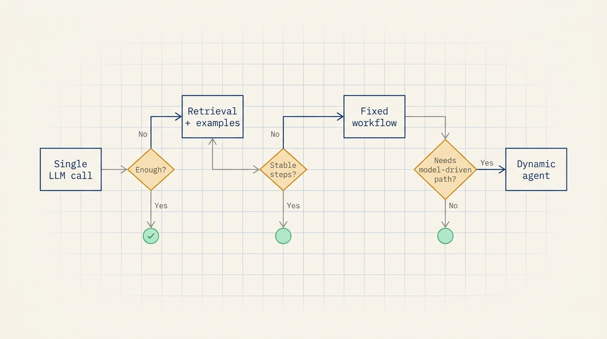
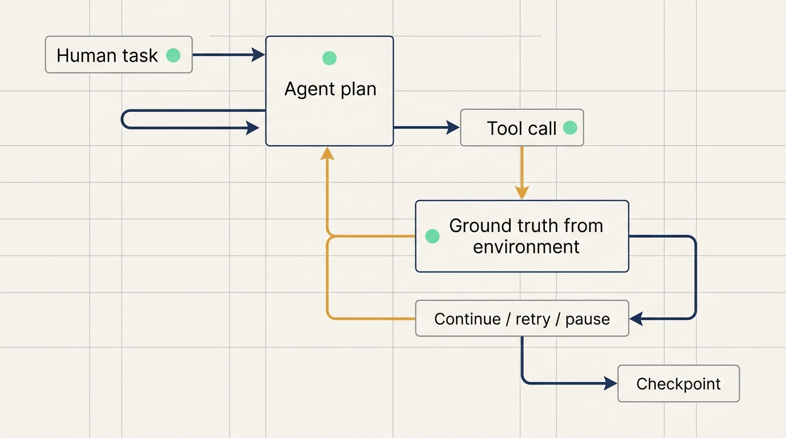
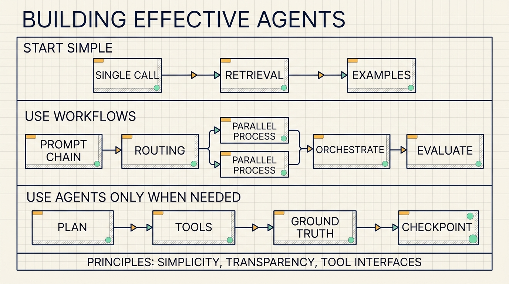

# From Workflow to Agent: An Engineering Choice Checklist

Many teams start an agent project by choosing a framework and wiring together tools, memory, planning, and an execution loop. The system looks complete, but the first real debugging session often exposes the problem: nobody can clearly see what the model saw, which prompt shaped the decision, what tool arguments were generated, or which abstraction layer introduced the failure.

Anthropic's advice in "Building effective agents" is more restrained: start with the simplest system that can solve the task, then add complexity only when the task proves it needs it. Many applications only need a single LLM call, retrieval, and a few in-context examples. Agents become useful when the task needs multiple steps, tool use, environment feedback, and model-driven decisions.

This article is best read as an engineering checklist. It separates augmented LLMs, fixed workflows, autonomous agents, and the tool interfaces that let agents act reliably.

## Start by separating workflows from agents

Anthropic uses "agentic systems" as a broad category, but it draws a useful architectural distinction.

A workflow is a system where LLMs and tools run through predefined code paths. The model may participate, but the process is controlled by software. A simple example is: generate an outline, check the outline against rules, then write the final document from the outline.

An agent is a system where the model dynamically decides what to do next, which tool to call, and whether to continue. It starts from a human request, creates a plan, acts through tools, reads the results, and updates the plan.

That distinction matters because many problems sound like agent problems but are better solved by workflows. If the task can be decomposed into stable steps, a workflow is usually more predictable. Agents fit tasks where the number of steps and the execution path are hard to know in advance.

## Complexity needs evidence

Anthropic's first recommendation is to find the simplest viable solution. "Simple" means every action is explainable, observable, and replaceable.

A support FAQ task may only need retrieval and one answer. A contract explanation task may need retrieval plus a structured response format. A code repair task may need file reads, tests, edits, and iteration based on test results.

Agentic systems usually trade latency and cost for task performance. Every extra model call, tool call, routing step, or loop introduces another possible failure point. That cost is justified only when it measurably improves outcomes.

A useful decision path is:

1. Can one model call solve the task?
2. Can retrieval and examples solve it?
3. Can a fixed multi-step workflow solve it?
4. Does the model need to dynamically decide the path?

Agents are the natural choice only when the fourth condition holds.

## Frameworks accelerate setup and can hide the system

Anthropic mentions tools such as Claude Agent SDK, Strands Agents SDK, Rivet, and Vellum. Frameworks can simplify model calls, tool definitions, parsing, and call chaining.

The risk is abstraction. When an agent fails, teams need access to the real prompt, the real tool definition, the raw model response, the generated tool arguments, and the tool result. If the framework hides those details, debugging turns into guesswork.

Anthropic suggests starting with direct LLM API usage. Many patterns can be implemented with a small amount of code. Once the team understands the flow, state, and failure modes, a framework can be introduced with clearer intent.

Early agent projects need observability more than abstraction. If the team can inspect inputs, outputs, tool arguments, and errors, it can decide whether to improve the prompt, tool design, task decomposition, or evaluation.

## The augmented LLM is the smallest building block

Anthropic uses the augmented LLM as the base building block: an LLM equipped with retrieval, tools, and memory.

Modern models can actively use these capabilities. They can generate search queries, select tools, and decide what information to retain. The engineering task is not just to attach capabilities, but to make the interfaces clear and fit for the use case.

A tool interface should read like documentation for a new teammate. It should explain what the tool does, what each parameter means, when to use it, what failure looks like, and which actions require human confirmation.

MCP can help organize this integration layer. It provides a way to connect external tools through a common client implementation. But MCP does not replace tool design. A poorly documented tool remains easy for the model to misuse.

## Prompt chaining fits sequential tasks

Prompt chaining breaks a task into a sequence of steps. Each LLM call processes the output of the previous step. Programmatic checks can be placed between steps.

This is a good fit when the task decomposes cleanly. One call can generate marketing copy, another can translate it. One call can write an outline, a check can validate the outline, and a later call can write the document.

This pattern trades latency for accuracy. Each call handles a smaller task. Debugging is also easier: if the outline fails, improve the first step; if validation is weak, improve the gate; if the final draft fails, improve the last prompt.

## Routing fits category-specific handling

Routing classifies the input and sends it to a specialized process. In support, refund requests, technical issues, and general questions can go to different prompts and tools. In model routing, common questions can go to a smaller model, while hard or unusual questions can go to a stronger model.

Routing works when input categories are meaningfully different. Putting every case into one large prompt often causes rule interference.

The classification step needs to be reliable. If routing affects downstream actions, record the label, confidence, and reason. Low-confidence cases can go to a safer default path or human review.

## Parallelization fits independent work and multi-perspective checks

Anthropic describes two forms of parallelization.

Sectioning breaks a task into independent subtasks that run at the same time. One model call can handle the user request while another screens the request for safety. This often works better than forcing one call to handle both the main task and guardrails.

Voting runs the same or similar tasks multiple times and aggregates the results. Code security review and content risk classification can benefit from this when different prompts catch different issues.

Parallelization is useful only when the subtasks are independent or when multiple perspectives actually improve confidence.

## Orchestrator-workers fit dynamic task decomposition

Orchestrator-workers looks similar to parallelization, but the subtasks are not predefined.

An orchestrator LLM examines the task, decides which subtasks are needed, delegates them to worker LLMs, and synthesizes the results. This fits work where the number and type of subtasks are hard to know ahead of time.

Coding is a strong example. One issue may require a single file edit; another may require API changes, tests, configuration, and documentation. Search tasks can also fit this pattern because the system may need to gather and compare information from several sources.

The orchestrator's plan should be visible. The system should log which tasks were created, why they were created, what each worker returned, and how the final result was assembled.

## Evaluator-optimizer fits measurable improvement loops

Evaluator-optimizer uses one LLM to generate a response and another to evaluate it and provide feedback. The loop repeats until the output improves or the system reaches a stopping condition.

This pattern works when two things are true: the output can be improved against clear criteria, and an LLM can provide useful feedback against those criteria.

Anthropic gives literary translation as an example. A first translation may miss nuance; an evaluator can point out the issue; the generator can revise. Complex search tasks can also use this pattern when an evaluator decides whether the current information is sufficient.

In production, the loop needs a limit. Each round should be logged, and the final output should preserve the reason for the changes.

## Agents fit open-ended work

Agents fit tasks where the execution path cannot be hardcoded. They start with a human request, create a plan, call tools, read the results, and continue from the latest state.

Anthropic emphasizes ground truth from the environment. Agents should not rely only on their own sense of progress. They need tool results, code execution output, test results, file state, or external system responses.

Coding agents are a clear example. They can read the issue, inspect files, edit code, run tests, and continue based on failing test output. Customer support agents can read order history, knowledge base articles, and ticket status before choosing the next step.

Agents have higher cost and higher risk. They need sandboxes, permission controls, logs, human checkpoints, and stopping conditions.

## Tool interfaces decide whether agents work reliably

The appendix on tool design is one of the most useful parts of the article. Anthropic argues that tool definitions deserve as much prompt engineering attention as the overall system prompt.

The reason is simple: tools are how agents act. If a tool description is vague, the model guesses. If parameter names are unclear, the model fills them incorrectly. If the return format is awkward, later steps struggle to use it.

Anthropic's tool design suggestions include:

1. Give the model enough tokens to think before producing complex structured output.
2. Keep tool formats close to natural formats the model has seen.
3. Reduce formatting overhead, such as difficult diff headers, JSON string escaping, or line counting.
4. Include examples, edge cases, input requirements, and usage limits in tool definitions.
5. Test how the model uses tools across many example inputs.

Anthropic gives a concrete example from its SWE-bench agent work. The model made mistakes with relative file paths after moving around the repository. The tool was changed to require absolute file paths, and that reduced the error.

Many agent failures are not pure model failures. They come from interfaces that make the wrong action easy.

## A small practice system

A practical team exercise is to build a small internal technical-support assistant.

Layer one is routing. Classify the issue as account, deployment, API usage, or unknown.

Layer two is prompt chaining. For each known category, retrieve the relevant internal documentation, generate a recommendation, and check whether the answer includes a source link and a next action.

Layer three uses an agent only for unknown issues. It can search more documents, inspect log summaries, or ask for more information. It cannot change production systems.

Evaluate four things:

1. Whether routing is stable.
2. Whether recommendations cite the right source.
3. Whether unknown issues move forward within a bounded number of steps.
4. Whether human reviewers can see the reason for each step.

This exercise follows Anthropic's main principle: use simple patterns for stable work, and reserve agents for uncertainty.

## NSSA practice

For NSSA, a good starting point is incident-ticket triage in cloud operations. Routing can classify tickets into network, application, database, and permission issues. Each category can enter a fixed workflow: retrieve the runbook, draft a recommendation, and list operations that need human confirmation.

An agent should be used only when the ticket cannot be classified or the runbook does not cover it. The agent can inspect log summaries and historical tickets, then propose the next diagnostic step. Production actions still need human approval, access controls, logs, rollback steps, and a timeout condition.

The lesson is simple: an agent is not the first layer. It is the layer for uncertainty.

## Source

Anthropic Engineering, "Building effective agents", published December 19, 2024.

https://www.anthropic.com/engineering/building-effective-agents

## Review checklist

1. Start with a single call when a single call is enough.
2. Use workflows when steps are stable.
3. Use agents when the path must be chosen dynamically.
4. Keep real prompts, tool definitions, model outputs, and tool results visible.
5. Design tool interfaces to reduce model mistakes.
