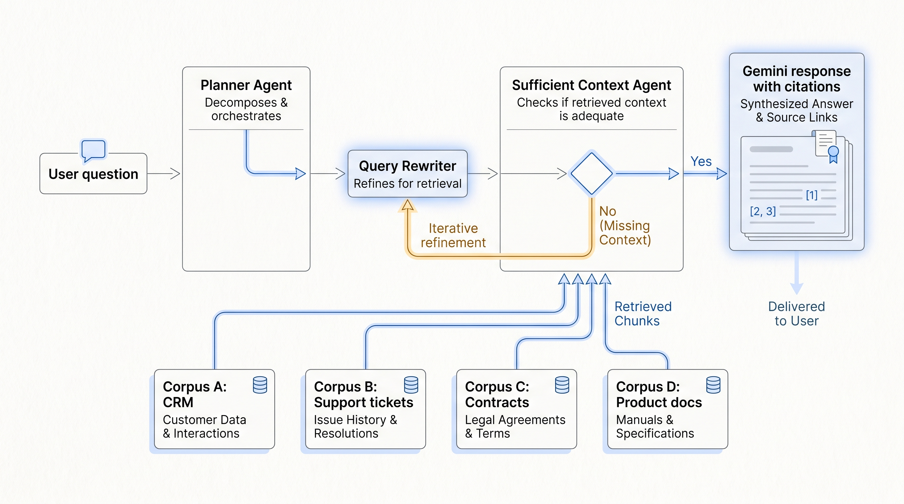
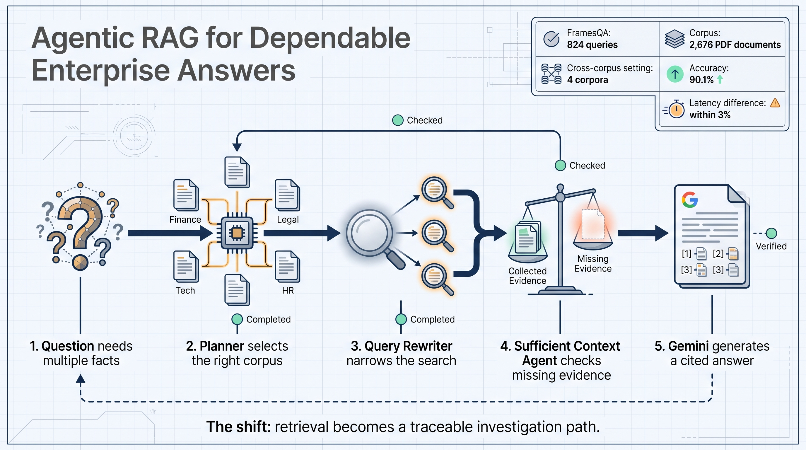
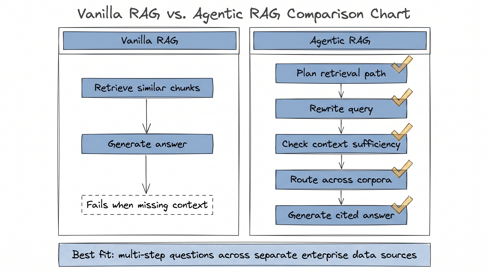

# Gemini Enterprise Agent Platform: Reliable Responses with Agentic RAG

Google Research published an experiment around Agentic RAG in Gemini Enterprise Agent Platform. The useful signal is not a generic "RAG is getting better" story. It is more specific: enterprise question answering is moving from retrieving related documents to planning a traceable retrieval path.

The example is simple. A system is asked: among the two most watched television season finales as of June 2024, which one was longer, and by how much?

To answer correctly, the system first needs to identify the top two finales, then find their runtimes, then calculate the difference. A normal RAG setup can retrieve viewership data and still fail because the duration is missing from the retrieved context.

Google's Agentic RAG handles the task by splitting the work. It searches for the shows, uses a Query Rewriter to target the missing runtime information, uses a Sufficient Context Agent to decide whether the evidence is enough, and then lets Gemini produce the answer.

The experiment used FramesQA, with 824 queries and 2,676 PDF documents. Google compared a vanilla RAG setup using Google's RAG Engine with Agentic RAG. In the cross-corpus setup, three distracting datasets were added, forcing the Planner Agent to choose the correct corpus among four options.

The cross-corpus result is the important part. The system answered 90.1% of questions correctly, while latency stayed within 3% of the single-corpus version on average.

That maps directly to enterprise AI. Real company knowledge is rarely in one place. Sales notes, support tickets, contracts, product docs, incident logs, and meeting notes are owned by different teams. A useful assistant needs to choose where to search, notice missing evidence, rewrite the query, and keep going until the answer has enough support.

This changes how teams should evaluate RAG. Do not only ask whether the final answer sounds right. Check whether the system selected the right data source, excluded irrelevant corpora, detected missing context, and produced a traceable answer.

The practical starting point is small: choose 30 real questions that require at least two data sources, define the expected answer and required evidence, then test whether the system follows the right retrieval path.

Agentic RAG does not remove the need for clean data ownership, permissions, source freshness, and audit logs. It makes those requirements more visible. If enterprise AI assistants are going to answer cross-team questions, retrieval has to become a managed workflow, not a single search call.

## Why the example matters

The TV finale question is useful because it is small enough to inspect. The question does not ask for one fact. It asks for a chain of facts:

- identify which finales were the most watched
- find the runtime for each finale
- compare the two runtimes
- produce the difference in minutes

A retrieval system can fail at any of those steps. It may retrieve viewership data and never retrieve runtime data. It may retrieve both facts but fail to connect them. It may retrieve the right documents but stop early because the first batch of context does not contain the answer.

That is exactly where enterprise RAG breaks in practice. A user does not ask, "Find the policy document about renewals." A user asks, "Why is this account at risk?" That question may require CRM notes, support history, product usage, contract status, and recent meeting summaries. The answer has to be assembled.

## What changes in the system design

The design shift is that retrieval becomes a sequence of decisions.

The Planner Agent decides which corpus is relevant. In an enterprise setting, this could mean choosing among CRM, support tickets, contracts, product documentation, and incident logs.

The Query Rewriter turns a broad question into targeted searches. A user may ask about customer churn, but the system may need to search for renewal date, unresolved support tickets, usage drop, and pricing objections separately.

The Sufficient Context Agent checks whether the current evidence can support an answer. This is the part many basic RAG systems lack. If the evidence is incomplete, the system should continue searching instead of producing a weak answer.

Gemini then generates the response from the gathered evidence. The answer is only useful if the path can be inspected later: which corpora were searched, what evidence was retrieved, and where the final claim came from.

## How to evaluate this in a real company

A practical evaluation should not start with hundreds of generic questions. Start with a small set of cross-source questions that matter to the business.

For example:

- "Why did this customer stop using the product after onboarding?"
- "Which contract clauses differ from our current template?"
- "Which recent release is most likely related to this support spike?"
- "Which internal policy applies to this approval request?"

For each question, define the expected answer and the required evidence. Then test the system on four things:

1. Did it select the correct data source?
2. Did it rewrite the query when the first retrieval was incomplete?
3. Did it reject distracting corpora?
4. Did the final answer cite enough evidence for a human to review?

That evaluation is more useful than asking whether the answer sounds fluent. Fluency hides retrieval errors. A traceable path exposes them.

## What teams should build first

The first step is not a giant company-wide knowledge assistant. The first step is a narrow workflow with two or three data sources and a clear success metric.

Customer success is a good starting point. A risk question may require CRM notes, support tickets, and product usage. Legal review is another good starting point. A contract question may require the current template, the customer agreement, and exception history. Engineering support also fits: an incident question may require logs, release notes, alerts, and tickets.

In each workflow, define the corpora before building the agent. A corpus should have an owner, an update rule, a permission model, and a description of what questions it can answer. Without that metadata, a Planner Agent has weak signals for routing.

## The limit

Agentic RAG can improve the retrieval path, but it cannot repair broken knowledge governance by itself. If the documents are stale, permissions are unclear, or the same business concept has five names across five teams, the agent will inherit that mess.

It also adds operational cost. Planning, query rewriting, context checking, and repeated retrieval can increase model calls and infrastructure work. Google's experiment reports cross-corpus latency within 3% of the single-corpus version on average, but each company still needs to measure latency and cost in its own stack.

The practical takeaway is straightforward: build a small benchmark from real cross-team questions, inspect the retrieval path, and expand only when the path is reliable.

One more operational detail matters: save failed retrieval traces. The most useful failures are not empty answers. They are cases where the agent chose the wrong corpus, stopped after partial evidence, or answered from a distracting document. Those traces tell the team whether to improve corpus descriptions, add routing rules, rewrite metadata, or tighten permission checks.
